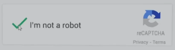
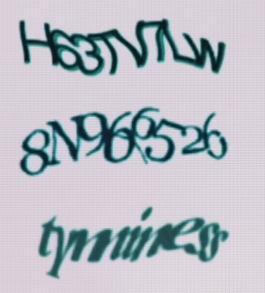
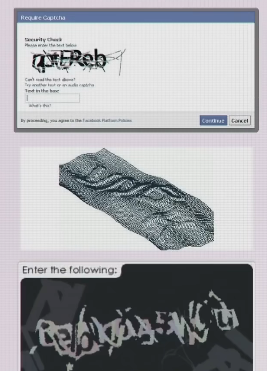
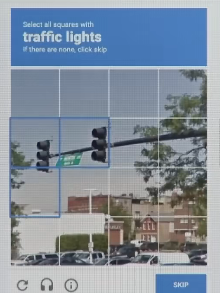

# reCAPTCHA

Why Can't Robots Check The Box That Says I'm Not A Robot?

CAPTCHA
1. C-completely
2. A-automated
3. P-public
4. T-Turing(图灵) test to tell
5. C-computers and
6. H-humans
7. A-apart

传统方法

点击不是要测试的内容

测试是在点击前进行的，测试鼠标移向勾选框的方式

红绿灯可能也是大规模运动测试

