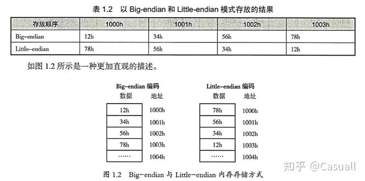

# 字节序

## Portals

[大端序和小端序](https://zhuanlan.zhihu.com/p/77436031)

## 

Big-endian：高位字节存入低地址，低位字节存入高地址

Little-endian：低位字节存入低地址，高位字节存入高地址

x86系列CPU都是Little-endian字节序，PowerPC通常是Big-endian字节序。

网络协议也都是采用Big-endian方式传输数据的，所以有时也把Big-endian方式称为网络字节序

**内存中的高地址低地址和数据的高字节低字节相反。**
1. 高字节指的是左边的（前面的），低字节指的是右边的（后面的）
2. 高地址就是内存地址大的，低地址就是内存地址小的

0x12345678中0x12是高字节，按照Little-endian，存在第四个字节（高地址）。

