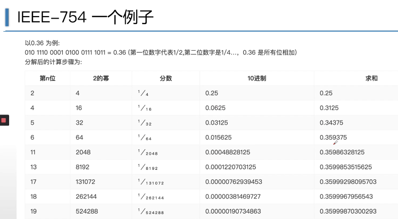

# 解密浮点数

## IEEE-754 标准

一种二进制浮点数算术标准

以**2**为底数

 

| 精度    | 位数   |符号位|指数位   | 小数位   |偏移量|数值范围|
|---------|------|------|---------|---------|------|------|
| single  | 32 |1[31]|8[30-23] |23[22-00]|127   |-3.4\*10^38~3.4\*10^38|
| double  | 64|1[63]|11[62-52]|52[51-00]|1023  |-1.7\*10^308~1.7\*10^308|

 

符号位：1为负数，0为正数。

指数位：存储 指数加上 **偏移量** ，偏移量为指数位能够表示负数而设计。

小数位：存储 系数的 **小数位** 的准确或者最接近的值。

**偏移量和指数的关系：指数位存储的是偏移量加上实际浮点数的指数的结果。即存储时候会加上127。**
对于单精度浮点数来说，指数由8位组成，本身可以保存0\~255，共256个可能。所以通过利用偏移量可以表示-127\~128。双精度浮点数类似，这里不再赘述。

 

任何一个数的科学计数法表示如下： 
$$ 1.xxx*2^n $$
位数部分可以表示为xxx，因为第一位都是1，可以将小数点前面的1省略，所以23bit的尾数部分可以表示24bit的精度。

可以这么理解，xxx存储的就是“1.”后面的小数部分，最后是1.xxx乘以指数幂

&emsp;&emsp;eg：0.085=1.36*2^(-4)，实际浮点数的指数是-4，加上偏移量127就是指数位存储的数据123。小数位存储的是.36因为以2为底的数永远是1（省了空间，其实是24bit）。

 

**浮点数存储的数据是不精确的。**

*这是B站up主的视频中的截图，视频的链接我会发送到相关资料中*

 

## 浮点数存储验证

## 相关资料
①B站视频：[IEEE754揭秘浮点数—计算机存储的秘密](https://www.bilibili.com/video/BV1AE41137TM)

②B站视频：[庄老师V课堂](https://space.bilibili.com/2015597365?spm_id_from=333.788.b_765f7570696e666f.1)
