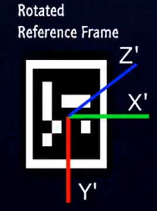
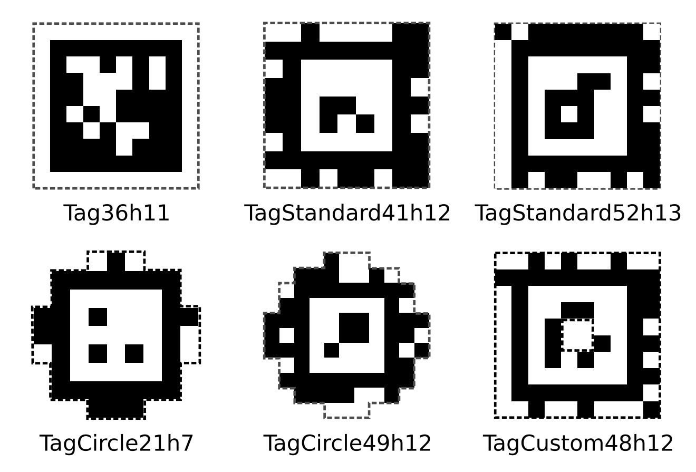

# ArUco & AprilTag

[ArUco Markers Generator](https://chev.me/arucogen/)

[April Tags generator](https://chaitanyantr.github.io/apriltag.html)

ArUco 和 AprilTag 都是基于 二维码 Marker，通过识别特定信息，实现对相机相对位姿的解算

根据 二维码的编码值 可以对野值进行剔除实现识别与定位

AprilTag 的编码更复杂，增加了容错能力

AprilTag 的检测算法，在处理模糊&光照变化&较大的角度旋转时更鲁棒，对部分遮挡的容忍度更高，更轻量级，在实时检测中效率更高

检测是，均需要指定 字典/family

# ArUco

[Detection of ArUco Markers - OpenCV](https://docs.opencv.org/4.x/d5/dae/tutorial_aruco_detection.html) - 可以参考 API

[cv::aruco Namespace Reference - OpenCV](https://docs.opencv.org/4.10.0/d4/d17/namespacecv_1_1aruco.html)

 

ArUco 是 科尔多瓦大学 人工视觉应用 研究小组(A.V.A) 设计开发的 微型增强现实库

ArUco 用于检测平面ArUco标记，并基于此估计相机位姿

ArUco 相关功能都被集成到了OpenCV中，包括ArUco标记的生成、检测等

ArUco Markers是一种二维的方形二值标记，每个标记由一系列黑白区域组成，具有唯一的ID
1. 每个标记可以唯一识别
2. 设计简单且对噪声具有较强的鲁棒性
3. 通过标记四角点的坐标，可以计算出它在三维空间中的位置和方向

ArUco Marker
1. 外围 黑色边框(加速标记在图像中的检测速度)
2. 内部 确定该标记唯一ID的二维矩阵(能唯一识别该标记，同时进行错误检测和错误修复)

ArUco 中的字典含义，以 `DICT_4X4_50` 为例
1. 标记的尺寸 4x4
2. 字典中独特标记的数量 50

ArUco 提供了多种内置字典
1. 较小尺寸，适合近距离或小型场景 (机器人实验室、桌面应用) : `DICT_4X4_50`, `DICT_4X4_100`, `DICT_5X5_50`
2. 较大尺寸，更适合远距离或高分辨率场景，更高的抗噪声能力和检测准确率 (无人机导航、大型工业应用) : `DICT_6X6_250`, `DICT_7X7_1000`

ArUco 的字典设计中，每个标记的二维编码被设计为唯一且不受旋转或翻转影响

字典之间没有相互排除机制(如果在同一应用中使用了多个字典，需要手动确保所用字典中的标记不会互相冲突)

# AprilTag

[AprilTag](https://april.eecs.umich.edu/software/apriltag.html)

[AprilTag - Github](https://github.com/AprilRobotics/apriltag)

[apriltag-imgs - Github](https://github.com/AprilRobotics/apriltag-imgs)

[pupil-apriltags: Python bindings for the apriltags3 library - Github](https://github.com/pupil-labs/apriltags) - 可能有用

AprilTag 是 University of Michigan 的 APRIL Robotics Laboratory 提出的

视觉基准系统(Visual Fiducial System)，其应用领域包括AR、机器人、相机校正等

通过对AprilTag Marker的识别，可以确定相机的位姿(相对于Marker)

AprilTag除了常规的方形，还可以包含其它形状

AprilTag 标记家族(Family)
1. 标记含义
   1. 编码位数(bits)
   2. 哈希码的汉明距离(Hamming distance) : 两个标记之间的最小位差，越大越能减少误识别的可能性
   3. 标记数量
2. 家族种类
   1. `TAG16H5 → 0 to 29`
   2. `TAG25H7 → 0 to 241`
   3. `TAG25H9 → 0 to 34`
   4. ...

`pip install apriltag`
