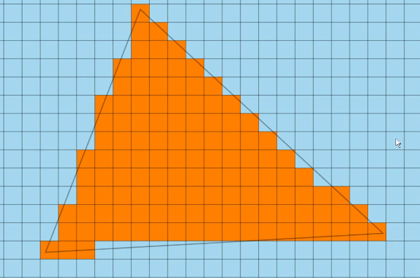
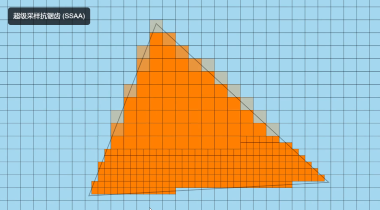
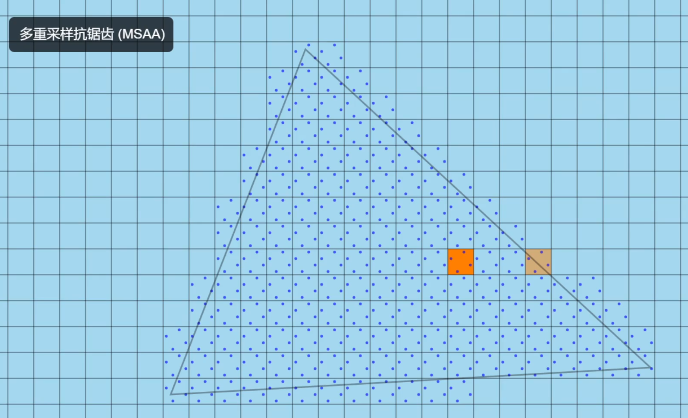
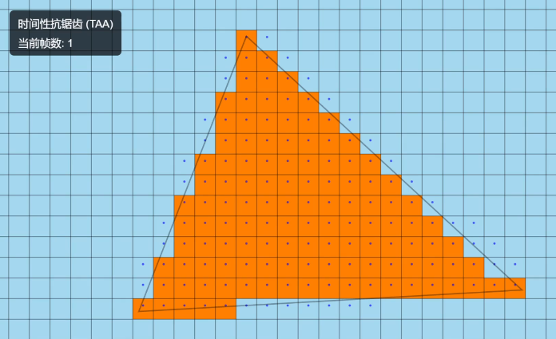
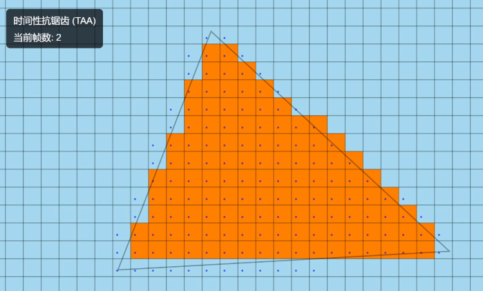
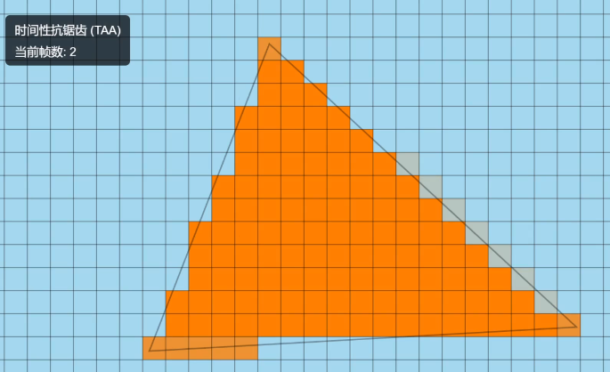
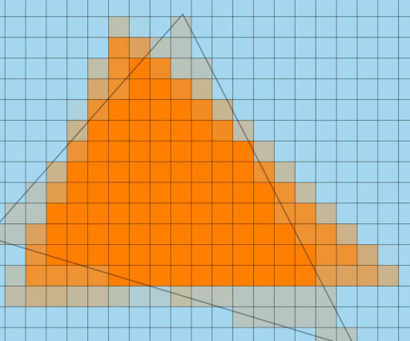
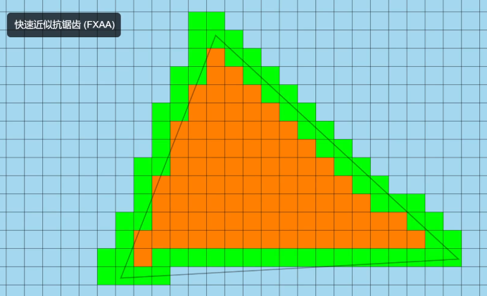

# 抗锯齿

[浅入深出，带你了解抗锯齿 --- B站视频](https://www.bilibili.com/video/BV13z4y1K7CC/)

[图形学中的抗锯齿方法简谈 --- 知乎博客](https://zhuanlan.zhihu.com/p/379219516)

抗锯齿（英语: anti-aliasing, 简称AA),也译为边缘柔化、消除混叠、抗图像折叠有损等

## 锯齿状边缘出现原因

**光栅化**过程，将连续图形转为离散的像素

若像素采样点在图形范围内，则着色，反之不着色

导致部分在图形内，部分在图形外的像素颜色无法准确的显示

## 常用抗锯齿技术及优缺点

### 超级采样抗锯齿 SSAA

使用更高分辨率，将图形渲染到一个虚拟屏幕上，再将其释放回原本的分辨率

图形中有锯齿的地方产生一系列有过渡颜色的像素

缺点
1. 计算成本高

### 多重采样抗锯齿 MSAA

在SSAA基础上改良

在像素的多个不同位置进行采样

计算有多少采样点被当前被渲染的图形覆盖
1. 如果所有采样点都被覆盖，直接将图形颜色应用于该像素
2. 如果仅有部分采样点被覆盖，使用图形和背景颜色的混合色，比例取决于被覆盖或未被覆盖的采样点数量的比例

缺点
1. 无法解决图形内部的锯齿
2. 无法解决因物体移动而出现的闪烁

### 时间性抗锯齿 TAA

混合前一帧和当前帧的信息

第一帧中，无上一帧，不做处理

第二帧，渲染结果

第一帧与第二帧画面进行混合，作为最终画面

缺点
1. 需要额外处理因图像移动而产生的问题(eg:图形在下一帧旋转)，需要对增加的像素进行运动溯源，对于差距过大的颜色直接使用当前帧下的颜色
2. 计算运动溯源对性能要求较大

### 快速近似抗锯齿 FXAA

后期抗锯齿技术

在已经渲染完成的图像中，寻找图形边缘，实现抗锯齿

边缘通常出现在相邻像素颜色发生剧烈变化处

找到边缘后对像素进行模糊处理，达到软化效果

快速，易于实现

