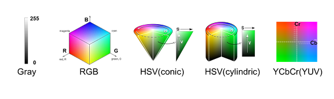
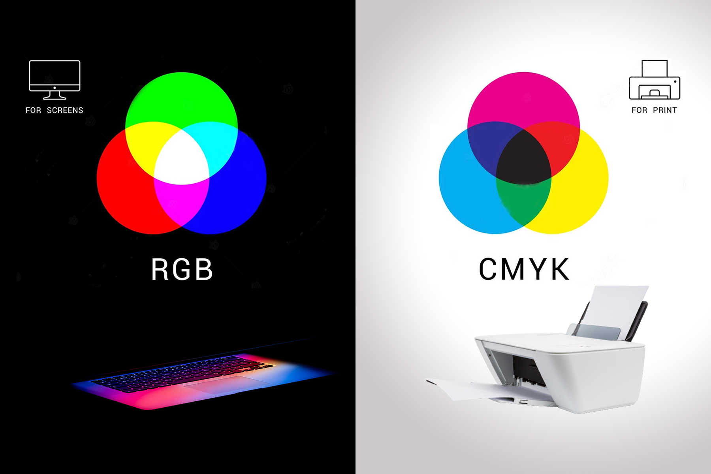
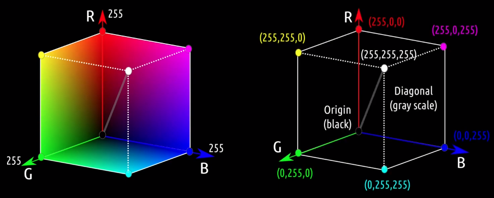
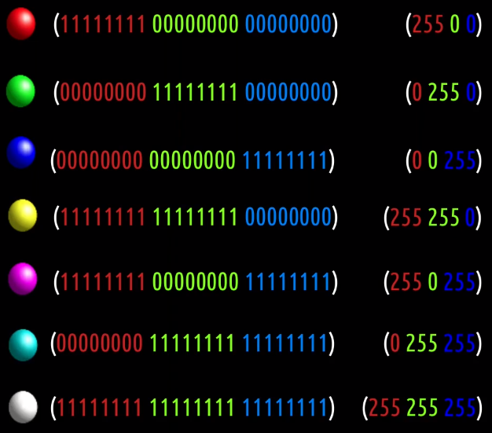
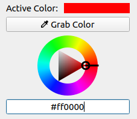
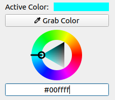
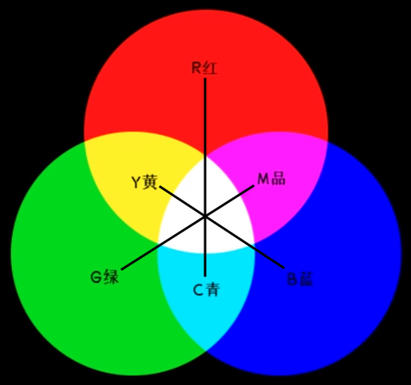
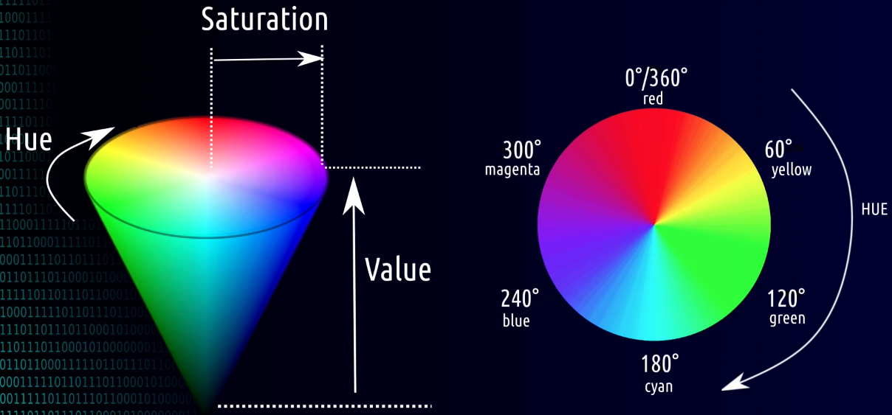
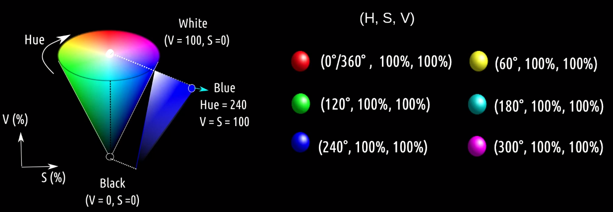
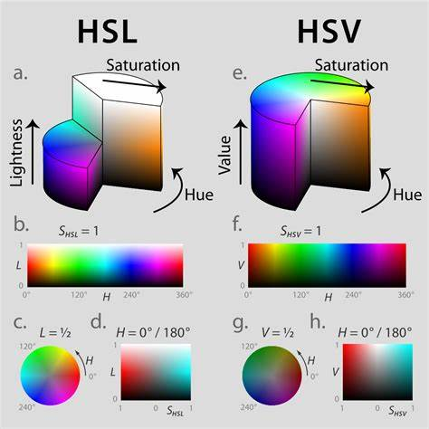

# Color (RGB & CMYK & HSV)

[Convert Color Tool](https://colordesigner.io/)

## RGB(光三原色) & CMYK(印刷三原色)

**RGB**
1. 加色模型 additive (黑色为底，显示屏本身为黑色)
2. 应用于电视、计算机显示器、手机屏幕
3. Open顺序为 BGR
4. 颜色
   1. Red
   2. Green
   3. Blue
5. 颜色编码 #RRGGBB
   1. 6位16进制数 = 3组 2位16进制数 = 3组 0~255 = 3组 8bit
   
   

**CMY(K)**
1. 减色模型 subtractive (白色为底，打印纸本身为白色)
2. 通过颜料 吸收(减去) 光波来显示颜色的，青色墨水吸收红色光波，反射绿色和蓝色
3. 颜色
   1. Cyan - 青色
   2. Magenta - 洋红/品红
   3. Yellow
   4. Key-Black - (印刷时混合黑色不纯且成本高，故引入纯黑色)

## 互补色(相反色)

**互补色**
1. 减 x 色 == 加 x 的互补色
2. 互补色就是对 颜色二进制编码 按位取反 (eg - 红色 #ff0000 & 青色 #00ffff)
   
3. eg - 红&青, 绿&洋红, 蓝&黄
4. eg - 青 = 绿 + 蓝 = - 品红 + 蓝
5. eg - 黄 + 品红 = 黄 - 绿 = 红
6. eg - 品红 + 青 + 黄 = 品红 + 绿 = 品红 + (- 品红) = 黑

## HSV

HSV
1. Hue - 色相
2. Saturation - 饱和度
3. Value - 亮度

HSV 色彩空间
1. Hue 色相
   1. 颜色的**种类** : 红色、绿色、蓝色等
   2. OpenCV 范围 : 0 - 179
2. Saturation 饱和度
   1. 颜色的**纯度或浓度** : 饱和度越**高**，颜色越**鲜艳**；饱和度越**低**，颜色越**灰暗**，趋于无色
   2. OpenCV 范围 : 0 - 255
3. Value 亮度
   1. 颜色的**明亮程度** : 值越**高**，颜色越**亮**；值越**低**，颜色越**暗**
   2. OpenCV 范围 : 0 - 255

