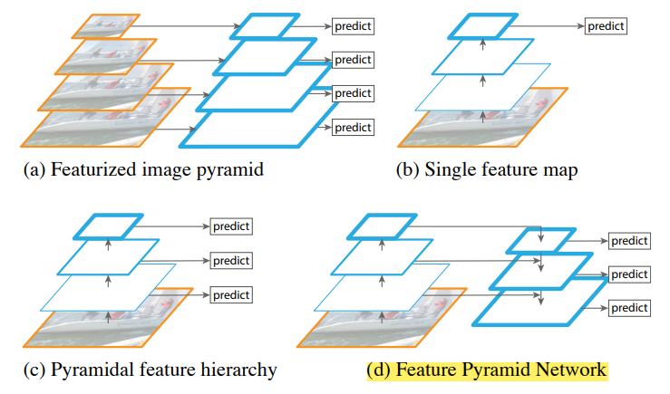
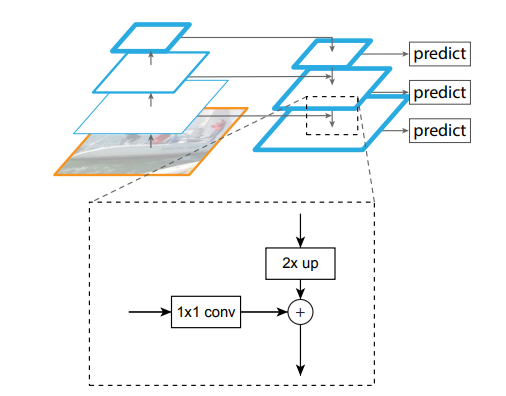
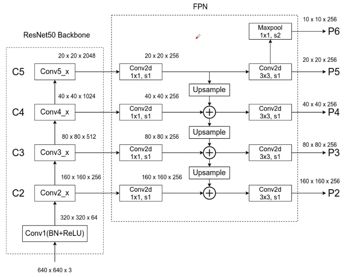

# Feature Pyramid Network 特征金字塔网络

[FPN结构详解 - B站视频](https://www.bilibili.com/video/BV1dh411U7D9/?vd_source=d5863bac06474ffc8562eab966db3af7)

用于解决 多尺度目标检测 问题

可以被看作是 一种专门用于 多尺度特征提取 框架

通过 自上而下 & 横向连接 结构，将 基础特征图 转换成 多尺度的特征金字塔

很多网络都使用了利用单个高层特征(Conv4)，小物体本身具有的像素信息较少，在下采样的过程中极易被丢失

FPN 将不同特征图的特征 进行 融合，在 融合的 特征图上进行 预测
1. 

直接加法进行融合
1. 
2. 1×1 卷积，保证 channel 数 相同
3. 2×up 上采样(`torch.nn.functional.interpolation`，近邻插值)，保证 图片尺寸一致

更完整的结构
1. 
2. 下层(尺寸更大) 保留 底层细节，更适合 小型目标
3.

TODO : RPN - region proposal
