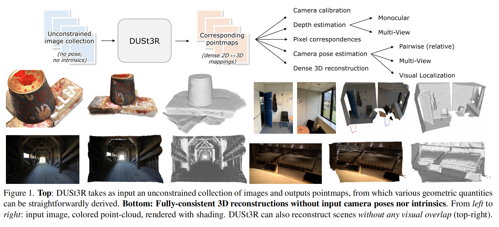
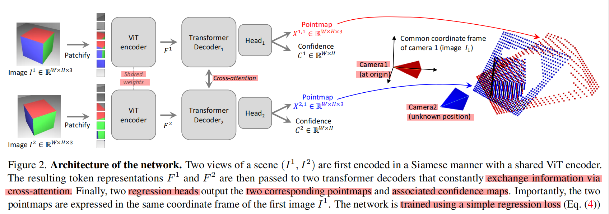
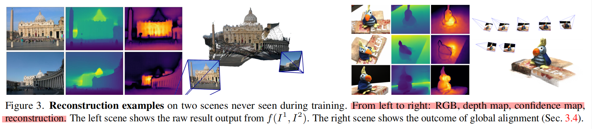

# DUSt3R: Geometric 3D Vision Made Easy (Dense Unconstrained Stereo 3D Reconstruction)

[Paper Website](https://europe.naverlabs.com/research/publications/dust3r-geometric-3d-vision-made-easy/)

[Github](https://github.com/naver/dust3r)

[arxiv](https://arxiv.org/pdf/2312.14132) - [Submitted on 21 Dec 2023 (v1), last revised 26 Oct 2024 (this version, v2)]

## Table of Contents

# DUSt3R

DUSt3R(Dense Unconstrained Stereo 3D Reconstruction)

Resources
1. [理解DUSt3R三维重建新思路 - 知乎](https://zhuanlan.zhihu.com/p/686078541)
2. [DUSt3R：三维视觉基础模型 - B站](https://www.bilibili.com/video/BV15t421P79o/)

三维重建是计算机视觉中的一个高层任务
1. 关键点提取 & 匹配
2. 本质矩阵(Essential Matrix，描述了两个相机之间的几何关系，尤其是在已知相机内参数的情况下) 计算
   1. 从点对中计算基础矩阵(Fundamental Matrix)：基础矩阵描述了两个相机之间的几何关系，但不考虑相机的内参数
   2. 利用相机内参数将基础矩阵转换为本质矩阵
3. 三角化
4. 相机位姿Pose估计(包括 内参&外参)
5. 稀疏重建
6. 稠密重建

传统的三维重建将任务拆解为了多个子问题，作者认为这样的设定 存在问题
1. 这些子问题的解决并非完美的，而且会给下一个子问题带来误差
   1. each sub-problem is not solved perfectly and adds noise to the next step
2. 子问题的数量也会增加任务的复杂度，并加大工程难度
   1. increasing the complexity and the engineering effort required for the pipeline to work as a whole
3. 子问题之间的互相协助是有障碍的，后一个子问题的优化不能反馈给前一个子问题，例如相机位姿估计能够帮助进行稠密重建，但是稠密重建的结果无法反馈给相机位姿估计
   1. absence of communication between each sub-problem is quite telling
   2. dense reconstruction should naturally benefit from the sparse scene that was built to recover camera poses, and vice-versa
4. pipeline中有些关键步骤没有较强的鲁棒性，例如估计相机姿态可能会受到图像数量、相机运动等的影响
   1. key steps in this pipeline are brittle and prone to break in many cases
   2. the number of scene views is low
   3. for objects with non-Lambertian(亮度会随着观察角度的变化而变化，包括镜面反射、半镜面反射等) surfaces
   4. insufficient camera motion

**整体框架**
1. 左侧指出 DUSt3R 的 input/output，右侧表示通过 DUSt3R 的结果可以进行的各种后续工作(相当于是反向进行传统3D)
2. 
3. 跳过 显式的 位姿估计、匹配 等
4. DUSt3R **在非标定、不含位姿信息的图像上进行稠密三维重建**(左侧) **end-to-end**，甚至无需相机内参
5. DUSt3R 从非约束的图像集合中**直接恢复出对应的相机坐标系下面的三维点位置信息**(**直接从2D图像中恢复出了对应的3D点云信息**)，然后在三维点信息基础上进行相机标定、深度估计、相机位姿估计、稠密三维重建等(右侧)
6. cast pairwise reconstruction problem as a regression of pointmaps(成对重建问题转换为一个点图的回归问题)
7. **pointmap representation**
   1. has rich properties(可用于进一步 extract 各种 scene parameters)
      1. scene geometry
      2. relation between pixels and scene points(2D -> 3D)
      3. relation between the two viewpoints
   2. a one-to-one mapping between image pixels and 3D scene points : $\text{IMG}_{i,j} \leftrightarrow X \in \mathbb{R}^{W×H×3}$(每个像素都对应一个三维点，所以点图的最后一个维度大小为 3)
   3. ignoring the case of translucent(透明) surfaces
   4. 如果 给定 camera intrinsic $K \in \mathbb{R}^{3×3}$，pointmap $X$ 可以从 ground-truth depthmap $D \in \mathbb{R}^{W×H}$ 得到
      1. 像素坐标系 → 相机坐标系
      2. $$X_{i,j} = K^{−1} [iD_{i,j} , jD_{i,j} , D_{i,j}]^{T}$$
      3. 这里的 intrinsic matrix $K$ 使用的是 3×3，用来求逆，有一个特性，$K^{-1}$ 的最后一行和 $K$ 也是 $[0,0,1]$
      4. $[i,j,1]^T$ 是 像素坐标系(homogenous)，D是深度图的值$D_{i,j}$，为了和 $K^{-1}$ & $X_{i,j}$的最后一个值 配合，像素坐标系坐标 同时 $×D_{i,j}$
   5. $X^{n,m}$ the pointmap $X^n$ from camera frame {n} expressed in camera {m}'s coordinate frame
      1. $$X^{n,m} = P_m P^{−1}_n h(X_n)$$
      2. $P_m, P_n \in \mathbb{R}^{3×4}$
      3. h : $(x, y, z) → (x, y, z, 1)$
8. having the opportunities of **solving multiple minimal problems simultaneously**, enabling **internal collaboration** between them

直接拥有了2D图像对应的3D点云信息(相机坐标系下面)，剩下的问题就是如何让这些在各自相机坐标系下面的3D点云形成一个完整的场景表达。这就是Global Alignment需要完成的事情

**模型结构**
1. 
2. DUSt3R的功能是从2D图像中恢复出相机坐标系下面的三维点
3. trained in **fully-supervised manner** using a simple **regression loss**, based on generic transformer architecture
4. a network F
   1. input  : 2 RGB images $I^1, I^2 \in \mathbb{R}^{W×H×3}$
      1. both pointmaps are expressed in the same coordinate frame of $I^1$
      2. naturally in practice their resolution can differ
   2. output :
      1. 2 corresponding **pointmaps** $X^{1,1}, X^{2,1} \in \mathbb{R}^{W×H×3}$
      2. associated **confidence maps** $C^{1,1}, C^{2,1} \in \mathbb{R}^{W×H}$
5. 采用的是孪生网络结构，模仿 CroCo(2组 encoder + decoder + regression head)
6. 2张图像 分别经过 **参数一致(共享)**的 ViT encoder(特征提取)，得到 two token representations
   1. $F^1 = Encoder(I^1)$
   2. $F^2 = Encoder(I^2)$
7. 分别经过 transformer decoder(利用 **cross attention** & token共享 来进行特征交互，帮助网络捕捉两个视图之间的关系，以便生成一致的点图)，可以理解为 隐式的 matching
   1. 对于 1图，2图 为参考，理解为 隐式的 multi-view stereo，**不是 简单的 单目深度估计**
   2. 同样的，2图 也使用 1图 信息进行 深度估计，同时进行 隐式 相对位姿的估计
   3. for $i = 1,··· ,B$ for a decoder with $B$ blocks and **initialized** with **encoder tokens** $G^1_0 := F^1$ & $G^2_0 := F^2$，($G$ 是 token)
      1. $G^1_i = \text{DecoderBlock}^1_i(G^1_{i−1}, G^2_{i−1})$
      2. $G^2_i = \text{DecoderBlock}^1_i(G^2_{i−1}, G^1_{i−1})$
      3. 一张图用于 query，另一张图 key, value
      4. **P.S.** 解码器块 $\text{DecoderBlock}^v_i (G^1, G^2)$ denotes the **i-th** block in branch $v \in {1, 2}$, **$G^1$ & $G^2$ are the input tokens**, with tokens from the other branch
   4. Each decoder block sequentially performs (crucial to output properly aligned pointmaps)
      1. **self-attention**  : each token of a view attends to tokens of the **same view**
      2. **cross-attention** : each token of a view attends to all other tokens of the **other view**
      3. finally feeds tokens to a MLP
      4. **information shared between the two branches** during the decoder pass
   5. 在解码过程中，两个分支不断 共享信息，确保解码过程中的 token 能够访问来自另一个视图的相关特征
   6. 这种共享对于生成对齐的点图至关重要，因为两幅图像的视角不同，只有通过特征的共享和对齐，才能保证输出的点图是空间上一致的
8. in each branch a separate **regression head** **takes the set of decoder tokens** and outputs a **pointmap** and an associated **confidence map**(类似 DPT 网络?)
   1. $X^{1,1}, C^{1,1} = Head^1 (G^1_0,...,G^1_B)$
   2. $X^{2,1}, C^{2,1} = Head^2 (G^2_0,...,G^2_B)$
   3. 图1 : 以第一帧图片的相机位置 frame {1} 为参考系
   4. 图2 : 像素 在 frame {1} 下的 坐标

**Discussion**
1. 缩放因子未知 : 生成的点图会存在一个未知的缩放因子 unknown scale factor，点相对位置正确，实际尺寸不明确
2. 无显式几何约束 : architecture never explicitly enforces any geometrical constraints(没有显式地施加几何约束)，而是通过网络自学习对齐不同视图的点图，这种设计使得网络的结构更加通用
3. 几何先验学习 : 网络会在训练集中学习几何一致性先验(geometrically consistent priors)，这意味着网络会自动学到点图的对齐和几何关系，而不是通过手动设置几何约束
4. 通用架构的优势 : allow to leverage strong pretraining technique

The output pointmaps X1,1 and X2,1 are regressed up to an unknown scale factor.

Also, it should be noted that our generic architecture never explicitly enforces any geometrical constraints.

Hence, pointmaps do not necessarily correspond to any physically plausible camera model.

Rather, we let the network learn all relevant priors present from the train set, which only contains geometrically consistent pointmaps.

Using a generic architecture allows to leverage strong pretraining technique, ultimately surpassing what existing task-specific architectures can achieve.

We detail the learning process in the next section.

因为单目相机的深度是不具有唯一性的，因此从两张图像中恢复出来的3D点云是不具备尺度信息的

DUSt3R的损失函数包含两个部分，一个是置信度得分，一个预测点云和真值点云在欧式空间的距离

在构建训练集的时候，我们就需要获得图像对应的相机内参、以及相机位姿信息，方便构建图像对应的相机坐标系下的点云和在其他相机坐标系下的点云

**全局对齐**

introduce a **global alignment** to fuse predictions from multiple images pairs
1. contrary to **Bundle Adjustment**, does not involve minimizing reprojection errors
2. optimize the camera pose and geometry alignment **directly in 3D space**

输出结果
1. 
2. 原图、深度图、置信图、重建结果

总结
1. 本文提出了一种三维重建方法，并且在相机参数未知、场景未知的情况下，能够完成三维重建任务。DUSt3R利用数据驱动的方式，采用神经网络的方法，直接从2D图像对中估计3D点云信息，从而跳过了传统三维重建方法中的提取特征点、特征点匹配、点云三角化等步骤。使得整个三维重建pipeline变得简洁，仅仅包含了3D点云估计、全局对齐两个步骤。这是三维重建的一个全新视角
2. 本文方法并没有取得SOTA的效果，甚至在ACC一列上的效果还比较差，说明其**构建的三维场景和真实三维重建之间有一定的差距**，细节上还有很多值得改进的地方
3. 在全局对齐过程中，作者考虑了所有的图像对，随着图像数量的增加，图像对的数量会急剧增加，导致程序运行的效率变慢，消耗大量的计算资源，甚至使得机器无法达到运行条件
4. 源码其实下相机的内参是参与匹配过程的，如果把相机内参固定(require_grad为false)是不是就可以完成你文中提到的输入内参的方式

