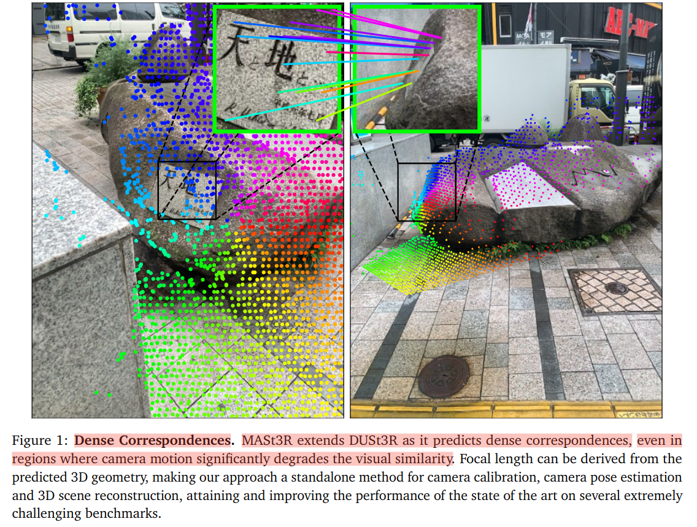
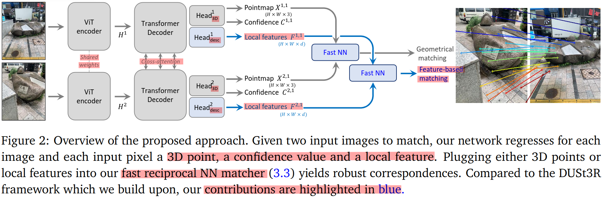

# Grounding Image Matching in 3D with MASt3R(Matching And Stereo 3D Reconstruction)

[MASt3R - Paper Website](https://europe.naverlabs.com/blog/mast3r-matching-and-stereo-3d-reconstruction/)

[MASt3R - Github](https://github.com/naver/mast3r)

[MASt3R - arxiv](https://arxiv.org/pdf/2406.09756) - [Submitted on 14 Jun 2024]

[Radiance Fields from VGGSfM和Mast3r:两种先进3D重建方法的比较与分析](https://www.dongaigc.com/a/radiance-fields-vggsfm-mast3r-comparison)

[MASt3R：从3D的角度来实现图像匹配](https://blog.csdn.net/m0_74310646/article/details/141830671)

[MASt3R 落地 3D 的图像匹配](https://blog.csdn.net/yorkhunter/article/details/141274989)

[VEnhancer及Mast3R及Color peel方法一览 - Bilibili](https://www.bilibili.com/video/BV1iJ4m1M7Vu/)

Paper & Reference List
1. MASt3R
2. DUSt3R
3. ViewFormer: NeRF-free Neural Rendering from Few Images Using Transformers
4. ReconFusion

## Table of Contents

Relationship
1. **DUSt3R**
   1. Laid the groundwork for **unconstrained 3D reconstruction by regressing "pointmaps"**(map 2D image points to 3D points) **without requiring prior camera calibration or poses**.
   2. Unified monocular and binocular reconstruction and demonstrated robustness against typical reconstruction challenges (e.g., view changes).
2. **MASt3R**
   1. Builds on DUSt3R by **adding a new head for dense local features**, specifically **improving the matching aspect**.
   2. This allows it to **produce more precise correspondences** essential for tasks like **localization and pose estimation**, addressing DUSt3R’s limitations in precision while preserving its robustness.

# Abstract

MASt3R extends DUSt3R as it predicts **dense correspondences**, even in regions where camera motion significantly degrades the visual similarity
1. DUSt3R 在 稠密对应(dense correspondence)方面的能力相对有限，主要聚焦于从立体图像中进行稠密的三维重建，但它的重点在于生成 稠密点图(dense pointmaps)，间接用于对齐图像，而不是直接建立图像间的稠密对应关系
2. DUSt3R 在处理两幅图像的直接像素匹配时并不完善，尤其在视角差异较大、视觉相似度降低的情况下，可能无法提供高精度的匹配结果

MASt3R 方法可以从其预测的 3D 几何信息 中推导出 相机焦距(focal length)，DUSt3R 无法得到相机焦距

Image Matching is typically treated as a 2D problem

MASt3R cast matching as a 3D task with DUSt3R(robust but limited accuracy), improve matching capabilities

augment the DUSt3R network with a new head that outputs dense local features(trained with an additional matching loss)

trained with an additional matching loss

address the issue of **quadratic complexity of dense matching**, introduce **a fast reciprocal matching scheme** that not only accelerates matching by orders of magnitude, but also comes with theoretical guarantees

# Introduction

State of-the-art methods for visual localization rely upon image matching
1. offline mapping stage : **COLMAP**
   1. COLMAP 是一种开源的**三维重建工具**
   2. 主要功能包括 SfM & MVS，目标是生成稠密三维模型
2. online localization step : **PnP**
   1. 主要目的是 解决位姿估计问题，假设已经有 图像&三维点之间的对应关系，利用对应关系来计算相机姿态
   2. 图像匹配在 PnP 之前进行，作为找到图像中的 2D 点和三维模型中的对应关系的手段

traditional matching method (3 steps):
1. extract keypoints (sparsity -> computationally tractable)
2. local invariant feature descriptor
3. pairing by comparing distance in the feature space

keypoint-based method
1. keypoint detectors are precise under low-to-moderate illumination and viewpoint changes
2. **discard the global geometric context of the correspondence task**
3. prone to errors in situation with **repetitive patterns** or **low-texture areas**

Solutions
1. **Solution 1** : **global optimization** strategy during the pairing step (like **SuperGlue**)
   1. no use if keypoints and their descriptors do not encode enough information
2. **Solution 2** : dense holistic matching
   1. possible with mechanism for global **attention**(Transformer : attention is all you need)

**Problem** : disappointing VCRE precision (Visual Correspondence Error Rate)
1. matching task is intrinsically and fundamentally a 3D problem
2. 2D pixel correspondences and a relative camera pose in 3D space are two sides of the same coin, as they are directly related by the epipolar matrix
3. DUSt3R(current top-performer on the Map-free benchmark), matches are only a by-product of the 3D reconstruction

MASt3R(Matching And Stereo 3D Reconstruction)
1. **DUSt3R** can indeed be used for matching but **not precise**
2. attach a second head that **regresses dense local feature maps**
3. train with an **InfoNCE Loss**
   1. Information Noise Contrastive Estimation
   2. 对比学习 contrastive learning 中的损失函数
   3. 强化正样本对(positive pairs)之间的相似性，抑制负样本对(negative pairs)的相似性
4. propose a **coarse-to-fine matching scheme**
   1. to **get pixel-accurate matches**
   2. matching is performed **at several scales**
   3. extracting reciprocal matches 耗时 > computing the dense feature maps
   4. a faster algorithm for finding reciprocal matches

# Related Works

TODO

# Method

目标 同时进行
1. performing 3D scene reconstruction
2. matching given two input images

2 images $I^1$, $I^2$ captured by camera $C^1$, $C^2$ with unknown parameters

recover a set of pixel correspondences {$(i,j)$}, where $i, j$ are pixels $i = (u_i, v_i), j = (u_j, v_j)$

based on the **DUSt3R framework**
1. transformer-based network predicts a local 3D reconstruction
2. in the **form** of two **dense 3D point-clouds**
3. pointmap $X^{a,b} \in \mathbb{R}^{H×W×3}$ represents a dense 2D-to-3D mapping between
   1. each pixel $i=(u,v)$
   2. corresponding 3D point $X^{a,b}_{u,v} \in \mathbb{R}^{3}$ expressed in the coordinate system of camera $C^b$
4. regressing two pointmaps $X^{1,1}$, $X^{2,1}$ expressed in the same coordinate system of camera $C^1$
5. In the case where **more than two images are provided**, a second step of **global alignment merges all pointmaps in the same coordinate system**
6. **MASt3R do not make use of global alignment**, restrict to the binocular case

inference
Both images are first encoded in a Siamese manner

