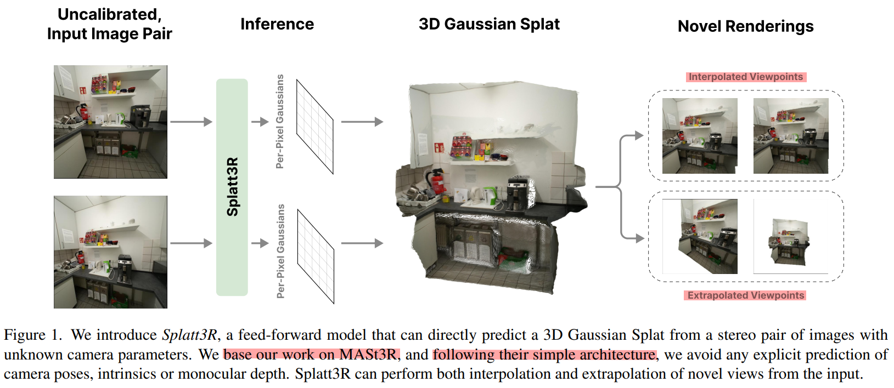
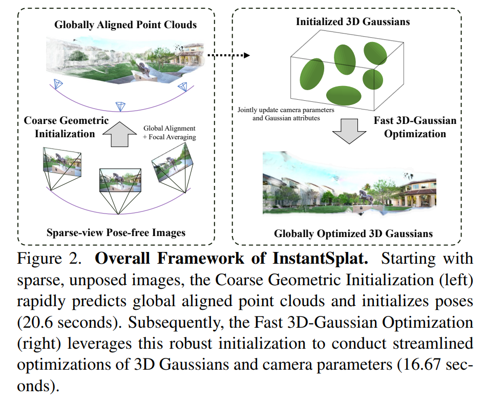
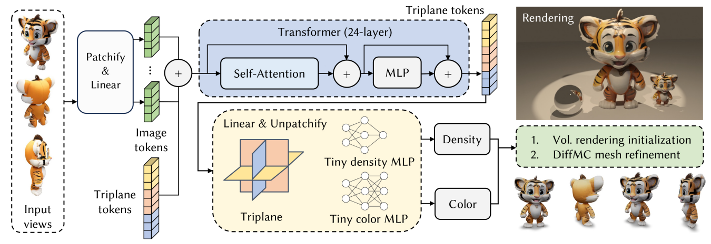
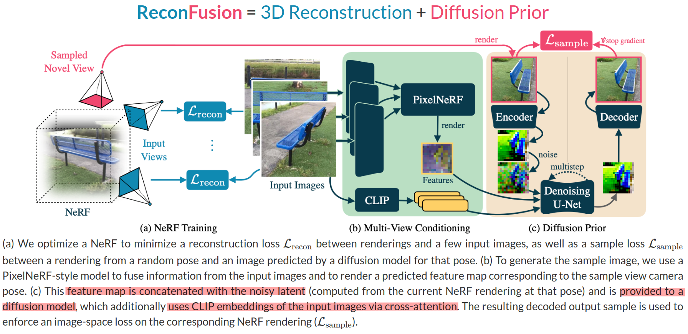

Splatt3R: Zero-shot Gaussian Splatting from Uncalibrated Image Pairs

3D GS + MASt3R

InstantSplat: Unbounded Sparse-view Pose-free Gaussian Splatting in 40 Seconds

MeshLRM: Large Reconstruction Model for High-Quality Meshes
1. while handling highly sparse input views, our model requires input camera poses
2. explore combining our approach with DUSt3R

ReconFusion: 3D Reconstruction with Diffusion Priors

[Paper Website](https://reconfusion.github.io/)

[arxiv](https://arxiv.org/pdf/2312.02981)

Abstract
1. reconstruct real-world scenes using only a few photos
2. ReconFusion = 3D Reconstruction + Diffusion Prior

Thank you Jose, I'm Leo, the archeologist 2. And I'll talk about some paper based on Duster and Master, and also some interesting ideas for few-view reconstructions.

First, as usual, let's look at the papers' statistics data from google scholar. So compared with the papers our fellows talked about in the previous lectures which have more than 1000 citations, Duster and Master are relatively new, and from now on, these 2 papers do not appear to have great influence, though they pose a new stand to cast matching & pairwise reconstruction problem as a 3D task.

Here I list 2 papers which cited the duster and master. Similarly, they focus on combining 3D Gaussian with Duster/Master to solve the Novel View Synthesis problem. What's more, they both use the Frozen Duster/Master Backbone to get pointmaps representation to substitute the traditional SfM procedure.

Do you guys think these 2 works have enough novelty? Maybe no?

This also let us reflect on the topic that Prof. Wang and Junkun Chen talked about before, should we quickly change our research direction when a new paper come out? Whether quality of the paper or the quantity matters most?

Let's see a relatively novel idea. ReconFusion uses a diffusion model trained for novel view synthesis to regularize NeRF optimization in order to avoid artifacts of NeRF when trained with few input. When the reconstruction problem is severely under-constrained (3 and 9 views), this prior can greatly improve robustness and often prevent catastrophic failures.

Except from the Novel View Synthesis problem, Duster/Master may have possibility to enhance the performance of this mesh reconstruction model specially when the input views are sparse and the camera poses are unknown.

So I believe after a few months or years, these 2 paper can show their influence.

