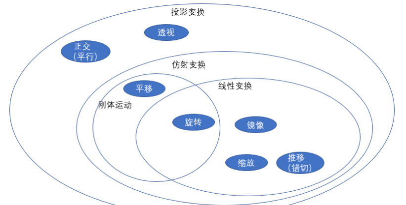
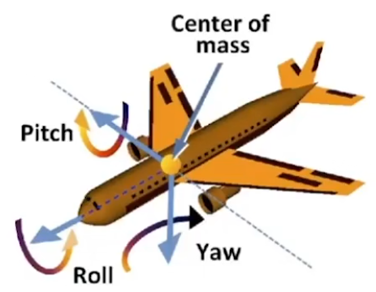

# GAMES101 : 现代计算机图形学入门 - 闫令琪

教师 : [闫令琪](https://sites.cs.ucsb.edu/~lingqi/index.html)

邮箱 : lingqi@cs.ucsb.edu

[GAMES101 课程主页](https://sites.cs.ucsb.edu/~lingqi/teaching/games101.html)

[GAMES101 B站教学](https://www.bilibili.com/video/BV1X7411F744)

[HomeWork - 计算机图形学与混合现实在线平台](https://games-cn.org/forums/topic/allhw/)

[Fundamentals of Computer Graphics(Tiger Book) - Recommended Reference Book](./Fundamentals%20of%20Computer%20Graphics,%20Fourth%20Edition.pdf)

## Table of Contents

- [GAMES101 : 现代计算机图形学入门 - 闫令琪](#games101--现代计算机图形学入门---闫令琪)
  - [Table of Contents](#table-of-contents)
- [Lecture 01 - Overview of Computer Graphics](#lecture-01---overview-of-computer-graphics)
- [Lecture 02 - Review of Linear Algebra](#lecture-02---review-of-linear-algebra)
  - [Vector](#vector)
  - [Matrix](#matrix)
- [Lecture 03 \& 04 - Transformation](#lecture-03--04---transformation)
  - [2D Transformations](#2d-transformations)
  - [Homogeneous Coordinates](#homogeneous-coordinates)
  - [Composing Transforms 变换合成](#composing-transforms-变换合成)
  - [Decomposing Complex Transforms 变换分解](#decomposing-complex-transforms-变换分解)
  - [3D Transforms](#3d-transforms)
  - [Quaternion 四元数](#quaternion-四元数)
  - [==☆==Viewing(观测) Transformation](#viewing观测-transformation)
    - [View(视图)/Camera Transformation](#view视图camera-transformation)
    - [Projection(投影) Transformation](#projection投影-transformation)
      - [Orthographic Projection (正交投影)](#orthographic-projection-正交投影)
      - [Perspective Projection (透视投影)](#perspective-projection-透视投影)
- [Lecture 05 \& 06 - Rasterization](#lecture-05--06---rasterization)
  - [Triangles](#triangles)
  - [Anti-Aliasing and Z-Buffering](#anti-aliasing-and-z-buffering)

# Lecture 01 - Overview of Computer Graphics

**Course Topics**
1. Rasterization (光栅化)
   1. 投影 : 3D geometry primitive(几何体) are projected to screen
   2. 像素化 : break projected primitive into pixel (pixelate)
   3. 实时性 : real-time(30+ fps) applications (real-time 反义词 off-line)
2. Curves and Meshes
   1. represent geometry in Computer Graphics
      1. Bezier Curve 贝塞尔曲线
      2. Catmull-Clark subdivision surface
3. Ray Tracing (光线追踪)
   1. Shoot rays from the camera though each pixel
      1. Calculate intersection and shading
      2. Continue to bounce the rays till they hit light sources
   2. Offline Applications(效果好，则速度慢)
4. Animation / Simulation
   1. Key frame Animation

技术上好的画面，是不是足够亮，全局光照做的好会比较亮

最困难的是把日常生活中常见的做的真实，而非特效

Application : Games, Movies, Animations, Design(CAD), Visualization, VR/AR, Digital Illustration, Simulation, GUI(Graphical User Interface), Typography(点阵/矢量)

---

# Lecture 02 - Review of Linear Algebra

## Vector

Vectors
1. no absolute starting point
2. normalization -> unit vector
3. addition
4. dot product(模，模，夹角余弦)
   1. 交换律，结合律，分配律
   2. 可反向求解夹角
   3. 光照模型，法线
   4. projection 投影
   5. 判断前后方向(点乘 正负)
5. cross product
   1. right hand rule
   2. result is also a vector
   3. 不满足交换律(加负号)
   4. 自己叉乘自己 = 0向量
   5. 反对称矩阵 skew-symmetric (矩阵 × 向量)
   6. 判断两个向量是 **顺(逆)时针方向** 关系
   7. **==☆==判断内外** (AB×Ap, BC×Bp, CA×Cp)
      1. 
      2. 如果所有叉乘结果符号相同，则 P 在三角形内部
      3. 如果某个叉乘结果的符号与其他不同，则 P 在三角形外部
      4. 如果某个叉乘结果为零，则 P 落在三角形的边上
   8. 向量分解 (投影到三个坐标轴)

## Matrix

Matrices
1. Matrix-Matrix Multiplication
   1. (M x N) (N x P) = (M x P)
   2. 前矩阵列数 = 后矩阵行数
   3. 没有交换律
2. Matrix-Vector Multiplication
   1. Transformation
3. Transpose 转置
4. Identity Matrix

---

# Lecture 03 & 04 - Transformation

Modeling(模型变换)

Viewing(视图变换) - 3D to 2D projection
1. 

**线性变换** $T(x) = Ax$ (括号内的是向量)
1. 可加性 $T(u+v) = T(u) + T(v)$
2. 齐次性 $T(cu) = cT(u)$，(c为标量)

## 2D Transformations

Scale 缩放
1. Uniform
2. Non-Uniform
3. $$\left[\begin{array}{cc}
         s_{x} & 0 \\
         0     & s_{y}
      \end{array}\right]$$

Reflection 反射(对称)
1. 沿 y轴 镜像
   1. $$\left[\begin{array}{cc}
            -1 & 0 \\
             0 & 1
         \end{array}\right]$$
2. 沿 x轴 镜像
   1. $$\left[\begin{array}{cc}
            1  & 0 \\
            0  & -1
         \end{array}\right]$$

Shear(错切)
1. 沿 x 轴的剪切矩阵
   1. $$\left[\begin{array}{cc}
            1 & a \\
            0 & 1
         \end{array}\right]$$
   2. 
2. 沿 y 轴的剪切矩阵
   1. $$\left[\begin{array}{cc}
            1 & 0 \\
            a & 1
         \end{array}\right]$$
3. 特征值 & 特征向量
   1. 重复特征值 1
   2. 需要求解 广义特征向量

Rotate(default : counter clock wise, about the origin)
1. 
2. $$\mathbf{R}_{\theta}
      =\left[\begin{array}{cc}
         \cos \theta & -\sin \theta \\
         \sin \theta & \cos \theta
      \end{array}\right]$$
3. $R_{\theta}^{-1} = R_{-\theta} = R_{\theta}^T$
   1. 第一个等号是定义(矩阵&逆矩阵)
   2. 第二个等号是数值规律

Linear Transforms = Matrices
1. 如果加上 常数 则不为 线性变换

## Homogeneous Coordinates

齐次坐标变化**不为线性变换**，是为了实用性而进行的一种扩展和转换

Trade-Off
1. 代价 : 引入额外的数字

Translation
1. 特殊，不为线性变换
2. 点和向量要不同处理(增加维度时) - **向量具有平移不变性**，平移不改变值
   1. 2D point = $(x, y, 1)^T$
   2. 2D vector = $(x, y, 0)^T$
   3. 原因
      1. vector + vector = vector
      2. point - point = vector
      3. point + vector = point
      4. point1 + point2 = middle point of point1&2
3. $$\left[\begin{array}{c}
         x \\ y \\ w
      \end{array}\right]
      \text { is the 2D point }
      \left[\begin{array}{c}
         \frac{x}{w} \\ \frac{y}{w}
      \end{array}\right], w \neq 0$$

Affine Transformations(仿射变换)
1. $$\left[\begin{array}{l}
         x^{\prime} \\ y^{\prime} \\ 1
      \end{array}\right]
      =\left[\begin{array}{llc}
         a & b & t_x \\
         c & d & t_y \\
         0 & 0 & 1
      \end{array}\right]
      \cdot\left[\begin{array}{l}
         x \\ y \\ 1
      \end{array}\right]$$

Inverse Transform 逆变换
1. 使用 逆矩阵 进行 逆变换
2. 理解 : 向量 先乘以变换矩阵，再乘以矩阵的逆，相当于乘以单位矩阵(结合律)
3. 

## Composing Transforms 变换合成

顺序很重要(不满足交换律，但有结合律)

先旋转，后平移 ≠ 先平移，后旋转

矩阵乘法，从右往左读，类似函数
1. $$A_{n}(\ldots A_{2}(A_{1}(\mathbf{x})))
      =\mathbf{A}_{n} \cdots \mathbf{A}_{2} \mathbf{A}_{1}
      \left[\begin{array}{l}
      x \\ y \\ 1
      \end{array}\right]$$

## Decomposing Complex Transforms 变换分解

如何 **以任意一个点进行旋转**
1. 
2. **Procedure**
   1. Translate center to origin
   2. Rotate
   3. Translate back

## 3D Transforms

Homogeneous Coordinate
1. 3D point = $(x, y, z, 1)^T$
2. 3D vector = $(x, y, z, 0)^T$
3. $(x, y, z, w)^T$ ($w \neq 0$) is the 3D point $(x/w, y/w, z/w)^T$
4. 矩阵形式
   1. 先线性变换，再平移
   2. $$\left[\begin{array}{c}
            x^{\prime} \\ y^{\prime} \\ z^{\prime} \\ 1
         \end{array}\right]
         =\left[\begin{array}{llll}
            a & b & c & t_x \\
            d & e & f & t_y \\
            g & h & i & t_z \\
            0 & 0 & 0 & 1
         \end{array}\right]
         \cdot\left[\begin{array}{l}
            x \\ y \\ z \\ 1
         \end{array}\right]$$

Rotation
1. 绕 X, Y, Z 轴 (注意 绕 Y 轴)
   1. 
2. Euler Angles (roll, pitch, yaw)
   1. 
   2. $$\mathbf{R}_{x y z}(\alpha, \beta, \gamma)
         =\mathbf{R}_{x}(\alpha)
         \mathbf{R}_{y}(\beta)
         \mathbf{R}_{z}(\gamma)$$
3. 绕 任意**过原点**的轴$\mathbf{n}$ 用 Rodrigues Rotation Matrix
   1. $$\mathbf{R}(\mathbf{n}, \alpha)
         =\cos (\alpha) \mathbf{I}
         +(1-\cos (\alpha)) \mathbf{n} \mathbf{n}^{T}
         +\sin (\alpha)
         \underbrace{
            \left[\begin{array}{ccc}
               0 & -n_{z} & n_{y} \\
               n_{z} & 0 & -n_{x} \\
               -n_{y} & n_{x} & 0
               \end{array}\right]}
         _{\mathbf{N}}$$
4. 绕不经过原点的轴旋转 : 平移到原点 + Rodrigues + 平移回原来的位置

## Quaternion 四元数

四元数 主要用于插值

矩阵不易进行插值

TODO

## ==☆==Viewing(观测) Transformation

最终目的，将 三维空间 变为 二维照片

==☆==拍照步骤 (MVP, Model-View-Projection)
1. Model Transformation(摆好 Pose)
2. View Transformation(摆好 相机 角度&位置，取景)
3. Projection Transformation(拍到照片上)

### View(视图)/Camera Transformation

Define the Camera
1. Position $\vec{e}$
2. LookAt/Gaze Direction $\hat{g}$
3. Up Direction $\hat{t}$，垂直于 LookAt Direction，可以理解为 相机的 roll

If the camera and all objects **move together**, the photo will be the same

Transform the camera to
1. **Position at origin**(相机永远放在原点), **up at Y**(相机摆放上方朝Y), **look at -Z**(看向-Z方向，保证右手系)
   1. 
2. transform the objects along with the camera(让物体变换位置)

Transform the camera by $M_{view} = R_{view} T_{view}$
1. 所有的物体本身就是在原坐标系下，现在想要转到相机坐标系，需要用到 $T^{camera}_{origin}$
2. 相机和物体之间的相对位置始终不变，后续推导事实上并非是直接求整个变换矩阵，而是拆分成两个步骤(**先平移后旋转**)
3. 
4. Translation to the origin(移到原点后才能有效旋转)
   1. $$T_{\text {view }}
         =\left[\begin{array}{cccc}
            1 & 0 & 0 & -x_{e} \\
            0 & 1 & 0 & -y_{e} \\
            0 & 0 & 1 & -z_{e} \\
            0 & 0 & 0 & 1
         \end{array}\right]$$
5. Rotation
   1. 对齐方式，只需要顺序对，两个坐标系的 "$X,Y,Z$" 按照顺序 分别对应即可，得到的变换矩阵一致
   2. 即 用 $(g×t, t, -g)$ 对应 $(X, Y, Z)$，或 $(g×t, g, t)$ 对应 $(X, -Z, Y)$ 得到的变换矩阵一致
      1. $g×t$ to $X$, $g$ to $-Z$, $t$ to $Y$
      2. **Inverse Rotation** : $X$ to $g×t$, $Y$ to $t$,$Z$ to $-g$
   3. 从 坐标轴投影 的角度 写出 变换矩阵
   4. $$R_{\text {view }}^{-1}
         =\left[\begin{array}{cccc}
            x_{\hat{g} × \hat{t}} & x_{t} & x_{-g} & 0 \\
            y_{\hat{g} × \hat{t}} & y_{t} & y_{-g} & 0 \\
            z_{\hat{g} × \hat{t}} & z_{t} & z_{-g} & 0 \\
            0                     & 0     & 0      & 1
         \end{array}\right]$$
      1. 注意顺序
      2. 每一列都是 original camera 的坐标 在 new camera 的坐标下的表示
      3. 相当于 $T_{new}^{old}$
   5. $$R_{\text {view }}
         =\left[\begin{array}{cccc}
            x_{\hat{g} × \hat{t}} & y_{\hat{g} × \hat{t}} & z_{\hat{g} × \hat{t}} & 0 \\
            x_{t}                 & y_{t}                 & z_{t}                 & 0 \\
            x_{-g}                & y_{-g}                & z_{-g}                & 0 \\
            0                     & 0                     & 0                     & 1
         \end{array}\right]$$
6. 其他全部物体也需要做相应变换

### Projection(投影) Transformation

3D to 2D

| **特性**     | **正交投影**           | **透视投影**              |
|-------------|-----------------------|--------------------------|
| **平行性**   | 保持平行               | 破坏平行性(**远小近大**)    |
| **深度感**   | 无深度感               | 有深度感，模拟**人眼**效果   |
| **比例保持** | 保持比例               | 近处比例大，远处比例小       |
| **应用场景** | 工程图、建筑图、CAD绘图  | 3D游戏、VR、模拟、视觉场景   |

#### Orthographic Projection (正交投影)

Understanding
1. Camera located at origin, looking at $-Z$, up at $Y$
2. **Drop $Z$ coordinate**(区分前后？)
3. Translate and scale the resulting rectangle to $[-1, 1]×[-1, 1]$

**In General**
1. 
2. map a cuboid $[l, r] × [b, t] × [f, n]$ to the **"canonical (正则、规范、标准)"** cube $[-1, 1]^3$，物体会被拉伸
   1. $[left,right]$, $[bottom, top]$, $[far, near]$(负的越大(z值越小)，距离越远)
   2. 先 Center cuboid by translating，再 Scale into "canonical" cube
   3. Translate (center to origin) first, then scale (length/width/height to **2**)
3. $$M_{ortho}
      =\left[\begin{array}{cccc}
         \frac{2}{r-l}  & 0               & 0               & 0 \\
         0              & \frac{2}{t-b}   & 0               & 0 \\
         0              & 0               & \frac{2}{n-f}   & 0 \\
         0              & 0               & 0               & 1
      \end{array}\right]
      \left[\begin{array}{cccc}
         1  & 0   & 0   & -\frac{r+l}{2} \\
         0  & 1   & 0   & -\frac{t+b}{2} \\
         0  & 0   & 1   & -\frac{n+f}{2} \\
         0  & 0   & 0   & 1
      \end{array}\right]$$

#### Perspective Projection (透视投影)

从相机原点 延伸出 空间中 四棱锥(Rectangular Pyramid)，将 frustum(锥台) 区域内显示在平面内

**Parallel lines not parallel**, Converge(相交) to single point

Further Objects are Smaller(近大远小)

Recall Property of Homogeneous Coordinates
1. $(x, y, z, 1)$ 和 $(xz, yz, z^2, z)$ $(z\neq0)$ 都表示的是 $(x, y, z)$

How to do Perspective Projective?
1. 
2. First **Squish**(挤压) the **frustum**(锥台) into a **cuboid**(立方体) ($n → n$, $f → f$) ($M_{persp→ortho}$)
3. 规定
   1. Any point on the near plane will not change
   2. Any point’s **z** on the far plane will not change(远平面中心点经过挤压不变)
   3. x & y 值 变成和近平面对应点一致
   4. P.S. : 并没有说其他内部点的 $z$ 是否变化
4. 从侧面观察(利用相似三角形, $n>f$)
   1. 
   2. $$x^{\prime} = \frac{n}{z}x$$
   3. $$y^{\prime} = \frac{n}{z}y$$
5. 只关心 上下&左右 如何挤压，不关心 前后 移动
   1. $$\left[\begin{array}{l}
            x \\ y \\ z \\ 1
         \end{array}\right]
         \overset{squish}{\Rightarrow}
         \left[\begin{array}{c}
            n x / z \\ n y / z \\ \text{unknown} \\ 1
         \end{array}\right]
         \xlongequal{\text{multi by z}}
         \left[\begin{array}{c}
            n x \\ n y \\ \text{still unknown} \\ z
         \end{array}\right]$$
   2. $$M_{persp \rightarrow ortho}^{(4 × 4)}
         \left[\begin{array}{c}
            x \\ y \\ z \\ 1
         \end{array}\right]
         =\left[\begin{array}{c}
            n x \\ n y \\ \text{unknown} \\ z
         \end{array}\right]$$
   3. 第三行深度，暂时不能确定
   4. $$M_{persp \rightarrow ortho}^{(4 × 4)}
         =\left[\begin{array}{cccc}
            n  & 0   & 0   & 0 \\
            0  & n   & 0   & 0 \\
            ?  & ?   & ?   & ? \\
            0  & 0   & 1   & 0
         \end{array}\right]$$
6. 借用 近平面
   1. $$\left[\begin{array}{c}
            x \\ y \\ n \\ 1
         \end{array}\right]
         =\left[\begin{array}{c}
            n x \\ n y \\ n^{2} \\ n
         \end{array}\right]$$
   2. 观察变换矩阵 第3行，由于 $n^2$ 与 x,y 无关，故 第3行 前2个数 均为 0
   3. $$\left[\begin{array}{llll}
         0 & 0 & A & B
         \end{array}\right]
         \left[\begin{array}{l}
         x \\ y \\ n \\ 1
         \end{array}\right]=n^{2}$$
   4. 显然 $An + B = n^{2}$
7. 借用 远平面(取中心点,x&y都为0)
   1. $$\left[\begin{array}{c}
            0 \\ 0 \\ f \\ 1
         \end{array}\right]
         =\left[\begin{array}{c}
            0 \\ 0 \\ f^{2} \\ f
         \end{array}\right]$$
   2. 显然 $Af + B = f^{2}$
8. 利用 近平面 & 远平面
   1. $A = n + f$, $B = -nf$
   2. 至此，every entry in $M_{persp→ortho}$ is known
   3. $$M_{persp \rightarrow ortho}^{(4 × 4)}
         =\left[\begin{array}{cccc}
            n  & 0   & 0      & 0   \\
            0  & n   & 0      & 0   \\
            0  & 0   & n + f  & -nf \\
            0  & 0   & 1      & 0
         \end{array}\right]$$
   4. 除了 近/远 平面的点，其余点的 z 值会更靠近 near 平面
9. Do **Orthographic Projection** ($M_{ortho}$, already known)
10. $$M_{persp} = M_{ortho} M{persp→ortho}$$
11. Aspect Ratio(宽高比) & field-of-view(fovY，垂直视角(红线))
    1.  
    2.  利用 Aspect Ratio & fovY，可 推出 水平可视角度
    3.  
    4.  $$\tan\frac{fov Y}{2} = \frac{t}{|n|}$$
    5.  $$aspect = \frac{r}{t}$$
    6.  透视投影中，aspect ratio 宽高比不同(16:9, 4:3)，X 和 Y 方向的缩放比例不同
        1.  $$focal_x = \frac{width}{2 \tan(\frac{fov X}{2})}$$
        2.  $$focal_y = \frac{height}{2 \tan(\frac{fov Y}{2})}$$

---

# Lecture 05 & 06 - Rasterization

经过 MVP(Model, View, Projection)变换 后，所有物体都处于 cube $[-1,1]^3$ 内(canonical cube)

需要画在屏幕上
1. An array of pixels
2. Size of the array: **resolution**(720p, 1080p)
3. A typical kind of raster display

Raster(光栅) : Rasterize = drawing onto the screen

Pixel (picture element)
1. For now : A pixel is a little square with uniform color(像素内颜色一致)
2. Color is a mixture of (red, green, blue)

像素 & 规定
1. 
2. 规定
   1. Pixels' indices are in the form of **(x, y)**, where both x and y are **integers**
   2. Pixels' indices are from (0, 0) to (width - 1, height - 1)
   3. Pixel (x, y) is centered at **(x + 0.5, y + 0.5)**
   4. The screen covers range (0, 0) to (width, height)
3. Irrelevant to z
4. Transform in xy plane: $[-1, 1]^2$ to $[0, width] × [0, height]$
5. $$M_{viewport}
      =\left[\begin{array}{cccc}
         \frac{width}{2}   & 0                  & 0      & \frac{width}{2}    \\
         0                 & \frac{height}{2}   & 0      & \frac{height}{2}   \\
         0                 & 0                  & 1      & 0                  \\
         0                 & 0                  & 0      & 1
      \end{array}\right]$$

## Triangles

Rasterize Triangles into Pixels

Different Raster Displays 成像设备
1. Oscilloscope - 示波器
   1. 原理 : Cathode Ray Tube - 阴极射线管
      1. 
   2. 早期 Television - Raster Display CRT - 扫描线(隔行扫描)
      1. 
2. LCD (Liquid Crystal Display, 液晶显示) Pixel
   1. 通过液晶的排布，影响光的极化(偏振 方向)
   2. 
3. LED Array Display
4. OLED (Organic Light Emitting Diode, 有机发光二极管)
5. Electrophoretic (Electronic Ink, 电子墨水) Display
   1. 刷新率低

Polygon Meshes
1. 

Triangle Meshes
1. 
2. Most basic polygon
3. Break up other polygons(多边形可以拆分为三角形)
4. Unique properties
   1. Guaranteed to be planar(一定为平面)
   2. Well-defined interior(内外分明)
   3. Well-defined method for **interpolating values** at vertices over triangle
      1. barycentric interpolation 重心坐标插值

判断 像素 & 三角形关系
1. Input: position of triangle vertices projected on screen
2. Output: set of pixel values approximating triangle

Sample 采样
1. discretize(离散化) a function by sampling
2. Sample If Each Pixel Center Is Inside Triangle
   1. 
3. Define Binary Function: $inside(tri, x, y)$
   1. 
4. 判断 inside 方式 (三向量叉乘，判断同号异号) - 详见[Review of Linear Algebra - Vector(判断内外)](#vector)
5. 无需遍历全部图像，使用 Bounding Box 即可(Axis-Aligned Bounding Box)
   1. 
6. Incremental Triangle Traversal(适用于 thin and rotated triangles)
   1. 
   2. 每一行都找bounding

Bayer Pattern
1. 
2. 绿色点数量比红色蓝色多，人眼对绿色最敏感(感光元件，显示单元)

打印是减色系统，相机是加色系统

Aliasing(走样) Jaggies(锯齿；锯齿状图形)
1. 
2. 像素有一定大小
3. 采样率不够高

## Anti-Aliasing and Z-Buffering

