# 3D Gaussian Splatting for Real-Time Radiance Field Rendering

[Paper Website](https://repo-sam.inria.fr/fungraph/3d-gaussian-splatting/)

[Github](https://github.com/graphdeco-inria/gaussian-splatting)

```bibtex
@Article{kerbl3Dgaussians,
   author       = {Kerbl, Bernhard and Kopanas, Georgios and Leimk{\"u}hler, Thomas and Drettakis, George},
   title        = {3D Gaussian Splatting for Real-Time Radiance Field Rendering},
   journal      = {ACM Transactions on Graphics},
   number       = {4},
   volume       = {42},
   month        = {July},
   year         = {2023},
   url          = {https://repo-sam.inria.fr/fungraph/3d-gaussian-splatting/}
}
```

## Table of Contents

- [3D Gaussian Splatting for Real-Time Radiance Field Rendering](#3d-gaussian-splatting-for-real-time-radiance-field-rendering)
  - [Table of Contents](#table-of-contents)
- [Gaussian Splatting 原理速通 - 中恩实验室](#gaussian-splatting-原理速通---中恩实验室)
  - [01 - 三维高斯 概念](#01---三维高斯-概念)
  - [02 - 球谐函数(Spherical Harmonics) 概念](#02---球谐函数spherical-harmonics-概念)
  - [03 - 迭代参数 \& 渲染](#03---迭代参数--渲染)
  - [04 - 伪代码流程](#04---伪代码流程)
- [讲人话 3D Gaussian Splatting 全解](#讲人话-3d-gaussian-splatting-全解)
  - [捏雪球](#捏雪球)
  - [抛雪球 (3D -\> Pixel)](#抛雪球-3d---pixel)
  - [抛雪球](#抛雪球)
  - [雪球颜色](#雪球颜色)
  - [高性能渲染 \& 机器学习](#高性能渲染--机器学习)

---

# Gaussian Splatting 原理速通 - 中恩实验室

[中恩实验室 - B站主页](https://space.bilibili.com/3494380627299296/video)

[3D Gaussian Splatting 原理速通 - 中恩实验室](https://space.bilibili.com/3494380627299296/channel/collectiondetail?sid=2116610)


## 01 - 三维高斯 概念


3D GS 使用 椭圆 拼接

效果
1. 允许在 **1080p** 分辨率下实现高质量的实时 (**>30fps**) 的新视图合成
2. 在提出该方法时，在现有公开数据集，确保实时渲染，达到 sota 质量
3. mipnerf360 在渲染相同质量下，需要长达48h的训练时间，无法在高分辨率下实现实时渲染，10-15帧每秒

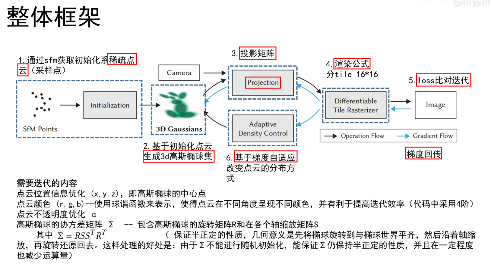


初始化 : 通过 colmap 推理照片对应的相机位姿，得到 特征点，投射到世界坐标，得到稀疏关键点云(比随机初始化更快收敛)
1. 


Gaussian 椭球集创建
1. 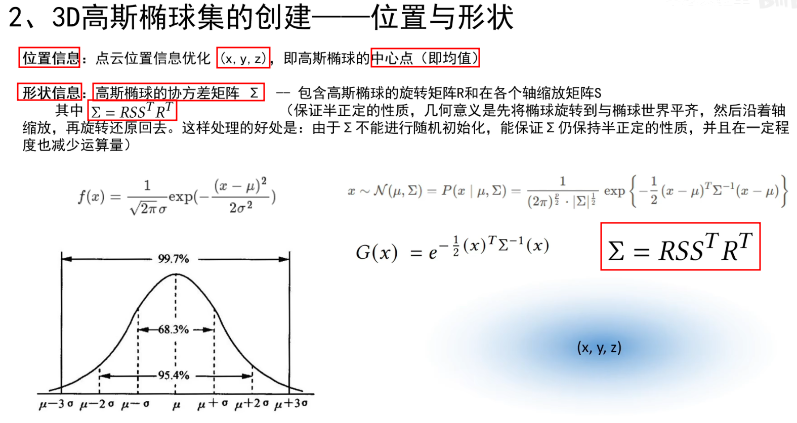
2. 协方差矩阵$\Sigma$ 决定形状，联想 PCA


## 02 - 球谐函数(Spherical Harmonics) 概念

类似于傅里叶级数，也是由一堆 基函数 组成(用于球面)

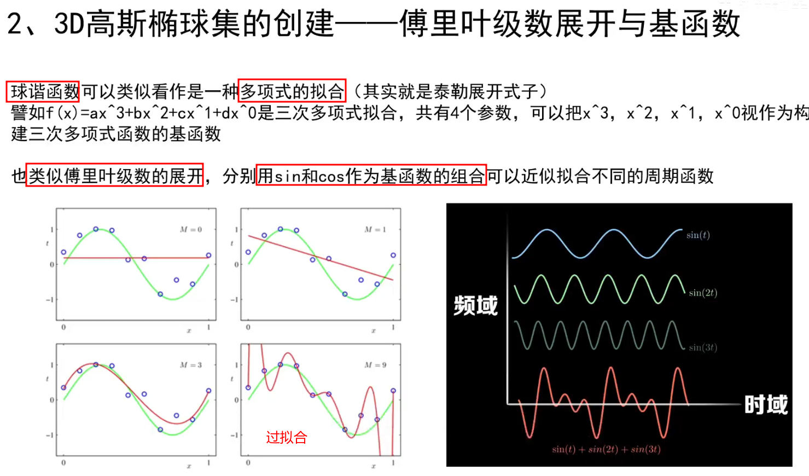

$r=f(\theta, \phi)$

左图中，每一行代表阶数(从0开始)

左下角图 展示 球谐函数 基函数 (阶数越高，表达能力越强)，通过 线性组合

球谐函数 只和 仰角 & 方位角 有关，与 半径 r 无关


颜色表达类似，r,g,b 对应 之前的 半径 r

r,g,b 分别用三个不同的 球谐函数 储存颜色值

代码中使用 4阶 球谐函数 (共有 0,1,2,3 阶数)

第l层的球数 = 2l + 1

个人理解 : 每个球只存储一个权重值，从倒三角可以看出，球的累计数量($n$ 阶)为 $n^2$

因为 有 r,g,b 三个值，故使用 $3×4^2 = 48$ 个参数，存储 RGB 值

实现效果 : 从不同角度看高斯点云能有不同颜色

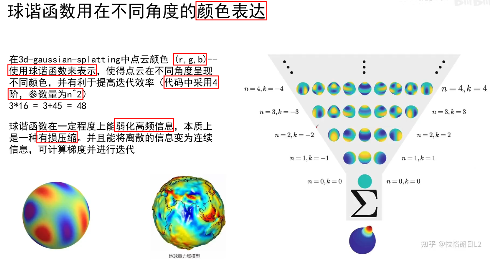


## 03 - 迭代参数 & 渲染

PLY 文件 Polygon File Format
1. 用于 存储三维模型的 点云数据 或 多边形网格
2. 存储 每个顶点的 位置、颜色、法向量以及其他与几何模型相关的属性
   1. ASCII 格式 : **以人类可读的形式存储**，容易查看和修改，但文件较大，加载速度较慢
   2. 二进制格式 : **以二进制形式存储**，文件更小，读取速度更快，但不易直接查看和编辑
3. 包含两个部分
   1. 头部(Header) : 描述文件内容的元数据(包含文件的格式，顶点、面的数量，以及对应属性)
      1. 以 ply 开始，以 end_header 结束
   2. 数据部分(Data Section) : 存储实际的点或面的数据


PLY 文件说明
1. element vertex 代表点数
2. property 代表每个点包含的信息
   1. x,y,z : Gaussian 中心点
   2. nx, ny, nz : 法向量信息
   3. f_dc, f_rest : 颜色信息，共 3 + 45 = 48 个参数(r,g,b 各 16)
   4. opacity : 不透明度，密度信息
   5. scale : 缩放矩阵
   6. rot : 旋转矩阵(旋转四元数)

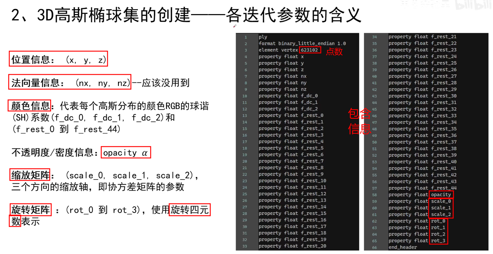


投影矩阵 - **非线性变换**

将原始形状进行挤压，到光栅化平面空间，将非平行线拉平，对点进行排序 并 进行光栅化渲染(并行计算加速)

使用雅可比矩阵，利用 泰勒公式(扩展到三维)一阶展开 进行线性近似

$\Sigma^{\prime}=J W \Sigma W^{T} J^{T}$

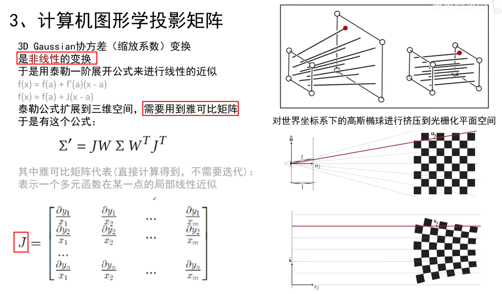


渲染公式，与 NeRF 一样，都是 `权重 × 不透明度 × 颜色`
1. NeRF 的 点基于射线(视线)，权重 是指 透光率，不透明度 是指 体密度
2. 3D GS 的

通过点云中一定半径范围内能够影响像素的 N个 有序点 计算像素的颜色C


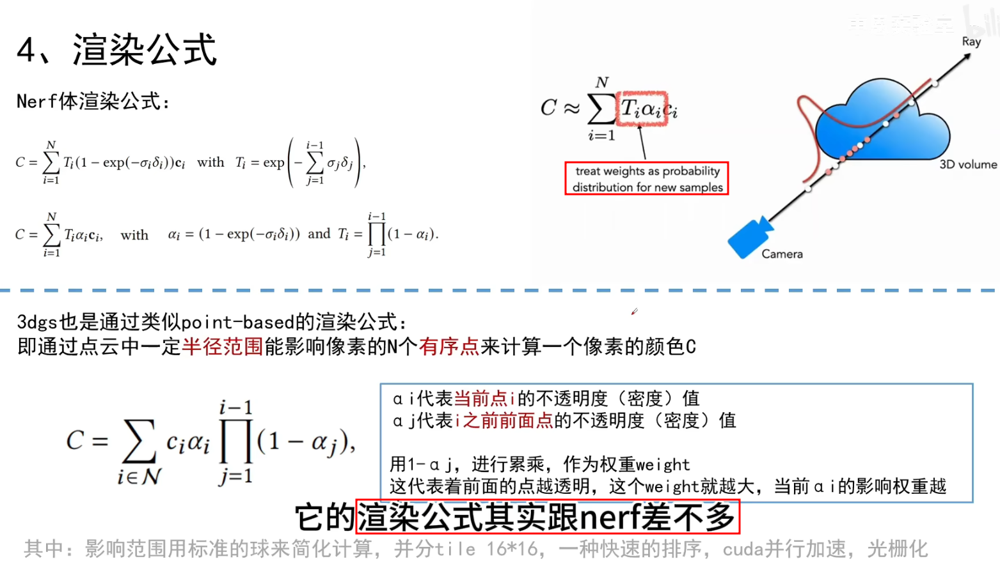

损失函数 Loss
1. $\mathcal{L} = (1 - \lambda)\mathcal{L}_1 + \lambda\mathcal{L}_{D-SSIM}$
2. 论文使用值 $\lambda = 0.2$

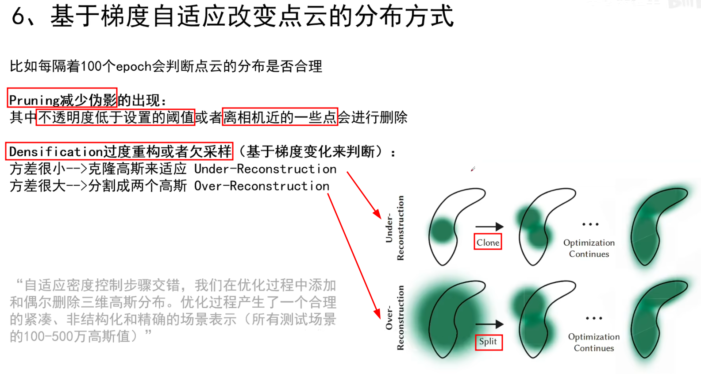


初始化点云质量不高


## 04 - 伪代码流程


Rasterize 光栅化


---


# 讲人话 3D Gaussian Splatting 全解

[讲人话 3D Gaussian Splatting 全解](https://space.bilibili.com/644569334/channel/collectiondetail?sid=3173291)

[3D GS Render Python(Python 替代 CUDA) - Github](https://github.com/SY-007-Research/3dgs_render_python)

基于 Splatting 和 机器学习 的 3D Reconstruction 方法 (无深度学习)


## 捏雪球

**什么是 splatting?**
1. 一种体渲染方法，从 3D物体 渲染到 2D平面
2. 形象理解
   1. 输入是一些雪球，**图片是砖墙**
   2. 图像生成过程 是 向墙面扔雪球的过程
   3. 每扔一个雪球，墙面上会有**扩散痕迹**，足迹(footprint)
3. 主动 & 被动
   1. Splatting : **主动**算法，计算出 **每个发光粒子如何影响(多个)像素点**
   2. NeRF : **被动**算法(Ray-Casting)，计算出 **每个像素点受到发光粒子的影响来生成图像**
4. 核心
   1. 选择 雪球形状
   2. 投掷 雪球，3D to 2D 得到footprint
   3. 合成 footprint


**什么是 3D Gaussian?**
1. 为什么使用 核?
   1. 输入是 点云中的点 没有体积，需要给点一个核，进行膨胀
   2. 核 可以是 高斯 / 圆 / 正方形
2. 为什么选择 Gaussian? 因为有很好的数学性质:
   1. **仿射变换**后，高斯核仍然闭合(封闭性)
   2. 3D 降维到 2D (沿着某一个轴积分) 后，依然为高斯
3. 3D Gaussian 定义
   1. $$G(x)=\frac{1}{\sqrt{(2 \pi)^{k}|\Sigma|}} e^{-\frac{1}{2}(x-\mu)^{T} \Sigma^{-1}(x-\mu)}$$
   2. $$G(x, y, z) = \frac{1}{(2 \pi)^{3/2} |\Sigma|^{1/2}}
         \exp \left( -\frac{1}{2}
            \begin{bmatrix}
               x - \mu_x \\ y - \mu_y \\ z - \mu_z
            \end{bmatrix}^T
            \Sigma^{-1}
            \begin{bmatrix}
               x - \mu_x \\ y - \mu_y \\ z - \mu_z
            \end{bmatrix}
         \right)$$
   3. $\Sigma$ 表示 **协方差矩阵**(**正定**)，控制高斯核在不同方向上的扩散程度(形状和方向)
   4. $|\Sigma|$ 是 **该协方差矩阵**行列式
4. P.S. : 低维(1,2 维) Gaussian 函数
   1. $$f(x) = \frac{1}{\sqrt{2 \pi \sigma^2}} \exp \left( -\frac{(x - \mu)^2}{2 \sigma^2} \right)$$
   2. $$f(x, y) = \frac{1}{2 \pi \sigma_x \sigma_y}
         \exp \left( -\frac{(x - \mu_x)^2}{2 \sigma_x^2} - \frac{(y - \mu_y)^2}{2 \sigma_y^2} \right)$$
   3. $$f(x, y) = \frac{1}{2 \pi \sigma_x \sigma_y \sqrt{1 - \rho^2}}
         \exp \left(-\frac{1}{2(1 - \rho^2)}\left[
            \frac{(x - \mu_x)^2}{\sigma_x^2}
            + \frac{(y - \mu_y)^2}{\sigma_y^2}
            - \frac{2\rho(x - \mu_x)(y - \mu_y)}{\sigma_x \sigma_y}
         \right]\right)$$


**为什么 3D Gaussian** 是 **椭球**?
1. 对于相同 协方差矩阵，exp() 前面的部分为 常数，exp() **指数为常数 对应了 整个 3D Gaussian 部分为常数(其余部分本身就是常数)**
2. 令 exp() 指数为常数时，即 指数 = const 时，该表达式 为 椭球面
3. 概率密度函数的等值面(具有相同概率密度的 3D 点所组成的表面) 形成了 椭球面，也就对应 3D Gaussian = const 的形状为 椭球面
4. 而 **3D Gaussian 可以取 [0, 1]** 因此 全部可能可以看做 **椭球**(实心)


**协方差矩阵** 怎么就能 **控制椭球形状呢**? 怎么就能 用 旋转 和 缩放 矩阵表达?
1. 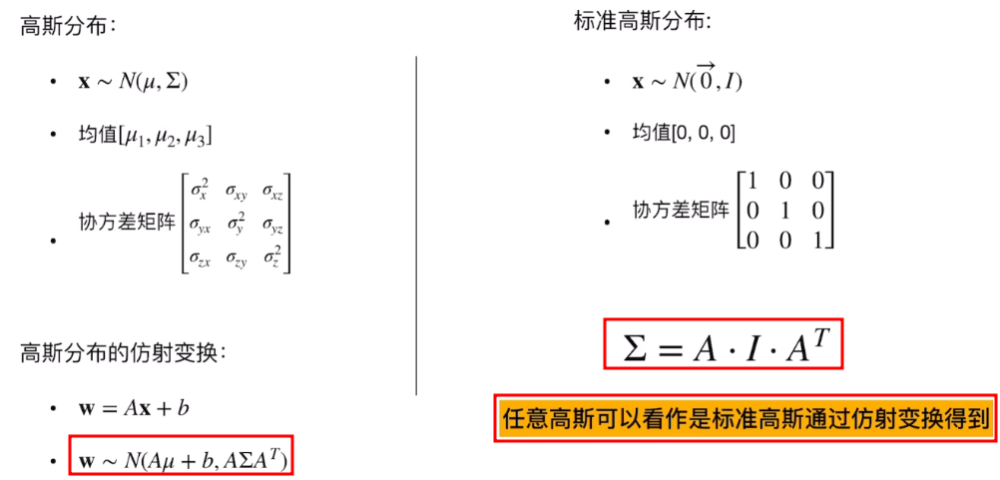
2. 任意 Gaussian 可以看做标准 Gaussian(均值=0，协方差=$I$) 通过 **变换** 得到的
3. 重点在于协方差矩阵，$\Sigma$，可以表示为 **旋转 + 拉伸 + 旋转** 动作
   1. SVD 分解 :
   2. EVD 分解 : $\Sigma = U \Lambda U^{T}$，取 $A = U \Lambda^{1/2}$，则可得 $\Sigma = AA^T$
      1. $\Lambda$ 为对角阵
      2. $U$ 是由特征向量构成的正交阵(旋转矩阵)，P.S. **实对称矩阵特特征向量一定正交**
4. 如果所有维度上的方差都相同且没有相关性，那么高斯分布的等值面是一个球体，因为在每个方向上的扩展是对称的(对应 **各向同性 Isotropic**)
5. 协方差矩阵 $\Sigma$ 的特征值和特征向量决定了高斯分布的主轴方向和扩展范围
   1. EigenValue 决定了高斯分布在各个主轴方向上的扩展程度
   2. EigenVector 定义了椭球的主轴方向

**Cholesky 分解**， `scipy.linalg.cholesky` - TODO


**各向异性** 和 **各向同性** 是什么意思?
1. 各向同性(Isotropic)高斯核 : 协方差矩阵 $\Sigma$ 是 标量矩阵 $\sigma^2I$，各个方向方差相同，各个方向不相关，**在每个方向上的扩散程度相同**
   1. $$G(x, y, z) = \frac{1}{(2 \pi \sigma^2)^{3/2}}
         \exp \left(-\frac{(x - \mu_x)^2 + (y - \mu_y)^2 + (z - \mu_z)^2}{2 \sigma^2} \right)$$
2. 各向异性(Anisotropic)高斯核 : 此时协方差矩阵 $\Sigma$ 是一个一般的 3×3 **对称正定矩阵**，**不同方向上具有不同的扩散程度**
   1. $$\Sigma = \begin{bmatrix}
            \sigma_x^2  & \rho_{xy}    & \rho_{xz} \\
            \rho_{xy}   & \sigma_y^2   & \rho_{yz} \\
            \rho_{xz}   & \rho_{yz}    & \sigma_z^2
         \end{bmatrix}$$
   2. $\rho$ 表示不同维度之间的协方差，表示各方向之间的相关性


## 抛雪球 (3D -> Pixel)

**相机模型** : 世界坐标系(WCS) -> 相机坐标系(CCS) -> 归一化坐标系(NCS) -> 像素坐标系(PCS)
1. $$\left[\begin{array}{l}
         u \\
         v \\
         1
      \end{array}\right]
      =\underbrace{\left[\begin{array}{ccc}
         f_x   & 0      & c_x \\
         0     & f_y    & c_y \\
         0     & 0      & 1
      \end{array}\right]}_{\text{PCS} \leftrightarrow \text{NCS}}
      \underbrace{\left[\begin{array}{ccc}
         \frac{1}{z_c}  & 0               & 0 \\
         0              & \frac{1}{z_c}   & 0 \\
         0              & 0               & 1
      \end{array}\right]}_{\text{NCS} \leftrightarrow \text{CCS}}
      \underbrace{\left[\begin{array}{cc}
         R & T \\
         0 & 1
      \end{array}\right]}_{\text{CCS} \leftrightarrow \text{WCS}}
      \left[\begin{array}{c}
         x_{world} \\
         y_{world} \\
         z_{world} \\
         1
      \end{array}\right]$$


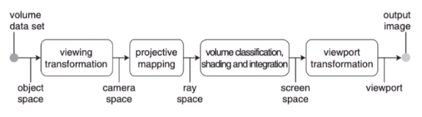

**Computer Graphics**
1. **视图变换**(View Transformation) (世界坐标系 -> 相机坐标系)
   1. 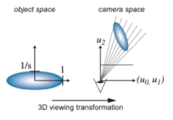
2. **投影变换**(Projection Transformation) (相机坐标系 -> 2D 空间)
   1. 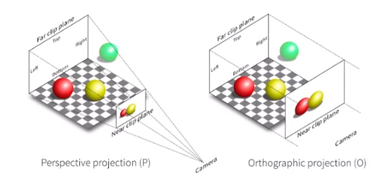
   2. 正交(Orthographic)投影 - 无近大远小，与深度无关
   3. 透视(Perspective)投影 - 有近大远小，与深度有关
      1. 先把 **视锥** 压成立方体，再进行正交投影
      2. **非线性** ？ - TODO
3. **视口变换** ()
4. **光栅化** (Rasterization)
   1. 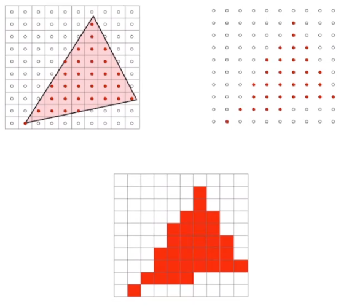
   2. 连续转离散 (要显示在离散的像素中)
   3. 采样 (查看像素中心点是否在图形中)
   4. 可能会产生 混叠、混淆(Aliasing)


**3D Gaussian** (核心 : 均值 & 协方差)
1.


为什么引入 雅可比?
1. 不能直接使用投影变换，需要引入雅可比近似矩阵


如何进行参数估计?


球谐函数 怎么就能 更好的表达颜色?

3D GS 怎么就快了?


## 抛雪球


## 雪球颜色


## 高性能渲染 & 机器学习


