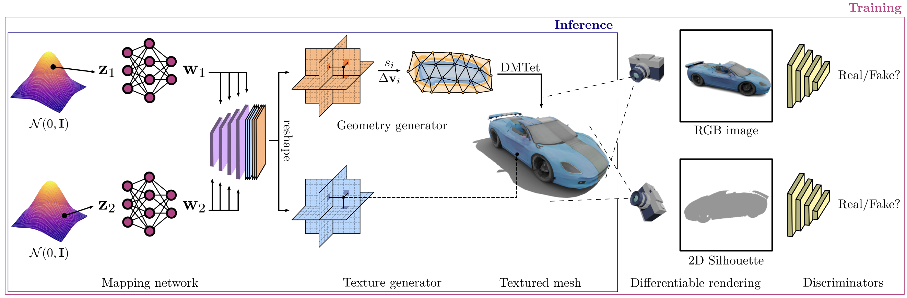
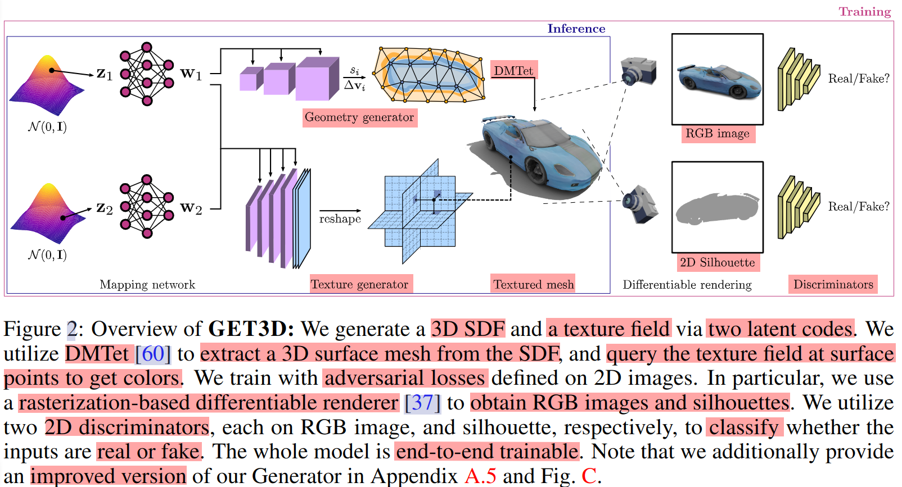
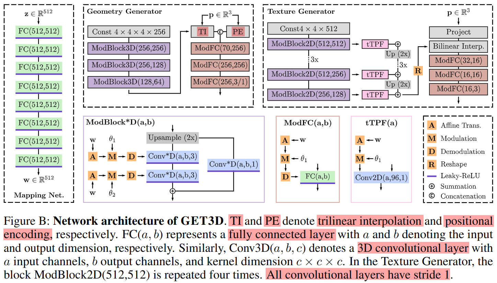
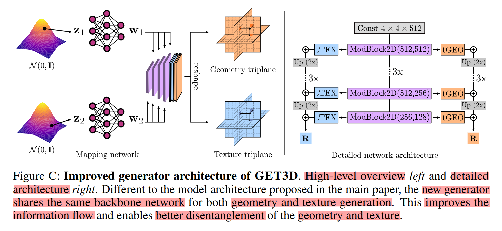

# GET3D: A Generative Model of High Quality 3D Textured Shapes Learned from Images (NeurIPS 2022)

[Paper Website](https://research.nvidia.com/labs/toronto-ai/GET3D/)

[Github](https://github.com/nv-tlabs/GET3D)

Related Paper
1. 3D Simulation
   1. UniSim
   2. ClimateNeRF
   3. PhysGaussian
2. 3D Generation
   1. DreamFusion
   2. PointFlow
   3. Get3D
   4. WonderJourney
   5. XCube

DMTet 专注于 隐式表示的精细化 和 高效的显式网格提取

GET3D 专注于 生成直接可用的高分辨率纹理化显式网格

[CLAY](https://sites.google.com/view/clay-3dlm)

Start with a deep learning model trained on 2D images

Watch as a point on high-dimensional space becomes triangles, meshes, and textures to visualize diverse objects in 3D

GET3D通过一系列2D图像训练后，可生成具有高保真纹理和复杂几何细节的 3D 形状

这些 3D 对象以主流图形软件所使用的相同格式创建，允许用户快速将其形状导入3D渲染器和游戏引擎以进行进一步编辑

GET3D得名于其能够生成显式纹理3D网格的能力(Generate Explicit Textured 3D meshes)

它创建的形状是三角形网格的形式，就像纸模型一样，上面覆盖着纹理材质

# Website 笔记

We generate a 3D SDF and a texture field via two latent codes.

We utilize DMTet to extract a 3D surface mesh from the SDF, and query the texture field at surface points to get colors.

We train with adversarial losses defined on 2D images.

In particular, we use a rasterization-based differentiable renderer to obtain RGB images and silhouettes.

We utilize two 2D discriminators(鉴别器), each on RGB image, and silhouette(轮廓), respectively, to classify whether the inputs are real or fake.

The whole model is end-to-end trainable.

GET3D is able to generate diverse shapes with arbitrary topology, high-quality geometry and texture.

Disentanglement(解耦) between Geometry and Texture
1. geometry latent code
2. texture latent code

Latent Code Interpolation
1. apply a random walk **in the latent space** and generate corresponding 3D shapes
2. generate a smooth transition between different shapes for all categories

Generating Novel Shapes
1. **locally perturb(局部扰乱) the latent code** by adding a small noise
2. GET3D is able to generate similar looking shapes with slight difference locally

Unsupervised Material Generation
1. Combined with **DIBR++**, GET3D is able to generate materials and produce meaningful **view-dependent lighting effects** in a completely **unsupervised manner**

Text-guided Shape Generation
1. follow recent work **StyleGAN-NADA** , where **users provide a text** and we fine-tune our 3D generator by computing the **directional CLIP loss** on the rendered 2D images and the provided texts from the users(使用文本提示为图像添加特定的风格)

# Abstract & Introduction

industry -> modeling massive 3D virtual worlds -> the need for content creation tools

3D marketplaces such as [Turbosquid](https://www.turbosquid.com/) or [Sketchfab](https://sketchfab.com/)

aim -> train performant 3D generative models that synthesize **textured meshes** (can be directly consumed by 3D rendering engines(Maya, Blender))

Prior Work 之前工作的问题
1. lack geometric details 几何细节缺失
   1. Methods that generate voxel often lack geometric details and do not produce texture
2. limited in the mesh topology 拓扑受限
   1. Methods that directly output textured 3D meshes typically require pre-defined shape templates and cannot generate shapes with complex topology
3. do not support textures 缺乏纹理支持
   1. Methods that generate 3D point clouds do not produce textures and have to be converted to a mesh in post-processing
4. utilize neural renderers in the synthesis process not easy to use in 3D software (implicit 隐式) 依赖神经渲染器
   1. SDF(signed distance field)
   2. NeRF(Neural Radiance Fields)
   3. 3D Gaussian Splatting
   4. 适合 Novel View Synthesis 新视角合成，不适合得到显式的 3D Model
   5. focus on extracting geometry but disregard texture

GET3D, a Generative model that directly generates **Explicit Textured 3D meshes** with
1. complex topology(arbitrary mesh topology)
2. rich geometric details
3. high fidelity(精确) textures

able to leverage 2D images for supervision, as they are more widely available than explicit 3D shapes

Bridge
1. Differentiable surface modeling
2. Differentiable rendering
3. 2D Generative Adversarial Networks (to train our model from 2D image collections)

方法核心 : generative process(for end-to-end) utilizes
1. differentiable **explicit surface extraction method**(显式表面提取)
   1. enables us to directly optimize and output textured 3D meshes with arbitrary topology
2. differentiable **rendering technique**
   1. allows us to train our model with 2D images
   2. leveraging powerful and mature discriminators developed for 2D image synthesis

model
1. directly generates meshes
2. uses a highly efficient (differentiable) graphics renderer, allowing us to learn high-quality geometric and texture details
   1. scale up our model to train with image resolution as high as 1024 × 1024

[ShapeNet](https://shapenet.org/) - 一个大规模、公开的 3D 模型数据库

[Turbosquid](https://www.turbosquid.com/) - Turbosquid 是一个商业化的 3D 模型在线市场

[RenderPeople](https://renderpeople.com/) - 逼真的 3D 人物模型的资源网站

GET3D is also very flexible and can easily be adapted to other tasks
1. learning to generate decomposed material and view-dependent lighting effects
2. text-guided 3D shape generation using **CLIP embedding**

# Related Work

3D Generative Models(for geometry and appearance)
1. 2D generative models have achieved photorealistic quality in high-resolution image synthesis
2. directly **extend the 2D CNN generators to 3D voxel grids**
   1. high memory footprint(占用的空间) and computational complexity of 3D convolution -> 无法 high-resolution
3. explored point cloud, implicit, or octree representations
   1. focus mainly on **generating geometry** and **disregard appearance**
   2. output representations also need to be post-processed to make them compatible with standard graphics engines
4. More similar to our work
   1. Textured3DGAN and DIBR
      1. 生成带纹理的 3D 网格
      2. but they formulate the generation as a deformation of a template mesh 依赖于模板网格的变形
         1. 无法生成 复杂拓扑 or shapes with varying genus 多重属类
   2. PolyGen and SurfGen
      1. 支持生成任意拓扑的网格，但无法生成纹理

3D-Aware Generative Image Synthesis - 3D 感知的图像生成
1. neural volume rendering(神经体积渲染，NeRF) and implicit representations
   1. Neural volume rendering networks 查询速度慢，训练时间长
   2. generate images of limited resolution
2. GIRAFFE and StyleNerf 通过 低分辨率神经渲染并使用 2D 卷积上采样，提高了训练和渲染效率
   1. 提升效率的代价是 多视角一致性 (Multi-view Consistency) 的下降
3. EG3D can partially mitigate Multi-view Consistency problem
   1. 从基于神经渲染的方法中提取纹理化表面仍然困难

# Method

分为 Geometry & Texture 生成器，分别负责 表面mesh & mesh对应纹理

使用 可微渲染器 从 textured mesh 得到 RGB & 2D轮廓

Discriminator 判别器

The entire process is differentiable, allowing for **adversarial training** from images

##  Generative Model of 3D Textured Meshes

通过 generator 将 标准正态分布的潜变量 $z$ 映射为 mesh M & texture E

**following StyleGAN**

Geometry & Texture 的 non-linear Mapping Network 结构类似，都为 8层 全连接

将 random input vector $z_1, z_2$ 转为 intermediate latent vectors，后续用于 produce style that control shapes & texture generation

为什么需要 Mapping Network 既然 前后都是 512维 latent vector?
1. $z, w$ 信息量一样，但是 $z_1$ 遵循 训练数据的 特征分布，对于很少出现的特征 表达能力弱，容易发生 特征纠缠，无法具体控制单一特征
2. 通过 Mapping，模型可以生成 不需要跟随 训练数据分布的 隐变量 $w$，做到 特征解耦/分离
3. Mapping Network 深度越深，特征分离 效果越好

### Geometry Generator

输入 $z_1$ latent code(512维)，控制 表面生成，经过 mapping network 得到 中间隐变量 $w_1$(512维)

$w_1$ 经过 神经网络(a series of conditional 3D convolutional and fully connected layers) 得到 两种输出 $s_i$(空间四面体网格顶点 SDF值) & $\Delta v_i$(空间四面体网格顶点 偏移量 deformation from initial canonical coord)，$s_i$ 指导 $\Delta v_i$ 偏移，更好的拟合 物体表面

$v_i^\prime = v_i + \Delta v_i$

first use 3D convolutional layers to generate a feature volume conditioned on $w_1$

query the feature at each vertex using trilinear interpolation and feed it into MLPs that outputs the SDF value & deformation

一共有 3个 输入
1. $w_1$ 512 维
2. 随机初始化的 特征体 (4×4×4×256)
   1. 训练时，对同类型物体，特征体 参数共享
   2. 通过 3个 调制3D卷积块(每一层都升采样)，得到 (32×32×32×64)
      1. 隐变量 会对 卷积块 中 每一层 卷积 进行调制
      2. 首先经过 仿射变换 得到 样式 style，再经过 调制 & 解调
3. 空间四面体网格顶点位置 $p$
   1. 网格顶点 $p$ 映射到 特征体(32×32×32×64) 中
   2. 经过 三线性插值 得到 64 维，结合 position encoding 6维(sin & cos)，共 70 维

再经过 调制全连接层 得到 $s$(3维) & $\Delta v_i$(1维)

最后进行归一化

**adopting DMTet for surface extraction**，利用 DMTet 的 differentiable Marching Tetrahedron Layer，extract the explicit mesh
1. 如果四面体的某一条边两端顶点的符号不同 $sign(s_i)$ 不同，说明该边穿过了隐式表面
2. 交点位置 由 插值得到

### Texture Generator

generating a texture map **consistent with the output mesh** is not trivial

solution : parameterize the texture as Texture Field 纹理场，而不是直接生成一个纹理贴图

Tri-plane Representation

输入 $z_1$ latent code(512维)，经过 mapping network 得到 中间隐变量 $w_2$(512维)

使用 $z_1$ & $z_2$ 共同生成 texture，纹理 不仅与样式有关，还与 mesh 有关

输出结果 为 3平面场，物体表面任意点都可以映射

3个输入
1. 隐变量 $w_1$ & $w_2$ 级联
2. 随机初始化的 特征图 (4×4×512)
3. 空间四面体网格顶点位置 $p$

经过 6 层 调制卷积块，并通过 3平面变换(tTPF) 升采样(Up)，叠加到下一层，得到最终特征 (256×256×96)

Reshape 后 变为 沿各自轴的 3平面特征，每个平面(256×256×32)

位置坐标 通过 投影变换，投影到三个平面的特征值，加权求和，并分别进行 双线性插值，并通过 3层 全连接调制，得到最终 RGB 颜色

only need to sample the texture field at the locations of the surface points

无需 沿射线 对纹理场 进行密集采样(dense samples along a ray)

reduces the computational complexity

guarantees to generate multi-view consistent images by construction(因为纹理场与表面点直接绑定)

##  Differentiable Rendering and Training

draw inspiration from **Nvdiffrast**

render 3D mesh & texture to 2D 轮廓 & images using differentiable renderer

supervise our network with a 2D discriminator

2 separate discriminators for RGB & silhouettes(to distinguish the image from a real object or rendered from the generated object)

Differentiable Rendering
1. assume **camera distribution** that was used to acquire the images in the dataset **is known**
2. each pixel contains the coordinates of the corresponding 3D point on the mesh surface
3. coordinates are further used to query the texture field to obtain the RGB values
4. **operate directly on the extracted mesh** →  can render high-resolution images with high efficiency & allow our model to be trained with image resolution

Discriminator & Objective
1. e train our model using an **adversarial objective**
2. adopt discriminator architecture from **StyleGAN**
3. 2 separate discriminators for RGB & silhouettes empirically better

Regularization : remove floating faces that are not visible in any of the views
1. regularize the geometry generator with a cross-entropy loss( defined between the SDF values of the neighboring vertices)

Overall Loss 由 3部分组成，`轮廓 判别器 loss` + `图片 判别器 loss` + `正则项`

# Experiment

Datasets
1. ShapeNet
2. TurboSquid
3. Renderpeople

train a separate model on each category

Metrics(评价指标)
1. Geometry
   1. Chamfer Distance (CD) 点云之间的几何相似性
   2. Light Field Distance (LFD) 光场图像的相似性评价几何形状
   3. Coverage (COV) 生成形状与测试集形状之间的覆盖范围
   4. 最小匹配距离 (Minimum Matching Distance, MMD)
2. Texture
   1. Fréchet Inception Distance (FID) 计算生成图像与真实图像的分布差异
      1. FID-Ori
      2. FID-3D

GET3D generates high-quality shapes with diverse texture, high-quality geometry, and complex topology.

Shape interpolation. GET3D is able to faithfully generate a smooth and meaningful transition from one shape to another

Shape variation. We locally perturb each latent code to generate different shapes.

和 DeepSDF 一样，GET3D 的模型在一次训练中主要针对 单一类别 的物体进行生成

潜变量属于一个形状类别的潜变量空间，训练时每个潜变量代表一个具体形状

# Conclusion

GET3D is trained using only 2D images as supervision

Limitation
1. rely on 2D silhouettes as well as the knowledge of camera distribution during training
2. only evaluated on synthetic data
3. trained per-category not able to handle multi-category
4. GET3D is also prone to biases introduced in the training data

Broader Impact

改进，隐变量 同时输入 同一个网络，tTPF 分别用 tTEX & tGEO 代替

the new generator shares the same backbone network for both geometry and texture generation

improves the information flow and enables better disentanglement of the geometry and texture

