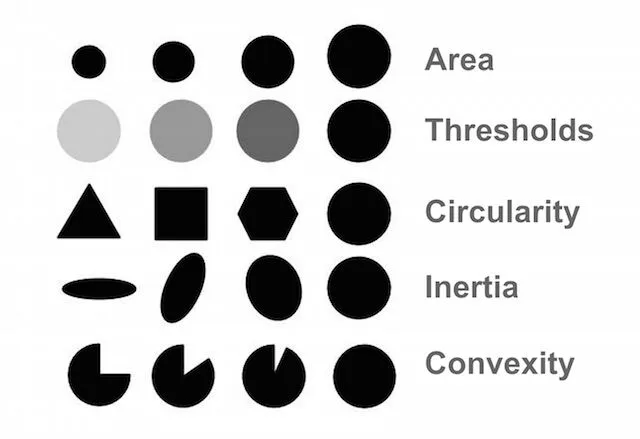

# Blob Detection 斑点检测

[cv::SimpleBlobDetector Class Reference](https://docs.opencv.org/4.10.0/d0/d7a/classcv_1_1SimpleBlobDetector.html)

工作原理
1. 图像二值化(binary images)
   1. 基于灰度图像的斑点检测器，因此只能对图像的亮暗(灰度值)进行过滤，无法直接控制 RGB 颜色的具体值
   2. 需要配合 `cv2.inRange` 生成一个二值掩码
2. 提取连通区域轮廓 `findContours` & 计算中心点
3. 分组中心点
   1. 位置接近的中心点会被分为同一组，这个分组距离由参数 `minDistBetweenBlobs` 控制
   2. 每组对应一个斑点`blob`，即表示在图像中检测到的一个物体
4. 估计最终的斑点中心和半径

OpenCV 类
1. `params = cv2.SimpleBlobDetector_Params()`
2. `detector = cv2.SimpleBlobDetector_create(params)`

Filter Parameters
1. color
   1. `blobColor = 0` to extract dark blobs
   2. `blobColor = 255` to extract light blobs
   3. 只能设置为一个特定值(0 或 255)，表示检测暗色或亮色的斑点，而无法设置成一个范围
   4. 个人理解 是 对于 binary image
2. area
   1. minArea : inclusive
   2. maxArea : exclusive
3. circularity
   1. $$circularity = \frac{4 \pi × Area}{Perimeter^2}$$
   2. 对于 完美圆形 $circularity = 1$
   3. $$circularity = \frac{4 \pi × (\pi r^2)}{(2 \pi r)^2}$$
   4. 形状的 $circularity < 1$，因为它们的周长相对于面积来说更大
4. ratio of the minimum inertia to maximum inertia (惯性比)
   1. 一个完美的圆形或接近正方形的形状，Inertia Ratio 会接近 1
   2. 一个细长的椭圆或长条形的物体，Inertia Ratio 会接近 0
5. convexity
   1. `area / area of blob convex hull(凸包)`

测试代码 : [BlobDetectionTrackbar.py](./BlobDetectionTrackbar.py)

