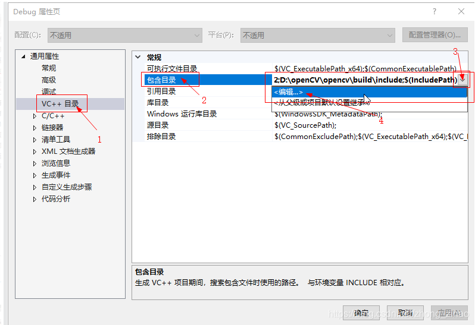
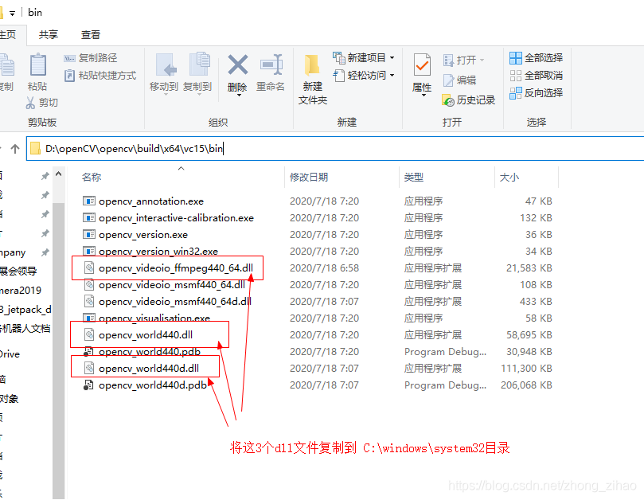

# 安装OpenCV


官网，下载

VS2019使用vc15目录中的内容


# 配置环境

1. 环境变量配置

    添加到Path
    ```
    D:\OpenCV\opencv_4.5.0\opencv\build\x64\vc15\bin
    ```

2. 配置VS2019包含目录

    1. 创建一个新的控制台应用，创建完成后选择 视图--其他窗口--属性管理器
   
        

    2. 在win10 64位系统里，将运行环境改为Debug x64，选择Debug x64的文件夹，右键-属性 打开配置

        

    3. 选择VC++目录 -- 包含目录 -- 点击下拉箭头 -- 编辑
        
        添加以下路径：

        openCV安装目录下\opencv\build\include

        openCV安装目录下\opencv\build\include\opencv2

        ```
        D:\OpenCV\opencv_4.5.0\opencv\build\include
        D:\OpenCV\opencv_4.5.0\opencv\build\include\opencv2
        ```

        

3. 配置VS2019 库目录

    

    添加此路径：

    openCV安装目录\opencv\build\x64\vc15\lib

    ```
    D:\OpenCV\opencv_4.5.0\opencv\build\x64\vc15\lib
    ```

4. 配置链接器依赖项

    1. 先找到 安装目录\opencv\build\x64\vc15\lib 下的 opencv_worldXXX.lib和opencv_worldXXXd.lib, 其中XXX为openCV的版本，带d后缀的为debug版本。 复制opencv_worldXXXd.lib 这个名字

        

        ```
        D:\OpenCV\opencv_4.5.0\opencv\build\x64\vc15\lib
        ```

    2. 回到vs 选择 链接器--输入--附加依赖项--编辑 添加依赖项

        

    3. 手动输入 opencv_worldXXXd.lib（名字按照目录下的lib名字复制） ，点击确认

        

5. 找到安装目录\opencv\build\x64\vc15\bin目录下，以下的dll文件复制到 C:\Windows\System32 系统目录

    
