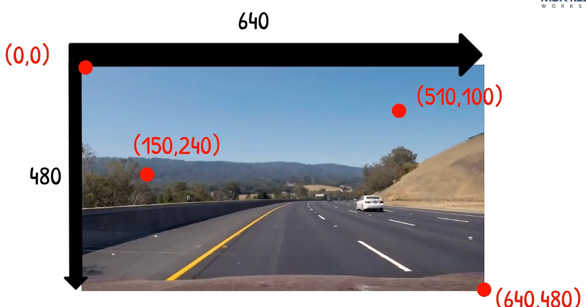

# OpenCV Python

# Portals

[LEARN OPENCV in 3 HOURS with Python](https://www.bilibili.com/video/BV16K411W7x9/)

# LEARN OPENCV in 3 HOURS with Python

# RGB&BGR
OpenCV在1999年由Intel建立，当时主流的摄像头制造商和软件供应商提供的摄像头采集的图像的通道排列顺序为BGR，另外对于图片，位图BMP是最简单的，也是Windows显示图片的基本格式，其文件扩展名为*.BMP。在Windows下，任何格式的图片文件（包括视频播放）都要转化为位图才能显示出来，各种格式的图片文件也都是在位图格式的基础上采用不同的压缩算法生成的，值得注意的是位图BMP的格式就是BGR。正是基于BGR在当时被广泛使用，于是早期OpenCV开发者就选择BGR颜色格式，这也就成为了一种规范一直用到现在。

# opencv坐标系

# resize与reshape的区别
resize 无返回值（返回值为None），会改变原数组。
reshape 有返回值，返回值是被reshape后的数组，不会改变原数组。

resize 可以放大或者缩小原数组的形状：放大时，会用0补全剩余元素；缩小时，直接丢弃多余元素。
reshape 要求reshape前后元素个数相同，否则会报错，无法运行。
