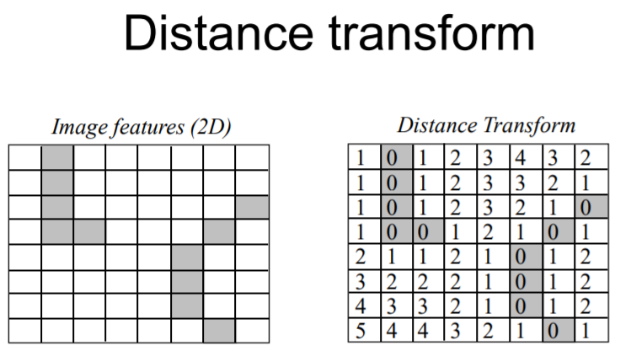

# Distance

衡量 两个点云之间 相似度/差异(discrepancy) 的方法

# Chamfer Distance

关注整体分布(平均最近距离)，对噪声鲁棒，**适用于生成任务中的质量评估**

定义 : 给定两个点云 P 和 Q，Chamfer Distance 是 `P 中每个点到 Q 中最近的点的距离的平方和`与 `Q 中每个点到 P 中最近的点的距离的平方和` 的平均值

$$
CD(A, B) = \frac{1}{|A|} \sum_{a \in A} \min_{b \in B} d(a, b) + \frac{1}{|B|} \sum_{b \in B} \min_{a \in A} d(b, a)
$$

$$CD(A, B) = CD(B, A)$$

计算 Chamfer Distance 需要先确定每个点在另一个点云中的最近点

常用的算法有 暴力匹配 和 KD-Tree 匹配

暴力匹配的时间复杂度较高(仅适用小规模)，而 KD-Tree 匹配可以在 `O(n log n)` 的时间复杂度内完成(适用于大规模)

进行 Chamfer Distance 计算之前
1. 标准化点云数据，使得每个点的坐标都在同一尺度上
2. 需要对点云数据进行预处理(去除噪声、过滤异常值)

和 2D 图像的 距离变换 类似，但是 单向
1. 

# Hausdorff Distance

关注最坏情况(最大的最小距离)，对噪声敏感，**适用于几何精确匹配**
1. 集合中某一点到另一集合最近的点的距离，然后在所有这些最小距离中取最大值
2. 对于 集合1 的 每一个点，找 集合2 中最近的 点，然后 求出最大值。集合2 也做相同操作，最后再找出 两个方向的最大值

$$
H(A, B) = \max\left\{\sup_{a \in A} \inf_{b \in B} d(a, b), \sup_{b \in B} \inf_{a \in A} d(b, a)\right\}
$$
1. $inf$ : 从集合中找到与某点最近的点的距离
2. $sup$ : 找到所有最近距离中的最大值

$$H(A, B) = H(B, A)$$

对于 异常点 敏感
1. 一个点集 A 中大部分点集中在某一区域，而一个异常点 outlier 远离这个区域
2. 导致 该 outlier 到 另一集合 的 最小距离 很大

