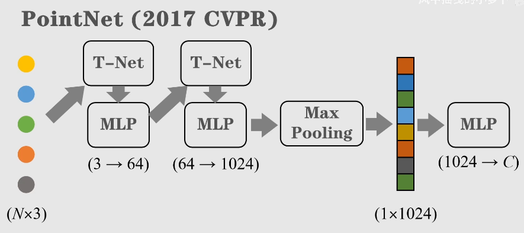

# PointNet: Deep Learning on Point Sets for 3D Classification and Segmentation

[PointNet - Project Website](https://stanford.edu/~rqi/pointnet/)

[PointNet - Github](https://github.com/charlesq34/pointnet)

[5分钟深度学习-点云篇 - B站(风中摇曳的小萝卜)](https://space.bilibili.com/168709400/lists/1379836?type=season)

## Table of Contents

- [PointNet: Deep Learning on Point Sets for 3D Classification and Segmentation](#pointnet-deep-learning-on-point-sets-for-3d-classification-and-segmentation)
  - [Table of Contents](#table-of-contents)
- [PointNet \& PointNet++](#pointnet--pointnet)
  - [最远点采样 (Farthest Point Sampling, FPS)](#最远点采样-farthest-point-sampling-fps)
  - [PointNet](#pointnet)
  - [PointNet++](#pointnet-1)
- [PointNet作者亲述 3D物体检测算法和未来方向](#pointnet作者亲述-3d物体检测算法和未来方向)

# PointNet & PointNet++

## 最远点采样 (Farthest Point Sampling, FPS)

图像金字塔 : 不断 下采样的 多尺度表达方式
1. 

点云下采样 也需要 尽可能的 均匀

Farthest Point Sampling, FPS
1. 
2. 
3. 步骤
   1. 初始化空集合，存储选中的采样点
   2. 第1个点随机选择，后续点按照规则选取，储存在集合中
   3. 计算所有其他点和集合中的各个点之间的距离
      1. 对于每一个可能的新的点，距离是它和所有集合中点的距离的最小值
   4. 选择所有其他点中，距离最大的点 作为新的采样点
   5. 相当于最大化最小值，**希望 新点 要尽量远离 已有 采样点**，最近的距离要尽量大
4. 最常见的 点云均匀采样算法
5. 时间复杂度为 $O(MN) ≈ O(N^2)$，从 n个点 采样出 m个点
6. 缺点
   1. 运算速度难以实时
   2. 对噪声敏感(远的噪声点会被采样到，偏离真实几何结构)

实际算法中 使用 `distance` & `distance_tmp`
1. 定义
   1. `distance` : 每个点 到 已有全部采样点的 最小距离，初始化为 99999
   2. `distance_tmp` : 新采样点 到 每个点的 最小距离
2. 第一个点是随机选取的，计算其 `distance_tmp`
3. `distance` & `distance_tmp` 取 min 更新在 `distance` 中
4. 从 `distance` 中 选取 最大值，作为 新采样点

## PointNet

图像数据 有序(结构化)

点云数据 无序(非结构化) : 调换点云元素的顺序，点云仍保持原有的 几何 & 语义 & 类别 信息

神经网络 需要 对抗点云的无序性，从而学习 robust 的点云特征

点云包含 (x, y, z) 三维信息，任意排列

使用 MLP 将其进行升维，取每个维度的 最大值 (**==取最大值的操作 与 点云顺序 无关==**)，也就是 max-pooling 最大值池化，得到 最终向量(也就和点云顺序无关)

原版的 PointNet 在 MLP 前，增加了 变换矩阵的学习 T-Net，提升网络 对点云刚性变换的 泛化能力

如果需要对点云分割，预测每个点的类别，则需要 先对全局特征进行复制，然后用第一个 MLP 的数据，拼接到全局特征，保留 整体点云特征 & 点云间差异

**除了使用 max-pooling 也可以使用 mean-pooling & weighted-sum pooling**，实验结果是 max-pooling 准确率最高

## PointNet++

PointNet 的局限性
1. 并非所有点都有相同的重要性
2. 有代表性的局部结构更加有用
3. 分析 复杂 & 大尺度 环境点云时候，PointNet 性能不够

通过 最远点采样(Farthest Point Sampling, FPS)，采集到具有代表性的点

通过 固定半径的 球状邻域查询(Ball Query)，构成球状邻域 (也可以使用 KNN 等算法)，构成子集

多尺度聚合策略

使用 PointNet 网络，提取各个子集的特征
1. 
2. 点坐标 直接计算
3. 隐空间特征 通过 PointNet 得到
4. 点坐标 & 隐空间特征 作为下层网络的 input

相当于 PointNet 仅仅作用在 一个 局部邻域中，使其更关注局部性质

PointNet 可以看作是 图神经网络中的 readout 函数

本质上，PointNet++ 使用非常稀疏的 图结构来建模 点云数据

PointNet++ 编码器 使用了多个 SGP集合(set abstraction 模块)，不断减少点的数量 增加输出端通道数

针对不同任务，可以有不同输出

对于分割任务，需要学习每一个点的特征，需要恢复点的数量

对所有 蓝色点进行相同操作，可以恢复原始点云中 点的数量，并添加 编码器学到的特征 (**feature propagation**)

Encoder-Decoder 结构

PointNet++ 的共享是提供了 点云分析的框架结构，其中的 PointNet 结构可以替换为 其他 Encoder

PointNet++ 对于多尺度特征 & 局部几何特征 的提取性能 远远超过 PointNet

---

# PointNet作者亲述 3D物体检测算法和未来方向

[[PointNet作者亲述] 3D物体检测算法和未来方向 - B站视频](https://www.bilibili.com/video/BV1wA411p7FZ/)

