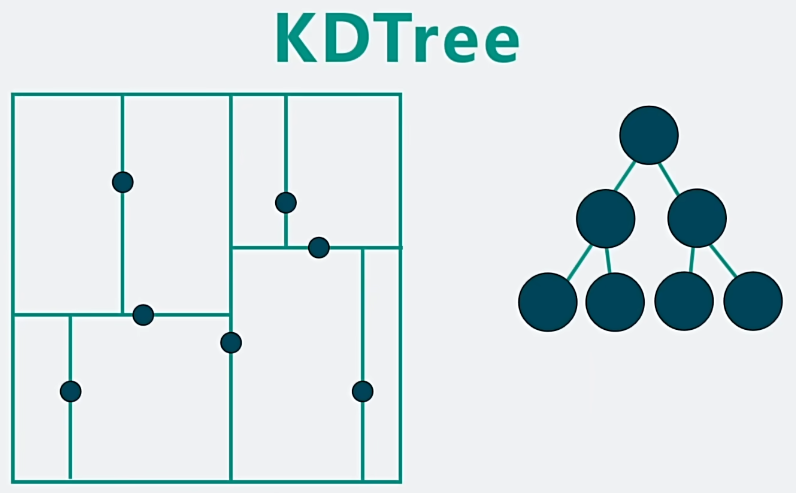
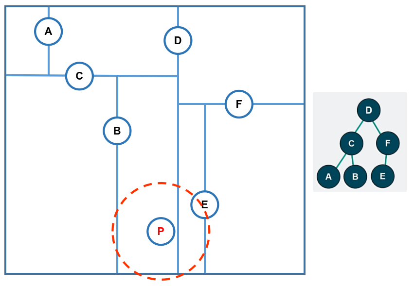

#

KD Tree
1. 用于 对k维空间进行分割，高效进行 最近邻搜索问题 Nearest Neighbor Search
2. 是一种 平衡二叉树
3. 根据物体位置关系，将空间不断二分，得到二叉树
4. 
5. 构建过程
   1. 交替 划分 x/y 轴
   2. 根据 x/y 坐标排序，过中位点，垂直 x/y轴 做分割线
   3. 递归构建 左右 子树
6. 最近邻搜索过程
   1. 给定 查询点坐标
   2. 从根节点开始，不断判断 处于 左子树 还是 右子树
   3. 直到到达 叶子节点，暂时取 该叶子节点为最近邻，并记录最近距离
   4. 判断 圆(以 暂时的 最近邻点 & 最近距离 画圆) 是否 与 父节点 对应的分割线 相交
      1. 如果相交，从 叶子节点 回溯 父节点，判断是否更近
         1. 更近 则 更新 暂时的最近邻 & 最近距离
         2. 回溯 判断 其他子树是否可能包含更近的点
      2. 如不相交，进行剪枝(如果 查询点 与 分割平面的距离 大于当前最优距离，则 无需检查 另一个子树)
         1. 理解 : 如果都和分割线不相交了，该分割线另一侧的子树距离更远
   5. 直到 回溯到根节点
7. 较坏/最坏 情况
   1. 数据点集中分布在一个狭长的区域内(如沿着对角线分布)，当在角落查询一个最近邻点时，由于数据点的分布方向与分割平面方向不一致，剪枝效果大大降低
   2. 查询点位于分割边界附近
      1. 
      2. 根据 边界 最初的 最近邻 为 P 但是 显然，需要跨越
   3. 最坏情况 : 退化为需要遍历所有节点
8. Cons
   1. 构建成本高
   2. 不支持动态更新

BVH

BSP Tree

