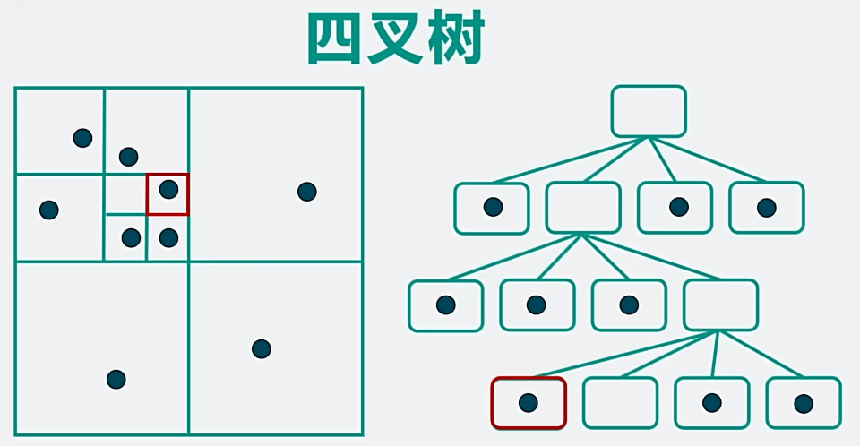
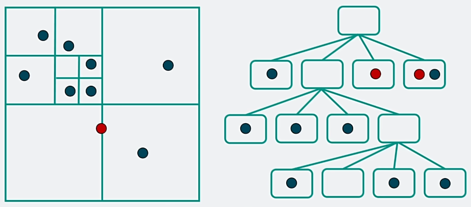
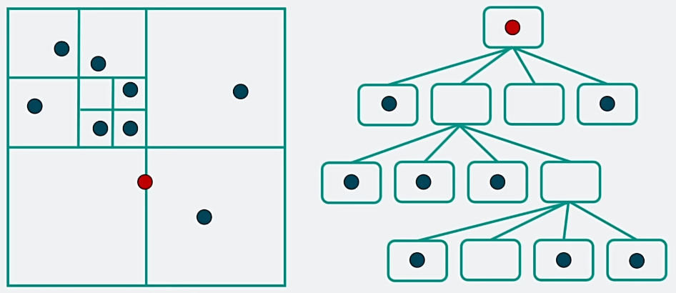
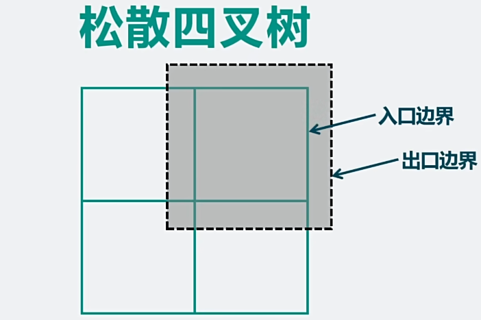

Quad Tree - 四叉树
1. 
2. 常用于碰撞检测优化 (空间划分 Spatial Partition)
3. 将空间递归划分为多个相等的子空间，直到 空间中物体数量小于阈值 或 达到树的最大深度
4. 从根节点开始缩小范围到相关子空间，只需要跟子空间内物体进行精细的碰撞检测即可，过滤大量不可能交互的物体
5. 压线情况 (2个方案)
   1. 每个子空间都存储(树的体积变大)
      1. 
   2. 存储在父节点(无关子空间进行冗余碰撞检测)
      1. 
6. 更新问题
   1. 从头开始建树
   2. 动态更新(将物体从旧节点删除，再插入新节点)
   3. 松散四叉树 Loose Quad Tree，(处理在边界附近频繁变动)
      1. 
      2. 出口边界 > 入口边界 (经验值 2倍)