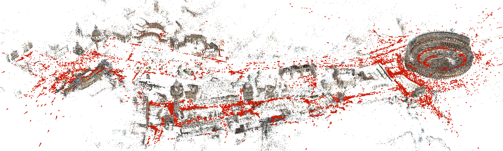
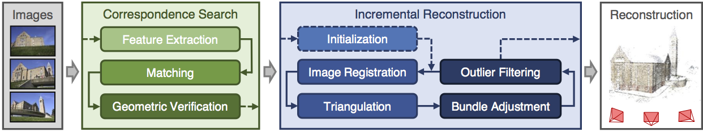

# COLMAP : Structure-from-Motion Revisited(CVPR 2016)

[COLMAP - Documentation](https://colmap.github.io/index.html)

[COLMAP - Github](https://github.com/colmap/colmap)

[COLMAP - Structure-from-Motion and Multi-View Stereo](https://demuc.de/colmap/)

[CVPR2017 - Large-­scale 3D Modeling](https://demuc.de/tutorials/cvpr2017/)


## Table of contents


# Tutorial



Image-based 3D reconstruction from images traditionally **first recovers a sparse representation of the scene and the camera poses** of the input images using **Structure-from-Motion**

This output then **serves as the input to Multi-View Stereo** to **recover a dense representation of the scene**


## Quick Start

自动重建
1. 直接 `Reconstruction > Automatic Reconstruction`
2. 无需前期进行 `Feature Extraction` & `Feature Matching`
3. `New Project`
   1. `New Database` (选定位置，起名字)
   2. `Select Images` (选择图片存放位置)

自动重建结果(包含 sparse & dense)

```text
+── images
│   +── image1.jpg
│   +── image2.jpg
│   +── ...
+── sparse (contains the sparse models for all reconstructed components)
│   +── 0
│   │   +── cameras.bin
│   │   +── images.bin
│   │   +── points3D.bin
│   +── ...
+── dense (contains corresponding dense models)
│   +── 0
│   │   +── images
│   │   +── sparse
│   │   +── stereo
│   │   +── fused.ply(dense point cloud)
│   │   +── meshed-poisson.ply
│   │   +── meshed-delaunay.ply
│   │   +── (dense mesh must be visualized with an external viewer such as Meshlab)
│   +── ...
+── database.db
```


## Camera Models

[Camera Models - COLMAP Documentation](https://colmap.github.io/cameras.html)

COLMAP implements different camera models of varying complexity. If no intrinsic parameters are known a priori, it is generally best to use the simplest camera model that is complex enough to model the distortion effects

Supported Cameras
1. `SIMPLE_PINHOLE(f, cx, cy)`, `PINHOLE(fx, fy, cx, cy)` (已去畸变)
   1. when your images are **undistorted** a priori
   2. Note that even in the case of undistorted images, COLMAP could try to improve the intrinsics with a more complex camera model
2. `SIMPLE_RADIAL(f, cx, cy, k)`, `RADIAL(f, cx, cy, k1, k2)` (未去畸变，未知内参)
   1. when the **intrinsics are unknown** and **every image has a different camera calibration**
      1. e.g. **Internet photos**
   2. simplified versions of the OPENCV model, only modeling **radial distortion effects**, OPENCV 模型的简化版本，只建模径向畸变
3. ` OPENCV(fx, fy, cx, cy, k1, k2, p1, p2)`, `FULL_OPENCV(fx, fy, cx, cy, k1, k2, p1, p2, k3, k4, k5, k6)` (已知内参)
   1. when **know the calibration parameters** a priori (`k` 径向畸变, `p` 切向畸变)
   2. can also try to let COLMAP estimate the parameters, if you share the intrinsics for multiple images
      1. 可以选择让COLMAP自己估计内参，也可以将自己知道的内参告诉COLMAP，(COLMAP**只能共享一套内参**，不能指定多个相机模型)，让COLMAP去估计外参
      2. 即使你不知道相机的具体内参，COLMAP 也能尝试通过优化来估计它们
   3. Note that the automatic estimation of parameters will most likely fail, if every image has a separate set of intrinsic parameters
      1. 如果每张图片有不同的内参的话，自动重建可能会失败
4. `SIMPLE_RADIAL_FISHEYE, RADIAL_FISHEYE, OPENCV_FISHEYE, FOV, THIN_PRISM_FISHEYE, RAD_TAN_THIN_PRISM_FISHEYE`
   1. for fisheye lenses
   2. other models are not capable of modeling the distortion effects of fisheye lenses
   3. The FOV model is used by Google Project Tango (make sure to not initialize omega to zero).


# 参数说明

Cameras(已使用的相机模型数量)

Images(输入的图像总数)

Registered Images(成功注册(定位)到稀疏点云中的图像数量)

Points(稀疏点云的总点数)

Observations(所有图像中成功匹配到的特征点总数)

Mean Track Length(每个 3D 点被观测到的平均图像数量)

Mean Observations Per Image(每张图像中平均的特征点观测数)

Mean Reprojection Error(平均重投影误差)


# Datasets

[COLMAP Datasets](https://demuc.de/colmap/datasets/)
1. South Building: **128 images** of the "South" building at UNC Chapel Hill. The images are taken with the same camera, kindly provided by Christopher Zach.
2. Gerrard Hall: **100 high-resolution images** of the "Gerrard" hall at UNC Chapel Hill, which is the building right next to the “South” building. The images are taken with the same camera but different focus using a wide-angle lens.
3. Person Hall: **330 high-resolution images** of the "Person" hall at UNC Chapel Hill. The images are taken with the same camera using a wide-angle lens.


# 视觉三维重建colmap 框架的现状与未来

[视觉三维重建colmap 框架的现状与未来](https://www.bilibili.com/video/BV1xi421v74W/?)

NeRF & Gaussian Splatting，精度上比不过 传统 MVS 精度，但是视觉效果更好(水、玻璃)，带火 COLMAP，输入并非必须是 COLMAP，但是 COLMAP 开源 & 容易安装

AR 领域 也使用 COLMAP，AR 核心是 空间计算 VPS(Virtual Positioning System)

local/global Bundle Adjustment

三维重建软件
1. COLMAP (2016，开源)
2. OpenMVG + OpenMVS (2015，开源)
   1. `Multiple View Geometry` & `Multi-View Stereo Reconstruction`
   2. 稀疏重建和密集重建分离
   3. 需要手动将 OpenMVG 的结果传递给 OpenMVS
3. AgiSoft MetaShape(PhotoScan)
4. Bentley ContextCapture


## SfM & SLAM

| 特性       | SfM                                       | SLAM                                   |
|-----------|-------------------------------------------|----------------------------------------|
| 核心目标   | 从多视角图像中恢复三维结构，优化相机位姿和稀疏点云 | 同时进行实时定位 和 环境建图               |
| 应用场景   | 静态场景重建(建筑建模、景区重建)                | 动态环境中的机器人导航、无人机飞行、增强现实  |
| 实时性     | **离线处理，不要求实时性**                    | 强调**实时性**，需要高效计算               |
| 输入数据   | 一组多视角的图像(通常已知次序)                 | 连续的传感器数据(图像序列、IMU、激光雷达)    |
| 结果输出   | 稀疏点云、密集点云和高精度的三维模型             | 机器人轨迹和环境地图(稀疏点云、栅格地图等)   |
| 核心算法   | 图像特征提取与匹配、PnP、BA、三角化等           | 图像特征提取、视觉惯性融合、局部优化、回环检测 |
| 优化方式   | **全局捆绑调整**(Global BA)，优化所有帧和点云   | 关键帧 BA + 非关键帧 滤波器 + **回环检测**  |
| 精度要求   | 精度优先，允许花费大量时间进行优化               | 实时性优先，精度和速度需要权衡              |


## 存在的问题

对于 车载数据(forward motion)，不需要频繁的 global BA
1. 减少 `Mapper.ba_global_max_refinements` 次数
2. 增大 模型扩大到一定比例 触发 global BA 的条件
   1. `Mapper.ba_global_images_ratio` : 添加 多少比例 新图像 后
   2. `Mapper.ba_global_points_ratio` ： 添加 多少比例 新点 后
   3. `Mapper.ba_global_images_freq` : 添加 多少张 新图像 后

对于 车载数据，baseline 短，图像两侧特征消失快，需要 调小 初始最小三角化角度 `Mapper.init_min_tri_angle`(降低三角化失败的可能性)

相机模型 选择
1. 简单模型
   1. 欠拟合，模型过于简单，无法捕捉数据的复杂性
   2. 出现 blend map(图像重建或点云拼接过程中，数据无法完美对齐)
2. 复杂模型
   1. 可能不收敛，复杂模型 引入了更多的 自由度(参数)
   2. 如果 数据质量不好 或 优化初值不佳 或 数据不足，可能会导致优化过程不收敛

Matching 匹配(**耗时**)
1. Exhaustive
   1. 暴力匹配，对所有图像两两匹配，匹配结果全面，计算量大
2. Sequential
   1. 假设相邻图像之间具有较大的重叠区域，只在相邻图像之间进行匹配
   2. 适用于顺序拍摄的图像(视频帧)
3. Vocabulary Tree
   1. 使用词袋模型(Bag of Words)加速匹配
      1. 用于 将数据转换为 固定维度的特征向量
      2. 把数据中的元素 看作词汇
   2. 利用视觉单词对图像进行特征聚类，只匹配相似的图像对
   3. 适合大规模数据集，需要预训练词袋模型
   4. Deep Learning 方法(netvlad, cosplace) 完全超越 BoW，替代传统检索方式
4. Spatial Matching
   1. 利用 GPS 或相机的位置信息限制匹配范围
5. Transitive Matching
   1. 利用已知的匹配关系推断新的图像对匹配关系，需要高质量的初始匹配

View Graph 优化
1. 特征检测 & 匹配 后生成 view graph
2. 基于图像之间的特征匹配关系生成的图结构
   1. 节点 (Node)： 每张图像表示一个节点
   2. 边 (Edge)： 两张图像之间有足够的匹配点(特征对)时，会连接一条边，边权重通常代表匹配质量
3. 直接从图像特征匹配得到的 View Graph 可能包含冗余或错误的边
4. 通过剔除冗余边，降低后续 BA 和相机位姿计算的复杂性
5. 仅保留高质量的边可以减少错误的几何约束，提升整体精度


Drift 问题
1. 使用 GCP(Ground Control Points, 控制点)/GPS 约束 改善
2. 将 已知点作为约束，优化相机位姿和点云，使整个模型与真实世界对齐
3. 帮助解决长距离或大场景的漂移问题
4. 减少漂移，确保模型的全局一致性
5. 提供绝对尺度信息，使模型具有物理意义

多源数据处理(手机、全景设备)

COLMAP 速度慢
1. 可采用 分组 SfM (Pipeline 问题)
   1. 将整个数据集 划分为多个较小的 子集(groups)，分别进行局部 SfM 重建，然后将这些局部模型合并为全局模型

COLMAP 评判机制
1. Metrics : Track Length, Reprojection Error, ...
2. Reprojection Error 重投影误差 其实没有意义，即使很小 SfM 也会有 drift


# Installation 安装

[COLMAP - Installation](https://colmap.github.io/install.html)

```bash
# Dependencies from the default Ubuntu repositories
sudo apt-get install \
    git \
    cmake \
    ninja-build \
    build-essential \
    libboost-program-options-dev \
    libboost-filesystem-dev \
    libboost-graph-dev \
    libboost-system-dev \
    libeigen3-dev \
    libflann-dev \
    libfreeimage-dev \
    libmetis-dev \
    libgoogle-glog-dev \
    libgtest-dev \
    libgmock-dev \
    libsqlite3-dev \
    libglew-dev \
    qtbase5-dev \
    libqt5opengl5-dev \
    libcgal-dev \
    libceres-dev

# 自己装了 cuda 应该还是需要，否则 Feature Extraction 都会报错
# To compile with CUDA support, also install Ubuntu’s default CUDA package
sudo apt-get install -y \
    nvidia-cuda-toolkit \
    nvidia-cuda-toolkit-gcc

# Configure and compile COLMAP
git clone https://github.com/colmap/colmap.git
cd colmap
mkdir build
cd build
cmake .. -GNinja  # 根据 COLMAP 的源码生成对应的构建文件，这些文件可以被 Ninja 编译器使用
    # 如果下一步 ninja 出现 Unsupported gpu architecture 'compute_native'
    # nvcc --help | grep compute
    # 可以添加 -DCMAKE_CUDA_ARCHITECTURES=90或75等
ninja  # 使用 Ninja 编译器根据 CMake 生成的构建文件编译 COLMAP，将 COLMAP 的源码编译为可执行文件和动态库
sudo ninja install  # 将编译好的 COLMAP 安装到系统中，以便全局使用
```


Run COLMAP
```bash
colmap -h  # help
colmap gui
```


[Snap 安装 COLMAP](https://snapcraft.io/install/colmap/ubuntu) - 未测试成功

