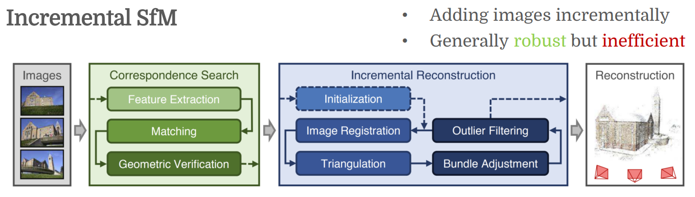
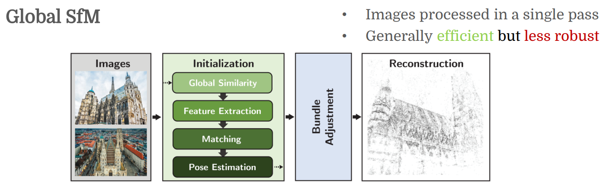
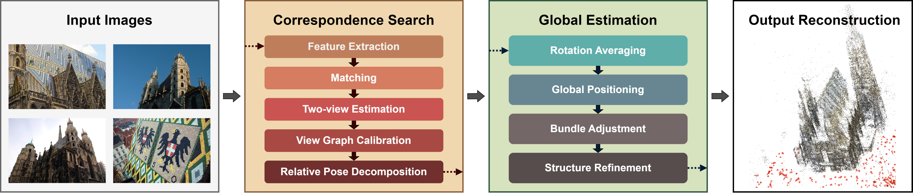
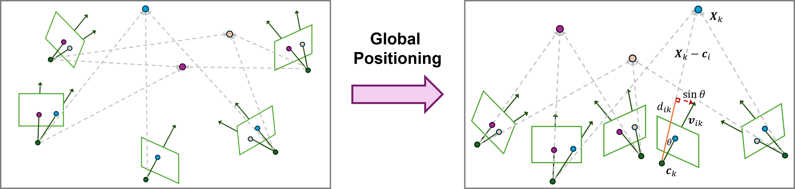

# GLOMAP: Global Structure-from-Motion Revisited

[GLOMAP - Website](https://lpanaf.github.io/eccv24_glomap/)

[Github](https://github.com/colmap/glomap)

SfM
1. incremental method
   1. 
2. global method
   1. 

The pipeline consists of two major components
1. 
2. correspondence search
3. global estimation

The major differences between GLOMAP and other bases are three steps
1. view graph calibration
2. global positioning(**core step**)
   1. 
   2. `camera position` and `image points` are jointly estimated from random positional
3. structure refinement

