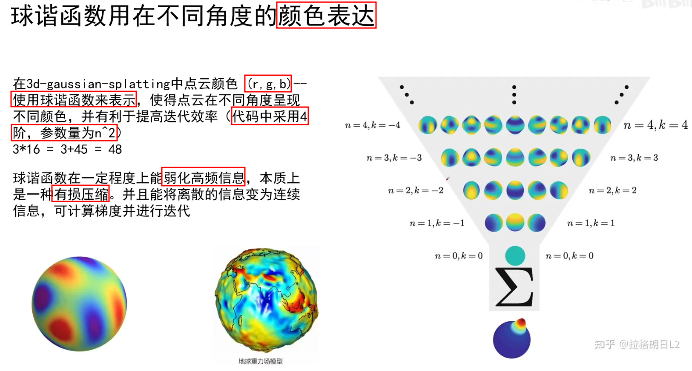
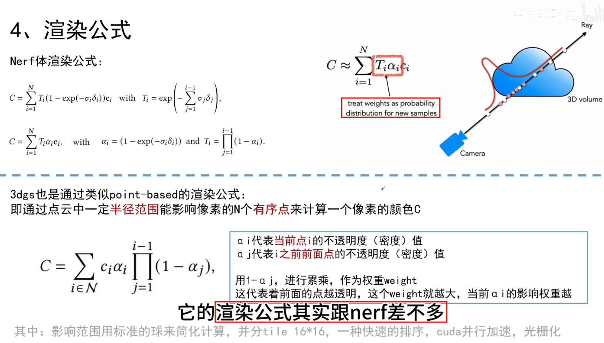

# 3D Gaussian Splatting for Real-Time Radiance Field Rendering

[3D Gaussian Splatting - Paper Website](https://repo-sam.inria.fr/fungraph/3d-gaussian-splatting/)

[3D Gaussian Splatting - Github](https://github.com/graphdeco-inria/gaussian-splatting)

[gaussian-splatting-Windows - Github](https://github.com/jonstephens85/gaussian-splatting-Windows) - tutorial(`ffmpeg` & `convert.py` & `train.py`)


NeRF & 3D GS
1. NeRF : Ray-Tracer
2. 3D Gaussian : Rasterizer


核心步骤
1. 
2. 

[3D Gaussian Splatting: How's This The Future of 3D AI? - YouTube](https://www.youtube.com/watch?v=C708Mh7EHZM)

[【论文讲解】用点云结合3D高斯构建辐射场](https://www.bilibili.com/video/BV1uV4y1Y7cA/)
1. 没有用到 法向量
2. 3D Gaussian - TODO 详细推导
   1. 文章中的 3D Gaussian 表达式 没有 控制概率密度积分=1 的系数
3. $\Sigma = AA^T = RSS^TR^T$, 变换矩阵$A$拆分为先缩放再旋转($A=RS$)
4. Optimization
   1. SGD 随机梯度下降
   2. 不透明度 激活函数 Sigmoid
   3. 协方差矩阵尺度 激活函数 Exponential
   4. 损失函数 $Loss = (1-\lambda)L_1 + \lambda L_{D-SSIM}$ (SSIM 结构相似性损失)
5. Adaptive Control of Gaussians 自适应密度控制
   1. 移除透明度小于阈值的点(源码似乎是 用 mask)
   2. 重建不充分的区域(反向传播的梯度较大，需要修正量大) - split(gaussian 方差大) & clone(gaussian 方差小)
6. Tile-based Rasterizer 快速可微光栅化 - TODO


## Table of Contents

- [3D Gaussian Splatting for Real-Time Radiance Field Rendering](#3d-gaussian-splatting-for-real-time-radiance-field-rendering)
  - [Table of Contents](#table-of-contents)
- [3D Gaussian Splatting 源码安装](#3d-gaussian-splatting-源码安装)
  - [Overview](#overview)
  - [Requirements](#requirements)
  - [Installation](#installation)
  - [Dataset](#dataset)
  - [Visualization](#visualization)
  - [Colab](#colab)
    - [下载文件](#下载文件)
- [源码解读](#源码解读)
- [Processing your own Scenes ☆](#processing-your-own-scenes-)
- [分组 3D GS](#分组-3d-gs)
- [Gaussian Splatting 原理速通 - 中恩实验室](#gaussian-splatting-原理速通---中恩实验室)
  - [01 - 三维高斯 概念](#01---三维高斯-概念)
  - [02 - 球谐函数(Spherical Harmonics) 概念](#02---球谐函数spherical-harmonics-概念)
  - [03 - 迭代参数 \& 渲染](#03---迭代参数--渲染)
  - [04 - 伪代码流程](#04---伪代码流程)
- [讲人话 3D Gaussian Splatting 全解](#讲人话-3d-gaussian-splatting-全解)
  - [捏雪球](#捏雪球)
  - [抛雪球 (3D -\> Pixel)](#抛雪球-3d---pixel)
  - [雪球颜色](#雪球颜色)
  - [高性能渲染 \& 机器学习](#高性能渲染--机器学习)
- [Cite Info](#cite-info)
- [Ideas from ShenLong Wang](#ideas-from-shenlong-wang)

---

# 3D Gaussian Splatting 源码安装

[Gaussian Splatting - Github](https://github.com/graphdeco-inria/gaussian-splatting)

## Overview

4 main components:
1. A **PyTorch-based optimizer** to produce a 3D Gaussian model from SfM inputs
2. A **network viewer** that allows to connect to and visualize the optimization process
3. An **OpenGL-based real-time viewer** to render trained models in real-time.
4. A script to help you **turn your own images into optimization-ready SfM data sets**

have been tested on **Windows 10** and **Ubuntu Linux 22.04**

## Requirements

[Your GPU Compute Capability - NVIDIA](https://developer.nvidia.com/cuda-gpus)

Optimizer
1. **Hardware Requirements**
   1. CUDA-ready GPU with Compute Capability 7.0+
   2. 24 GB VRAM (to train to paper evaluation quality)
   3. I don't have 24 GB of VRAM for training, what do I do?
      1. The VRAM consumption is **determined by the number of points that are being optimized**, which increases over time.
      2. If you only want to train to 7k iterations, you will need significantly less.
      3. To do the full training routine and avoid running out of memory, you can
         1. increase `--densify_grad_threshold` : 增大该值会减少高斯点的密集化，减少显存使用
         2. increase `--densification_interval` : 增大该值可以减少密集化的频率，从而降低显存需求
         3. reduce `--densify_until_iter` : 减少该参数值，可以缩短密集化的持续时间，降低显存占用
      4. Note however that this will affect the quality of the result.
      5. Also try setting `--test_iterations` to -1 to avoid memory spikes during testing. 禁用整个训练过程中的测试阶段
      6. If `--densify_grad_threshold` is very high, no densification should occur and training should complete if the scene itself loads successfully.
2. **Software Requirements**
   1. Conda (recommended for easy setup)
   2. C++ Compiler for PyTorch extensions (we used Visual Studio 2019 for Windows)
   3. CUDA SDK 11 for PyTorch extensions, install after Visual Studio (we used 11.8, known issues with 11.6)
   4. C++ Compiler and CUDA SDK must be compatible

Interactive Viewers
1. Hardware Requirements
   1. OpenGL 4.5-ready GPU and drivers (or latest MESA software)
   2. 4 GB VRAM recommended
   3. CUDA-ready GPU with Compute Capability 7.0+ (only for Real-Time Viewer)
2. Software Requirements
   1. Visual Studio or g++, not Clang (we used Visual Studio 2019 for Windows)
   2. CUDA SDK 11, install after Visual Studio (we used 11.8)
   3. CMake (recent version, we used 3.24)
   4. 7zip (only on Windows)


```python
import torch
if torch.cuda.is_available():
    print(torch.cuda.get_device_properties(0).name)  # NVIDIA GeForce RTX 3050 Laptop GPU
    print(torch.cuda.get_device_properties(0).major)  # 主版本号 : 8
    print(torch.cuda.get_device_properties(0).minor)  # 次版本号 : 6
else:
    print("No CUDA-ready GPU found.")
```

```bash
nvidia-smi --query-gpu=memory.total --format=csv
# memory.total [MiB]
# 4096 MiB

gcc --version  # 检查 C++ 编译器
# gcc (Ubuntu 11.4.0-1ubuntu1~22.04) 11.4.0
# Copyright (C) 2021 Free Software Foundation, Inc.

g++ --version
# g++ (Ubuntu 11.4.0-1ubuntu1~22.04) 11.4.0
# Copyright (C) 2021 Free Software Foundation, Inc.

nvcc -V  # 检查 CUDA SDK
# nvcc: NVIDIA (R) Cuda compiler driver
# Copyright (c) 2005-2024 NVIDIA Corporation
# Built on Tue_Feb_27_16:19:38_PST_2024
# Cuda compilation tools, release 12.4, V12.4.99
# Build cuda_12.4.r12.4/compiler.33961263_0

cmake --version
# cmake version 3.25.1
# CMake suite maintained and supported by Kitware (kitware.com/cmake).

glxinfo | grep "OpenGL version"
# OpenGL version string: 4.6 (Compatibility Profile) Mesa 23.2.1-1ubuntu3.1~22.04.2
```


## Installation

```bash
git clone https://github.com/graphdeco-inria/gaussian-splatting --recursive  # HTTPS  # recursive is for submodules
cd gaussian-splatting

sudo apt install build-essential
sudo apt install ninja-build


pip3 install submodules/diff-gaussian-rasterization
pip3 install submodules/simple-knn

pip3 install plyfile
pip3 install tensorboard


# Interactive Viewers
sudo apt install -y libglew-dev libassimp-dev libboost-all-dev libgtk-3-dev libopencv-dev libglfw3-dev libavdevice-dev libavcodec-dev libeigen3-dev libxxf86vm-dev libembree-dev
```

## Dataset

T&T+DB COLMAP (650MB)


## Visualization

[ PolyCam](https://poly.cam/library) - Go to library, Upload a 3D model

[3D Gaussian Splatting with Three.js - 清华大学自动化系JI-GROUP](https://www.neuralrendering.cn/)

[splatviz](https://github.com/Florian-Barthel/splatviz) - 待测试

## Colab

[gaussian_splatting_colab.ipynb](https://colab.research.google.com/github/camenduru/gaussian-splatting-colab/blob/main/gaussian_splatting_colab.ipynb)

```bash
%cd /content
!git clone --recursive https://github.com/camenduru/gaussian-splatting
!pip install -q plyfile

%cd /content/gaussian-splatting
!pip install -q /content/gaussian-splatting/submodules/diff-gaussian-rasterization
!pip install -q /content/gaussian-splatting/submodules/simple-knn

!wget https://huggingface.co/camenduru/gaussian-splatting/resolve/main/tandt_db.zip
!unzip tandt_db.zip

!python train.py -s /content/gaussian-splatting/tandt/train

# !wget https://huggingface.co/camenduru/gaussian-splatting/resolve/main/GaussianViewTest.zip
# !unzip GaussianViewTest.zip
# !python render.py -m /content/gaussian-splatting/GaussianViewTest/model
# !ffmpeg -framerate 3 -i /content/gaussian-splatting/GaussianViewTest/model/train/ours_30000/renders/%05d.png -vf "pad=ceil(iw/2)*2:ceil(ih/2)*2" -c:v libx264 -r 3 -pix_fmt yuv420p /content/renders.mp4
# !ffmpeg -framerate 3 -i /content/gaussian-splatting/GaussianViewTest/model/train/ours_30000/gt/%05d.png -vf "pad=ceil(iw/2)*2:ceil(ih/2)*2" -c:v libx264 -r 3 -pix_fmt yuv420p /content/gt.mp4 -y
```


### 下载文件

将文件夹下载到你的Google Drive中

```python
from google.colab import drive
drive.mount('/content/drive')
!cp -r [srcFolder] /content/drive/MyDrive/  # 会将 srcFolder 拷贝到 Google Drive 中 [srcFolder]
```


# 源码解读

`train.py` 训练代码主入口(`training()`函数)

`scene/__init__.py` 场景训练数据,相机数据,gaussian模型初始化

`scene/gaussian_model.py` gaussian模型核心代码

`scene/colmap_loader.py`

`gaussian_renderer/__init__.py` render渲染核心代码


# Processing your own Scenes ☆

COLMAP loaders expect the following `dataset structure` :

```bash
<location>
|---images  # 存储所有用于重建的图像
|   |---<image 0>
|   |---<image 1>
|   |---...
|---sparse  # 存储重建生成的稀疏点云数据
    |---0
        |---cameras.bin  # 相机参数
        |---images.bin  # 图像位姿，COLMAP 默认选择场景中第一个相机的位置作为原点
        |---points3D.bin  # 三维点
```

For **rasterization**, the camera models must be either a `SIMPLE_PINHOLE` or `PINHOLE` camera

converter script `convert.py`, to extract undistorted images and SfM information from input images

Optionally, can use ImageMagick to resize the undistorted images (creates images with 1/2, 1/4 and 1/8 the original resolution)

Put the images you want to use in a directory `<data_location>/input`

`python convert.py -s <location> [--resize] #If not resizing, ImageMagick is not needed`


loader 实际上会从 images 文件夹中读取文件，而不是从 input 文件夹读取
1. `input` 文件夹 主要用于存放未经处理的原始图像
2. `images` 文件夹 最终存放无畸变的、经过处理的图像
3. `sparse` 文件夹 用于存放最终的稀疏三维重建结果
4. `distorted` 表示未经去畸变处理的中间数据


`convert.py`

对于视频 可以先用 ffmpeg 从中提取 图片

```bash
ffmpeg -i {video} -qscale:v 1 -qmin 1 -vf fps={fps} %4d.jpg
ffmpeg -i {video} -qscale:v 1 -qmin 1 -vf "fps={fps},scale=iw/2:ih/2" %4d.jpg  # 添加 scale 滤镜来将图片缩小一半

# -qscale:v 1 -qmin 1 : 控制输出图像的质量，-qmin 1 : 设置最小质量
# -vf fps={fps} : 设置输出的帧率(vf = video filter)，将 {fps} 替换为所需的帧率，比如 fps=30 表示每秒提取 30 帧
# %4d.jpg : 指定输出文件的命名格式，从 0001.jpg 开始自动编号
```


COLMAP 的相机模型必须是 SIMPLE_PINHOLE 或 PINHOLE，这样才可以用于后续的光栅化渲染

**`convert.py`**
1. 对输入图像进行去畸变处理
2. 提取必要的结构化数据 `.bin`
3. 如果需要，也可以将图像按 1/2、1/4 和 1/8 的原始分辨率进行缩放(需要安装 ImageMagick)

```bash
python convert.py -s <location> [--resize]
```

准备数据 : 将所有需要处理的图像放入 `<location>/input`
```python
python convert.py -s <location> [--resize]
# -s <location>：指定数据位置
# --resize：可选参数，是否对图像进行缩放
```


# 分组 3D GS


---

# Gaussian Splatting 原理速通 - 中恩实验室

[中恩实验室 - B站主页](https://space.bilibili.com/3494380627299296/video)

[3D Gaussian Splatting 原理速通 - 中恩实验室](https://space.bilibili.com/3494380627299296/channel/collectiondetail?sid=2116610)


## 01 - 三维高斯 概念


3D GS 使用 椭圆 拼接

效果
1. 允许在 **1080p** 分辨率下实现高质量的实时 (**>30fps**) 的新视图合成
2. 在提出该方法时，在现有公开数据集，确保实时渲染，达到 sota 质量
3. mipnerf360 在渲染相同质量下，需要长达48h的训练时间，无法在高分辨率下实现实时渲染，10-15帧每秒


初始化 : 通过 **colmap** 推理照片对应的相机位姿，得到 特征点，投射到世界坐标，得到稀疏关键点云(比随机初始化更快收敛)，作为初始场景默认点
1. 


Gaussian 椭球集创建
1. 
2. 协方差矩阵$\Sigma$ 决定形状，联想 PCA


## 02 - 球谐函数(Spherical Harmonics) 概念

类似于傅里叶级数，也是由一堆 基函数 组成(用于球面)


$r=f(\theta, \phi)$

左图中，每一行代表阶数(从0开始)

左下角图 展示 球谐函数 基函数 (阶数越高，表达能力越强)，通过 线性组合

球谐函数 只和 仰角 & 方位角 有关，与 半径 r 无关


颜色表达类似，r,g,b 对应 之前的 半径 r

r,g,b 分别用三个不同的 球谐函数 储存颜色值

代码中使用 4阶 球谐函数 (共有 0,1,2,3 阶数)

第l层的球数 = 2l + 1

个人理解 : 每个球只存储一个权重值，从倒三角可以看出，球的累计数量($n$ 阶)为 $n^2$

因为 有 r,g,b 三个值，故使用 $3×4^2 = 48$ 个参数，存储 RGB 值

实现效果 : 从不同角度看高斯点云能有不同颜色




## 03 - 迭代参数 & 渲染

PLY 文件 Polygon File Format
1. 用于 存储三维模型的 点云数据 或 多边形网格
2. 存储 每个顶点的 位置、颜色、法向量以及其他与几何模型相关的属性
   1. ASCII 格式 : **以人类可读的形式存储**，容易查看和修改，但文件较大，加载速度较慢
   2. 二进制格式 : **以二进制形式存储**，文件更小，读取速度更快，但不易直接查看和编辑
3. 包含两个部分
   1. 头部(Header) : 描述文件内容的元数据(包含文件的格式，顶点、面的数量，以及对应属性)
      1. 以 ply 开始，以 end_header 结束
   2. 数据部分(Data Section) : 存储实际的点或面的数据


PLY 文件说明
1. element vertex 代表点数
2. property 代表每个点包含的信息
   1. x,y,z : Gaussian 中心点
   2. nx, ny, nz : 法向量信息
   3. f_dc, f_rest : 颜色信息，共 3 + 45 = 48 个参数(r,g,b 各 16)
   4. opacity : 不透明度，密度信息
   5. scale : 缩放矩阵
   6. rot : 旋转矩阵(旋转四元数)


投影矩阵 - **非线性变换**

将原始形状进行挤压，到光栅化平面空间，将非平行线拉平，对点进行排序 并 进行光栅化渲染(并行计算加速)

使用**雅可比矩阵**，利用 泰勒公式(扩展到三维)一阶展开 进行线性近似

$\Sigma^{\prime}=J W \Sigma W^{T} J^{T}$


渲染公式，与 NeRF 一样，都是 `权重 × 不透明度 × 颜色`
1. NeRF 的 点基于射线(视线)，权重 是指 透光率，不透明度 是指 体密度
2. 3D GS 的

通过点云中一定半径范围内能够影响像素的 N个 有序点 计算像素的颜色C




损失函数 Loss
1. $\mathcal{L} = (1 - \lambda)\mathcal{L}_1 + \lambda\mathcal{L}_{D-SSIM}$
2. 论文使用值 $\lambda = 0.2$

SSIM (Structural Similarity Index Measure)
1. 度量 2个 给定图像之间的 相似性
2. 
3. 从图像中提取 3 个关键特征
   1. 亮度(Luminance) : 比较图像的均值  ($\mu_x$ & $\mu_y$)
   2. 对比(Contrast)  : 比较图像的方差  ($\sigma_{x}^2$ & $\sigma_{y}^2$)
   3. 结构(Structure) : 比较图像的协方差  ($\sigma_{xy}$)
4. $$\operatorname{SSIM}(x, y)=\frac{(2 \mu_{x} \mu_{y}+c_{1})(2 \sigma_{x y}+c_{2})}{(\mu_{x}^{2}+\mu_{y}^{2}+c_{1})(\sigma_{x}^{2}+\sigma_{y}^{2}+c_{2})}$$
   1. $\mu_x$ : the pixel sample mean of x
   2. $\mu_y$ : the pixel sample mean of y
   3. $\sigma_{x}^{2}$ : the variance of x
   4. $\sigma_{y}^{2}$ : the variance of y
   5. $\sigma_{xy}$ : the covariance of x & y
   6. $c_1=(k_1 L)^2$, $c_2=(k_2 L)^2$ : two variables to stabilize the division with weak denominator(防止 分母趋于零 导致数值不稳定或计算失败)
   7. $L$ : the dynamic range of the pixel-values ($2^{\text{\#bits\ per\ pixel}} - 1$)
   8. $k_1 = 0.01$ (default)
   9. $k_2 = 0.03$ (default)
5. 变体
   1. Multi-Scale SSIM
   2. Multi-component SSIM
   3. Structural Dissimilarity (DSSIM)
      1. $DSSIM(x,y) = \frac{1 - SSIM(x, y)}{2}$
      2. **计算相对复杂**，计算 SSIM 需要均值、方差和协方差的卷积操作，开销比 L2 损失大
      3. SSIM 更关注局部结构，**有时对全局误差不敏感**
      4. SSIM Loss 常与 L1/L2 损失结合使用
   4. Complex Wavelet SSIM


给予梯度自适应改变点云分布，densification(密集化)


初始化点云质量不高

在优化过程中，每个高斯点都有其颜色、位置和透明度的梯度变化

梯度是针对投影后的 2d gaussian

当某个高斯点的梯度大于预设的 **梯度阈值（densify_grad_threshold）** 时，会触发 Densification

产生新的 Gaussian 点是三维的，继承原高斯点的三维坐标以及协方差矩阵的初始值

Densification 也可以按照固定的 间隔次数(**Densification Interval**) 触发，以确保在训练过程中不断增加高斯点的数量，从而逐渐提高场景的密集度。只有在到达 **Densification Interval** 的那一批次时，才会检查哪些点需要进行 split 或 clone，减少计算开销，控制密集化的频率和效果

`gaussian_model.py` 中 `densify_and_split()`(使用了随机偏移量，并且scaling也会调整), `densify_and_clone()`

Densification 操作本身是用于动态调整高斯点的数量和分布，包括增加高斯点、更新其属性和剪枝(pruning)，这些操作不涉及梯度计算，减少显存消耗，优化训练效率

每次 Densification 后，需要重新建立 Loss，相当于自动将新旧点都连接到Loss中


## 04 - 伪代码流程


---


# 讲人话 3D Gaussian Splatting 全解

[讲人话 3D Gaussian Splatting 全解](https://space.bilibili.com/644569334/channel/collectiondetail?sid=3173291)

[3D GS Render Python(Python 替代 CUDA) - Github](https://github.com/SY-007-Research/3dgs_render_python)

基于 Splatting 和 机器学习 的 3D Reconstruction 方法 (无深度学习)


## 捏雪球

**什么是 splatting?**
1. 一种体渲染方法，从 3D物体 渲染到 2D平面
2. 形象理解
   1. 输入是一些雪球，**图片是砖墙**
   2. 图像生成过程 是 向墙面扔雪球的过程
   3. 每扔一个雪球，墙面上会有**扩散痕迹**，足迹(footprint)
3. 主动 & 被动
   1. Splatting : **主动**算法，计算出 **每个发光粒子如何影响(多个)像素点**
   2. NeRF : **被动**算法(Ray-Casting)，计算出 **每个像素点受到发光粒子的影响来生成图像**
4. 核心
   1. 选择 雪球形状
   2. 投掷 雪球，3D to 2D 得到footprint
   3. 合成 footprint


**什么是 3D Gaussian?**
1. 为什么使用 核?
   1. 输入是 点云中的点 没有体积，需要给点一个核，进行膨胀
   2. 核 可以是 高斯 / 圆 / 正方形
2. 为什么选择 Gaussian? 因为有很好的数学性质:
   1. **仿射变换**后，高斯核仍然闭合(封闭性)
   2. 3D 降维到 2D (沿着某一个轴积分) 后，依然为高斯
3. 3D Gaussian 定义
   1. $$G(x)=\frac{1}{\sqrt{(2 \pi)^{k}|\Sigma|}} e^{-\frac{1}{2}(x-\mu)^{T} \Sigma^{-1}(x-\mu)}$$
   2. $$G(x, y, z) = \frac{1}{(2 \pi)^{3/2} |\Sigma|^{1/2}}
         \exp \left( -\frac{1}{2}
            \begin{bmatrix}
               x - \mu_x \\ y - \mu_y \\ z - \mu_z
            \end{bmatrix}^T
            \Sigma^{-1}
            \begin{bmatrix}
               x - \mu_x \\ y - \mu_y \\ z - \mu_z
            \end{bmatrix}
         \right)$$
   3. $\Sigma$ 表示 **协方差矩阵**(**正定**)，控制高斯核在不同方向上的扩散程度(形状和方向)
   4. $|\Sigma|$ 是 **该协方差矩阵**行列式
4. P.S. : 低维(1,2 维) Gaussian 函数
   1. $$f(x) = \frac{1}{\sqrt{2 \pi \sigma^2}} \exp \left( -\frac{(x - \mu)^2}{2 \sigma^2} \right)$$
   2. $$f(x, y) = \frac{1}{2 \pi \sigma_x \sigma_y}
         \exp \left( -\frac{(x - \mu_x)^2}{2 \sigma_x^2} - \frac{(y - \mu_y)^2}{2 \sigma_y^2} \right)$$
   3. $$f(x, y) = \frac{1}{2 \pi \sigma_x \sigma_y \sqrt{1 - \rho^2}}
         \exp \left(-\frac{1}{2(1 - \rho^2)}\left[
            \frac{(x - \mu_x)^2}{\sigma_x^2}
            + \frac{(y - \mu_y)^2}{\sigma_y^2}
            - \frac{2\rho(x - \mu_x)(y - \mu_y)}{\sigma_x \sigma_y}
         \right]\right)$$


**为什么 3D Gaussian** 是 **椭球**?
1. 对于相同 协方差矩阵，exp() 前面的部分为 常数，exp() **指数为常数 对应了 整个 3D Gaussian 部分为常数(其余部分本身就是常数)**
2. 令 exp() 指数为常数时，即 指数 = const 时，该表达式 为 椭球面
3. 概率密度函数的等值面(具有相同概率密度的 3D 点所组成的表面) 形成了 椭球面，也就对应 3D Gaussian = const 的形状为 椭球面
4. 而 **3D Gaussian 可以取 [0, 1]** 因此 全部可能可以看做 **椭球**(实心)


**协方差矩阵** 怎么就能 **控制椭球形状呢**? 怎么就能 用 旋转 和 缩放 矩阵表达?
1. 
2. 任意 Gaussian 可以看做标准 Gaussian(均值=0，协方差=$I$) 通过 **变换** 得到的
3. 重点在于协方差矩阵，$\Sigma$，可以表示为 **旋转 + 拉伸 + 旋转** 动作
   1. SVD 分解 :
   2. EVD 分解 : $\Sigma = U \Lambda U^{T}$，取 $A = U \Lambda^{1/2}$，则可得 $\Sigma = AA^T$
      1. $\Lambda$ 为对角阵
      2. $U$ 是由特征向量构成的正交阵(旋转矩阵)，P.S. **实对称矩阵特特征向量一定正交**
4. 如果所有维度上的方差都相同且没有相关性，那么高斯分布的等值面是一个球体，因为在每个方向上的扩展是对称的(对应 **各向同性 Isotropic**)
5. 协方差矩阵 $\Sigma$ 的特征值和特征向量决定了高斯分布的主轴方向和扩展范围
   1. EigenValue 决定了高斯分布在各个主轴方向上的扩展程度
   2. EigenVector 定义了椭球的主轴方向

**Cholesky 分解**， `scipy.linalg.cholesky` - TODO


**各向异性** 和 **各向同性** 是什么意思?
1. 各向同性(Isotropic)高斯核 : 协方差矩阵 $\Sigma$ 是 标量矩阵 $\sigma^2I$，各个方向方差相同，各个方向不相关，**在每个方向上的扩散程度相同**
   1. $$G(x, y, z) = \frac{1}{(2 \pi \sigma^2)^{3/2}}
         \exp \left(-\frac{(x - \mu_x)^2 + (y - \mu_y)^2 + (z - \mu_z)^2}{2 \sigma^2} \right)$$
2. 各向异性(Anisotropic)高斯核 : 此时协方差矩阵 $\Sigma$ 是一个一般的 3×3 **对称正定矩阵**，**不同方向上具有不同的扩散程度**
   1. $$\Sigma = \begin{bmatrix}
            \sigma_x^2  & \rho_{xy}    & \rho_{xz} \\
            \rho_{xy}   & \sigma_y^2   & \rho_{yz} \\
            \rho_{xz}   & \rho_{yz}    & \sigma_z^2
         \end{bmatrix}$$
   2. $\rho$ 表示不同维度之间的协方差，表示各方向之间的相关性


## 抛雪球 (3D -> Pixel)

**相机模型** : 世界坐标系(WCS) -> 相机坐标系(CCS) -> 归一化坐标系(NCS) -> 像素坐标系(PCS)
1. $$\left[\begin{array}{l}
         u \\
         v \\
         1
      \end{array}\right]
      =\underbrace{\left[\begin{array}{ccc}
         f_x   & 0      & c_x \\
         0     & f_y    & c_y \\
         0     & 0      & 1
      \end{array}\right]}_{\text{PCS} \leftrightarrow \text{NCS}}
      \underbrace{\left[\begin{array}{ccc}
         \frac{1}{z_c}  & 0               & 0 \\
         0              & \frac{1}{z_c}   & 0 \\
         0              & 0               & 1
      \end{array}\right]}_{\text{NCS} \leftrightarrow \text{CCS}}
      \underbrace{\left[\begin{array}{cc}
         R & T \\
         0 & 1
      \end{array}\right]}_{\text{CCS} \leftrightarrow \text{WCS}}
      \left[\begin{array}{c}
         x_{world} \\
         y_{world} \\
         z_{world} \\
         1
      \end{array}\right]$$


**Computer Graphics** 中
1. 详见 [GAMES101 Viewing Transformation 个人笔记](../GAMES101/games101.md#viewing观测-transformation)
2. **视图变换**(View Transformation) (世界坐标系 -> 相机坐标系)
   1. 
   2. 本质是 平移加旋转
   3. 已知 $T^{world}_{camera}$, $T^{world}_{object}$
   4. 将物体变换到相机坐标系
3. **投影变换**(Projection Transformation) (相机坐标系 -> 2D 空间)
   1. 
   2. 正交(Orthographic)投影 - 无近大远小，与深度无关
   3. 透视(Perspective)投影 - **有近大远小**，与深度有关
      1. 先把 **视锥** 压成立方体，再进行正交投影
      2. **非线性**，非仿射变换
   4. 但是希望高斯椭球只做仿射变换
4. **视口变换**
   1. 拉伸成想要的图片大小
   2. 解决压成 canonical cube 的形变
5. **光栅化** (Rasterization) - 画在屏幕上
   1. 
   2. 连续转离散 (要显示在离散的像素中)
   3. 采样 (查看像素中心点是否在图形中)
   4. 可能会产生 混叠、混淆(Aliasing)


**3D Gaussian** 的 **Viewing Transformation** (均值$M$ & 协方差$\Sigma$)
1. 视图变换
   1. $u = \phi(t) = Wt+d$
   2. 
2. 投影变换
   1. 
   2. 均值就是一个点，不会形变
   3. 协方差矩阵会形变，所以难求
   4. 
   5. 引入 Jacobian Matrix(对非线性变换的局部线性近似(利用导数求变换趋势))
   6. 
   7. 均值已经被投影到了 canonical cube，需要 视口变换
   8. 协方差在未缩放的正交坐标系中($[l,r]×[b,t]×[f,n]$)，不需要 视口变换
   9. 
   10. 表达的三维坐标的点为 $[f_1(x), f_2(x), f_3(x)]^T = [\frac{nx}{z}, \frac{ny}{z}, n+f-\frac{nf}{z}]^T$，求导即可得 Jacobian
   11. 
   12. 视口变换(只对均值，不对协方差)
   13. 

## 雪球颜色

基函数 & 球谐函数
1. 任何球面坐标函数可以用多个球谐函数近似
2. 
3. 
4. 其中
   1. $l$ 表示 阶数
   2. $m$ 表示 同一阶位置
   3. $c^m_l$ 为一个 三元组，表示 **R,G,B** 颜色
   4. 共使用4阶，共 $1+3+5+7=16$ 个球
   5. 形成 $16×3$ 的 系数matrix
   6. 0阶只有一个颜色
5. 在使用实数球谐函数时，虽然 $\phi$ 没有显式出现，但它的影响已被转换为方向向量在三维空间中的分量。因此，代码中的 dir(归一化方向向量) 实际上已经包括了 $\phi$ 的影响。这个方向向量是从 3D 高斯中心指向相机的方向，通过其分量的组合来反映不同方向上的球谐函数分量。


球谐函数 怎么就能 更好的表达颜色?
1. 参数量更多
2. 球形环境贴图
   1. 
   2. 可以用球谐函数重建亮度
3. **球谐函数的球(颜色空间) 与 高斯椭球(物理空间) 无关**


合成图片(足迹合成)
1. 直观上，$\alpha$-blending
2. 实际上，对每个像素进行着色(GPU)，求出每个像素的颜色
3. 
4. 没有类似NeRF通过像素反向找射线粒子的过程
5. 但需要 对高斯球 按照 深度z 排序


## 高性能渲染 & 机器学习

3D GS 怎么就快了?
1. GPU 高性能运算
2. 并行 : 一个线程负责一个像素，找对应的高斯椭球渲染颜色即可
3. 图像分块 & 高斯对应分块
4. GPU 每个 Block 负责一个区
5. Block 之内可以共享内存


如何进行参数估计?


# Cite Info

```bibtex
@Article{kerbl3Dgaussians,
   author       = {Kerbl, Bernhard and Kopanas, Georgios and Leimk{\"u}hler, Thomas and Drettakis, George},
   title        = {3D Gaussian Splatting for Real-Time Radiance Field Rendering},
   journal      = {ACM Transactions on Graphics},
   number       = {4},
   volume       = {42},
   month        = {July},
   year         = {2023},
   url          = {https://repo-sam.inria.fr/fungraph/3d-gaussian-splatting/}
}
```

# Ideas from ShenLong Wang

Archeologists
1. despite recent hype of gsplats. point-based rendering, and geometric primitive based rendering has been there for years. trace back that direction
2. there exists faster solutions, there also exist better solution, but think about why Gsplats triggered people’s excitement. what is the reason for their success?


Industrial Practitioners
1. try to think something coupled with the model itself.
2. some of our recent solutions are a bit too generic in VR/AR in general.
3. try to think out of box and come up with something unique or weird, or entertaining, or ambitious.

Hackers
1. 2d color image fitting with a bunch of 2d gaussians could be a very interesting experiment.
   1. take a reference how our last hacker implement differentiable rectangle rendering.
   2. i believe 1000 gaussians could fit some images very well.
   3. this is the result of geometric primitive fitting using non differentiable method.
   4. gaussians are differentiable to xy location by nature
   5. [Primitive Image: Approximating Images with Basic Shapes, Creating SVG approximations of images using basic shapes](https://www.samueltgoldman.com/post/primitive-image/)
   6. SIREN(Sinusoidal Representation Networks)’s image fitting could be another reference (you can consider its a nerf version)
2. rethink the design of sfm point cloud init.
   1. could you come up with some other initialization that doesn’t require sfm?
   2. could you theoretically analyze why or why not gsplats is sensitive to init?
   3.  some toy 1d/2d fitting example might help.
3. repurpose monocular depth method to output gaussians splats
   1. you can overfit a few images first
   2. think about what are the challenges and can it generalize

