# NeRF: Representing Scenes as Neural Radiance Fields for View Synthesis

NeRF(Neural Radiance Fields) - 神经辐射场

[Paper Website](https://www.matthewtancik.com/nerf)

[Github](https://github.com/bmild/nerf)

```bibtex
@inproceedings{mildenhall2020nerf,
 title={NeRF: Representing Scenes as Neural Radiance Fields for View Synthesis},
 author={Ben Mildenhall and Pratul P. Srinivasan and Matthew Tancik and Jonathan T. Barron and Ravi Ramamoorthi and Ren Ng},
 year={2020},
 booktitle={ECCV},
}
```

## Table of Contents

- [NeRF: Representing Scenes as Neural Radiance Fields for View Synthesis](#nerf-representing-scenes-as-neural-radiance-fields-for-view-synthesis)
  - [Table of Contents](#table-of-contents)
- [NeRF - 中恩实验室](#nerf---中恩实验室)
  - [NeRF 原理 快速入门](#nerf-原理-快速入门)
  - [02 五分钟学会渲染自己的 NeRF 模型](#02-五分钟学会渲染自己的-nerf-模型)
- [NeRF 基础 \& 常见算法解析 - 鲁鹏(深蓝学院)](#nerf-基础--常见算法解析---鲁鹏深蓝学院)
- [其他](#其他)

---

# NeRF - 中恩实验室

[中恩实验室 - B站主页](https://space.bilibili.com/3494380627299296/video)

## NeRF 原理 快速入门

[十分钟带你快速入门NeRF原理 - B站视频](https://www.bilibili.com/video/BV1o34y1P7Md/)

渲染 & 反渲染(3D reconstruction，从 图像 获取 三维模型)

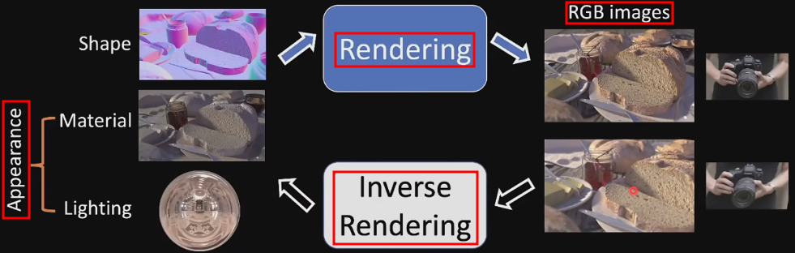

过往的 三维重建 通过图片 重建 网格/点云/体素

NeRF 通过 神经隐式 方法(将 3维 模型信息 隐式 存储神经网络中)

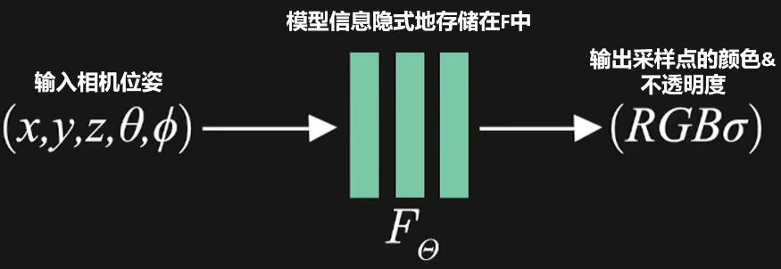

NeRF神经网络 采取 体积雾(≈ 带不透明度的点云)的 渲染方式，通过已知视角的图片进行训练，然后输入其它相机视角的参数，从而预测出未出现视角的图片

此时三维模型的信息就储存在了NeRF神经网络之中，所以这是一种 **隐式** 的表示方法，而不是像点云、体素、网格 **显式** 的表示方式

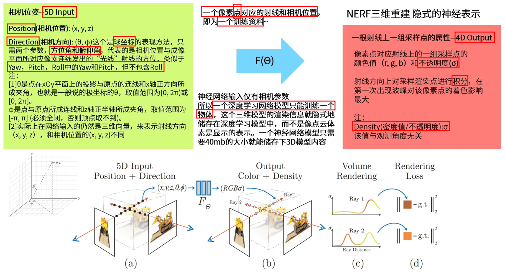

相机位姿可以理解成射线的起点，但实际上训练要用射线上的采样点才能表示出空间中体积雾的点

采样点位置 = 相机原点 + 采样距离 * 相机观测方向(unit vector)

注意
1. 以 像素点 为 训练资料，而非 整张图
2. 一个 batch 包括 多个 像素点 & 多个 相机位姿 的参数
3. 输出
   1. 不是直接得到一个像素点的 RGB-D 值
   2. 而是输出 一段 采样点 上的 RGB-D 值
   3. 通过 在一定范围内的 采样点 RGB-D 值 积分 以得到确切的颜色值 (体积雾渲染)


位置编码 $\gamma(x, y, z)$ 是为了体现 图像中的高频信息，提高图片的细节质量
1. $F_{\Theta} = F_{\Theta}^{\prime} \circ \gamma$
2. $\gamma(p) = (\sin (2^{0} \pi p), \cos (2^{0} \pi p), \cdots, \sin (2^{L-1} \pi p), \cos (2^{L-1} \pi p))$
3. $\sin$ 和 $\cos$ 2个 为 1项
4. 空间坐标用 10 项，即 20 维来分别表示 (x, y, z) 位置编码
5. 相机方向用  4 项，即  8 维来分别表示 (x, y, z) 位置编码

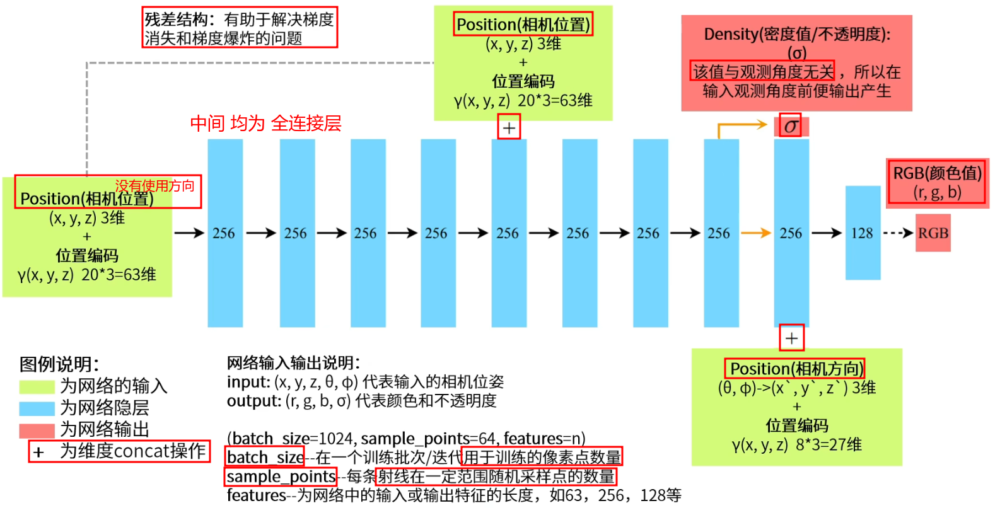

开始时，没有将 相机方向 作为 输入，因为 认为物体不透明度 和 相机朝向 无关

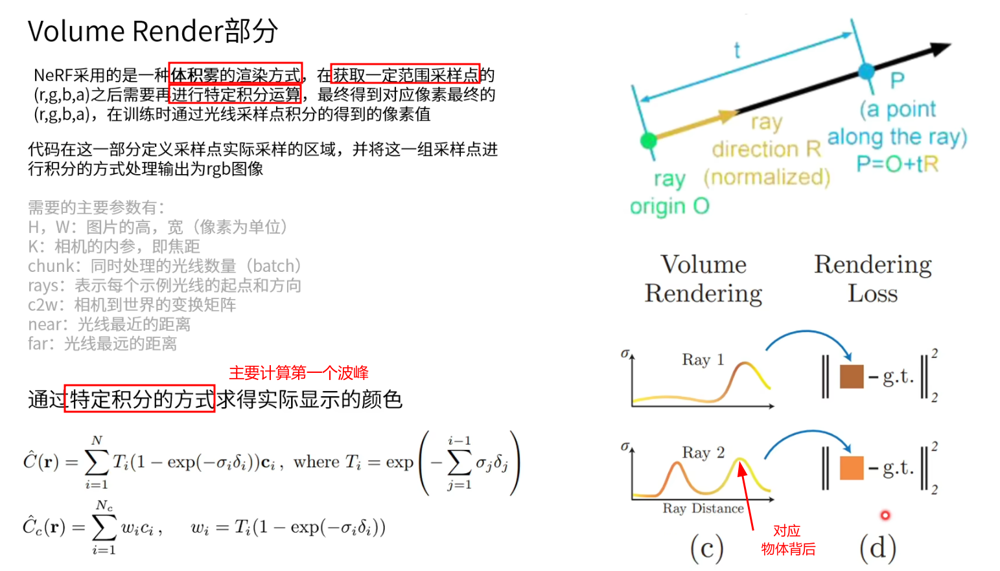

Volume Render

如果已经碰到 不透明度 很高的波峰，说明 已经碰到物体表明，后面的波峰 代表物体的背后(实际上看不见)，不应该成像到图片上

使用 特殊积分(主要 计算第一个波峰)
1. $\hat{C}(\mathbf{r})=\sum_{i=1}^{N} T_{i}(1-\exp (-\sigma_{i} \delta_{i})) \mathbf{c}_{i}$
   1. 其中 $T_{i}=\exp (-\sum_{j=1}^{i-1} \sigma_{j} \delta_{j})$
2. $\hat{C}_{c}(\mathbf{r})=\sum_{i=1}^{N_{c}} w_{i} c_{i}$
   1. $w_{i}=T_{i}(1-\exp (-\sigma_{i} \delta_{i}))$

通过一组图片 & 对应相机位姿 训练网络，用来存储对应模型信息


## 02 五分钟学会渲染自己的 NeRF 模型

[五分钟学会渲染自己的 NeRF 模型 - B站视频](https://www.bilibili.com/video/BV1q84y1U7Qf/)

[Instant Neural Graphics Primitives - Github](https://github.com/NVlabs/instant-ngp)

使用 instant-ngp 来快速生成 NeRF，使用哈希编码的方式极大地提高了训练速度


---


# NeRF 基础 & 常见算法解析 - 鲁鹏(深蓝学院)

[NeRF 基础 - 深蓝学院 鲁鹏](https://www.shenlanxueyuan.com/my/course/664)

[NeRF 基础与常见算法解析 - 鲁鹏](https://www.bilibili.com/video/BV1f94y1V7AC/)

[NeRF 基础与常见算法解析 : 神经辐射场 & 体渲染 - 鲁鹏](https://www.bilibili.com/video/BV1Gg4y1k7jG/)

[NeRF 基础与常见算法解析 : 神经网络 & 位置编码 - 鲁鹏](https://www.bilibili.com/video/BV1wN4y167Bf/)


传统 三维重建
1. input    : 给定一个场景的 多个视角图像
2. output   : 重建出场景的 三维模型
3. 步骤
   1. 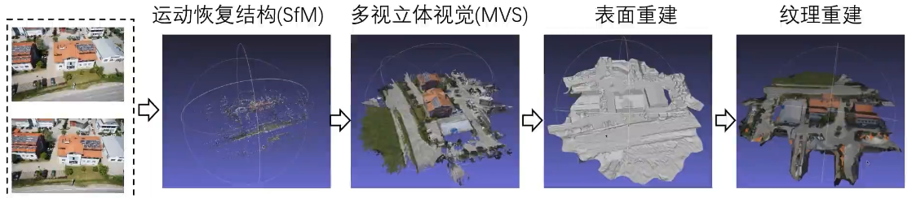
   2. 运动恢复结构(SfM - Structure from Motion)
      1. input    : 多视角图像 + 相机内参(像素坐标系 ↔ 相机坐标系)
      2. output   : **稀疏三维点云** + **相机外参(相机位姿)**(世界坐标系 ↔ 相机坐标系)
   3. 多视立体视觉(MVS - Multi-View Stereo)
      1. input    : 多视角图像 + 相机内参 + 相机外参 + 稀疏三维点云
      2. output   : 稠密三维点云
   4. 表面重建(3D 模型，无颜色)
      1. input    : 稠密三维点云
      2. output   : 场景/模型 三角网格 (方便导入 游戏引擎/建模软件/**物理仿真**)
   5. 纹理重建(为每个点找 RGB 值)
      1. input    : 多视角图像 + 相机内参 + 相机外参
      2. output   : 场景/模型 纹理图像 (实现可视化)
4. 缺点
   1. 重建会有空洞
   2. PipeLine 牵扯过多技术


NeRF 概述
1. input : 多视角图像 + 相机内参 + 相机外参
2. 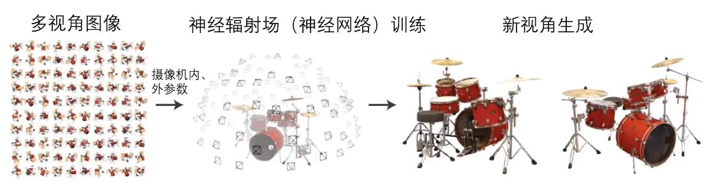
3. 使用 神经辐射场(创新) 表达场景 完成 视角合成(任务)，可以进行端到端学习
4. 三维结构、色彩信息 **隐式** 存储在 神经网络权重中
5. 逼真度高，无空洞
6. 难以 三维可视化 & 物理仿真
7. 衍生
   1. BlockNeRF - 城市级渲染(large scale)
   2. F2NeRF - 自由视点渲染
   3. Mip-NeRF - 视觉质量改进
   4. Instant-NGP - 速度改进(架构重新设计)


NeRF
1. 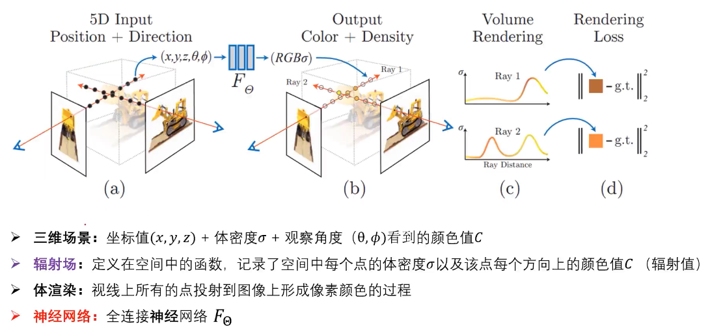
2. 神经辐射场
   1. 辐射场 : 定义在空间中的函数，记录 空间中 各点的 体密度$\sigma$ & 各个方向看去的颜色值C
   2. 理解为学习场景光线
   3. 假设物体包含在三维立方体中，投影到平面上形成图像
   4. 三维表示 : 坐标$(x,y,z)$ + 体密度$\sigma$ + 观察角度(光线、视线)的$\theta (pitch), \phi (yaw)$(没有 $row)$看到的 颜色值 C
      1. 考虑了 镜面反射，一个位置从不同点看去可能的颜色值不同
      2. 相机的姿态 (roll, pitch, yaw) 会影响最终光线方向，但 NeRF 的输入是 **单个光线的方向**(pitch, yaw)，而不是相机整体的姿态
      3. 体密度(Volume Density)，描述了场景中的每个 3D 位置(体素) 在空间中的物质浓度
         1. $\sigma$ 大 : 说明这个点很可能在物体上
         2. $\sigma$ 小 : 意味着这个点在空中或较远的背景区域
3. 体渲染(Volume Rendering)
   1. 考虑光线(视线)上所有的点，通过体渲染技术生成像素值
   2. 视线表达
      1. 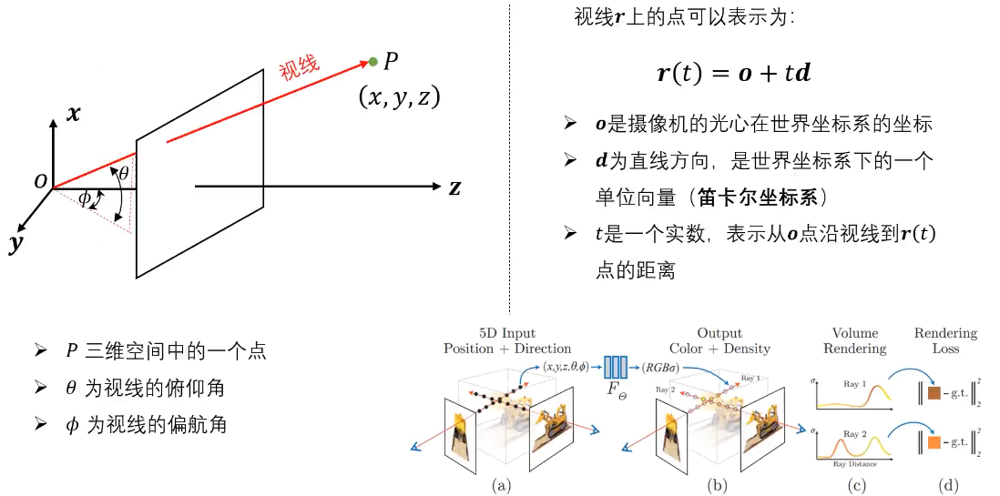
      2. 仅使用 俯仰角(pitch) & 偏航角(yaw)，滚转角(roll) 对于 光线/视线 没有用
      3. 三维坐标 都转换为 世界坐标系
   3. 体渲染解析
      1. 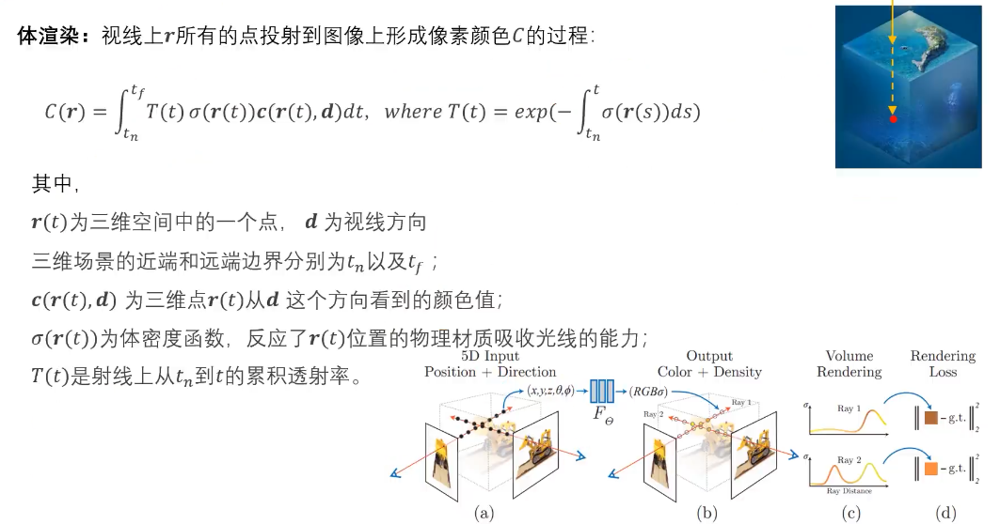
      2. 公式解析
         1. $t$ 控制 光线上 点的位置(远近)，$\bold{d}$ 控制 视线方向
         1. $t_n$, $t_f$ 是三维场景的 近端(near)&远端(far) 边界，降低计算量，需要预先设置
         2. $\bold{r}(t)$ 是三维空间中的点的位置
         3. $\sigma$ 是体密度，$\bold{c}$ 是 从 $\bold{d}$ 视角看去 $\bold{r}(t)$ 的颜色，二者都由 神经网络提供
         4. $T(t)$ 是 从 $t_n$ 到 $t$ 的 累积透射率(光强)，exp(- 体密度积分)
      3. 物理意义
         1. 体密度是当前点，物理属性的表达(空气中，物体表面，物体内部 中的点)，反应该位置物理材质吸收光线的能力，沿着 光线/视线，系数 $T(t)$ 不断衰减
         2. 空气中，$\sigma$ 应该为 0，表示没有吸收光线
         3. 如果某个位置，体密度大，将光线基本全部吸收，则后续点的 系数(重要性) 都会很小，可以从 $T(t)$ 表达式中看出
         4. $T(t)$ & $\sigma$ 可以反应当前点 颜色的重要性
      4. 体渲染 实际情况中需要离散化
         1. 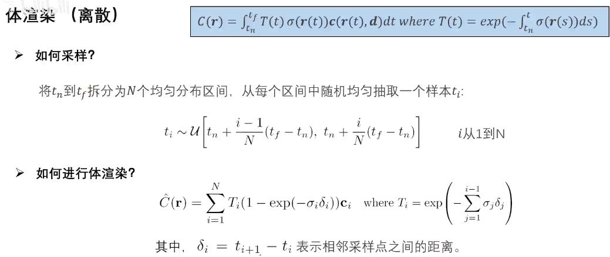
         2. 相邻两个样本点的 最大距离是 2倍 区间长度
         3. 积分转为 N 个点的求和
4. 神经网络 & 位置编码
   1. 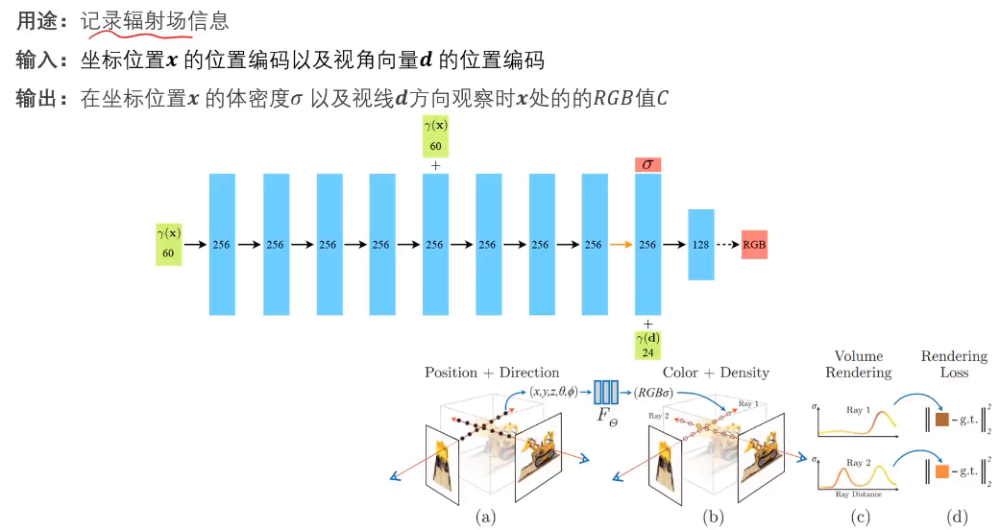
   2. 使用 **全连接神经网络** $F_{\Theta}$ 记录 辐射场信息(用途)
      1. input    : 坐标点x 的 **位置编码** & 视角向量$\bold{d}$(2维)
      2. output   : 坐标点x 的 体密度$\sigma$ & 视线$\bold{d}$方向观察时$\bold{x}$处的 颜色值 C
   3. 位置编码函数$\gamma$ 将坐标映射到高维空间(60维) 作为输入
   4. $\sigma$ 不受 视角影响，因此输出 $\sigma$ 后，才引入 视角方向信息
   5. 最终得到的 RGB 值 都在 [0, 1]之间
   6. 前面部分均使用 ReLU，最后一步使用 Sigmoid
   7. **视角向量** 作用
      1. 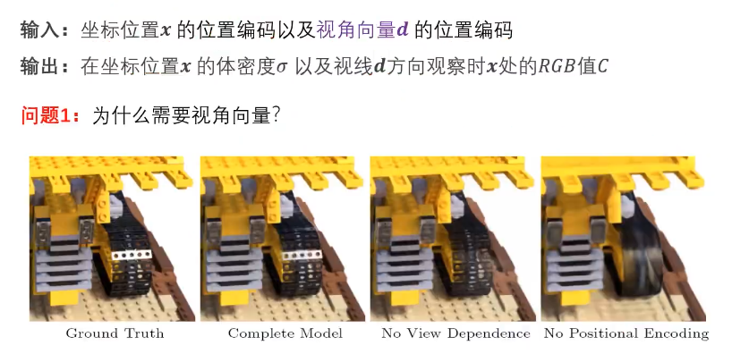
      2. 从 No View 图中可以看出，不使用 视角向量 **会缺少反光特性**
   8. **位置编码** 作用 - TODO
      1. 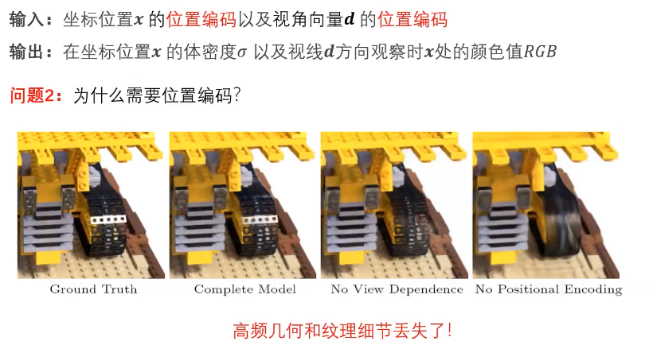
      2. 从 No Positional Encoding 图中可以看出，不使用 位置编码 **会缺少高频几何和纹理细节**
      3. 如果没有 位置编码，神经网络 不能同时兼顾 相邻点 既有差异大，又有差异小 的情况。学差异大还是差异小由训练样本决定，一般情况 平滑的样本较多，学习到的是 差异小，因此导致 **高频信息丢失**
      4. 位置编码原理
         1. 将 $(x_a,y_a,z_a)^T \rightarrow (x_b,y_b,z_b)^T$ 映射为 $(p_{a1},p_{a2},\cdots, p_{an})^T \rightarrow (p_{b1},p_{b1},\cdots, p_{bn})^T$
         2. 其中，映射后的坐标，越前面的维度，差距越小，越后面的维度，差距越大。方便神经网络选择放大倍数
      5. 位置编码方式
         1. 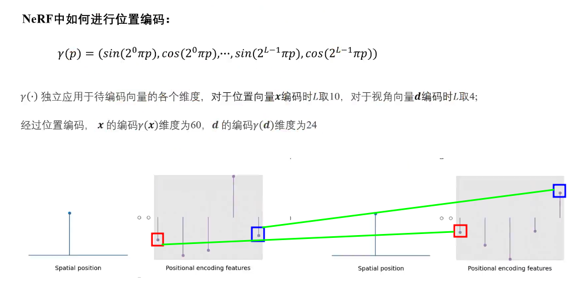
         2. 图中可看出，spatial position 微小变动，低频(红色)变化也微小，高频(蓝色)变化剧烈
         3. 对于位置向量 : L 取 10，由于分 $\sin$ & $\cos$，因此 $x,y,z$ 各有 20 维
         4. 对于视角向量 : L 取 4，因此 $\bold{d}$ 光线方向，共有 24 维
      6. 高频 & 低频 (神经网络 必须能够学到 差异/突变)
         1. 位置编码 :
         2. 图像信号 : 变化剧烈位置为高频，变化平缓位置为低频
         3. 三维场景 : 空气&物体表面接触的位置(体密度变化大)为高频
5. 损失函数 & 训练策略
   1. 损失函数 Rendering Loss
6. 模型推理
   1. 已有训练好的神经网络，包含 体密度$\sigma$ & 不同观察角度(视线方向)$\theta (pitch), \phi (yaw)$(没有 $row)$看到的 颜色值 C
   2. 目标 : 提供 相机 位姿，生成图片
   3. 逐像素点生成图像，沿视线 记录经过的三维点，对每个经过的点，将其 $x, y, z, \theta, \phi$ 组成 5D 输入，传入神经网络，输出，该点的 颜色值C & 体密度$\sigma$
   4. 将全部经过的点的信息，经过体渲染技术，合并信息得到当前图像的像素值


# 其他


[NeRF简介](https://www.bilibili.com/video/BV1Qd4y1r7ZX/)

NeRF
1. 2020年 ECCV best paper 提名
2. 解决新视图合成问题
3. 可微渲染的一种


