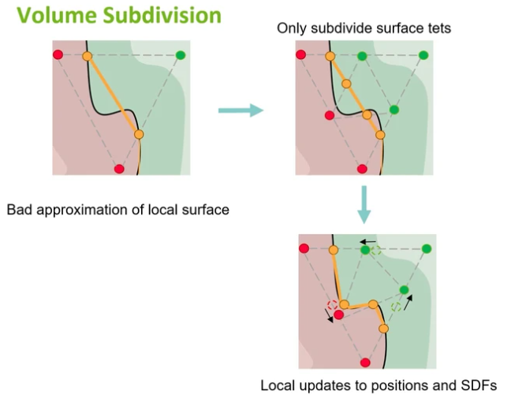

# DMTet : Deep Marching Tetrahedra: a Hybrid Representation for High-Resolution 3D Shape Synthesis - NeurIPS 2021

[Paper Website](https://research.nvidia.com/labs/toronto-ai/DMTet/)

[Tutorial Code - Github](https://github.com/NVIDIAGameWorks/kaolin/blob/master/examples/tutorial/dmtet_tutorial.ipynb)

[Author's Paper Talk](https://papertalk.org/papertalks/35710)

[DMTet论文讲解-能够生成高分辨率的物体表面网格 - B站视频](https://www.bilibili.com/video/BV1Ke4y1q77C/)

初始化 Grid，迭代 逼近 轮廓

只留下与物体有交点的四面体(SDF值二值化，顶点在内标为-1，顶点在外标为+1，求和如果为±4，说明四面体整体在物体 外/内，舍去)，真正有用的只是与物体相交的四面体

deformable 将 四面体 顶点向 物体表面 偏移，不需要生成新的点

能够较为精细的拟合SDF，使用 MT 提取 mesh

# Abstract

DMTet, a **deep 3D conditional generative model**(条件生成模型) that can **synthesize high-resolution 3D shapes using simple user guides** such as coarse voxel(粗糙的体素)，用户提供的初始低分辨率 3D 表示，用作条件约束或引导生成模型
1. 输入是粗糙体素 coarse voxel
2. 输出是高分辨率 3D 形状

marries the merits of **implicit and explicit** 3D representations by leveraging a novel **hybrid** 3D representation
1. Implicit : SDF
2. Explicit : Meshes

current **implicit** approaches(用 SDF 表示形状)，通常训练模型 去拟合每个查询点的 SDF(Signed Distance Value)
1. 难以捕捉细节
2. 可能产生伪影(artifacts)

models that directly generate **explicit** representations such as meshes，无法处理复杂拓扑

DMTet directly optimizes for the reconstructed surface(直接优化重建的表面), model can synthesize shapes with arbitrary topology

core of DMTet
1. a deformable tetrahedral grid(可变形四面体网格) that **encodes a discretized signed distance function** 编码SDF
   1. 只是用来离散化隐式函数 SDF 的空间，并不是最终的显式表面
   2. 四面体网格中的每个顶点存储的是 SDF 的离散值
2. a **differentiable** marching tetrahedra layer
   1. converts the **implicit** SDF representation to the **explicit** surface mesh representation
   2. differentiable → end-to-end trainable
   3. 四面体网格中的每个顶点只表示离散的 SDF 值，并不直接提供显式表面的拓扑或几何信息
   4. 算法通过插值计算 $SDF = 0$ 的交点位置，在四面体中构建显式的三角形网格
1. joint optimization 联合优化 using **reconstruction and adversarial losses**
   1. surface geometry
   2. topology
   3. hierarchy of subdivisions

| **属性**       | **Topology(拓扑)**            | **Geometry(几何)**              |
|---------------|------------------------------|---------------------------------|
| 定义           | 描述形状的连接关系和结构         | 描述形状的具体外观、大小和比例       |
| 是否与坐标相关   | 无关:只关心点和面的连接性        | 有关:依赖于点的精确坐标和几何特性    |
| 是否可变形      | 允许:只要保持连通性和孔洞结构不变 | 不允许:改变几何会改变物体的外观      |
| 典型描述信息    | 顶点、边、面的连接性，孔洞数量    | 点的坐标、曲率、表面法线，边的长度等  |
| 是否影响表面细节 | 不影响:拓扑仅描述结构           | 影响:几何直接决定表面的光滑度和细节   |

Topology(拓扑) : 描述物体的大体结构和形状的连通性，不涉及具体的细节

Geometry(几何) : 描述物体表面的具体细节，例如曲面光滑度、凹凸、法线方向等

# Introduction

need 3D content with rich geometric details & complex topology

create rough 3D shapes(Minecraft)

需要 具有 `rough 3D shapes` -> `detailed 3D shapes` 的能力

选择 3D representation
1. 要求
   1. capture local geometric details
   2. represent objects with arbitrary topology
   3. being memory and computationally efficient for fast inference
2. Discrete Representations(Voxel, Point Cloud, Mesh)
   1. are limited to **predefined resolution or topology**
   2. not suitable for diverse & complex surfaces
3. Deep Implicit Fields (SDF(signed distant field)/OF(occupancy field))
   1. use neural network to approximate signed distance function
      1. $f_\theta(x,y,z) ≈ s(x,y,z)$
      2. signed distance from $(x,y,z)$ to the closest surface
      3. $f_\theta(x,y,z)$ defines the implicit surface
   2. Pros:
      1. continuous
      2. represent arbitrary/complex topology
   3. Cons:
      1. fail to capture geometric details
      2. cannot utilize an explicit supervision on the target surface(which imposes useful constraints for training)

DMTet
1. predicts the underlying surface parameterized by an implicit function **encoded via a deformable tetrahedral grid**
   1. DMTet 预测一个表面，这个表面通过隐式函数参数化，而隐式函数则通过一个可变形的四面体网格进行编码
2. underlying surface is converted into an explicit mesh with a **Marching Tetrahedra (MT) algorithm** (differentiable and more performant than the Marching Cubes)
   1. MT 本身不是 DMTet 的原创算法
   2. 创新 : 将 MT 改造为 可微分版本，并集成到深度学习框架中，用于端到端的训练和优化
3. maintains efficiency by learning to **adapt the grid resolution** by deforming(变形) and selectively subdividing tetrahedra(选择性细分)
4. end-to-end differentiable, allowing the network to jointly optimize

demonstrate our DMTet on two challenging tasks
1. 3D shape synthesis from coarse voxel inputs
2. point cloud 3D reconstruction

contributions
1. using **Marching Tetrahedra(MT)** as a **differentiable iso-surfacing layer** allows topological change for the underlying shape represented by a implicit field
2. **incorporate MT in a DL framework** and introduce DMTet, a hybrid representation that combines implicit and explicit surface representations
3. introduce **a coarse-to-fine optimization strategy** that scales DMTet to high resolution during training

# Deep Marching Tetrahedra

四面体细分 subdivision，1分8，新顶点的 SDF值 是 线性插值 得到

MT 从 隐式SDF四面体 提取 表面mesh

四面体 & 物体表面 相交情况
1. 顶点全在内/外，不考虑
2. 1内3外、3内1外 : 3个交点，使用 1个 tri-mesh 表示
3. 2内2外 : 4个交点，使用 2个 tri-mesh 表示

线性插值计算交点
1. $[s(v_a) - s(v^\prime_{ab})](v_b-v^\prime_{ab}) = [s(v_b) - s(v^\prime_{ab})](v_a-v^\prime_{ab})$
   1. $s(v^\prime_{ab}) = 0$
2. 值差距大，距离交点远，因此是交叉相乘

