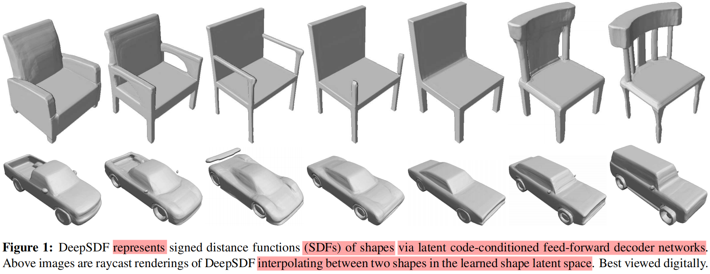
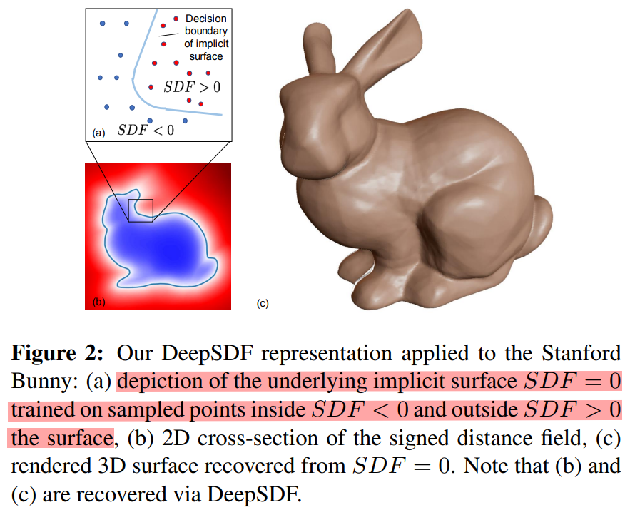
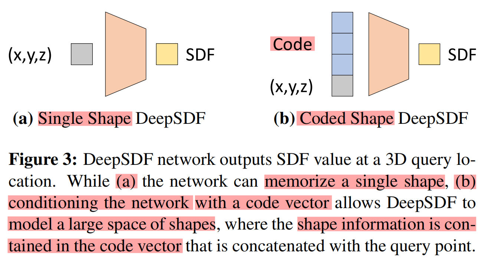
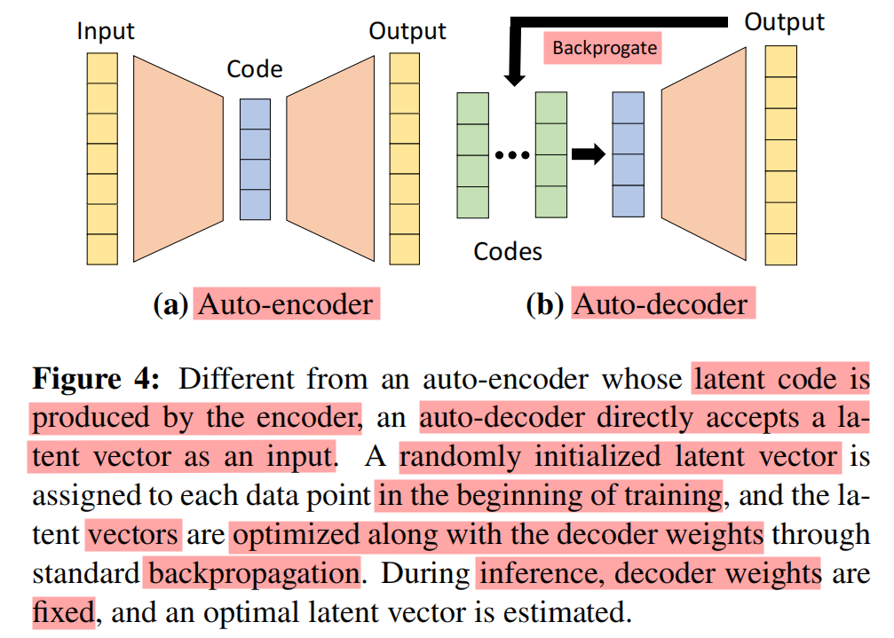

# DeepSDF : Learning Continuous Signed Distance Functions for Shape Representation - CVPR 2019







[DeepSDF笔记 - 知乎](https://zhuanlan.zhihu.com/p/185001163)

# Abstract & Introduction

用于高质量的 3D 形状表示、插值和补全任务，**专注点在于高质量几何生成，不包含颜色或纹理信息**

强项是生成光滑、细致的几何形状，而不是外观或视觉效果

DeepSDF
1. a learned **continuous** Signed Distance Function (SDF) representation of **a class of shapes**(shape-conditioned 3D modeling)
2. enables high quality shape **representation, interpolation and completion** from partial and noisy 3D input data.

like its classical counterpart, represents a shape’s surface by a continuous volumetric field
1. magnitude of a point represents the distance to the surface boundary
2. sign
   1. inside (-)
   2. outside (+)
   3. decision boundary is the surface of the shape(零水平集 $SDF(x,y,z)=0$ 定义形状表面)

our representation
1. **implicitly encodes a shape’s boundary** as the zero-level-set of the learned function(不需要显式存储顶点或面片)
2. **explicitly representing the classification of space as being part of the shape’s interior or not**(明确地对空间进行分类，判断某个点是否属于形状内部)

**classical SDF’s both in analytical or discretized voxel** form typically represent the surface of a **single shape**(通常只能表示单一的形状)
1. analytical(解析式)
   1. eg : $SDF_{sphere}(x,y,z) = \sqrt{x^2 + y^2 + z^2} - r$
   2. 要描述其他形状，就必须重新定义新的公式
2. discretized voxel
   1. 离散 SDF 存储的数据与形状一一对应，无法在同一网格中存储多个形状的几何信息
3. 都是静态的，只能表达特定形状，需要为每个形状生成一套新的 SDF

use the concept of a SDF, DeepSDF can represent an entire class of shapes(表示一类物体，有一定泛化能力，可以 completion)
1. $SDF(x,y,z; z_{shape}) = f_{\theta}(x,y,z; z_{shape})$
2. $z_{shape}$ 是形状的潜在表示 (latent code)
3. DeepSDF 不直接存储每个形状的 SDF 数据，而是通过 神经网络参数 和 潜在变量$z_{shape}$ 表示整个形状类别

reducing the model size by an order of magnitude compared with previous work(模型大小减少了一个数量级)


learn a generative model to produce **a continuous field**(efficient, expressive, fully continuous)


contributions include
1. the formulation of generative **shape-conditioned 3D modeling** with a **continuous implicit surface**
2. a learning method for 3D shapes based on a **probabilistic auto-decoder**
3. the demonstration and application of this formulation to shape **modeling and completion**

models produce high quality continuous surfaces with complex topologies
1. obtain state-of-the art results in quantitative comparisons for **shape reconstruction and completion**
2. effectiveness, our models use only 7.4 MB (megabytes) of memory to represent entire classes of shapes (for example, thousands of 3D chair models)
   1. less than half the memory footprint (16.8 MB) of a single uncompressed 5123 3D bitmap

latent code 和 神经网络 同时学习，每个物体对应 独立的潜变量，编码了物体的形状特征

对于 同一 形状类别的 物体，使用 不同潜变量 & 相同神经网络

对于 不同 形状类别的 物体，使用 不同潜变量 & 不同神经网络

# Related Work

Representations for 3D Shape Learning
1. Point-Based
2. Mesh-Based
3. Voxel-Based

Representation Learning Techniques
1. GAN
2. Auto-Encoder
   1. Variational Auto-Encoder - 变分自动编码器
3. Optimizing Latent Vectors

Shape Completion


将数据先经过编码器编码成latent code，然后将其解码得到对应的原始数据，一旦这个编码器和解码器训练好之后，就可以抛掉编码器，随便去找一个满足latent code的分布的数据，经过解码器后，也能实现生成一个新的、数据集中不存在的数据的功能

# Modeling SDFs with Neural Networks

view of this **implicit surface** can be **rendered** through
1. RayCasting 光线投射 - 通过沿光线查询 SDF 值定位表面
1. rasterization of a mesh obtained with Marching Cubes - 提取显式三角网格，用于表面可视化

**==Key Idea==** : directly regress the continuous SDF from point samples using deep neural networks

As a universal function approximator, **deep feed-forward networks** in theory can learn continuous SDFs with arbitrary precision


train a single deep network(下图(a)) given a target shape
1. prepare $X:={(x, s) : SDF(x) = s}$ (3D point samples & SDF values)
2. train the parameters $θ$ of a **multi-layer fully-connected neural network** $f_θ(x) ≈ SDF(x), \forall x \in \Omega$ to make it a good approximator of the given SDF in the target domain $\Omega$
3. minimizing the sum over losses between the predicted and real SDF values $L(f_{\theta}(x), s)=|\operatorname{clamp}(f_{\theta}(x), \delta)-\operatorname{clamp}(s, \delta)|$
   1. 定义(:=) $\operatorname{clamp}(x, \delta)$ 限制 $x$ 在 $[-\delta, \delta]$
4. accurate **normals**法向量 can be analytically computed by calculating the spatial derivative $\partial f_{\theta}(x)/\partial x$ via back-propagation through the network
   1. 无需使用定义的小扰动近似，得到的不是解析形式而是值
   2. 代码示例
      ```python
      x = torch.tensor([[1.0, 2.0, 3.0]], requires_grad=True)
      sdf_value = sdf_net(x)
      sdf_value.backward(torch.ones_like(sdf_value))
      gradient = x.grad
      ```



# Learning the Latent Space of Shapes

Training a specific neural network for each shape is neither feasible nor very useful

want a model that can
1. represent a wide variety of shapes
2. discover their common properties
3. embed them in a low dimensional latent space

introduce a **latent vector z**(be thought of as encoding the desired shape)  as a second input to the neural network(上图(b))

Conceptually, we map this latent vector$z_i$ to a 3D shape represented by a continuous SDF
$f_θ(z_i, x) ≈ SDF^i(x)$

相同形状类别，一个形状对应一个潜变量，神经网络权重共享，潜变量 $z$ 是每个形状的特定表示，而神经网络的作用是 将潜变量 和 查询点 x 结合起来，生成特定形状的 SDF 值

By conditioning the network output on a latent vector, allows modeling multiple SDFs with a single
neural network

Given the decoding model fθ, the continuous surface associated with a latent vector z is similarly
represented with the zero iso-surface


## Motivating Encoder-Less Learning





Auto-Encoder
1. 使用编码器将输入形状嵌入到潜变量空间
2. 编码器生成潜变量 $z$，然后通过解码器重建形状

Auto-Decoder
1. 没有编码器，直接 给每个形状 **初始化一个随机潜变量** $z$
2. 输入是 查询点 & 潜变量，输出是 点的 SDF 值
3. 训练
   1. 训练数据 固定，每个形状 都有一个特定的 潜变量
   2. 潜变量 和 解码器 权重 一起通过反向传播优化
4. 推理
   1. 推理阶段，潜变量 需要重新估计(优化)，以适应新的输入数据
   2. 固定网络权重，优化潜变量(通过 Maximum-a-Posterior (MAP) estimation来得到)
5. 不需要单独设计编码器，简化了网络结构
6. 潜变量在训练过程中被自动学习
7. "auto" 特性 主要体现在 自动优化潜变量(latent code)的方式，而不依赖显式编码器(encoder)，这种架构被称为 Auto-Decoder

[DeepSDF - CSDN](https://blog.csdn.net/qq_40520596/article/details/110275311)

前馈(Feedforward)神经网络，信息从输入层开始，依次经过隐藏层，最终到达输出层，而在网络中 **没有 循环 或 反馈 连接**


