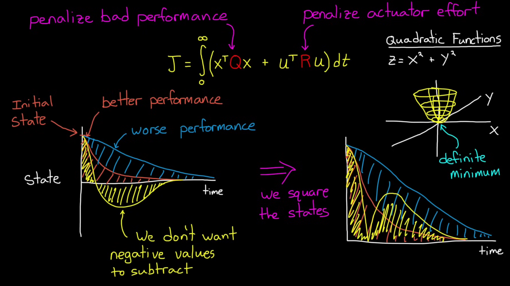
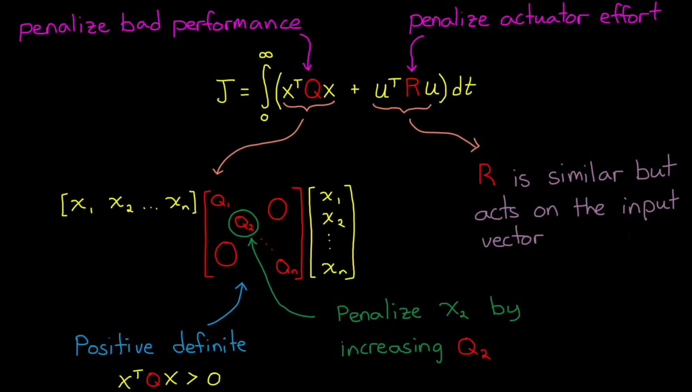

# LQR(Linear Quadratic Regulator) - 线性二次型调节器

[What Is Linear Quadratic Regulator (LQR) Optimal Control? - YouTube](https://www.youtube.com/watch?v=E_RDCFOlJx4)

给定一个线性系统，找一个**最优**反馈律，使系统稳定，同时代价(成本)最小

和 pole placement 相似，都是 full state feedback，但不需要手动确定极点位置

假设你的系统是个 **线性动态系统**

**$$\dot{x}(t) = A x(t) + B u(t)$$**
1. **$x(t)$** : 系统状态
2. **$u(t)$** : 控制输入
3. **$A, B$** : 系统矩阵(线性)
4. 标准LQR 本身不涉及 观测矩阵 (C, D)

那么LQR就是求一个**反馈控制律** : **$u(t) = -Kx(t)$**

让系统稳定，且使**代价(Cost)函数 最小**

**$$J = \int_0^∞  x(t)^T Q x(t) + u(t)^T R u(t) dt$$**
1. **$Q$**(Performance) : 惩罚 **状态** 偏离的代价矩阵(比如偏离原点就扣分)
2. **$R$**(Energy/Cost) : 惩罚 **控制输入** 的代价矩阵(比如太大的力矩就扣分)

平方 为了 防止 负值 并且 保证 Convex (有最小值)

LQR 本身更适合做 稳定平衡点控制(如倒立摆直立、飞行器悬停)，point stabilization 而非 path stabilization，想要轨迹跟踪需要扩展

