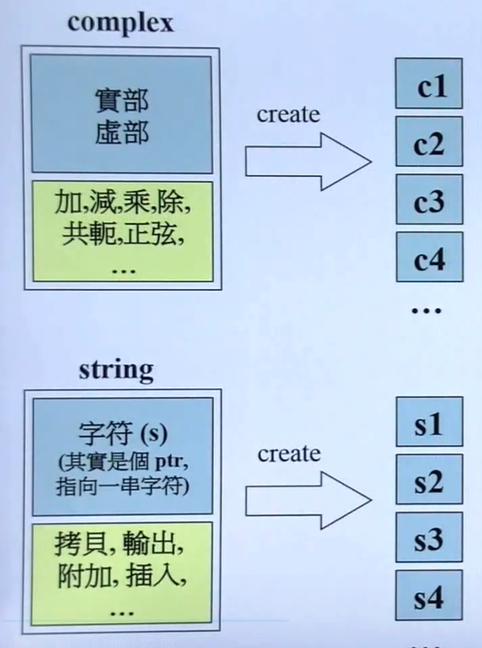
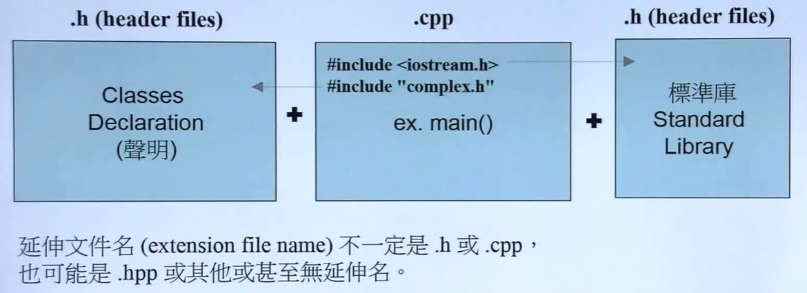

# 面向对象程序设计
# (Object Oriented Programming , OOP)

# C++

## 侯捷 C++面向对象编程

### 1.编程简介

培养正规大气的编程习惯

以良好的方式编写C++ Class

1. Object Based（基于对象）
   1. class without pointer members(Complex)
   2. class with pointer members(String)
2. Object Oriented（面向对象）
   1. 继承(inheritance)
   2. 复合(composition)
   3. 委托(delegation)

### 2.头文件与类的声明

将数据和处理数据的函数包在一起。

 

数据有很多份，函数只有一份。

 

1. Object Based 面对的是单一class的设计
2. Object Oriented 面对的是多重classes的设计，classes之间的关系

 

C++代码的基本形式

 
 

# Python

