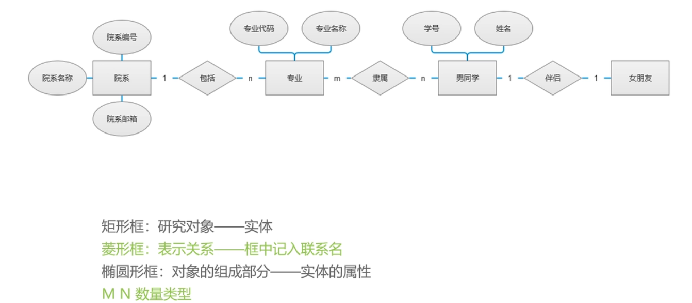
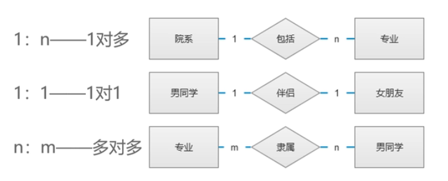
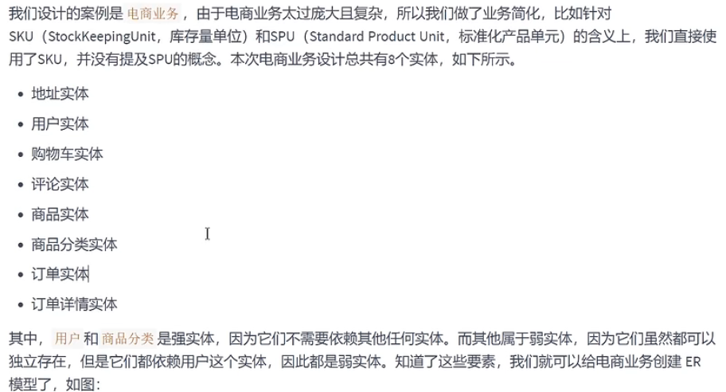
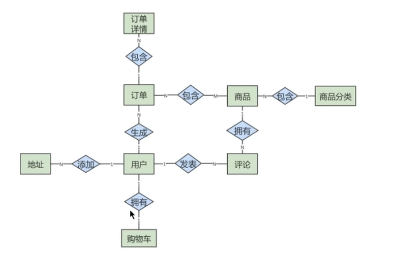
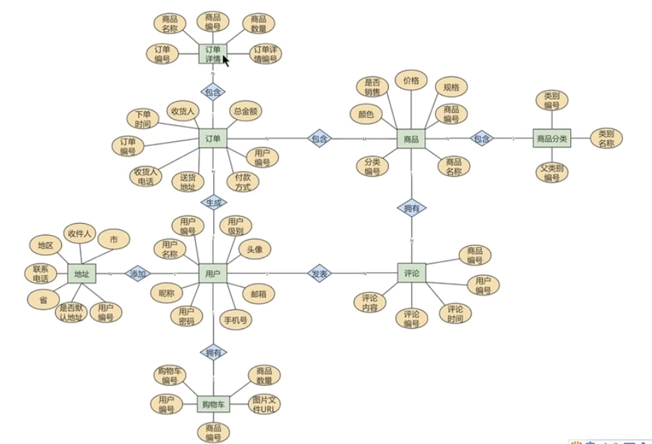
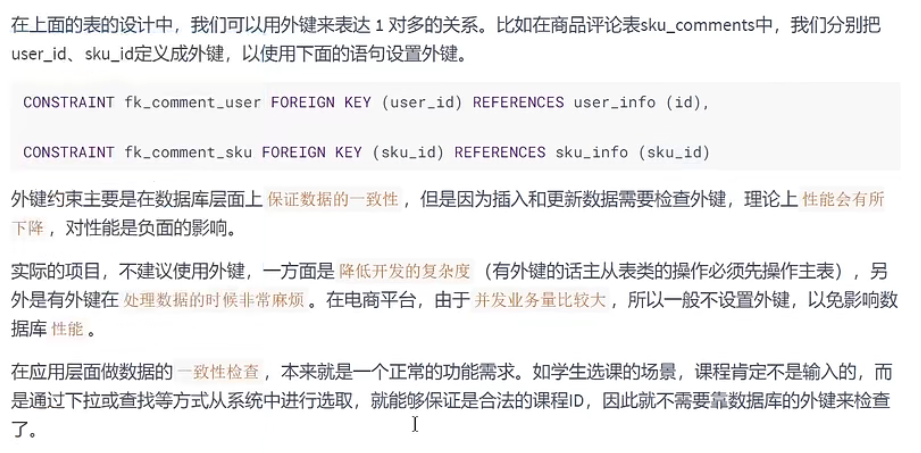

# 数据库

[toc]

## Portals

# 数据库系统概论 王珊

## 一、绪论

### 1.1 数据库系统概述

### 1.2 数据模型

数据库系统的**核心和基础**

对显示世界的抽象，用于描述数据、组织数据、操作数据。

**1.2.1 两类数据模型**

要求
1. 真实模拟现实世界
2. 容易理解
3. 便于使用计算机实现

现实世界抽象为信息世界（概念模型），再将信息时间转化为机器世界（逻辑、物理模型）。

两大类：
1. 概念模型(conceptual model)
2. 逻辑模型&物理模型
   1. 逻辑模型(**计算机系统的观点对数据进行建模，用于数据库管理系统的实现**)
      1. 层次模型(hierarchical model)
      2. 网状模型(network model)
      3. 关系模型(relational model)
      4. 面向对象数据模型(object oriented data model)
      5. 对象关系数据模型(object relational data model)
      6. 半结构化数据模型(semi-structured data model)
   2. 物理模型(**对数据最底层的抽样**)
      1. 描述数据在系统内部的表示方式和存取方法
      2. 或者在磁盘上的存储方式和存取方法
      3. 面向计算机系统
      4. **最终用户不必考虑物理级的细节**

**1.2.2 概念模型**

基本概念：
1. 实体 entity
2. 属性 attribute
3. 码 key ： 唯一标识实体的**属性集**
4. 实体型 entity type ： 具有相同属性的实体必然具有共同的特征和性质。用**实体名及其属性名**集合来抽象和刻画同类实体。
5. 实体集 entity set ： 同一类型实体的**集合**
6. 联系 relationship

实体之间的联系：1对1、1对多、多对多

**独立存在的是实体、不可再分的是属性**

## 七、数据库设计(p205)

### 7.1 数据库设计概述

目的：
1. 有效存储和管理数据
   1. 存取效率
   2. 存储空间利用率
   3. 系统运行管理的效率
2. 满足应用需求
   1. 信息管理（数据对象）
   2. 数据操作（**增、删、改、查、统计**）

**7.1.2 数据库设计方法**

数据库设计方法：
1. 新奥尔良方法
2. 基于E-R模型的设计方法
3. 3NF（第三范式）的设计方法
4. 面向对象的数据库设计方法
5. 统一建模语言（UML）

**7.1.2 数据库设计基本步骤**

基本步骤
1. 需求分析：**数据字典**（数据的描述，而非数据本身）
2. 概念结构设计：**E-R图**
3. 逻辑结构设计：E-R图转换为数据库产品支持的数据模型
4. 物理结构设计：
5. 数据库实施：
6. 数据库运行和维护：

### 7.2 需求分析

### 7.3 概念结构设计

E-R模型表示概念模型

**7.3.1 概念模型**

抽象为信息世界

特点
1. 充分反映现实世界、联系
2. 满足用户需求
3. 易于理解
4. 易于更改
5. 易于转化为关系、网状、层次等各种数据模型（比数据模型更抽象、更独立于机器）

**7.3.2 E-R模型**

实体-联系方法：Entity-Relationship Approach

E-R diagram

主要概念
1. 实体
2. 属性
3. 联系（实体间）
   1. 1对1：班级班长
   2. 1对n：班级学生
   3. m对n：学生选课

**联系的度**：参与联系的实体型的数目。（二元、三元、N元联系）

实体型：矩形
属性：椭圆形
联系：菱形（**联系也可以有属性**）

**ER模型转换成数据表**

转换原则：
1. 一个实体通常转换为一个**数据表**
2. 一个多对多的关系，通常也转换成一个数据表
3. 1对1和1对多的关系往往通过**表的外键**来表达
4. 数据转换为表的**字段**
5. **先考虑强实体**，不依赖于别人

**强实体**

**弱实体**

订单详情表用于体现多对多联系

