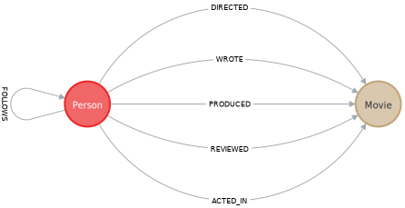

# Cypher


Graph Query Language  - Cypher®

Cypher is the primary interface for Neo4j

---

## Table of Contents

- [Cypher](#cypher)
  - [Table of Contents](#table-of-contents)
- [Cypher Manual](#cypher-manual)
  - [Query a Neo4j database using Cypher](#query-a-neo4j-database-using-cypher)
- [Cypher Fundamentals(Learn Cypher in 1 hour) - GraphAcademy](#cypher-fundamentalslearn-cypher-in-1-hour---graphacademy)
  - [01 Reading Data from Neo4j](#01-reading-data-from-neo4j)
    - [a. Introduction to Cypher](#a-introduction-to-cypher)
    - [b. Finding Relationships](#b-finding-relationships)
    - [c. Filtering Queries](#c-filtering-queries)
  - [02 Writing Data to Neo4j](#02-writing-data-to-neo4j)
    - [a. Creating Nodes - MERGE](#a-creating-nodes---merge)
    - [b. Creating Relationships](#b-creating-relationships)
    - [c. Updating Properties](#c-updating-properties)
    - [d. Merge Processing](#d-merge-processing)
    - [e. Deleting Data](#e-deleting-data)


---

# Cypher Manual

[Neo4j Cypher® Manual 5 - Neo4j](https://neo4j.com/docs/cypher-manual/current/introduction/)


## Query a Neo4j database using Cypher

[Query a Neo4j database using Cypher](https://neo4j.com/docs/getting-started/cypher-intro/)


```cypher
(nodes)-[:ARE_CONNECTED_TO]->(otherNodes)
```


---

# Cypher Fundamentals(Learn Cypher in 1 hour) - GraphAcademy

[Cypher Fundamentals(Learn Cypher in 1 hour) - GraphAcademy](https://graphacademy.neo4j.com/courses/cypher-fundamentals/)

`Shift` + `Enter` : 换行

`Ctrl` + `Enter` : 运行(如果单行就直接 `Enter`)

## 01 Reading Data from Neo4j

大小写敏感 Case-Sensitive
1. **labels, property keys, variables** - 敏感
2. **Cypher keywords** - 不敏感

Best Practice
1. **labels** using **CamelCase**
2. **property keys and variables** using **camelCase**
3. **Cypher keywords** using **UPPERCASE**


### a. Introduction to Cypher

Node
1. (alias:Label {keyOne:valueOne, keyTwo:valueTwo})
2. used to group nodes that have the same general set of properties

Relationship
1. -[:R]-
2. -[:R]->
3. <-[:R]-

Both nodes and relationships can contain properties

**MATCH**
```cypher
// 01
MATCH (p:Person)
RETURN p

// 02
MATCH (p:Person {name:"Tom Hanks", born:1956})
RETURN p.born, p.name

// 03
MATCH (p:Person {name:"Tom Hanks"})-[:ACTED_IN]->(m:Movie {title:"Cloud Atlas"})
RETURN p,m
```

**Where Filter**
```cypher
// 01
MATCH (p:Person)
WHERE p.name = "Tom Hanks" AND p.born = 1956
RETURN p.born, p.name

// 02
MATCH (p:Person)
WHERE p.name = "Tom Hanks" OR p.name = "Rita Wilson"
RETURN p.born, p.name
```

### b. Finding Relationships


```cypher
MATCH (p:Person)-[]->(m:Movie)
RETURN p,m
```


```cypher
match (p:Person)-[r]->(m)
where p.name = "Tom Hanks"
return m.title
```


如果 p 通过 不同 r 指向 同一个 m 则会多次返回 m.title

```cypher
MATCH (p:Person)-[r]->(m:Movie)
WHERE p.name = "Tom Hanks" AND m.title = "That Thing You Do"
RETURN p,m,r

MATCH (m:Movie)<-[r]-(p:Person)
WHERE p.name = "Tom Hanks" AND m.title = "That Thing You Do"
RETURN p,m,r
```


### c. Filtering Queries

```cypher
MATCH (p:Person)-[:ACTED_IN]->(m:Movie)
WHERE m.released = 2008 OR m.released = 2009
RETURN p, m
```


```cypher
MATCH (p:Person)-[:ACTED_IN]->(m:Movie)
WHERE m.title='The Matrix'
RETURN p.name
// same result
MATCH (p)-[:ACTED_IN]->(m)
WHERE p:Person AND m:Movie AND m.title='The Matrix'
RETURN p.name
// label filter was done in where clause
```


**Filtering using ranges**
```cypher
WHERE 2000 <= m.released <= 2003
```

**Filtering by existence of a property**
```cypher
WHERE p.name='Jack Nicholson' AND m.tagline IS NOT NULL


MATCH (p:Person)
WHERE p.stars is not NULL
RETURN p
```

**Filtering by partial strings**(case-sensitive)

**`STARTS WITH`**, **`ENDS WITH`**, **`CONTAINS`**, **`=正则表达式`**

**`toLower()`** or **`toUpper()`** if not sure

```cypher
WHERE p.name STARTS WITH 'Michael'

WHERE toLower(p.name) STARTS WITH 'michael'

WHERE p.name =~ 'Michael.*'
```


**Filtering by patterns in the graph**
```cypher
// find all people who wrote a movie but did not direct that same movie
MATCH (p:Person)-[:WROTE]->(m:Movie)
WHERE NOT exists( (p)-[:DIRECTED]->(m) )
RETURN p.name, m.title
```

**Filtering using lists**
```cypher
WHERE p.born IN [1965, 1970, 1975]

MATCH (p:Person)-[r:ACTED_IN]->(m:Movie)
WHERE  'Neo' IN r.roles AND m.title='The Matrix'
RETURN p.name, r.roles
```

**properties does a node or relationship have**
```cypher
// 查看一个标签下所有节点的不同属性键，并且只返回不同的键
// 使用 UNWIND 展开每个节点的属性键列表，并且使用 DISTINCT 去重
MATCH (p:Person) // 匹配所有具有 Person 标签的节点
UNWIND keys(p) AS key // 将每个节点的属性键列表展开为单个属性键
RETURN DISTINCT key // 返回所有不同的属性键
```

**What properties exist in the graph?**
```cypher
CALL db.propertyKeys()
CALL db.labels()
// 调用存储过程，列出数据库中的所有属性键
```

**Count**
```cypher
MATCH (p:Person)
RETURN count(p);

MATCH (m:Movie)
RETURN count(m);

MATCH ()-[r]->()
RETURN count(r);
```

## 02 Writing Data to Neo4j



### a. Creating Nodes - MERGE

```cypher
MERGE (p:Person {name: 'Michael Caine'})
RETURN p  // Verify that the node was created
```

**`MERGE`**
1. if not exists, create
2. eliminates duplication of nodes
3. if executed multiple times, not create additional node
4. Best Practice

**`CREATE`**
1. does not look up the primary key before adding the node
2. faster
3. if you are sure your data is clean


### b. Creating Relationships

**`MERGE`** to create relationships between two nodes

must have references to the two existing nodes

```cypher
MATCH (p:Person {name: 'Michael Caine'})
MATCH (m:Movie {title: 'The Dark Knight'})
MERGE (p)-[r:ACTED_IN]->(m)
RETURN p,r,m
```

边创建 & 边链接

**creates two nodes and a relationship between them**

```cypher
MERGE (p:Person {name: 'Chadwick Boseman'})
MERGE (m:Movie {title: 'Black Panther'})
MERGE (p)-[:ACTED_IN]-(m)
```

**create the node or relationship if it does not exist in the graph**

```cypher
MERGE (p:Person {name: 'Emily Blunt'})-[:ACTED_IN]->(m:Movie {title: 'A Quiet Place'})
RETURN p, m
```

不推荐

```cypher
MERGE (p:Person{name:"llll"})-[r:WROTE]->(m:Movie{title:"thu"})
RETURN p,r,m;

MERGE (p:Person{name:"llll"})-[r:DIRECTED]->(m:Movie{title:"thu"})
RETURN p,r,m;

MATCH (p:Person{name:"llll"})-[]->(m:Movie{title:"thu"})
RETURN p,m
```


**每次执行 MERGE 时，如果没有唯一约束，Neo4j 会将其视为创建新的节点，即使属性值相同**

需要 如下才行

```cypher
MERGE (p:Person {name:"z"})
MERGE (m:Movie {title:"zju"})
MERGE (p)-[r1:DIRECTED]->(m)
MERGE (p)-[r2:ACTED_IN]->(m)
RETURN p,r1,r2,m;
```


**Best Practice - separate the creation of nodes and relationships**

### c. Updating Properties

**`MERGE`** 、 **`WHERE`** 不能一块使用

**Adding properties for a node or relationship**
1. Inline as part of the MERGE clause
    ```cypher
    MERGE (p:Person {name: 'Michael Caine'})
    MERGE (m:Movie {title: 'Batman Begins'})
    MERGE (p)-[:ACTED_IN {roles: ['Alfred Penny']}]->(m)
    RETURN p,m
    ```
2. Using the **`SET`** keyword for a reference to a node or relationship
    ```cypher
    MERGE (p:Person{name:"lzy"})
    SET p.born = 2001, p.school = "tju" // set multiple properties
    RETURN p

    MERGE (p:Person{name:"lll"})-[r:ACTED_IN]->(m:Movie{title:"tju"})
    SET r.role = "joker"
    RETURN p,r,m

    MERGE (p:Person{name:"lll"})-[r:ACTED_IN]->(m:Movie{title:"tju"})
    SET r.role = "king"
    RETURN p,r,m
    ```
    1. Setting multiple properties

**Updating** use **`SET`**

**Removing** use **`SET x.y = null`** or **`REMOVE`**

```cypher
MATCH (p:Person)
WHERE p.name = "lzy" and id(p)=179
REMOVE p.name
SET p.name = null
RETURN p
```


### d. Merge Processing

Customizing **`MERGE`** behavior

specify behavior at **runtime**

**`ON CREATE SET`**、**`ON MATCH SET`**、**`SET`**

```cypher
// 运行两遍查看结果(第二遍 可以看到 updatedAt，重复运行则重复变化)

MERGE (p:Person {name: 'McKenna Grace'})
// Only set the `createdAt` property if the node is created during this query
ON CREATE SET p.createdAt = datetime()
// Only set the `updatedAt` property if the node was created previously
ON MATCH SET p.updatedAt = datetime()
// Set the `born` property regardless
SET p.born = 2006
RETURN p
```

**Best Practice - separate the creation of nodes and relationships**


### e. Deleting Data

In a Neo4j database you can delete:
1. nodes
2. relationships
3. properties
4. labels


**Deleting a node**

```cypher
MATCH (p:Person)
WHERE p.name = 'Jane Doe'
DELETE p
```

Neo4j prevents orphaned relationships in the graph

不能只删除 node 而留下 relationship


**Deleting a relationship**


```cypher
MATCH (p1)-[r]->(p2)
WHERE p1.name="lzy" AND p2.name="yzl"
DELETE r
RETURN p1,p2
```


**Deleting a node and its relationships** - **`DETACH DELETE`**

Neo4j provides a feature where you **cannot delete a node if it has incoming or outgoing relationships**

```cypher
MATCH (p:Person {name: 'Jane Doe'})
DETACH DELETE p
```

delete all
```cypher
MATCH (n)
DETACH DELETE n
```


**Deleting labels**

在Cypher中，关系不能拥有多个类型或标签

use new label

```cypher
MATCH (p:Person {name: 'Jane Doe'})
SET p:Developer, p:Reader  // 2 labels : Developer & Person
RETURN p

MATCH (p:Person {name: 'Jane Doe'})
REMOVE p:Developer, p:Reader
RETURN p
```


**[Next Step](https://graphacademy.neo4j.com/courses/cypher-fundamentals/summary/)**