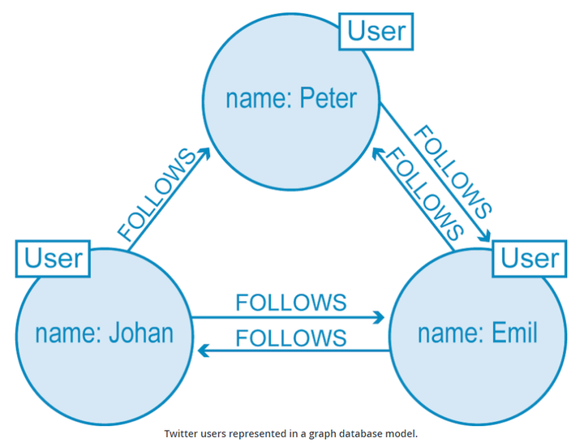
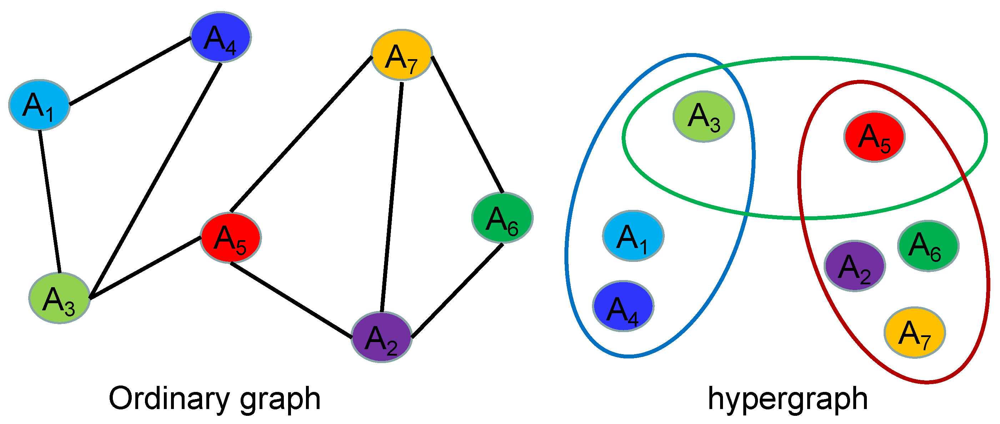
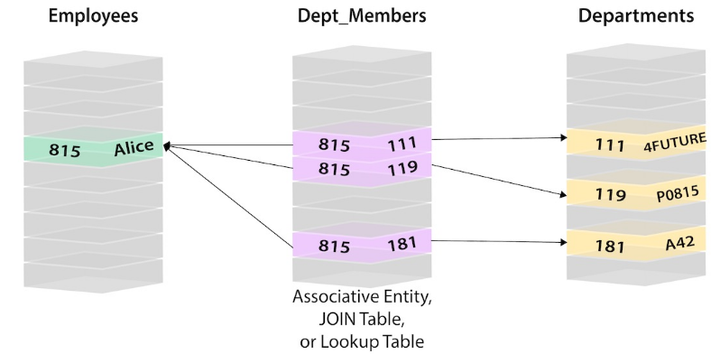
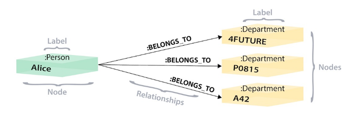
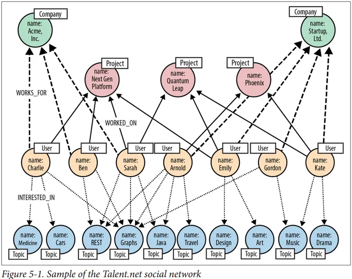
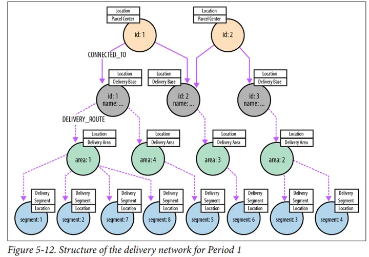

# Graph Database

---

## Table of Contents
- [Graph Database](#graph-database)
  - [Table of Contents](#table-of-contents)
- [Overview 综述](#overview-综述)
  - [主流开源 GraphDB](#主流开源-graphdb)

---

# Overview 综述

[ISO/IEC 39075:2024 - (Information technology) Database languages GQL](https://www.iso.org/standard/76120.html)

GQL - Graph Query Language (a peer, complementary language to SQL)

**图数据库 ≠ 向量数据库**

**图数据库**
1. 存储和管理 **图结构的数据**
2. 由 节点(实体) 和 边(关系) 组成
3. 优化 遍历 节点和边 的操作，能够快速执行 **深度连接查询** 和 **递归查询**
4. 场景
   1. 社交网络
   2. 供应链
   3. 知识图谱
5. Neo4j、ArangoDB、JanusGraph

**向量数据库**
1. 存储和处理 **向量数据**
2. 可以快速执行向量之间的相似性搜索
3. 利用索引结构 (如 KD树、球树 等) 来优化向量空间的近邻搜索，从而快速找到与给定向量最相似的项
4. 场景
   1. 推荐系统
   2. 图像检索
   3. 自然语言处理
5. Milvus、Faiss、Elasticsearch

图模型
1. PropertyGraph 属性图
   1. Node、Edge、Property(key-value)
   2. Neo4j
   
2. RDF 资源描述框架 三元组
   1. 适用于表示语义网络中的数据
   2. 主语subject、谓语、宾语object
3. HyperGraph 超图
   1. 一条超边(HyperEdge)可以连接多个节点，而不仅仅是两个节点
   2. 更灵活地表示多方关系，而不是通过多个二元关系来间接表示
   3. HyperGraphDB
   

**GraphDB VS RelationalDB 区别**
1. 关系型数据库不擅长处理数据之间的关系(查询是低效的)
2. 对于图数据库，数据量越大，越复杂的关联查询，约能体现其优势
3. 灵活性、敏捷性 是 图数据库的重要优势(图天生就是灵活可扩展)
4. 关系型数据库，查找时
   1. 先要通过员工信息表找到工号
   2. 使用工号去关系表中找到其对应的部门ID
   3. 使用部门ID在部门信息表中找到部门名称等
   
5. 在图数据库中，就不需要那么复杂的查询，员工和部门都在同一张图中，通过边直接建立关系
   

主流的图查询语言是 Cypher 和 Gremlin

场景
1. 社交网络应用
   
2. 实时推荐
3. 地理空间管理
   
4. 网络和数据中心管理
5. 授权和访问控制

## 主流开源 GraphDB

主流开源图数据库
1. [Neo4j - Community](https://neo4j.com/)
   
   1. 类型 - **`Graph DB`**
   2. 数据模型
      1. Graph DBMS
   3. 语言 - Cypher
   4. 支持 csv 导入
   5. 免费版只支持单实例(不是单机，可以远程连接)
   6. 社区活跃
   7. 提供可视化界面(网页 & Desktop)
2. [OrientDB](https://www.orientdb.org/)
   
   1. 类型 - **`multi-model DBMS`**
   2. 数据模型
      1. Document store
      2. Graph DBMS
      3. Key-value store
   3. 开源的分布式图数据库
   4. 兼具文挡数据库的灵活性和图形数据库管理链接能力的可深层次扩展的文档-图形数据库管理系统
   5. 性能和可扩展性不好
3. [ArangoDB](https://arangodb.com/)
   
   1. 类型 - **`multi-model DBMS`**
   2. 数据模型
      1. Document store
      2. Graph DBMS
      3. Key-value store
   3. 多模型数据库，支持图、文档和集合类型的数据模型
   4. 图查询性能方面可能略有不足
   5. 有 neo4j->ArangoDB 迁移工具
4. [JanusGraph](https://janusgraph.org/)
   
   1. 语言 - Gremlin
   2. 开源的分布式图数据库
   3. 使用Java开发
   4. 可扩展的存储和查询能力
   5. 支持多种数据模型 : 属性图 & RDF
5. [HugeGraph](https://hugegraph.apache.org/cn/)
   
   1. 语言 - Gremlin
6. [HyperGraphDB](https://hypergraphdb.org/)
   
7. [FlockDB](https://github.com/twitter-archive/flockdb)
   1. This repository has been archived by the owner on Sep 18, 2021. It is now read-only.
   2. Twitter is no longer maintaining this project or responding to issues or PRs.
   3. 轻量级的图数据库，适用于实时分析和流数据处理场景，功能相对有限
8. [TigerGraph](https://www.tigergraph.com/)
   
   1. 企业级的图数据库

