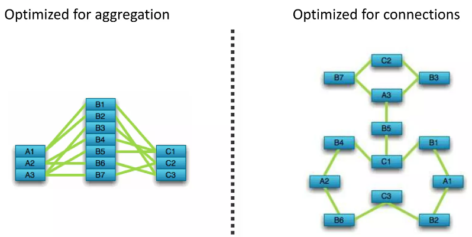

# Graph Database

---

## Table of Contents
- [Graph Database](#graph-database)
  - [Table of Contents](#table-of-contents)
- [Overview 综述](#overview-综述)
  - [主流开源 GraphDB](#主流开源-graphdb)
- [Neo4j](#neo4j)
  - [Install](#install)
  - [Neo4j](#neo4j-1)
  - [Neo4j Desktop](#neo4j-desktop)
  - [Aura](#aura)
  - [Problem Shooting](#problem-shooting)
    - [01 Unsupported Java Version](#01-unsupported-java-version)

---

# Overview 综述

[ISO/IEC 39075:2024 - (Information technology) Database languages GQL](https://www.iso.org/standard/76120.html)

GQL - Graph Query Language (a peer, complementary language to SQL)

**图数据库 ≠ 向量数据库**

**图数据库**
1. 存储和管理 **图结构的数据**
2. 由 节点(实体) 和 边(关系) 组成
3. 优化 遍历 节点和边 的操作，能够快速执行 **深度连接查询** 和 **递归查询**
4. 场景
   1. 社交网络
   2. 供应链
   3. 知识图谱
5. Neo4j、ArangoDB、JanusGraph

**向量数据库**
1. 存储和处理 **向量数据**
2. 可以快速执行向量之间的相似性搜索
3. 利用索引结构 (如 KD树、球树 等) 来优化向量空间的近邻搜索，从而快速找到与给定向量最相似的项
4. 场景
   1. 推荐系统
   2. 图像检索
   3. 自然语言处理
5. Milvus、Faiss、Elasticsearch


## 主流开源 GraphDB

[图数据库比较：Neo4j、OrientDB、ArangoDB等 - 百度开发者中心](https://developer.baidu.com/article/details/3047134)

主流开源图数据库
1. [Neo4j](https://neo4j.com/)
   
2. [OrientDB](https://www.orientdb.org/)
   
3. JanusGraph
4. HugeGraph
5. ArangoDB


# Neo4j


[Neo4j - Official Website](https://neo4j.com/)

[Neo4j - Github](https://github.com/neo4j/neo4j)


## Install

## Neo4j

[Deployment Center - Neo4j](https://neo4j.com/deployment-center/#community)

[Linux installation - Neo4j Official](https://neo4j.com/docs/operations-manual/current/installation/linux/)

[Download and install - Neo4j Official](https://neo4j.com/docs/desktop-manual/current/installation/download-installation/)

[Debian-based distributions (.deb) - Neo4j Official](https://neo4j.com/docs/operations-manual/current/installation/linux/debian/)

```bash
# Neo4j是基于Java的图形数据库，因此必须安装JAVA的JDK
# add the official OpenJDK package repository to apt
sudo add-apt-repository -y ppa:openjdk-r/ppa
sudo apt-get update
sudo apt install openjdk-21-jdk

# Dealing with multiple installed Java versions
# must configure your default Java version to point to Java 17, or Neo4j 5.19.0 will be unable to start
update-java-alternatives --list

# add the repository
# Debian package is available from https://debian.neo4j.com
wget -O - https://debian.neo4j.com/neotechnology.gpg.key | sudo apt-key add -
echo 'deb https://debian.neo4j.com stable latest' | sudo tee -a /etc/apt/sources.list.d/neo4j.list
sudo apt-get update

sudo add-apt-repository universe

sudo apt install maven
sudo apt install neo4j  # community
```

## Neo4j Desktop

Neo4j 一个图形用户界面应用程序

[Download Neo4j Desktop - Neo4j Official](https://neo4j.com/download/)



填个人信息后，浏览器自动下载 .AppImage 并 提供 **Neo4j Desktop Activation Key**

```bash
sudo chmod +x ~/Tools/Neo4j/neo4j-desktop-1.5.9-x86_64.AppImage
```

双击即可打开

创建快捷方式

```bash
sudo gedit /usr/share/applications/neo4j-desktop.desktop
```

[Website Icon - 不太清晰](https://neo4j.com/favicon.ico)


```bash
sudo cp ~/Projects/Blog/Data/GraphDB/Pics/neo4j-icon.png /usr/share/pixmaps/neo4j-icon.png

sudo cp ~/Projects/Blog/Data/GraphDB/Pics/neo4j-icon-old.png /usr/share/pixmaps/neo4j-icon-old.png
```

```bash
[Desktop Entry]
Encoding=UTF-8
Type=Application
Name=Neo4j-Desktop
#添加neo4j-desktop-1.4.1-x86_64.AppImage在本地的位置
Exec=/home/lzy/Tools/Neo4j-Desktop/neo4j-desktop-1.5.9-x86_64.AppImage
#读者可自行在互联网上搜索*.png格式图片然后重命名neo4j-desktop.png放置/neo4j目录
Icon=/usr/share/pixmaps/neo4j-icon.png
# Icon=/usr/share/pixmaps/neo4j-icon-old.png
Terminal=true
StartupNotify=true;
```


## Aura

```bash
username : neo4j

password : lvq1WFfG0b-yYbf14J1PXG9YtvsmqeTYtL2JKLfvNF8
```

## Problem Shooting

### 01 Unsupported Java Version

**Java LTS** - Java 8 ，Java 11， Java 17，Java 21

```bash
lzy@legion:~ $ neo4j
Unsupported Java 11.0.22 detected. Please use Java(TM) 17 or Java(TM) 21 to run Neo4j Server.

# Dealing with multiple installed Java versions
update-java-alternatives --list
sudo update-alternatives --config java

# 修改 $JAVA_HOME
# JAVA_HOME="/usr/lib/jvm/java-11-openjdk-amd64"JAVA_HOME="/usr/lib/jvm/java-11-openjdk-amd64"

echo '# JAVA_HOME by lzy' >> ~/.bashrc
echo 'JAVA_HOME=/usr/lib/jvm/java-1.21.0-openjdk-amd64' >> ~/.bashrc
echo 'export PATH=$JAVA_HOME/bin:$PATH' >> ~/.bashrc
source ~/.bashrc

# cd $JAVA_HOME/bin/
```


