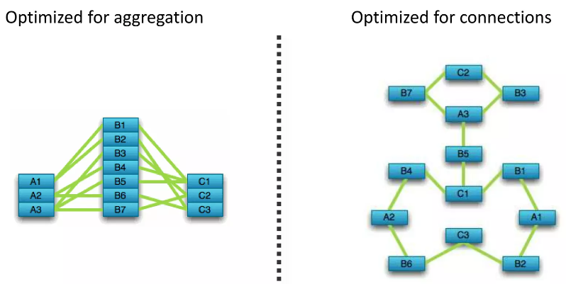

# Neo4j


[Neo4j - Official Website](https://neo4j.com/)

[Neo4j - Github](https://github.com/neo4j/neo4j)

## Overview

[Neo4j in 100 Seconds](https://www.youtube.com/watch?v=T6L9EoBy8Zk)

**Acid compliant** (描述数据库事务正确性的术语)
1. **A**tomicity 原子性 - 所有操作要么全部成功，要么全部失败。如果事务中的某个操作失败，整个事务将被回滚
2. **C**onsistency 一致性 - 事务必须将数据库从一个有效状态转换到另一个有效状态。事务完成后，所有数据规则都必须应用于数据库数据，确保数据的正确性和完整性
3. **I**solation 隔离性 - 发执行的事务之间必须是隔离的，事务的执行不应互相干扰，每个事务都应该独立于其他事务运行
4. **D**urability 持久性 - 一旦事务被提交，对数据库的修改就是永久性的，即使系统发生故障也不会丢失

RelationalDB -> Tabular Model

GraphDB -> Property Graph Model


## Install

## Neo4j

[Deployment Center - Neo4j](https://neo4j.com/deployment-center/#community)

[Linux installation - Neo4j Official](https://neo4j.com/docs/operations-manual/current/installation/linux/)

[Download and install - Neo4j Official](https://neo4j.com/docs/desktop-manual/current/installation/download-installation/)

[Debian-based distributions (.deb) - Neo4j Official](https://neo4j.com/docs/operations-manual/current/installation/linux/debian/)

```bash
# Neo4j是基于Java的图形数据库，因此必须安装JAVA的JDK
# add the official OpenJDK package repository to apt
sudo add-apt-repository -y ppa:openjdk-r/ppa
sudo apt-get update
sudo apt install openjdk-21-jdk

# Dealing with multiple installed Java versions
# must configure your default Java version to point to Java 17, or Neo4j 5.19.0 will be unable to start
update-java-alternatives --list

# add the repository
# Debian package is available from https://debian.neo4j.com
wget -O - https://debian.neo4j.com/neotechnology.gpg.key | sudo apt-key add -
echo 'deb https://debian.neo4j.com stable latest' | sudo tee -a /etc/apt/sources.list.d/neo4j.list
sudo apt-get update

sudo add-apt-repository universe

sudo apt install maven
sudo apt install neo4j  # community
```

## Neo4j Desktop

Neo4j 一个图形用户界面应用程序

[Download Neo4j Desktop - Neo4j Official](https://neo4j.com/download/)



填个人信息后，浏览器自动下载 .AppImage 并 提供 **Neo4j Desktop Activation Key**

```bash
sudo chmod +x ~/Tools/Neo4j/neo4j-desktop-1.5.9-x86_64.AppImage
```

双击即可打开

创建快捷方式

```bash
sudo gedit /usr/share/applications/neo4j-desktop.desktop
```

[Website Icon - 不太清晰](https://neo4j.com/favicon.ico)


```bash
sudo cp ~/Projects/Blog/Data/GraphDB/Pics/neo4j-icon.png /usr/share/pixmaps/neo4j-icon.png

sudo cp ~/Projects/Blog/Data/GraphDB/Pics/neo4j-icon-old.png /usr/share/pixmaps/neo4j-icon-old.png
```

```bash
[Desktop Entry]
Encoding=UTF-8
Type=Application
Name=Neo4j-Desktop
#添加neo4j-desktop-1.4.1-x86_64.AppImage在本地的位置
Exec=/home/lzy/Tools/Neo4j-Desktop/neo4j-desktop-1.5.9-x86_64.AppImage
#读者可自行在互联网上搜索*.png格式图片然后重命名neo4j-desktop.png放置/neo4j目录
Icon=/usr/share/pixmaps/neo4j-icon.png
# Icon=/usr/share/pixmaps/neo4j-icon-old.png
Terminal=false
StartupNotify=true
Categories=Application;Development;
```


## Neo4j AuraDB

```bash
username : neo4j

password : lvq1WFfG0b-yYbf14J1PXG9YtvsmqeTYtL2JKLfvNF8
```

## Problem Shooting

### 01 Unsupported Java Version

**Java LTS** - Java 8 ，Java 11， Java 17，Java 21

```bash
lzy@legion:~ $ neo4j
Unsupported Java 11.0.22 detected. Please use Java(TM) 17 or Java(TM) 21 to run Neo4j Server.

# Dealing with multiple installed Java versions
update-java-alternatives --list
sudo update-alternatives --config java

# 修改 $JAVA_HOME
# JAVA_HOME="/usr/lib/jvm/java-11-openjdk-amd64"JAVA_HOME="/usr/lib/jvm/java-11-openjdk-amd64"

echo '# JAVA_HOME by lzy' >> ~/.bashrc
echo 'JAVA_HOME=/usr/lib/jvm/java-1.21.0-openjdk-amd64' >> ~/.bashrc
echo 'export PATH=$JAVA_HOME/bin:$PATH' >> ~/.bashrc
source ~/.bashrc

# cd $JAVA_HOME/bin/
```
