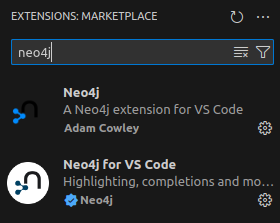

# Neo4j


[Neo4j - Official Website](https://neo4j.com/)

[Neo4j - Github](https://github.com/neo4j/neo4j)


[Neo4j Docs](https://neo4j.com/docs/)


---

## Table of Contents

- [Neo4j](#neo4j)
  - [Table of Contents](#table-of-contents)
- [Overview](#overview)
- [Neo4j DBMS](#neo4j-dbms)
  - [Welcome](#welcome)
  - [Get Started](#get-started)
  - [Model Data for Neo4j](#model-data-for-neo4j)
  - [Import Data into Neo4j](#import-data-into-neo4j)
  - [Query Neo4j Database](#query-neo4j-database)
  - [Connect to Neo4j](#connect-to-neo4j)
  - [Data Science with Neo4j](#data-science-with-neo4j)
  - [Visualize Data with Neo4j](#visualize-data-with-neo4j)
- [Neo4j Desktop](#neo4j-desktop)
  - [Install](#install)
  - [Visual Tour](#visual-tour)
  - [Desktop Operations](#desktop-operations)
- [Cypher](#cypher)
- [Generative AI](#generative-ai)
- [Neo4j Operations Manual v5](#neo4j-operations-manual-v5)
  - [Installation](#installation)
  - [Remote Connection](#remote-connection)
  - [Docker \& Kubernetes](#docker--kubernetes)
  - [Configuration](#configuration)
- [Install](#install-1)
  - [Neo4j](#neo4j-1)
  - [Neo4j Desktop](#neo4j-desktop-1)
  - [Neo4j AuraDB](#neo4j-auradb)
- [Problem Shooting](#problem-shooting)
  - [01 Unsupported Java Version](#01-unsupported-java-version)
  - [02 Neo4j Start Failure](#02-neo4j-start-failure)


---

# Overview

[Neo4j in 100 Seconds](https://www.youtube.com/watch?v=T6L9EoBy8Zk)

**CRUD**
1. Create
2. Read
3. Update
4. Delete


**Acid compliant** (描述数据库事务正确性的术语)
1. **A**tomicity 原子性 - 所有操作要么全部成功，要么全部失败。如果事务中的某个操作失败，整个事务将被回滚
2. **C**onsistency 一致性 - 事务必须将数据库从一个有效状态转换到另一个有效状态。事务完成后，所有数据规则都必须应用于数据库数据，确保数据的正确性和完整性
3. **I**solation 隔离性 - 发执行的事务之间必须是隔离的，事务的执行不应互相干扰，每个事务都应该独立于其他事务运行
4. **D**urability 持久性 - 一旦事务被提交，对数据库的修改就是永久性的，即使系统发生故障也不会丢失

RelationalDB -> **Tabular Model**(表格模型)

GraphDB -> **Property Graph Model**(属性图模型)
1. node -> entity
2. edge -> relationship
3. property -> Key-Value Pair

创始人 - Emil Eifrem

Neo4j 核心数据库引擎 用 Java 编写

查询语句 编程语言 - **Cypher**(声明式图形查询语言) (**.cyp 文件**)


可以安装插件



`Ctrl` + `Shift` + `p` & neo4j

---


# Neo4j DBMS

[Neo4j DBMS](https://neo4j.com/docs/getting-started) - Learn about graph database concepts, introduce yourself to Cypher, and find useful resources.

## Welcome


节点保存 direct pointer 无需 index

graph database takes a **property graph** approach

beneficial for both **traversal performance**(遍历性能) and **operations runtime**(运行时)

dedicated **memory management** and **memory-efficient operations**

**Neo4j Graph Database** is the core product
1. Community Edition (**CE**)
2. Enterprise Edition (**EE**)

**Neo4j AuraDB** is a graph database as a service

## Get Started

## Model Data for Neo4j

## Import Data into Neo4j

## Query Neo4j Database

## Connect to Neo4j

## Data Science with Neo4j

## Visualize Data with Neo4j

---

# Neo4j Desktop

[Neo4j Desktop - Neo4j Docs](https://neo4j.com/docs/desktop-manual/current/)

## Install

[Install Neo4j Desktop](#neo4j-desktop-1)

Software requirement - **Ubuntu 22.04**

Proxy Setup


## Visual Tour

[Visual Tour](https://neo4j.com/docs/desktop-manual/current/visual-tour/)


## Desktop Operations


---

# Cypher

[Cypher](https://neo4j.com/docs/cypher-manual) - Learn about Cypher; the graph query language for Neo4j and AuraDB.

[Cypher Cheat Sheet](https://neo4j.com/docs/cypher-cheat-sheet)

[Cypher Personal Note](./Cypher.md)

---

# Generative AI

[Generative AI](https://neo4j.com/docs/genai/) - Learn how to integrate Neo4j with Generative AI models.


---


# Neo4j Operations Manual v5

```bash
lzy@legion:~ $ neo4j --version
5.19.0
```

## Installation

[Installation - Neo4j](https://neo4j.com/docs/operations-manual/current/installation/)

[Installation - Local Note(Ubuntu22.04)](#install)


## Remote Connection

Procedure
1. the remote instance needs to be started
2. configuration setting
    ```bash
    server.default_listen_address=0.0.0.0=true
    ```
3. the firewall on your remote instance allows inbound connections to the defined bolt port (by default: 7687)


## Docker & Kubernetes

[Docker - Neo4j](https://neo4j.com/docs/operations-manual/current/docker/)

[Kubernetes - Neo4j](https://neo4j.com/docs/operations-manual/current/kubernetes/)

## Configuration


---


# Install

## Neo4j

[Deployment Center - Neo4j](https://neo4j.com/deployment-center/#community)

[Linux installation - Neo4j Official Operations Manual](https://neo4j.com/docs/operations-manual/current/installation/linux/)

[Download and install - Neo4j Official](https://neo4j.com/docs/desktop-manual/current/installation/download-installation/)

[Debian-based distributions (.deb) - Neo4j Official](https://neo4j.com/docs/operations-manual/current/installation/linux/debian/)

```bash
# Neo4j是基于Java的图形数据库，因此必须安装JAVA的JDK
# add the official OpenJDK package repository to apt
sudo add-apt-repository -y ppa:openjdk-r/ppa
sudo apt-get update
sudo apt install openjdk-21-jdk

# Dealing with multiple installed Java versions
# must configure your default Java version to point to Java 17, or Neo4j 5.19.0 will be unable to start
update-java-alternatives --list

# add the repository
# Debian package is available from https://debian.neo4j.com
wget -O - https://debian.neo4j.com/neotechnology.gpg.key | sudo apt-key add -
echo 'deb https://debian.neo4j.com stable latest' | sudo tee -a /etc/apt/sources.list.d/neo4j.list
sudo apt-get update

sudo add-apt-repository universe

sudo apt install maven
sudo apt install neo4j  # community
```

## Neo4j Desktop

Neo4j 一个图形用户界面应用程序

[Download Neo4j Desktop - Neo4j Official](https://neo4j.com/download/)


填个人信息后，浏览器自动下载 .AppImage 并 提供 **Neo4j Desktop Activation Key**

```bash
sudo chmod +x ~/Tools/Neo4j/neo4j-desktop-1.5.9-x86_64.AppImage
```

双击即可打开

创建快捷方式

```bash
sudo gedit /usr/share/applications/neo4j-desktop.desktop
```

[Website Icon - 不太清晰](https://neo4j.com/favicon.ico)

 


```bash
sudo cp ~/Projects/Blog/Data/GraphDB/Pics/neo4j-icon.png /usr/share/pixmaps/neo4j-icon.png

sudo cp ~/Projects/Blog/Data/GraphDB/Pics/neo4j-icon-old.png /usr/share/pixmaps/neo4j-icon-old.png
```

```bash
[Desktop Entry]
Encoding=UTF-8
Type=Application
Name=Neo4j-Desktop
#添加neo4j-desktop-1.4.1-x86_64.AppImage在本地的位置
Exec=/home/lzy/Tools/Neo4j-Desktop/neo4j-desktop-1.5.9-x86_64.AppImage
#读者可自行在互联网上搜索*.png格式图片然后重命名neo4j-desktop.png放置/neo4j目录
Icon=/usr/share/pixmaps/neo4j-icon.png
# Icon=/usr/share/pixmaps/neo4j-icon-old.png
Terminal=false
StartupNotify=true
Categories=Application;Development;
```


## Neo4j AuraDB

```bash
username : neo4j

password : lvq1WFfG0b-yYbf14J1PXG9YtvsmqeTYtL2JKLfvNF8
```

# Problem Shooting

## 01 Unsupported Java Version

**Java LTS** - Java 8 ，Java 11， Java 17，Java 21

```bash
lzy@legion:~ $ neo4j
Unsupported Java 11.0.22 detected. Please use Java(TM) 17 or Java(TM) 21 to run Neo4j Server.

# Dealing with multiple installed Java versions
update-java-alternatives --list
sudo update-alternatives --config java

# 修改 $JAVA_HOME
# JAVA_HOME="/usr/lib/jvm/java-11-openjdk-amd64"JAVA_HOME="/usr/lib/jvm/java-11-openjdk-amd64"

echo '# JAVA_HOME by lzy' >> ~/.bashrc
echo 'JAVA_HOME=/usr/lib/jvm/java-1.21.0-openjdk-amd64' >> ~/.bashrc
echo 'export PATH=$JAVA_HOME/bin:$PATH' >> ~/.bashrc
source ~/.bashrc

# cd $JAVA_HOME/bin/
```

## 02 Neo4j Start Failure

neo4j start 失败，报错

```bash
lzy@legion:~ $ neo4j start
Validating Neo4j configuration: /etc/neo4j/neo4j.conf
No issues found.

Validating user Log4j configuration: /etc/neo4j/user-logs.xml
5 issues found.
Error: Cannot access RandomAccessFile java.io.FileNotFoundException: /var/log/neo4j/neo4j.log (Permission denied)

...

Warning: Null object returned for RollingRandomAccessFile in Appenders.
Warning: Null object returned for RollingRandomAccessFile in Appenders.
Warning: Null object returned for RollingRandomAccessFile in Appenders.
Warning: Null object returned for RollingRandomAccessFile in Appenders.
Warning: Unable to locate appender "DebugLog" for logger config "root"
Warning: Unable to locate appender "HttpLog" for logger config "HttpLogger"
Warning: Unable to locate appender "QueryLog" for logger config "QueryLogger"
Warning: Unable to locate appender "SecurityLog" for logger config "SecurityLogger"

Configuration file validation failed.
Configuration contains errors. This validation can be performed again using 'neo4j-admin server validate-config'.
```


需要 sudo

```bash
lzy@legion:~ $ sudo neo4j start
[sudo] password for lzy:
Directories in use:
home:         /var/lib/neo4j
config:       /etc/neo4j
logs:         /var/log/neo4j
plugins:      /var/lib/neo4j/plugins
import:       /var/lib/neo4j/import
data:         /var/lib/neo4j/data
certificates: /var/lib/neo4j/certificates
licenses:     /var/lib/neo4j/licenses
run:          /var/lib/neo4j/run
Starting Neo4j.
Started neo4j (pid:678744). It is available at http://localhost:7474
There may be a short delay until the server is ready.
```

在浏览器中输入网址，可以看到相应界面


初始的 用户名 和 密码 都是 **neo4j**

后面会让修改 密码

You are connected as user **neo4j** - to **neo4j://localhost:7687**

```bash
lzy@legion:~ $ sudo neo4j stop
Stopping Neo4j....... stopped.
```
