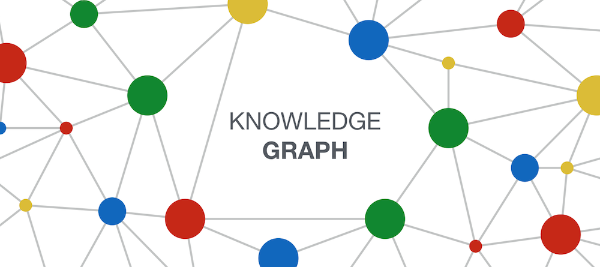
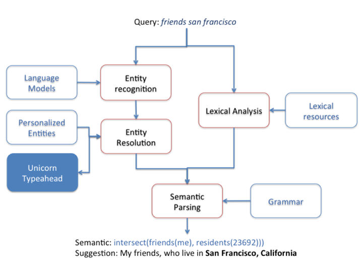
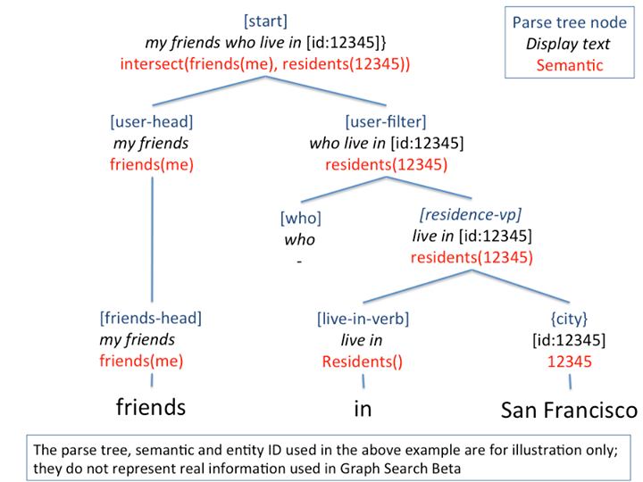

# Knowledge Graph

---

## Table of Contents

- [Knowledge Graph](#knowledge-graph)
  - [Table of Contents](#table-of-contents)
- [图谱学苑](#图谱学苑)
  - [知识图谱 原理\&应用 概述 - 北京大学邹磊](#知识图谱-原理应用-概述---北京大学邹磊)
    - [Additional Reading](#additional-reading)
  - [知识图谱数 据模型\&查询语言 - 北京大学邹磊](#知识图谱数-据模型查询语言---北京大学邹磊)
    - [1 RDF图数据模型 与 SPARQL 查询语言](#1-rdf图数据模型-与-sparql-查询语言)
    - [2 属性图数据模型与Cypher查询语言](#2-属性图数据模型与cypher查询语言)
    - [3 TinkerPop 图计算框架 与 Gremlin 图遍历语言及遍历机](#3-tinkerpop-图计算框架-与-gremlin-图遍历语言及遍历机)

# 图谱学苑

[图谱学苑-北京大学王选计算机所数据管理实验 - B站主页](https://space.bilibili.com/601583767/video)

## 知识图谱 原理&应用 概述 - 北京大学邹磊

[知识图谱原理与应用概述 - 北京大学邹磊](https://www.bilibili.com/video/BV1Kg4y1i7GN/)

2012 年 Google 正式提出 知识图谱 Knowledge Graph的概念，其初衷是优化搜索引擎返回的结果，增强用户搜索质量及体验 (传统 search engine 基于 关键词匹配)

本质上是 基于图的语义网络，表示实体间的关系

### Additional Reading

[Facebook Social Graph](https://engineering.fb.com/2013/04/29/web/under-the-hood-the-natural-language-interface-of-graph-search/)

semantic parser

## 知识图谱数 据模型&查询语言 - 北京大学邹磊

### 1 RDF图数据模型 与 SPARQL 查询语言

### 2 属性图数据模型与Cypher查询语言

Neo4j

### 3 TinkerPop 图计算框架 与 Gremlin 图遍历语言及遍历机

