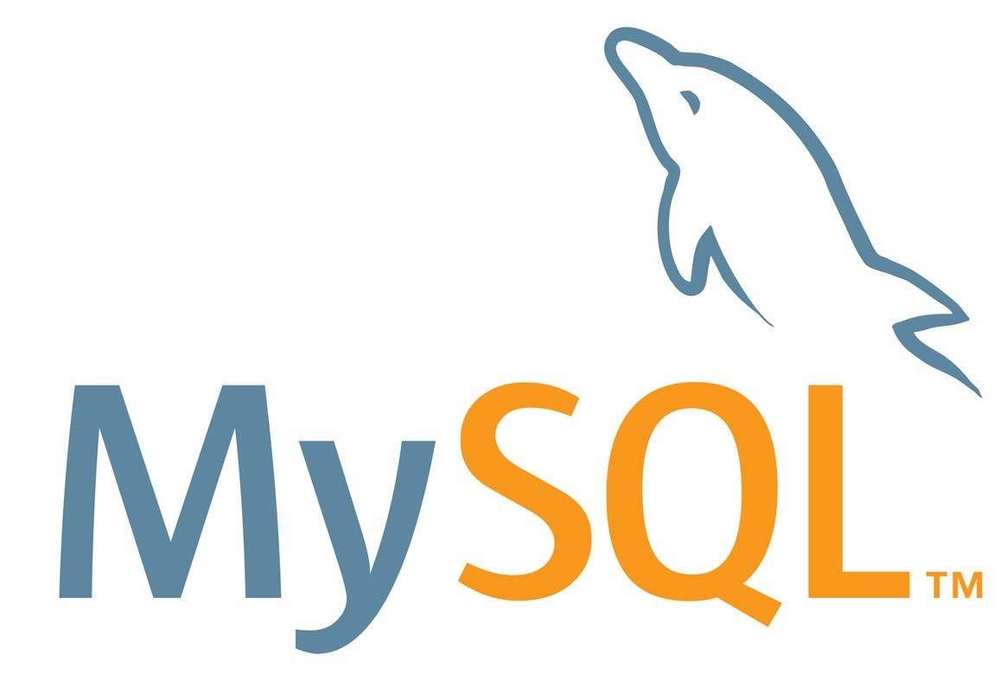

# MySQL

[toc]

## Portals

[狂神说 MySQL](https://www.bilibili.com/video/BV1NJ411J79W)


[MySQL创建用户与授权](https://www.cnblogs.com/zhongyehai/p/10695659.html)


#

[SQL的核心基础语法 | 快速入门MySQL - 技术蛋老师](https://www.bilibili.com/video/BV16D4y167TT/)

[一小时MySQL教程 - GeekHour](https://www.bilibili.com/video/BV1AX4y147tA/)

## 增

## 删

## 改

## 查


---

# 宋红康 MySQL数据库

[宋红康 MySQL数据库](https://www.bilibili.com/video/BV1iq4y1u7vj)

## 资料

网盘资料

```test
尚硅谷MySQL王炸版视频教程
B站直达：https://www.bilibili.com/video/BV1iq4y1u7vj
百度网盘：https://pan.baidu.com/s/1jUPQqXmk6x0YbSTvCu9ZRg 提取码：yyds
阿里云盘：https://www.aliyundrive.com/s/wLemFNs4ApJ（教程配套资料请从百度网盘下载）

更多尚硅谷视频教程请访问：http://www.atguigu.com/download.shtml
```

## 1 数据库概述与MySQL

### 数据库简介

由瑞典 MySQL AB 公司创立

**为什么使用数据库**
1. 持久化 persistence 将数据存储到硬盘加以“固化”
2. 持久化的主要作用是将内存中的数据存储在关系型数据库中(QQ保存消息记录)
3. 存储在数据库中而不存储在文件中，因为数据库的结构可以更复杂，支持的类型多种多样（大文本、图片、字符串），同时可以存储的数据量更大。（条目数、丰富度）

**数据库相关概念**
1. 数据库：DB Database：存储数据的仓库，文件系统
2. 数据库管理系统 DBMS Database Management System：操纵管理数据库的软件
3. 结构化查询语言 SQL Structured Query Language：与数据库通信的语言


**常见数据库管理系统**
1. Oracle（商用 Relational RDBMS 关系型 不开源）
2. MySQL
   1. 开源的关系型数据库管理系统
   2. 支持大学数据库
   3. 支持多种编程语言
3. MongoDB
4. Microsoft SQL Server
5. Redis
6. PostgreSQL

[各大数据库排名网站](https://db-engines.com/en/ranking)

**RDBMS和非RDBMS**

Relational,Document,Key-Value,Search Engine

RDBMS（主流）
1. 将复杂的数据结构归结为二维表格形式(关系型)
2. 按照行row和列column的形式存储数据，一系列行和列称为表table，一组表组成一个库database
3. 表与表之间的数据记录有关系。现实世界中的各种实体之间的各种联系均用**关系模型**来表示。
4. 便于复杂查询、事务支持（多线程安全性）

列式存储降低IO，减少冗余字段

非RDBMS
1. RDBMS的阉割版本（“舍得”）
2. 基于键值对存储数据，不需要经过SQL层的解析
3. 减少不常用功能，进一步提高性能
4. 种类
   1. 键值型 Redis
   2. 文档型 MongoDB 可以存放获取文档，可以是XML、JSON格式
   3. 搜索引擎 Solr 核心：“倒排索引”
   4. 列式存储、行式存储 HBase 降低系统I/O
   5. 图形型 存储图形关系的数据库

### 关系型数据库设计规则
1. 典型数据结构：**数据表**（结构化的）
2. 将数据放在表中，表放在库中
3. 数据库中有多个表，表有自己的名字用于标识
4. 表具有特性，定义了数据在表中如何存储（**类**）

**表、记录、字段**

E-R模型 entity-relationship：实体集、属性、联系集

ORM思想（Object Relational Mapping）：数据库中的一个表table对应于一个实体集（类class），表中的一条数据（一行row）对应类的对象（实体instance、记录record），表中的一列column对应类中的属性attribute（字段field）。


**表的关联关系**

四种：一对一、一对多、多对多（包括多对一）、自我引用

1. 一对一关系：实际应用不多，因为可以创建成一张表，但是为了节省I/O和内存占用，从设计上应该分拆为常用和不常用。
2. 一对多关系：客户订单表、分类商品表、部门员工表。主表、从表。
3. 多对多关系：必须创建第三个表（**联结表**），将多对多关系划分为两个一对多关系。多对多体现在联结表中。通过联结表关联。(eg:学生表+课程表+选课信息表)
   
4. 自我引用（Self Reference）：员工的主管也是公司员工，也有自己的主管

**mysql 与 mysqld**

MySQL是整个数据库管理系统的名称，包括服务器、客户端、工具等，而mysqld是MySQL服务器的核心程序，负责处理和管理数据库的请求和操作。

### MySQL的常见操作


```sql
system clear;
-- 清空 mysql 命令行
```

```sql
show databases;
-- 查看 databases

show schemas;
```

四个自带的数据库服务器
1. information_schema 保持数据库服务器的系统信息、名称、存储权限
2. mysql 运行时的系统信息、字符集
3. performance_schema 监控性能指标
4. sys 存储性能指标


```sql
create database [dbname];
-- 创建名为[dbname]的数据库
```


```sql
use [dbname];
-- 使用名为[dbname]的数据库
-- show tables;
-- 查看正在使用中的数据库中的所有表格
```


```sql
create table [tablename(...)]
-- 创建table，并指定其参数类型
```


```sql
select * from [tablename];
-- 查看所有数据
```


```sql
insert into [tablename] values(...);
-- 插入一条数据（可重复）
-- 8.0版本values中可以出现中文，而5.7等版本不行，因为字符集问题
```


```sql
show create table [tablename];
show create database [dbname];
show variables like 'character_%';
show variables like 'collation_%';
-- 可以查看字符集
```

mb4 表示字符用四个字节


若要修改字符集，在my.ini中修改[mysql]和[mysqld]中的default即可。my.ini在数据库数据位置。再重启服务


```sql
drop databases [dbname]
删除数据库
```

### 图形化管理工具

1. Workbench
2. Navicat
3. SQLyog
4. DBeaver

使用DBeaver的时候，在导航栏中的插头图标上点一下，输入用户名和密码即可。

使用MySQL8.0版本在设置时，由于使用高级加密方式导致使用GUI工具连接不上，如下图所示。


解决方案：

```sql
use mysql;

ALTER USER 'root'@'locolhost' IDENTIFIED WITH mysql_native_password BY '[yourpassword]';

FLUSH PRIVILEGES;
```

### 其他内容

**无论是命令行还是GUI都是通过网络的方式访问数据库。（客户端访问服务器）**

如果需要修改字符集可以通过alter语句

```sql
alter table [tablename] charset [aim_charset];
alter database [dbname] charset [aim_charset];
例子：utf8
```

## 3 基本的SELECT语句

### SQL概述

**SQL背景知识**

结构化查询语言 Structured Query Language

专为数据库建立的操作命令集

关系型数据库（可以用表格表达），非关系型数据库（redis，hbase）

sql只能对关系型数据库进行查询

不同数据库生产厂商都支持SQL语言，但都有特定内容。


SQL是一门ANSI的标准计算机语言，用来访问和操作数据库系统。SQL语句用于取回和更新数据库中的数据。

不幸地是，存在着很多不同版本的SQL语言，但是为了与**ANSI标准**相兼容，它们必须以相似的方式共同地来支持一些主要的关键词（比如SELECT、UPDATE、DELETE、INSERT、WHERE等等）。

**SQL分类**
1. **DDL** 数据定义语言（对数据库结构进行操作） （**用于定义不同的数据库、表、视图、索引等数据库对象，还可以用来创建、删除、修改数据库和数据表的结构**）
   1. CREATE(table view index)从无到有创建
   2. ALTER 修改
   3. DROP 删除（结构）
   4. RENAME 重命名
   5. TRUNCATE 清空 表的数据，但表的结构还在（adj. 截短的；被删节的  vt. 把…截短；缩短；[物]使成平面）
2. **DML** 数据操作语言（针对一条条记录） 使用频率最高 （**用于增删改查，添加、删除、更新、查询数据库记录，并检测数据完整性**）
   1. INSERT 添加记录
   2. DELETE 删除记录
   3. UPDATE 修改
   4. SELECT 查询 （数据查询 **DQL**） （重中之重，难+使用频繁）
3. **DCL** 数据控制语言 控制操作 （**用于定义数据库、表、字段、用户权限、安全级别**）
   1. COMMIT 提交（事务控制 TCL）
   2. ROLLBACK 回滚（事务控制 TCL）
   3. SAVEPOINT 设置保存点
   4. GRANT 赋予权限
   5. REVOKE 回收权限

### SQL的语言规范

**基本规则**
1. 每条命令以分号结束（单条语句执行可以不用分号，但是多条必须加分号）
2. 关键字不能被缩写或者分行写
3. 列的别名尽量使用双引号，不建议省略as

**基本规范（尽量遵守）**
1. 在Windows环境中，大小写不敏感
2. 在Linux环境中，大小写敏感
   1. 数据库名，表名，表的别名，变量名严格区分大小写
   2. 关键字，列名，列的别名，函数名忽略大小写
3. 推荐关键字、函数名、绑定变量都大写，数据库名、表名、字段名、表别名、字段别名都小写

**注释**
1. 单行：井号 #（**或者--加一个空格**（通用））
2. 多行：/* */（**多行注释不能嵌套**）

**命名规则**

数据库、表名不得超过30个字符

### 数据导入(执行sql脚本)

在百度网盘的资料中

两种方式
1. 命令行 source 文件的全路径名（只能在命令行执行）
   ```sql
   -- 在命令行中执行
   source D:\Project\MySQL\SourceSQL\atguigudb.sql
   ```
   如果没有在图形化工具中出现，右键数据库F5进行刷新即可
   
2. 基于具体的图形化界面工具
   对于DBeaver软件，在一个数据库中右键添加即可
   


### 基本的SELECT语句

**SELECT**

```sql
SELECT 字段1,字段2 FROM 表名;  # 最后一个字段后不加逗号

# dual：伪表

SELECT * FROM 表名; # *表示所有的字段（列）

SELECT 列1,列2 FROM 表名;

# 查询语句的结果称为结果集result_ set
```

**列的别名**

as : alias ，可以省略

别名中有中文也可以，utf8

方法：
1. AS（可加可不加）
2. 双引号（别名中间有空格必须加）
3. mysql也支持单引号，但最好还是按照**规范**使用双引号（定义字符串的时候最好使用单引号）

```sql
SELECT 列名1 别名1,列明2 AS 别名2 FROM 表名;
```

别名展示在结果集中

**去除重复行**

加关键字**distinct**（adj. 截然不同的, 完全分开的）

```sql
SELECT DISTINCT 列名1,列名2 FROM 表名;
# distinct 管好几个列 （只有这几个列都相同才不重复显示）
```

**空值NULL参与运算**

空值NULL不等同于0，NULL表示不知道

空值参与运算，结果一定是NULL

可以用IFNULL运算（一种解决null参与运算结果为null的解决方案）

```sql
IFNULL(列名,number)
# 当作一个变量写入整个表达式中
```

**着重号**

`

保证字段没有和保留字、数据库系统或常用方法冲突。

如果坚持使用，在SQL语句中使用着重号\`。（前后各加一个，一对着重号将字段包住）

普通字段加了着重号也不会错

```sql
SELECT `列名` FROM `表名`;
```

**查询常数**

```sql
SELECT 'const varchar',const_number FROM 表名;
```

可以是数也可以是字符串

在查询结果的每一行都匹配常量

**显示表结构**

==显示了表中字段的详细信息==

```sql
DESCRIBE 表名;

DESC 表名;

# 两者效果一致，后者相当于缩写
```


刻画了表中字段的详细信息

Type是数据类型

Null表示是否允许为空

Key刻画约束

Default默认值

**过滤数据**

只想查询满足某些条件的数据（**过滤**）

**WHERE一定要写在FROM后面，且必须挨在一起**

```sql
SELECT 列名1 FROM 表名 WHERE 列名2=xxx;
# 如果查询字符串，记得加引号。
# 也不一定是等于，大于小于也可以
```

windows中大小写不敏感，列名表名大小写无所谓。如果WHERE中查询字符串最好保证大小写和表中的符合（mysql不严谨导致大小写都无所谓）

## 4 运算符

**算数运算符**


/除完保留小数部分和整数部分，而DIV只保留整数部分（小数部分直接舍去）

整形除以整形，mysql**默认转为浮点型**

分母不能为0，否则结果为NULL

取模运算符，结果正负和被模数相同，与模数无关

在 SQL 中加号没有连接作用，仅表示加法运算

==隐式转换==，字符串转为数值，如果不能转为数值则看做0


null值参与运算，结果为null

**比较运算符**

比较的结果为真则返回1，假则返回0，其他情况返回NULL


一般字符串隐式转换会变为数值，如果不能隐式转换，则当作0（0='a'为真）

纯粹字符串比较不会转换，使用 ASCII 码比较

只要有null参与运算，结果就为null

不能通过xxx=null来筛选空值（不会有任何结果，需要通过安全等于进行查询）

安全等于可以对NULL进行判断（null<=>null）


安全等于和isnull（is null）类似，没空格相当于一个函数，没有空格为关键字

LEAST（求最小值）、GREAST（求最大值）、LENGTH（求长度）

BETWEEN...AND包含边界，而且一定要从小到大，否则查询不到数据（可用>=、&&、<=代替）（可以在BETWEEN之前加入NOT）

IN和NOT IN后面跟一个集合，离散查找。集合用小括号（）

LIKE模糊查询。eg:查询last_name包含字符'a'的员工信息(select xxx from xxx where xxx like "%x%")
1. 百分号%代表不确定个数的字符（包括0个）
2. 下划线_代表一个不确定的字符
3. 转义字符\

REGEXP RLIKE 正则表达式（精确操作）记得用单引号将正则表达式包起（在DBeaver中如果要使用\w等类似内容似乎需要多写一个\否则查询不到数据）


**逻辑运算符**


逻辑运算符在比较前左右就是真和假

非0看作1

运算符两边的条件都是完整的，不能缩写

and的优先级高于or

**位运算符**

使用频率较低

左移右移，补零，超出位置舍去

**运算符的优先级**


越下面优先级越高

## 5 排序与分页

**排序**

默认顺序是数据添加的顺序

使用**ORDER BY**对查询到的数据进行排序，需要指明是升序还是降序（默认升序）。（在order by xxx 之后加）
1. 升序：ASC（ascend）
2. 降序：DESC（descend）（和describe的desc相同）

可以使用列的别名进行排序，但是**不能在where中使用列的别名**。如果同时出现where和order by，where应该在前。

另外order by的排序字段并不一定是select中的查询字段。

真实的执行流程是先from，再where，接着select，最后order by。（这也解释了为什么where不能用别名）

**二级排序**

排列后，有相同的情况，需要再次进行排序。

```sql
select employee_id , salary , department_id
from employees
order by department_id desc , salary asc;

select employee_id , salary , ifnull(department_id,-1)
from employees
order by department_id desc , salary asc;
```

再多级类似，再后面添加逗号，标签，升降序即可。

**分页**

查询返回记录太多，查看不方便。实现分页查询

limit实现分页

```sql
SELECT xxx
FROM xxx
LIMIT 偏移量,条目数;  -- 偏移量=0的时候可以省略

-- 公式：LIMIT (pageNO-1)*pageSize, pageSize;  // No从1开始
-- 公式：LIMIT pageNO*pageSize, pageSize;  // No从0开始
```

声明顺序：where...order by...limit(不是实际执行顺序)

mysql8.0新特性支持将逗号用OFFSET关键字进行替代（注意偏移量和条目数的位置也进行了调换）

约束返回结果的数量可以减少数据表的网络传输量，提升查询效率。


```sql
// 查询邮箱中包含e的员工信息，并按邮箱的字节数降序，再按部门号升序
use atguigudb;

select employee_id ,email ,department_id
from employees
where email like '%e%'  -- regexp '[e]'
order by length(email) desc, department_id asc;
```

## 6 多表查询

将需要多个sql语句合成一个。减少网络传输量。

将数据拆分为多个表可以减少io，减少内存开销，增加并发性（否则一个人在查询时，其他人无法查询）。

**笛卡尔积的错误**

```sql
SELECT last_name, department_name
FROM employees, departments;
-- 这是错误的，每个员工都与每个部门进行了匹配
-- 出现笛卡尔积（交叉连接），将所有的可能都列了出来

SELECT last_name, department_name
FROM employees CROSS join departments;
-- 和上面的方式相同
```

错误出现的条件：
1. 省略多个表的连接条件
2. 连接条件无效
3. 所有表的所有行连接

为了避免笛卡尔积，可以在where中加入有效的连接条件

如果显示ambiguous，需要通过加.的方式显式指明。如果单独纯在可以不指明。从sql优化的角度，建议多表查询都指明所在的表。（省去数据库服务器的查询）

**可以给表起别名**

在from中起别名，在select和where中使用（而且必须要用别名（原名被覆盖了））。


**正确的多表查询**
需要加上连接条件

```sql
SELECT last_name, department_name
FROM employees CROSS join departments
WHERE employees.department_id = departments.department_id;

-- 缺少一种情况，department_id为NULL的情况
```

```sql
SELECT employees.employee_id, departments.department_id, locations.location_id, locations.city
FROM employees, departments, locations
WHERE employees.department_id = departments.department_id AND departments.location_id = locations.location_id
ORDER BY employees.employee_id ASC;
```
**如果有n个表实现多表的查询，至少需要n-1个连接条件**，否则一定会出现笛卡尔积的错误

**多表查询的分类**

角度
1. 等值连接&非等值连接
   ```sql
   -- 非等值连接
   SELECT e.last_name, e.salary, jg.grade_level
   FROM employees e, job_grades jg
   WHERE e.salary BETWEEN jg.lowest_sal AND jg.highest_sal;
   ```
2. 自连接（自我引用）&非自连接
   ```sql
   -- 自连接
   SELECT emp.employee_id, emp.last_name, mgr.employee_id, mgr.last_name
   FROM employees emp, employees mgr  -- 注意这里创建了一个“副本”
   WHERE emp.`manager_id` = mgr.`employee_id`;
   -- 注意少了一条记录，老板本人没有manager_id
   ```
3. 内连接&外连接
   1. 内连接：只是将满足条件的数据查询出来。（结果集中不包含一个表与另一个表不匹配的行）
   2. 外连接：结果集中除了包含一个表与另一个表匹配的行之外，还查询到了不匹配的行
      1. 左外连接（返回了左表不满足条件的行）
      2. 右外连接（返回了右表不满足条件的行）
      3. 满外连接
   3. 常用的sql标准实现内连接、外连接（最主要）
      1. sql-92
         1. 内连接见上
         2. 使用(+)实现外连接（在where中较短的表的后面加上括号和加号）。**但是mysql不支持这种外连接写法**（Oracle支持）
      2. sql-99
         1. 使用join...on的方式实现多表查询，也能解决外连接，内连接也可以（join 表 on 连接条件，可以一连串）
         2. inner join表示内连接（inner可以省略）
         3. outer join表示外连接（left outer join, right outer join）（写了left、right后outer可以省略）
         4. full join表示满外连接（但**mysql不支持**）
      ```sql
      -- 内连接
      SELECT e.last_name, d.department_name
      FROM employees e JOIN departments d
      ON e.department_id = d.department_id;

      SELECT e.last_name, d.department_name, l.city
      FROM employees e JOIN departments d
      ON e.department_id = d.department_id
      JOIN locations l
      ON d.location_id = l.location_id;

      -- 外连接
      -- 查询所有的员工的last_name,department_name信息（所有指明了是外连接）
      SELECT e1.employee_id, e1.last_name, e2.employee_id, e2.last_name
      FROM employees e1 LEFT OUTER JOIN employees e2
      ON e1.manager_id = e2.employee_id;

      SELECT e1.employee_id, e1.last_name, e2.employee_id, e2.last_name
      FROM employees e2 RIGHT OUTER JOIN employees e1
      ON e1.manager_id = e2.employee_id;

      ```

**union的使用**

利用UNION关键字，可以给出多条SELECT语句，并将他们的结果组成单个结果集。合并时，两个表对应的**列数和数据类型必须相同**，并且**相互对应**。各个SELECT语句使用UNION或UNION ALL关键字分割。（**只有一个分号**）


UNION ALL多了一套公共的部分。但因为不用检查重复所以效率更高，需要的资源更少（尽量使用union all）。

**7种sql joins的实现**


1. 中图：内连接
   ```sql
   SELECT e.employee_id, d.department_id
   FROM employees e
   JOIN departments d
   ON e.department_id = d.department_id;
   ```
2. 左上图：左外连接
   ```sql
   SELECT e.employee_id, d.department_id
   FROM employees e
   LEFT OUTER JOIN departments d
   ON e.department_id = d.department_id;
   ```
3. 右上图：右外连接
   ```sql
   SELECT e.employee_id, d.department_name
   FROM employees e
   RIGHT OUTER JOIN departments d
   ON e.department_id = d.department_id;
   ```
4. 左中图：中间部分不要。再通过B<=>NULL挖掉
   ```sql
   SELECT e.employee_id, d.department_name
   FROM employees e
   LEFT OUTER JOIN departments d
   ON e.department_id = d.department_id
   WHERE d.department_id <=> NULL;
   ```
5. 右中图：和左中图类似
   ```sql
   SELECT e.employee_id, d.department_name
   FROM employees e
   RIGHT OUTER JOIN departments d
   ON e.department_id = d.department_id
   WHERE e.department_id <=> NULL;
   ```
6. 左下图：满外连接
   ```sql
   -- 方式1：左上图union all右中图
   SELECT e.employee_id, d.department_id
   FROM employees e
   LEFT OUTER JOIN departments d
   ON e.department_id = d.department_id
   UNION ALL
   SELECT e.employee_id, d.department_name
   FROM employees e
   RIGHT OUTER JOIN departments d
   ON e.department_id = d.department_id
   WHERE e.department_id <=> NULL;
   -- 方式2：左中图union all右上图
   ```
7. 右下图：
   ```sql
   -- 左中图和右中图union all
   SELECT e.employee_id, d.department_name
   FROM employees e
   LEFT OUTER JOIN departments d
   ON e.department_id = d.department_id
   WHERE d.department_id <=> NULL
   UNION ALL
   SELECT e.employee_id, d.department_name
   FROM employees e
   RIGHT OUTER JOIN departments d
   ON e.department_id = d.department_id
   WHERE e.department_id <=> NULL;
   ```

### sql-99语法新特性

**自然连接NATURAL JOIN**

```sql
SELECT e.employee_id, e.last_name, d.department_name
FROM employees e
NATURAL JOIN departments d;
```

自动查询两张连接表中**所有相同的字段**，然后进行等值连接。但不够灵活。

**USING的使用**
```sql
SELECT e.employee_id, e.last_name, d.department_name
FROM employees e
JOIN departments d
USING (department_id);
```
不适用于自连接

替换等值连接条件（如果两个表的字段名相同），**需要加括号**

**小结**
表连接的约束条件有3种：
1. WHERE：适用于所有关联查询。
2. ON：只能和JOIN一起使用，只能写关联条件。虽然关联条件可以并到WHERE种和其他条件一起写，但分开写可读性更好。
3. USING：只能和JOIN一起使用，而且要求两个关联字段在关联表种名称一致，而且只能表示关联字段值相等。

多个join嵌套效率低。

**课后练习**
```sql
# 显式所有员工的姓名、部门号、部门名称
SELECT e.last_name, e.department_id, d.department_name
FROM employees e
LEFT OUTER JOIN departments d
USING (department_id);

# 查询90号部门员工的job_id和city
SELECT e.job_id, l.city
FROM employees e
JOIN departments d
USING (department_id)
JOIN locations l
ON l.location_id = d.location_id
WHERE d.department_id = 90;

# 选择所有有奖金的员工的last_name,department_name,location_id,city
SELECT e.last_name, d.department_name, d.location_id, l.city
FROM employees e
LEFT OUTER JOIN departments d
ON e.department_id = d.department_id
LEFT OUTER JOIN locations l  -- 注意两个地方都需要外连接。相当于三条腿，一条长，要补两次短
ON d.location_id = l.location_id
WHERE e.commission_pct IS NOT NULL;

# 选择city在Toronto工作的员工的last_name,job_id,department_id,department_name
SELECT e.last_name, e.job_id, e.department_id, d.department_name
FROM employees e
JOIN departments d
USING (department_id)
JOIN locations l
USING (location_id)
WHERE l.city = 'Toronto';

# 查询员工所在的部门名称、部门地址、姓名、工作、工资，其中员工所在部门为executive
SELECT d.department_name, l.street_address, e.last_name, j.job_title, e.salary
FROM employees e
JOIN departments d
USING (department_id)
JOIN locations l
ON d.location_id = l.location_id
JOIN jobs j
ON e.job_id = j.job_id
WHERE d.department_name = 'Executive';  -- 没有考虑其他地区有部门，但是没有员工的情况

# 选择指定员工的姓名、员工号、及其管理者的姓名、员工号
SELECT e.last_name "employees", e.employee_id "Emp", m.last_name "managers", m.employee_id "Mgr"
FROM employees e
LEFT OUTER JOIN employees m
ON e.manager_id = m.employee_id;

# 查询哪些部门没有员工
SELECT d.department_name
FROM employees e
RIGHT OUTER JOIN departments d
USING (department_id)
WHERE e.department_id IS NULL;

# 查询部门名为Sales或IT的员工信息
SELECT e.employee_id, e.last_name, d.department_name
FROM employees e
JOIN departments d
USING (department_id)
WHERE d.department_name IN ('Sales', 'IT');  -- 也可以用or
```

### 函数

提高代码效率，提高可维护性，提高用户对数据的管理效率。

内置函数，自定义函数

不同DBMS的函数之间差异很大，所以用SQL函数的代码移植性差。

**mysql内置函数及其分类**
实现功能角度：
1. 数值函数
2. 字符串函数
3. 日期和时间函数
4. 流程控制函数
5. 加密与解密函数

函数行数
1. 单行函数（SISO）
   1. 可以嵌套
   2. 参数可以是一列或者一个值
2. 聚合函数（也叫多行函数）（MISO）

**单行函数**

基本函数


三角函数


```sql
SELECT sin(pi()/2) FROM DUAL;
```

指数和对数


进制转换


**字符串函数**

注意：**MySQL中，字符串位置从1开始**


length与字符集有关，6是因为utf8中一个汉字三个字节。

**日期和时间函数**


**聚合函数**

```sql

```

### 子查询


# Python + MySQL

[Python + MySQL 0基础从入门到精通](https://www.bilibili.com/video/BV1B34y1R7in)

[Python + MySQL](https://www.bilibili.com/video/av807094101)

## 安装pymysql

需要安装pymysql十分方便：pip install pymysql

```python
import pymysql

db = pymysql.connect(host="localhost", port=3306, user="root", password="xxxx", database="atguigudb")
cursor = db.cursor()
cursor.execute("select * from employees;")
datas = cursor.fetchall()
for data in datas:
   print(data)
db.close()
```
```sql
conn = pymysql.connect(host="127.0.0.1", port=3306, user="root", password="lzy010409")

db = pymysql.connect(host="localhost", port=3306, user="root", password="xxxx", database="atguigudb")

cursor = conn.cursor()
cursor.execute("")

print(cursor.fetchall())
conn.commit() // 增删改需要commit
```


## 数据表操作

1. 创建


2. 修改


3. 查看描述
```sql
desc [表名];
```

## 常见列类型

1. 整型


如果值非法，则会报错(严格模型)


2. 小数

小数部分位数不对，四舍五入。整数部分超出，报错。

float double 不如 decimal 常用


3. 字符串

char定长（存储上固定长度，最多255个字符），varchar变长（按真实数据长度存储，最多65535）


4. 时间

datetime用的较多
timestamp类型与时区设置有关（数据当成所在时区的时间，转为UTC时间并存储至MySQL，查询时再转换为当前所在时间）

system_time_zone:系统时区，在MySQL启动时会检查当前系统的时区并根据系统时区设置全局参数system_time_zone的值（CST，china standard time）
time_zone:用来设置每个连接会话的时区，默认为system时，使用全局参数system_time_zone的值（system指向CST）


5. 其他


## 增删改查


## SQL注入


用户名为空，or一个true，“--”后面时注释

解决方法，使用pymysql中的方法

字符串对应%s，**不加引号**


# MySQL创建用户与授权

## 创建用户

```sql
create user 'jetson'@'%' identified by 'Lzy010409';
-- 命令:CREATE USER 'username'@'host' IDENTIFIED BY 'password';
-- username：你将创建的用户名
-- host：指定该用户在哪个主机上可以登陆，如果是本地用户可用localhost，如果想让该用户可以从任意远程主机登陆，可以使用通配符%
-- password：该用户的登陆密码，密码可以为空，如果为空则该用户可以不需要密码登陆服务器
```

## 授权

```sql
grant all on drowsydrivingdetect.* to 'jetson'@'%';
GRANT privileges ON databasename.tablename TO 'username'@'host';
-- privileges：用户的操作权限，如SELECT，INSERT，UPDATE等，如果要授予所的权限则使用ALL
-- databasename：数据库名
-- tablename：表名，如果要授予该用户对所有数据库和表的相应操作权限则可用*表示，如*.*
-- 注意:用以上命令授权的用户不能给其它用户授权，如果想让该用户可以授权，用以下命令:
GRANT privileges ON databasename.tablename TO 'username'@'host' WITH GRANT OPTION;
```
