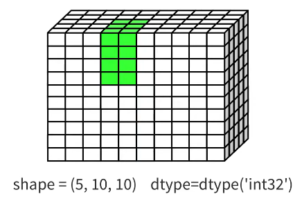

# HDF5

[HDF5 - Official Website](https://www.hdfgroup.org/solutions/hdf5/)

[HDF5 可视化工具 - Official Website](https://www.hdfgroup.org/download-hdfview/)

HDF5 (Hierarchical Data Format version 5)
1. 旨在 存储 & 组织 大量数据的 文件格式
2. Python 中，通常使用 `h5py` 库

HDF5 的核心结构
1. HDF5 文件主要由 2种对象 组成
   1. **Groups** (组) : 类似于 **文件夹**，可以包含 其他组 或 数据集
   2. **Datasets** (数据集) : 类似于 **文件**，实际存储 多维数组(eg : NumPy 数组)
   3. **Attributes** (属性) : 类似于 **文件描述**，可以给 Group 或 Dataset 添加 元数据

Chunk 说明
1. HDF5 文件不仅要存数据，还要存 索引表(**B-Tree**)，记录 chunk 位置
2. `create_dataset` 时候，可以用 chunk 指定 chunk_shape (硬盘的视角)
3. ==如果 使用压缩(GZIP, LZF 等)，就必须 Chunk==
4. ==I/O 的最小单位是一个 Chunk==
   1. 系统会计算 切片(Slicing)请求 落在了哪些物理 Chunk 上，定位 Chunk 存储位置，加载 & 裁剪
5. **==Contiguous Storage(连续存储)==** : 如果不开启 Chunking，HDF5 会使用
   1. 最快的读取方式，计算 offset 使用 `fseek` 指针跳转，比 Chunking 还快，因为没有查找 Chunk 索引的开销
   2. 缺点 : 文件没法变大(不能 append 数据)，不能压缩

Pros
1. 高效的 I/O
   1. 支持 切片读取(Slicing)，不需要完整加载整个文件到内存，可以只取出一部分
   2. 
   3. 所以一个 HDF5 文件可以很大
2. 层级化管理
3. 支持 压缩 & 分块(Chunking)
   1. 内置 透明的(Transparent) 压缩功能，写入时设置压缩，读取时它会自动解压
      1. 写入时 : 只需要在 创建 数据集(Dataset)时 声明 压缩方式，压缩信息也会存在 HDF5 文件的 Header 中
      2. 读取时 : 不需要知道 文件被压缩，会读取 文件 Header，自动调用 解压
   2. 分块 可以 优化数据的 存储布局，使得 按行读取/按列读取 的速度达到最优
4. 自带 元数据(metadata，**Attribute**)
5. 跨平台 & 通用性
   1. 工业标准
   2. Python、MATLAB、C++、Java、R 等语言都能无缝读取

HDF5 中，文件对象 (**f**) 本身 (`with h5py.File('simple.h5', 'w') as f`)，就是一个 Group(根目录 `/`)，因此可以直接创建 dataset

