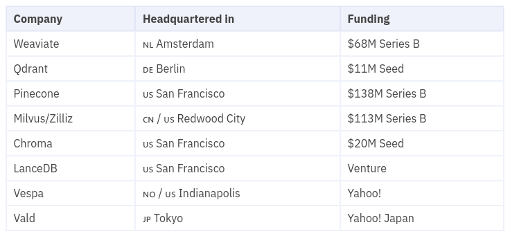
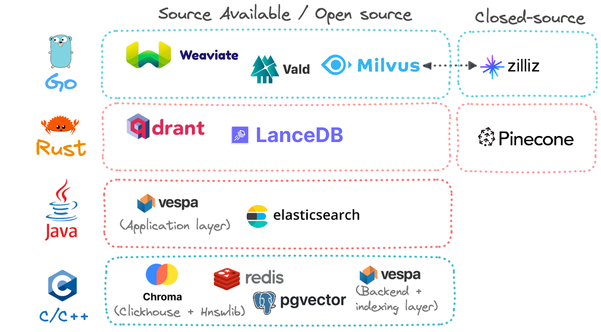
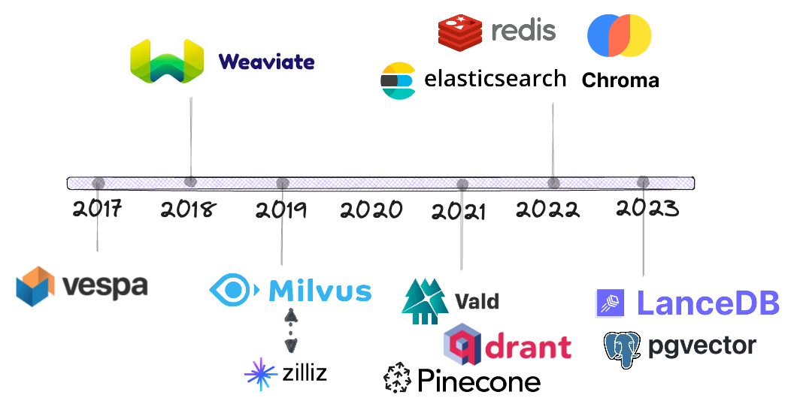
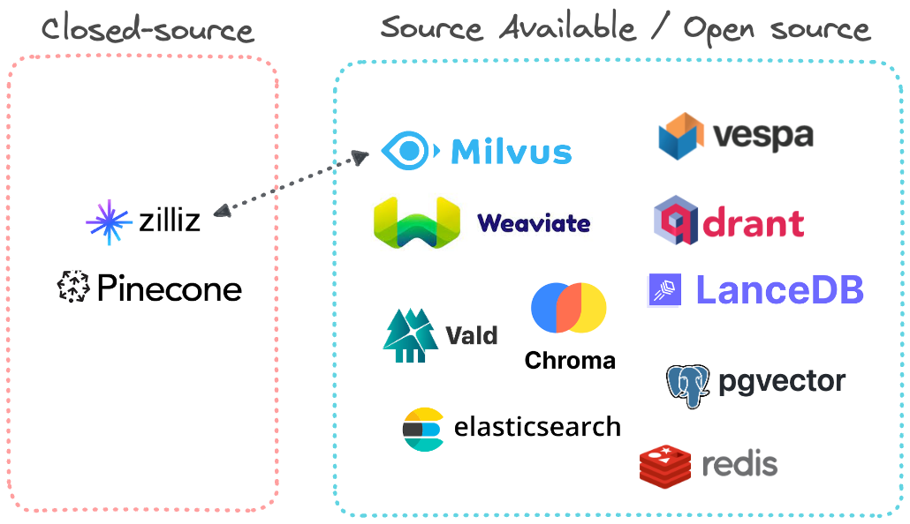
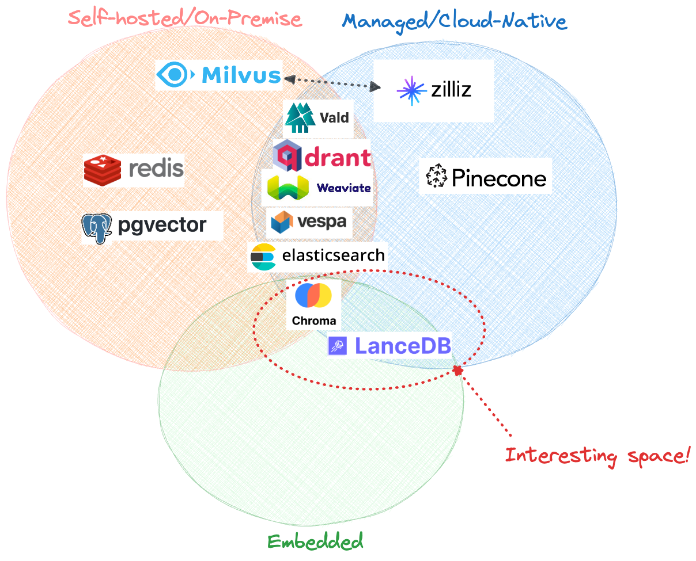
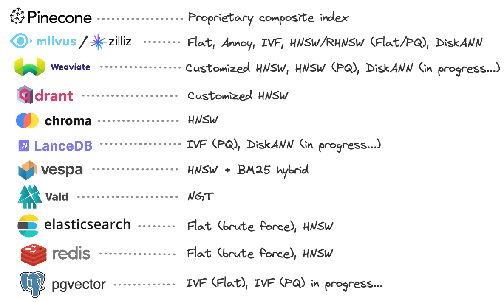

# Vector Database 向量数据库

## Table of Contents

- [Vector Database 向量数据库](#vector-database-向量数据库)
  - [Table of Contents](#table-of-contents)
- [向量数据库 - Data Quarry](#向量数据库---data-quarry)
  - [Vector databases (1): What makes each one different?](#vector-databases-1-what-makes-each-one-different)
  - [Vector databases (2): Understanding their internals](#vector-databases-2-understanding-their-internals)

---

# 向量数据库 - Data Quarry

## Vector databases (1): What makes each one different?

[Vector databases (1): What makes each one different?](https://thedataquarry.com/posts/vector-db-1/)

**Trade-Off**
1. hybrid 混合搜索 --- keyword search 关键字搜索
2. on-premise 本地部署 --- cloud-native
3. open source 开源 --- fully managed 完全托管

**常见向量数据库**
1. [Weavaite](https://weaviate.io/)
   1. Amazing documentation
   2. very easy to get up and running via Docker
   3. offering both keyword and vector search functionality
   4. fast query
2. [Qdrant](https://qdrant.tech/)
   1. great documentation
   2. get up and running via Docker with ease
   3. built entirely in Rust, offers APIs that developers can tap into via its Rust, Python and Golang clients
3. [Pinecone](https://www.pinecone.io/)
   1. fully cloud-native
4. Milvus/Zilliz
5. [Chroma - Github](https://github.com/chroma-core/chroma)
6. LanceDB
7. Vespa
8. Vald
9.  [Faiss Wiki - Github](https://github.com/facebookresearch/faiss/wiki)
10. [nmslib - Github](https://github.com/nmslib/nmslib)

**编程语言**

来越多的数据库社区正在接受 Rust 🦀

**时间线**

**开源 & 闭源**
1. Pinecone 完全闭源
2. Zilliz 闭源商业解决方案，但它完全建立在 Milvus 之上

**托管方式**
1. 本地
2. 云原生

嵌入式模式，在这种模式下，数据库本身以无服务器方式与应用程序代码紧密耦合

**索引方法**

[Hierarchical Navigable Small World (HNSW) graphs](https://www.pinecone.io/learn/series/faiss/hnsw/)

[DiskANN(Microsoft) - Github](https://github.com/microsoft/DiskANN)

## Vector databases (2): Understanding their internals

[Vector databases (2): Understanding their internals](https://thedataquarry.com/posts/vector-db-2/)
