# MySQL

[toc]

## Portals

[宋红康 MySQL数据库](https://www.bilibili.com/video/BV1iq4y1u7vj)

## 数据库概述与MySQL

### 数据库简介

由瑞典 MySQL AB 公司创立

**为什么使用数据库**
1. 持久化 persistence 将数据存储到硬盘加以“固化”
2. 持久化的主要作用是将内存中的数据存储在关系型数据库中
3. 存储在数据库中而不存储在文件中，因为数据库的结构可以更复杂，支持的类型多种多样（大文本、图片、字符串），同时可以存储的数据量更大。（条目数、丰富度）

**数据库相关概念**
1. 数据库：DB Database：存储数据的仓库，文件系统
2. 数据库管理系统 DBMS Database Management System：操纵管理数据库的软件
3. 结构化查询语言 SQL Structured Query Language：与数据库通信的语言

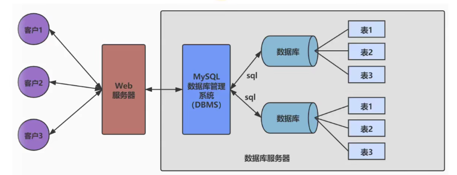

**常见数据库管理系统**
1. Oracle（商用 Relational RDBMS 关系型 不开源）
2. MySQL
   1. 开源的关系型数据库管理系统
   2. 支持大学数据库
   3. 支持多种编程语言
3. MongoDB
4. Microsoft SQL Server
5. Redis
6. PostgreSQL


**RDBMS和非RDBMS**

Relational,Document,Key-Value,Search Engine

RDBMS（主流）
1. 将复杂的数据结构归结为二维表格形式
2. 按照行row和列column的形式存储数据，一系列行和列称为表，一组表组成一个库database
3. 表与表之间的数据记录有关系。现实世界中的各种实体之间的各种联系均用**关系模型**来表示。
4. 便于复杂查询、事务支持（多线程安全性）

非RDBMS
1. RDBMS的阉割版本（“舍得”）
2. 基于键值对存储数据，不需要经过SQL层的解析
3. 减少不常用功能，进一步提高性能
4. 种类
   1. 键值型 Redis
   2. 文档型 MongoDB 可以存放获取文档，可以是XML、JSON格式
   3. 搜索引擎 Solr 核心：“倒排索引”
   4. 列式存储、行式存储 HBase 降低系统I/O
   5. 图形型 存储图形关系的数据库

### 关系型数据库设计规则
1. 典型数据结构：**数据表**（结构化的）
2. 将数据放在表中，表放在库中
3. 数据库中有多个表，表有自己的名字用于标识
4. 表具有特性，定义了数据在表中如何存储（**类**）

**表、记录、字段**

E-R模型 entity-relationship：实体集、属性、联系集

ORM思想（Object Relational Mapping）：数据库中的一个表table对应于一个实体集（类class），表中的一条数据（一行row）对应类的对象（实体instance、记录record），表中的一列column对应类中的属性attribute（字段field）。

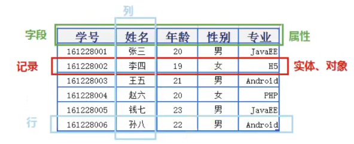

**表的关联关系**

四种：一对一、一对多、多对多（包括多对一）、自我引用

1. 一对一关系：实际应用不多，因为可以创建成一张表，但是为了节省I/O和内存占用，从设计上应该分拆为常用和不常用。
2. 一对多关系：客户订单表、分类商品表、部门员工表。主表、从表。
3. 多对多关系：必须创建第三个表（**联结表**），将多对多关系划分为两个一对多关系。多对多体现在联结表中。通过联结表关联。
   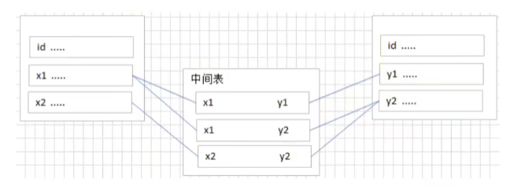
4. 自我引用（Self Reference）：员工的主管也是公司员工，也有自己的主管

### MySQL环境搭建

四个MySQL位置
1. 软件安装位置
2. 数据库位置
3. 服务
4. 环境变量

**MySQL的卸载**
1. 停止MySQL服务
2. 卸载软件，通过windows控制面板或其他软件或使用自身的Installer卸载
3. 数据文件不会随着软件的卸载而被删除，自行决定删除或保留
4. 删除环境变量
5. 可能需要删除服务和注册表（8.0版本不需要手动删除注册表，其他版本可能需要regedit）
6. 重启电脑

**MySQL的下载、安装、配置**

官方提供MySQL Workbench图形界面管理工具

[MySQL官网下载](https://dev.mysql.com/downloads/mysql/)

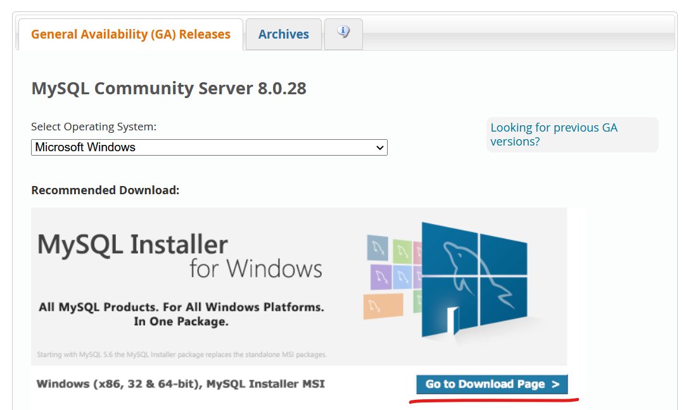

推荐下载.msi文件而不是.zip，这样可以省去安装后的配置步骤。

如果需要历史版本，点击Archives即可

安装时双击.msi文件，选择custom

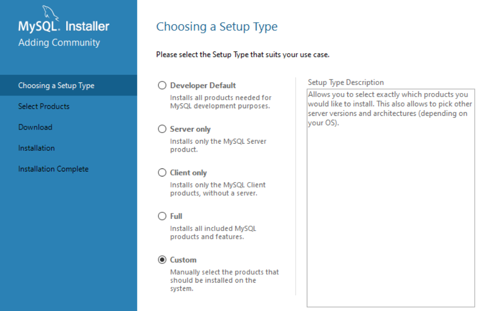

选择需要添加的组件，选中右侧方框中的组件，并点击Advanced Options进行软件安装位置和文件存储位置的配置。（路径中不要有中文）

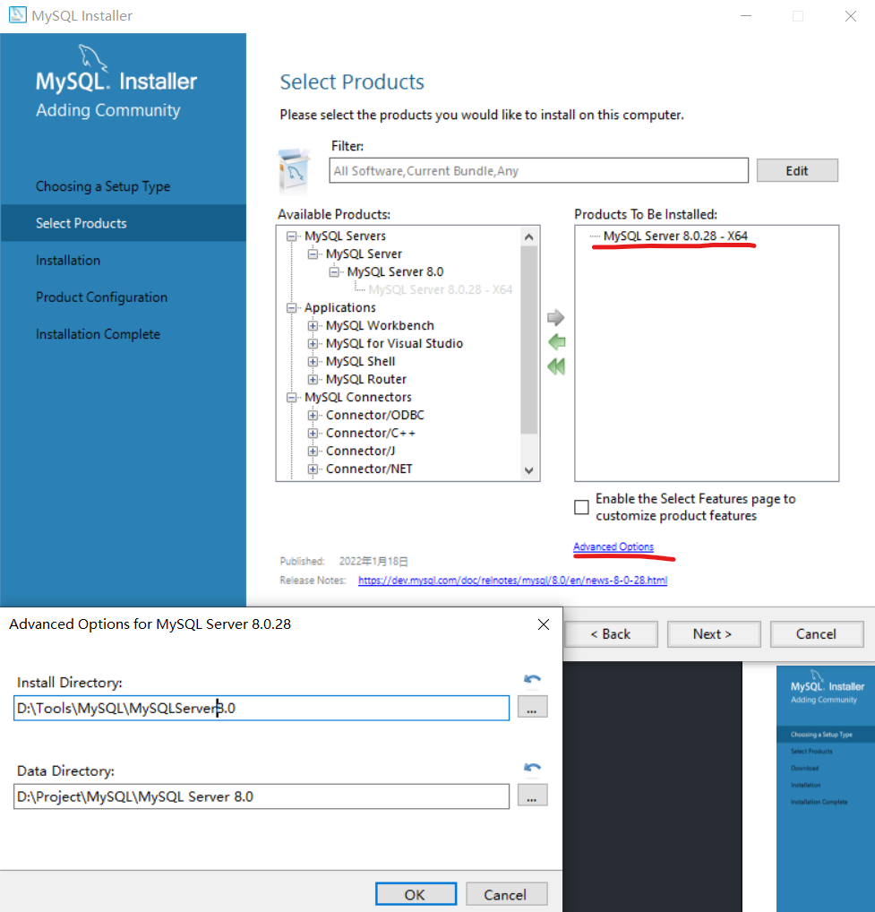

选择Config Type为Development Computer。端口号尽量不要修改，但是如果安装多个版本，则需要手动修改。

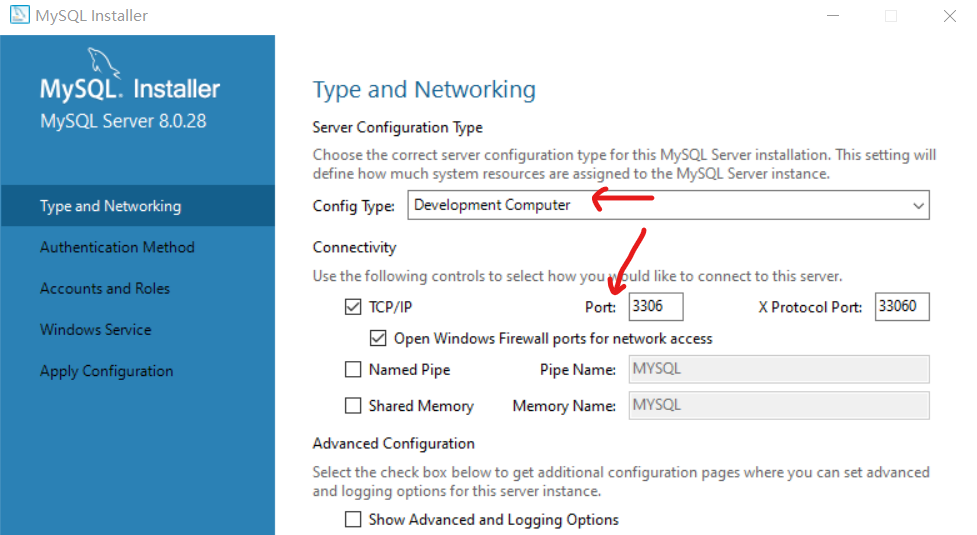

之后，设置Root用户密码

一路继续

最后还需要配置环境变量，将安装软件位置中bin的文件夹位置添加进环境变量即可。

```sql
查看version

mysql --version

登录数据库

mysql -u[root] -p[Password]

password可以不直接在中括号中写

退出数据库
quit
```
```sql
如果想要访问不同版本的数据库，可以通过端口号

mysql -u[root] -P[Port] -p
```

```sql
想要访问其他ip下的数据库

mysql -u[root] -P[Port] -hlocalhost -p

mysql -u[root] -P[Port] -h127.0.0.1 -p

mysql -u[root] -P[Port] -h[要访问的数据库ip] -p
```

**MySQL的登录**
1. 服务的启动与停止
   1. 使用图形化界面，在服务中启动与停止
   2. 用管理员运行cmd，然后net start/stop mysql80
2. 自带客户端的登录与推出
   1. MySQL自带的命令行工具
   2. Windows的命令行工具

**MySQL的常见操作**

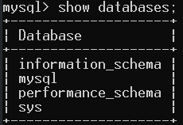

```sql
show databases;
查看databases
```

四个自带的数据库服务器
1. information_schema 保持数据库服务器的系统信息、名称、存储权限
2. mysql 运行时的系统信息、字符集
3. performance_schema 监控性能指标
4. sys 存储性能指标

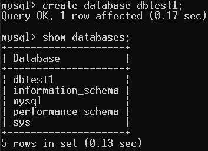

```sql
create database [dbname];
创建名为[dbname]的数据库
```

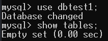
```sql
use [dbname];
使用名为[dbname]的数据库
show tables;
查看正在使用中的数据库中的所有表格
```

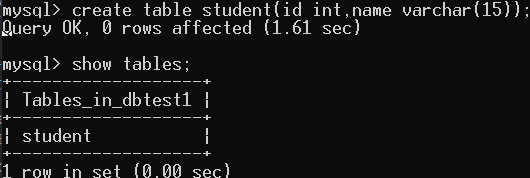
```
create table [tablename(...)]
创建table，并指定其参数类型
```


```sql
select * from [tablename];
查看所有数据
```

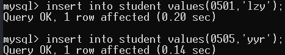
```sql
insert into [tablename] values(...);
插入一条数据（可重复）
8.0版本values中可以出现中文，而5.7等版本不行，因为字符集问题
```

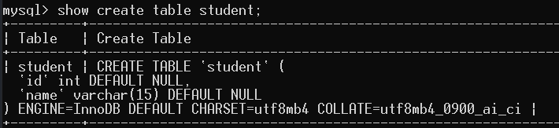

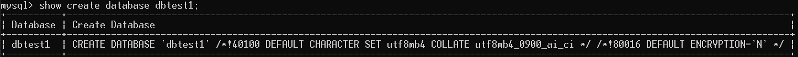

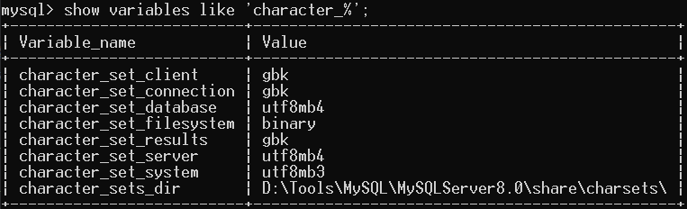

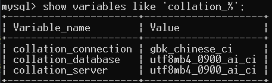
```sql
show create table [tablename];
show create database [dbname];
show variables like 'character_%';
show variables like 'collation_%';
可以查看字符集
```

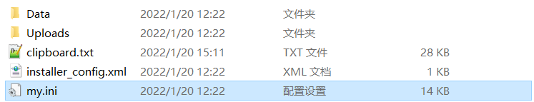

若要修改字符集，在my.ini中修改[mysql]和[mysqld]中的default即可。my.ini在数据库数据位置。再重启服务

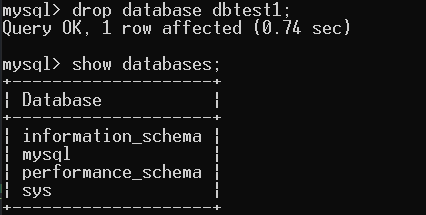
```sql
drop databases [dbname]
删除数据库
```

### 图形化管理工具

1. Workbench
2. Navicat
3. SQLyog
4. DBeaver

使用DBeaver的时候，在导航栏中的插头图标上点一下，输入用户名和密码即可。

使用MySQL8.0版本在设置时，由于使用高级加密方式导致使用GUI工具连接不上，如下图所示。

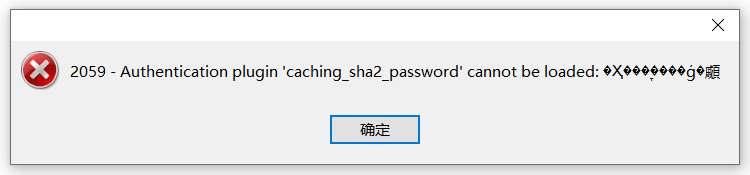

解决方案：

```sql
use mysql;

ALTER USER 'root'@'locolhost' IDENTIFIED WITH mysql_native_password BY '[yourpassword]';

FLUSH PRIVILEGES;
```

### 其他内容

**无论是命令行还是GUI都是通过网络的方式访问数据库。（客户端访问服务器）**

如果需要修改字符集可以通过alter语句

```sql
alter table [tablename] charset [aim_charset];  
alter database [dbname] charset [aim_charset];  
例子：utf8
```

## 基本的SELECT语句

### SQL概述

**SQL背景知识**

结构化查询语言 Structured Query Language

不同数据库生产厂商都支持SQL语言，但都有特定内容。

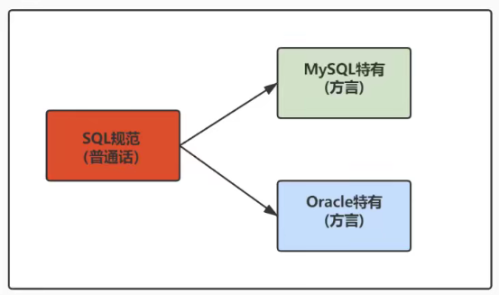

SQL是一门ANSI的标准计算机语言，用来访问和操作数据库系统。SQL语句用于取回和更新数据库中的数据。

不幸地是，存在着很多不同版本的SQL语言，但是为了与ANSI标准相兼容，它们必须以相似的方式共同地来支持一些主要的关键词（比如SELECT、UPDATE、DELETE、INSERT、WHERE等等）。

**SQL分类**

1. **DDL** 数据定义语言（对数据库结构进行操作） （**用于定义不同的数据库、表、视图、索引等数据库对象，还可以用来创建、删除、修改数据库和数据表的结构**）
   1. CREATE(table view index)从无到有创建
   2. ALTER 修改
   3. DROP 删除（结构）
   4. RENAME 重命名
   5. TRUNCATE 清空 表的数据，但表的结构还在（adj. 截短的；被删节的  vt. 把…截短；缩短；[物]使成平面）
2. **DML** 数据操作语言（针对一条条记录） 使用频率最高 （**用于增删改查，添加、删除、更新、查询数据库记录，并检测数据完整性**）
   1. INSERT 添加记录
   2. DELETE 删除记录
   3. UPDATE 修改
   4. SELECT 查询 （数据查询 DQL） （重中之重）
3. **DCL** 数据控制语言 控制操作 （**用于定义数据库、表、字段、用户权限、安全级别**）
   1. COMMIT 提交（事务控制 TCL）
   2. ROLLBACK 回滚（事务控制 TCL）
   3. SAVEPOINT 设置保存点
   4. GRANT 赋予权限
   5. REVOKE 回收权限

### SQL的语言规范

**基本规则**
1. 每条命令以分号结束（单条语句执行可以不用分号，但是多条必须加分号）
2. 关键字不能被缩写或者分行写
3. 列的别名尽量使用双引号，不建议省略as

**基本规范（尽量遵守）**
1. 在Windows环境中，大小写不敏感
2. 在Linux环境中，大小写敏感
   1. 数据库名，表名，表的别名，变量名严格区分大小写
   2. 关键字，列名，列的别名，函数名忽略大小写
3. 推荐关键字、函数名、绑定变量都大写

**注释**
1. 单行：井号 #（**或者--加一个空格**（通用））
2. 多行：/* */（**多行注释不能嵌套**）

**命名规则**

数据库、表名不得超过30个字符

### 数据导入指令

1. 命令行 source 文件的全路径名（只能在命令行执行）
   ```sql
   在命令行中执行
   source D:\Project\MySQL\SourceSQL\atguigudb.sql
   ```
   如果没有在图形化工具中出现，右键数据库F5进行刷新即可
   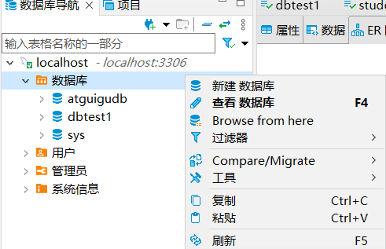
2. 基于具体的图形化界面工具
   对于DBeaver软件，在一个数据库中右键添加即可
   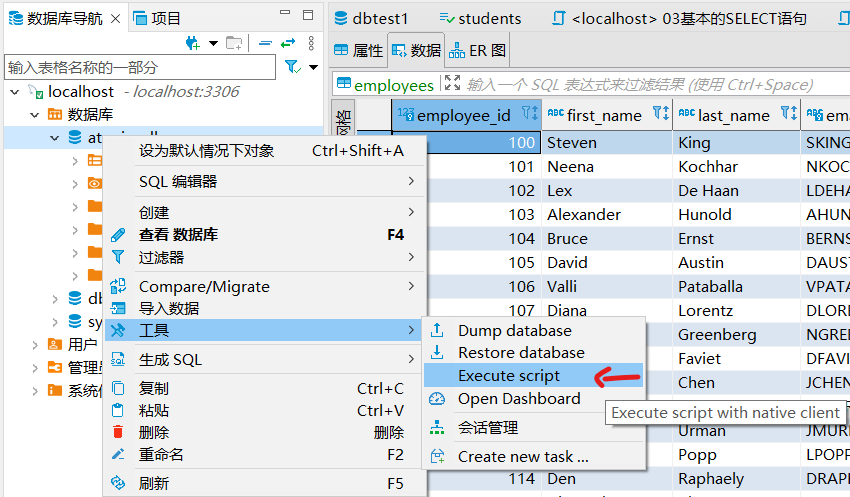


### 基本的SELECT语句

**SELECT**

```sql
SELECT 字段1,字段2 FROM 表名;  # 最后一个字段后不加逗号

# dual：伪表

SELECT * FROM 表名; # *表示所有的字段（列）

SELECT 列1,列2 FROM 表名;

# 查询语句的结果称为结果集result_ set
```

**列的别名**

as：alias ，可以省略

别名中有中文也可以

方法：
1. AS（可加可不加）
2. 双引号（别名中间有空格必须加）
3. mysql也支持单引号，但最好还是按照规范使用双引号（定义字符串的时候最好使用单引号）

```sql
SELECT 列名1 别名1,列明2 AS 别名2 FROM 表名;

```

**去除重复行**

加关键字**distinct**（adj. 截然不同的, 完全分开的）

```sql
SELECT DISTINCT 列名1,列名2 FROM 表名;
# distinct 管好几个列 （这几个列都相同就不显示）
```

**空值NULL参与运算**

空值NULL不等同于0，NULL表示不知道

空值参与运算，结果一定是NULL

可以用IFNULL运算（一种解决null参与运算结果为null的解决方案）
```sql
IFNULL(列名,number)
# 当作一个变量写入整个表达式中
```

**着重号**

\`

应该保证字段没有和保留字、数据库系统或常用方法冲突。

如果坚持使用，在SQL语句中使用着重号\`。（前后各加一个，一对着重号将字段包住）

普通字段加了着重号也不会错

```sql
SELECT `列名` FROM `表名`;
```

**查询常数**

```sql
SELECT 'const varchar',const_number FROM 表名;
```

可以是数也可以是字符串。

在查询结果的每一行都匹配常量。


**显示表结构**

显示了表中字段的详细信息

```sql
DESCRIBE 表名;

DESC 表名;

# 两者效果一致，后者相当于缩写
```

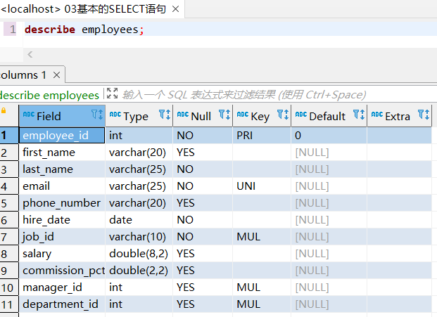

刻画了表中字段的详细信息

Type是数据类型

Null表示是否允许为空

Key刻画约束

Default默认值

**过滤数据**

只想查询满足某些条件的数据（过滤）

**WHERE一定要写在FROM后面，且必须挨在一起**

```sql
SELECT 列名1 FROM 表名 WHERE 列名2=xxx;
# 如果查询字符串，记得加引号。
# 也不一定是等于，大于小于也可以
```

windows中大小写不敏感，列名表名大小写无所谓。如果WHERE中查询字符串最好保证大小写和表中的符合（mysql不严谨导致大小写都无所谓）

### 运算符

**算数运算符**

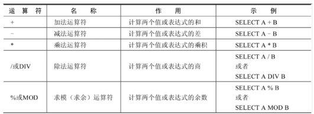

/除完保留小数部分和整数部分，而DIV只保留整数部分（小数部分直接舍去）

整形除以整形，mysql默认转为浮点型

分母不能为0，否则结果为NULL

驱魔运算符，结果正负和被模数相同，与模数无关

**比较运算符**

比较的结果为真则返回1，假则返回0，其他情况返回NULL

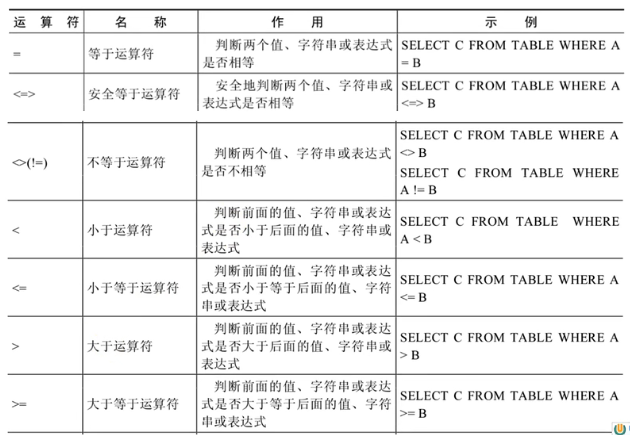

一般字符串隐式转换会变为数值，如果不能隐式转换，则当作0（0='a'为真）

只要有null参与运算，结果就为null

不能通过xxx=null来筛选空值（不会有任何结果，需要通过安全等于进行查询）

安全等于可以对NULL进行判断（null<=>null）

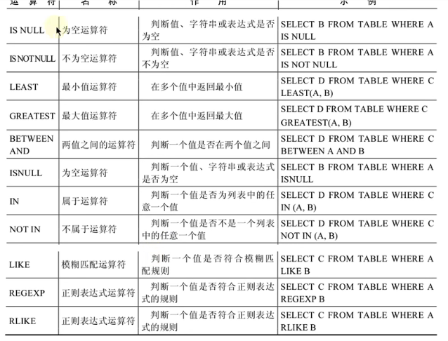

安全等于和isnull（is null）类似，没空格相当于一个函数，没有空格为关键字

LEAST（求最小值）、GREAST（求最大值）、LENGTH（求长度）

BETWEEN...AND包含边界，而且一定要从小到大，否则查询不到数据（可用>=、&&、<=代替）（可以在BETWEEN之前加入NOT）

IN和NOT IN后面跟一个集合，离散查找。集合用小括号（）

LIKE模糊查询。eg:查询last_name包含字符'a'的员工信息(select xxx from xxx where xxx like "%x%")
1. 百分号%代表不确定个数的字符（包括0个）
2. 下划线_代表一个不确定的字符
3. 转义字符\

REGEXP RLIKE 正则表达式（精确操作）记得用单引号将正则表达式包起（在DBeaver中如果要使用\w等类似内容似乎需要多写一个\否则查询不到数据）


**逻辑运算符**

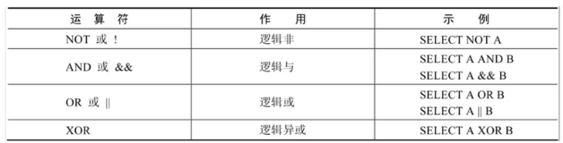

逻辑运算符在比较前左右就是真和假

非0看作1

运算符两边的条件都是完整的，不能缩写

and的优先级高于or

**位运算符**

使用频率较低

左移右移，补零，超出位置舍去

**运算符的优先级**

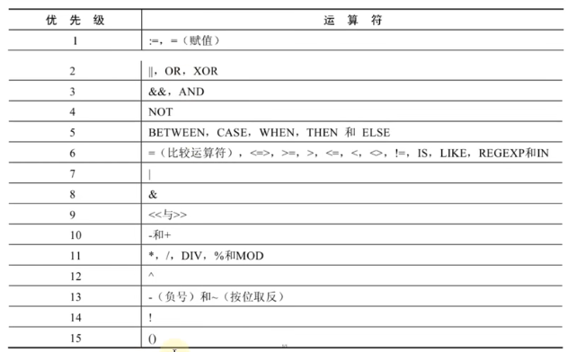

越下面优先级越高

### 排序与分页

**排序**

默认顺序是数据添加的顺序

使用**ORDER BY**对查询到的数据进行排序，需要指明是升序还是降序（默认升序）。（在order by xxx 之后加）
1. 升序：ASC（ascend）
2. 降序：DESC（descend）（和describe的desc相同）

可以使用列的别名进行排序，但是**不能在where中使用列的别名**。如果同时出现where和order by，where应该在前。

另外order by的排序字段并不一定是select中的查询字段。

真实的执行流程是先from，再where，接着select，最后order by。（这也解释了为什么where不能用别名）

**二级排序**

排列后，有相同的情况，需要再次进行排序。

```sql
select employee_id , salary , department_id 
from employees 
order by department_id desc , salary asc;

select employee_id , salary , ifnull(department_id,-1) 
from employees 
order by department_id desc , salary asc;
```

再多级类似，再后面添加逗号，标签，升降序即可。

**分页**

查询返回记录太多，查看不方便。实现分页查询

limit实现分页

```sql
SELECT xxx
FROM xxx
LIMIT 偏移量,条目数;  -- 偏移量=0的时候可以省略

-- 公式：LIMIT (pageNO-1)*pageSize, pageSize;  // No从1开始
-- 公式：LIMIT pageNO*pageSize, pageSize;  // No从0开始
```

声明顺序：where...order by...limit(不是实际执行顺序)

mysql8.0新特性支持将逗号用OFFSET关键字进行替代（注意偏移量和条目数的位置也进行了调换）

约束返回结果的数量可以减少数据表的网络传输量，提升查询效率。


```sql
// 查询邮箱中包含e的员工信息，并按邮箱的字节数降序，再按部门号升序
use atguigudb;

select employee_id ,email ,department_id 
from employees
where email like '%e%'  -- regexp '[e]'
order by length(email) desc, department_id asc;
```

### 多表查询

将需要多个sql语句合成一个。减少网络传输量。

将数据拆分为多个表可以减少io，减少内存开销，增加并发性（否则一个人在查询时，其他人无法查询）。

**笛卡尔积的错误**

```sql
SELECT last_name, department_name
FROM employees, departments;
-- 这是错误的，每个员工都与每个部门进行了匹配
-- 出现笛卡尔积（交叉连接），将所有的可能都列了出来

SELECT last_name, department_name
FROM employees CROSS join departments;
-- 和上面的方式相同
```

错误出现的条件：
1. 省略多个表的连接条件
2. 连接条件无效
3. 所有表的所有行连接

为了避免笛卡尔积，可以在where中加入有效的连接条件

如果显示ambiguous，需要通过加.的方式显式指明。如果单独纯在可以不指明。从sql优化的角度，建议多表查询都指明所在的表。（省去数据库服务器的查询）

**可以给表起别名**

在from中起别名，在select和where中使用（而且必须要用别名（原名被覆盖了））。


**正确的多表查询**
需要加上连接条件

```sql
SELECT last_name, department_name
FROM employees CROSS join departments
WHERE employees.department_id = departments.department_id;

-- 缺少一种情况，department_id为NULL的情况
```

```sql
SELECT employees.employee_id, departments.department_id, locations.location_id, locations.city
FROM employees, departments, locations
WHERE employees.department_id = departments.department_id AND departments.location_id = locations.location_id
ORDER BY employees.employee_id ASC;
```
**如果有n个表实现多表的查询，至少需要n-1个连接条件**，否则一定会出现笛卡尔积的错误

p27

### 子查询

