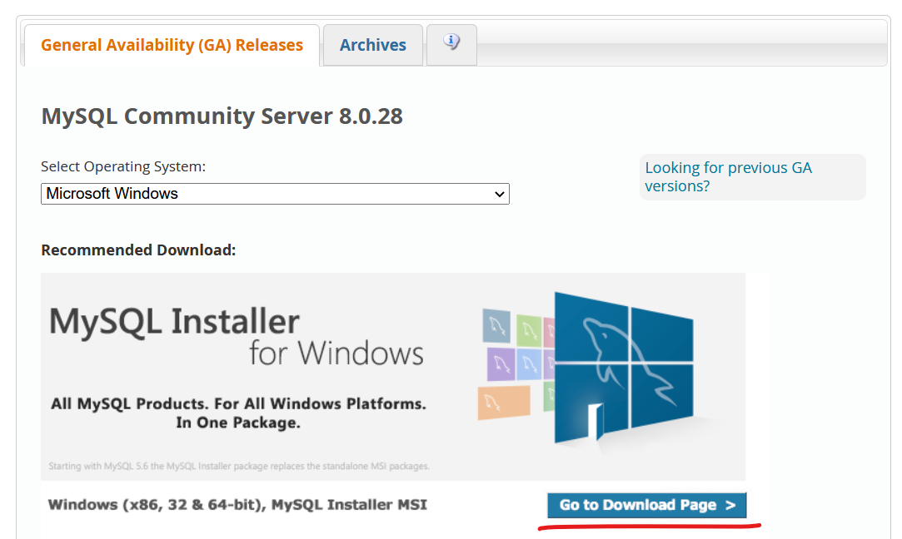
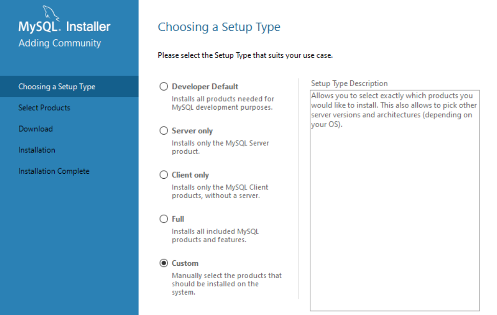
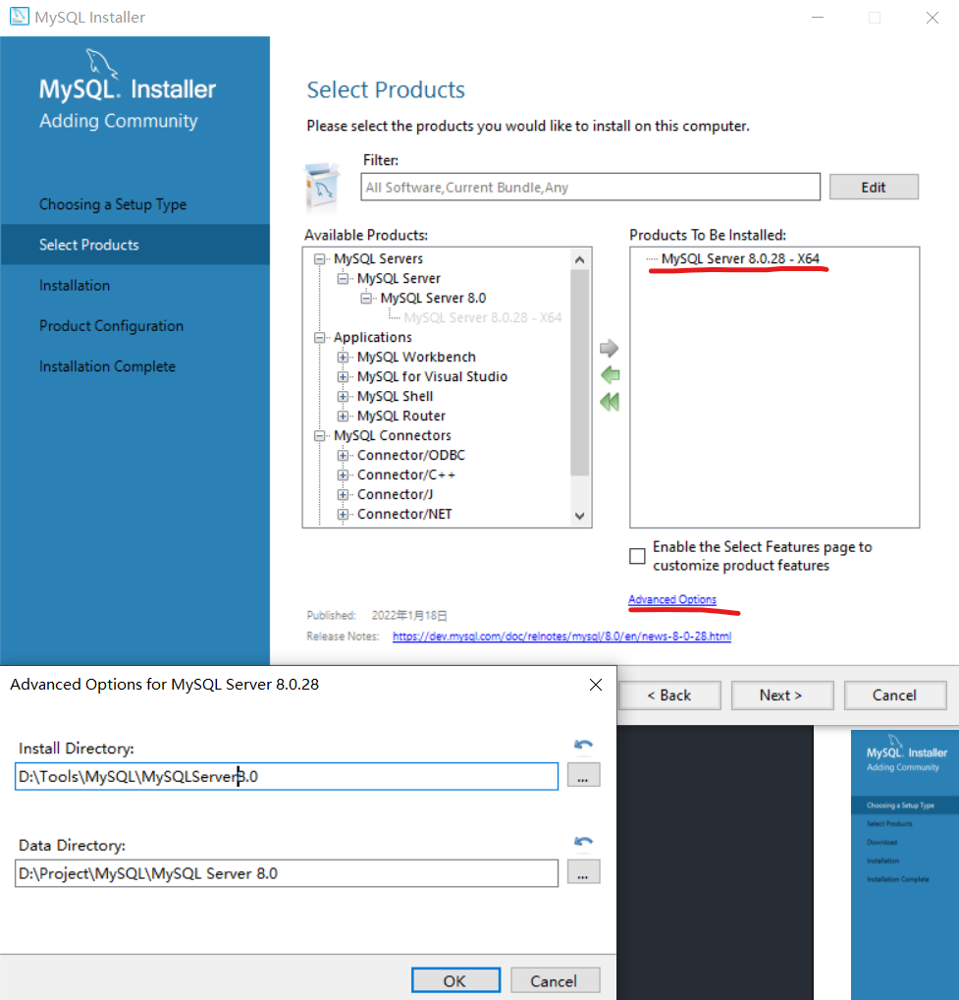
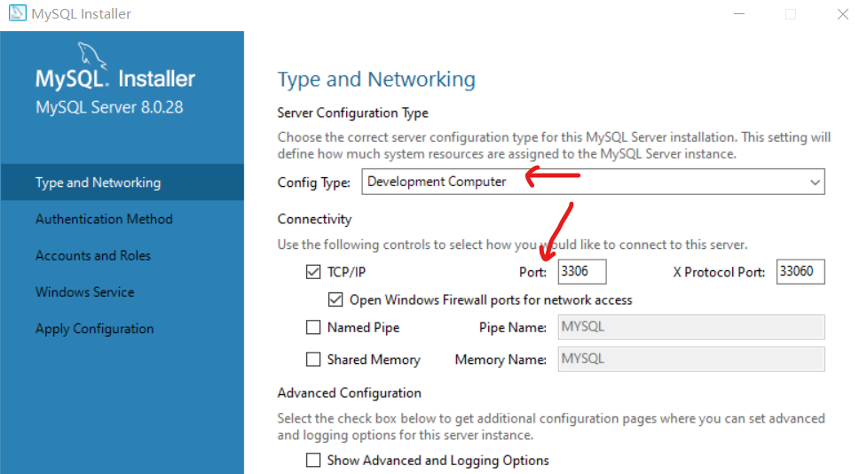

# MySQL环境搭建

**四个MySQL位置**
1. 软件安装位置
2. 数据库位置
3. 服务
4. 环境变量

**MySQL的卸载**
1. 停止MySQL服务
2. 卸载软件，通过windows控制面板或其他软件或使用自身的Installer卸载
3. 数据文件不会随着软件的卸载而被删除，自行决定删除或保留
4. 删除环境变量
5. 可能需要删除服务和注册表(8.0版本不需要手动删除注册表，其他版本可能需要regedit)
6. 重启电脑

**MySQL的下载、安装、配置**

官方提供MySQL Workbench图形界面管理工具

[MySQL官网下载](https://dev.mysql.com/downloads/mysql/)



推荐下载.msi文件而不是.zip，这样可以省去安装后的配置步骤。

如果需要历史版本，点击Archives即可

安装时双击.msi文件，选择custom



选择需要添加的组件，选中右侧方框中的组件，并点击Advanced Options进行软件安装位置和文件存储位置的配置。（路径中不要有中文）



选择Config Type为Development Computer。端口号尽量不要修改，但是如果安装多个版本，则需要手动修改。



之后，设置Root用户密码

一路继续

**最后还需要配置环境变量，将安装软件位置中bin的文件夹位置添加进环境变量即可。**

```sql
查看version

mysql --version

登录数据库

mysql -u[root] -p[Password]

password可以不直接在中括号中写

退出数据库
quit
```
```sql
如果想要访问不同版本的数据库，可以通过端口号

mysql -u[root] -P[Port] -p
```

```sql
想要访问其他ip下的数据库

mysql -u[root] -P[Port] -hlocalhost -p

mysql -u[root] -P[Port] -h127.0.0.1 -p

mysql -u[root] -P[Port] -h[要访问的数据库ip] -p
```

**MySQL的登录**
1. 服务的启动与停止
   1. 使用图形化界面，在服务中启动与停止
   2. 用管理员运行cmd，然后net start/stop mysql80
2. 自带客户端的登录与推出
   1. MySQL自带的命令行工具
   2. Windows的命令行工具
