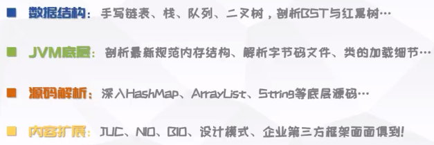
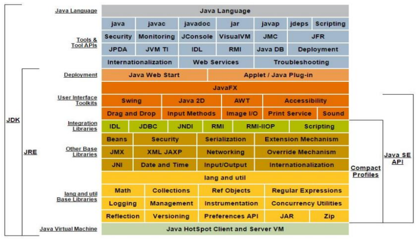

# Java

目录
[toc]

# 尚硅谷Java零基础全套视频教程2023版 --- 宋红康

[尚硅谷Java零基础全套视频教程2023版 --- 宋红康](https://www.bilibili.com/video/BV1PY411e7J6/)

## 第01章 Java语言概述

### 4 人机交互方式

GUI --- graphical user interface

CLI --- command line interface

### 5 计算机编程语言

高级语言按照程序设计方法
1. 面向过程
2. 面向对象(更高级)

Talk is cheap, show me the code.

### 6 Java语言概述

是 SUN (Stanford University Network，斯坦福大学网络公司) 1995 年推出的一门高级编程语言。

James Gosling -> 创造Oak -> 改造为Java

LTS 长期支持版本 -> 8、11、17

Java技术体系平台
1. JavaSE 
   1. (standard edition)
   2. 桌面级
2. JavaEE 
   1. (enterprise edition)
   2. 服务器、Web
3. JavaME 
   1. (micro edition)
   2. 移动终端
   3. != Android

JDK
1. Java Development Kit
2. 包含 JRE & 开发工具集

JRE
1. Java Runtime Environment
2. 包含 JVM & 核心类库

## 第02章 变量与运算符

## 第03章 流程控制语句

## 第04章 IDEA的安装与使用

## 第05章 数组

## 第06章 面向对象编程(基础)

## 第07章 面向对象编程(进阶)

## 第08章 面向对象编程(高级)

## 第09章 异常处理

## 第10章 多线程

## 第11章 常用类与基础 API

## 第12章 集合框架

## 第13章 泛型

## 第14章 数据结构与集合源码

## 第15章 File类与IO流

## 第16章 网络编程

## 第17章 反射机制

## 第18章 JDK8-17新特性

