# PostgreSQL

[toc]

## Portals

[PostgreSQL官网](https://www.postgresql.org/)

[零基础入门PostgreSQL教程（短）](https://www.bilibili.com/video/BV1tL41177av)

[PostgreSQL教程](https://www.bilibili.com/video/BV1tL41177av)

# PostgreSQL教程

## PostgreSQL历史

免费的对象关系数据库服务器（ORDBMS）。BSD许可证。去O。

1986年，加州大学伯克利分校。当时被叫做：Berkley Postgres Project。

纯社区，没有被商业公司控制

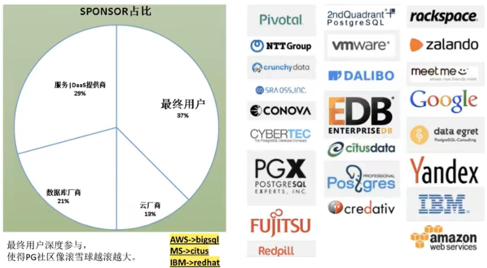

## MySQL和PostgreSQL的优势

PG采用堆表存放，MySQL采用索引组织表。支持比MySQL**更大的数据量**

**对SQL标准的实现更加完善**，功能实现比较严谨

对表连接支持较为完整，优化器功能完整，支持的索引类型多，复杂查询能力强

PG支持JSON和NoSQL功能

## 安装

就正常下一步下一步。可能有输入账号和密码。（安装完成自带一个图形化界面：pgAdmin 4 以及一个命令行工具）

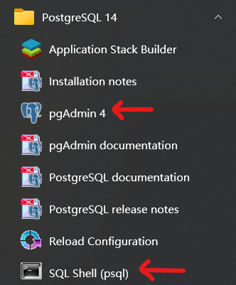

默认用户是postgres。（一般默认是这个）

如果想要其他设备进行连接需要修改一个配置文件，然后重启服务。

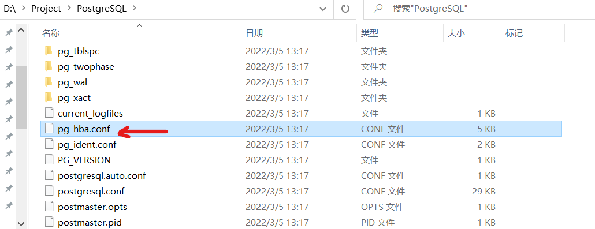

PostgreSQL 默认端口  5432

可以将软件安装目录中的bin目录添加进环境变量，方便后续使用。


**远程访问配置**

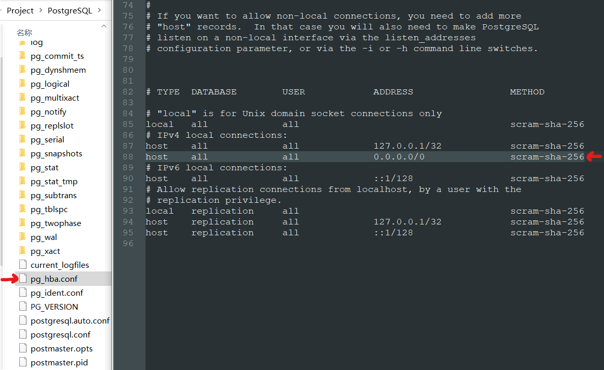

在pg_hba.conf文件中添加一行即可。注意不是数据库软件安装的位置，而是相应数据文件夹所在位置。

修改完配置文件，需要重启服务。

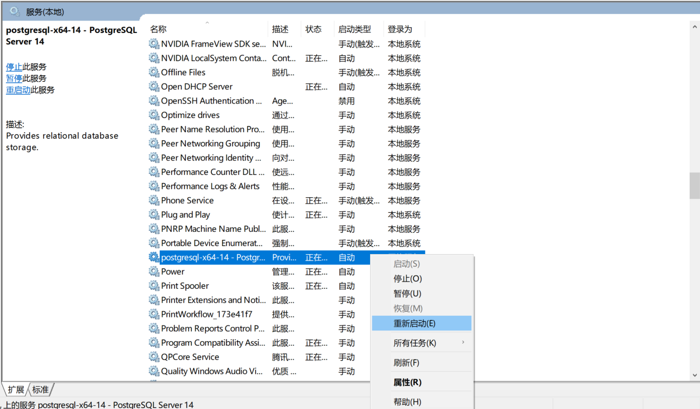


在DBeaver中连接需要对postgre进行一些配置
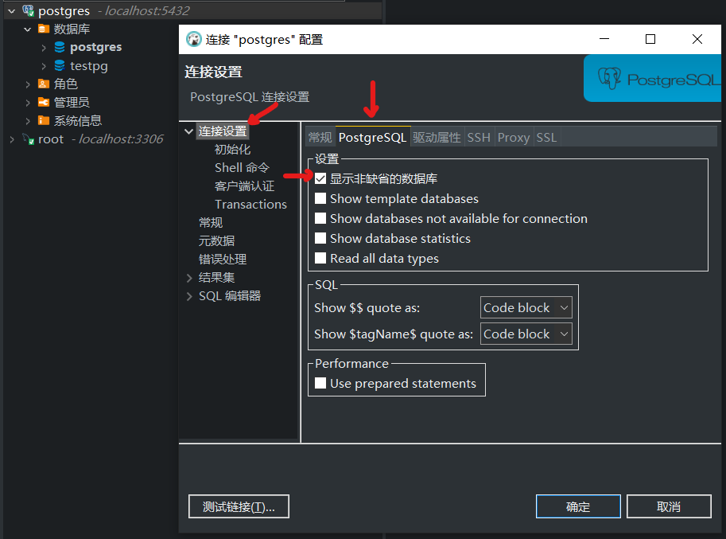


## PostgreSQL基本使用

### 数据库操作
```
CREATE DATABASE testPG; //其实是创建了一个schema

drop DATABASE testPG; //删除数据库
```

### 命令行操作
```
\q：退出命令行

\l：列出所有数据库

\c + [db_name]：切换数据库

\d：查看数据库下所有的表

\d + [table_name]：查看建表信息

\du：查看用户信息
```

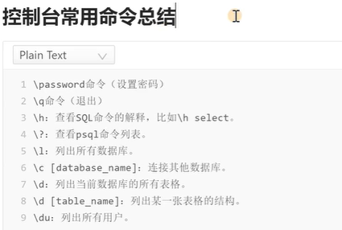

### 数据库表操作
数据类型
1. 数值数据类型
2. 字符串数据类型
3. 日期/时间数据类型

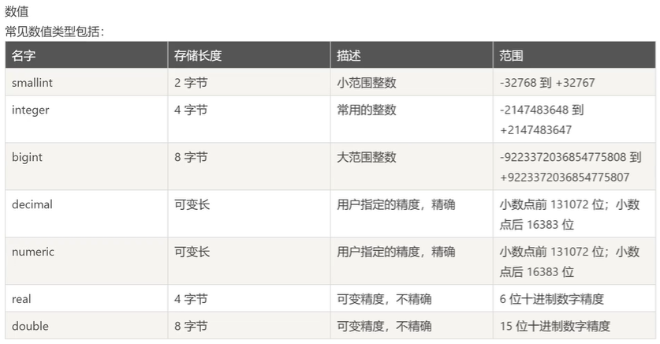


金额一般使用decimal


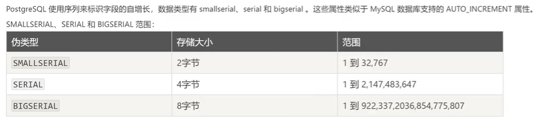

```
CREATE TABLE student(id serial PRIMARY KEY ,name varchar(35));//serial表示自增，同时建表时不需要指定int

insert into student(name) values('lzy');
insert into student(id,name) values(5,'yyr');

select * from student;

DROP TABLE student;
```

### Schema
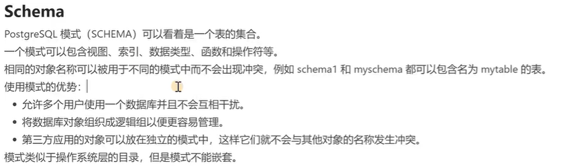

相当于命名空间

同一个数据库中可以有多个schema，方便表进行分别管理

```
create schema lzyschema;

CREATE TABLE lzyschema.student(id serial PRIMARY KEY ,name varchar(35));
```

首先创建一个模式，然后使用"."的方式将表创建在schema中。

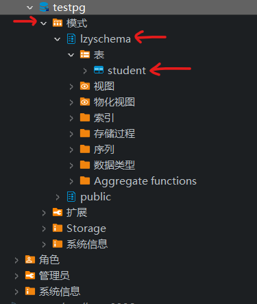


### 备份PostgreSQL数据库

**单数据库**

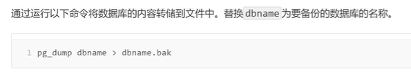

windows中需要加入"-U postgres"，随后输入口令（密码）

```
pg_dump -U postgres [db_name] > [new_db_name]
```

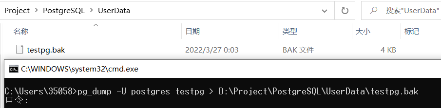

恢复数据库需要先创建一个空数据库，然后将之前备份的内容进行导入

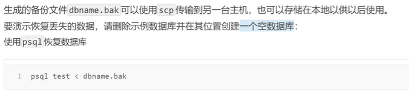

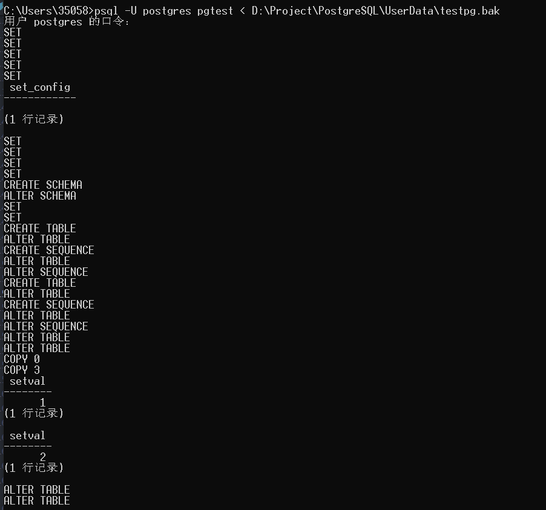 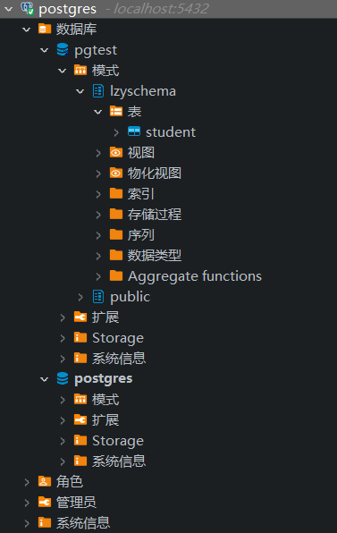

**所有数据库**

gp_dump同时只能备份一个数据库。为了解决这个问题，就要使用pg_dumpall工具，它备份每个数据库和角色、表空间定义。

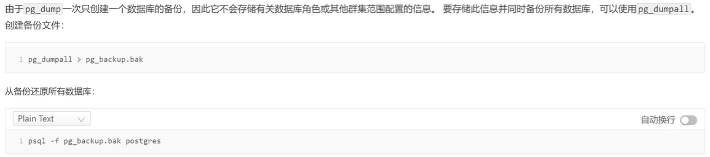

恢复时，只需写 psql -U postgres -f [all.bak] 即可，不需要指定数据库postgres

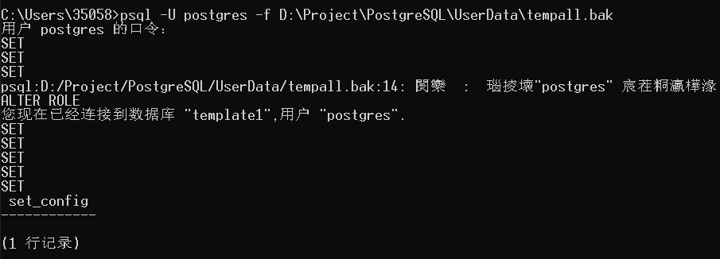

正常恢复结果

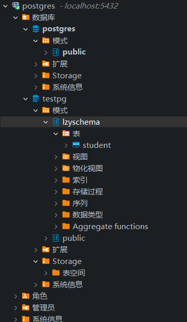

### 用户操作

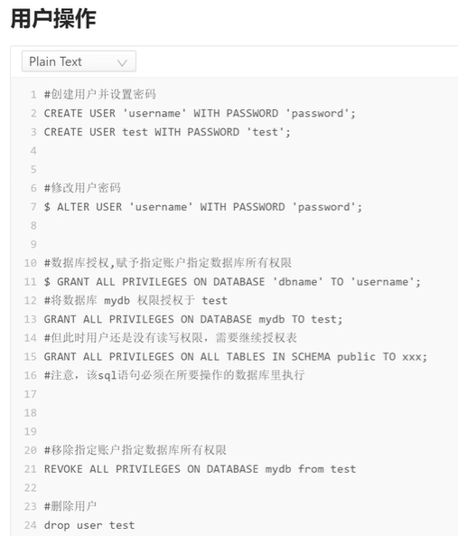

# 相关知识

## PostgreSQL全球概况

[PostgreSQL 全球概况介绍](https://www.bilibili.com/video/BV13r4y1z78r)

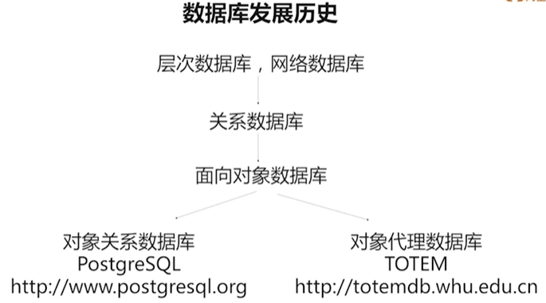

层次型数据库为树结构，网络数据库为网结构（效率高）

随后诞生，关系型数据库，表的关系运算。但不适用于复杂的数据类型。

由此诞生面向对象数据库，但是因为封装后的对象不能自由的重组（不够灵活），所以并未获得成功。

对象关系数据库，将面向对象数据库和关系数据库相结合。复杂的使用面向对象数据库，简单的使用关系型数据库。

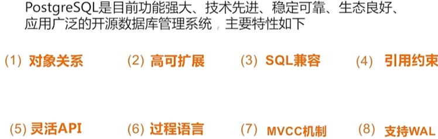

**发展历史**
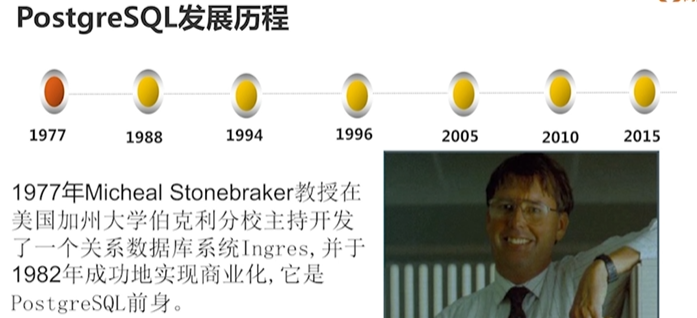
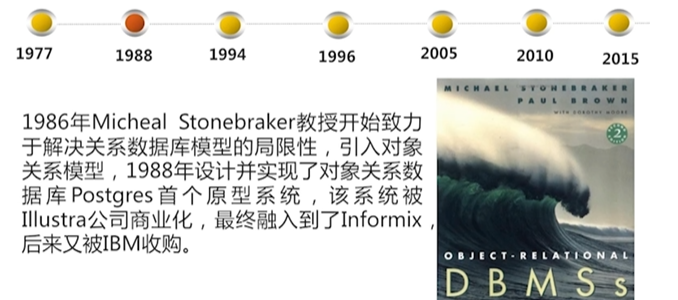
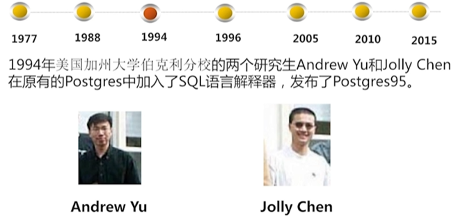
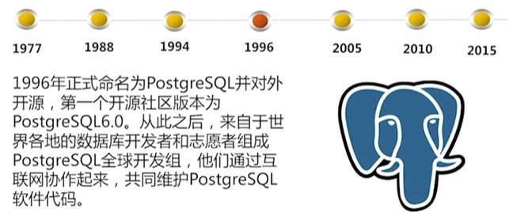
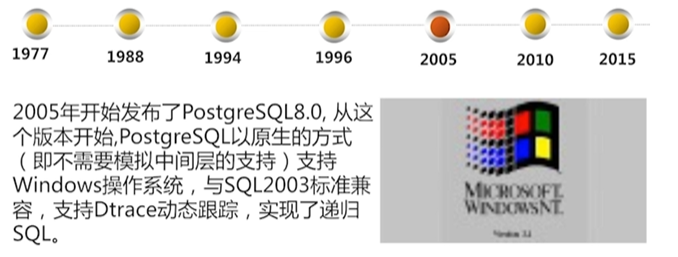
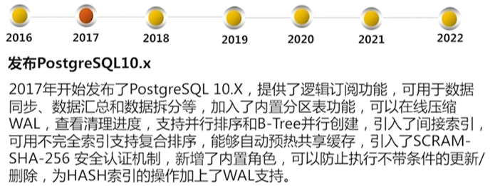

**核心技术**
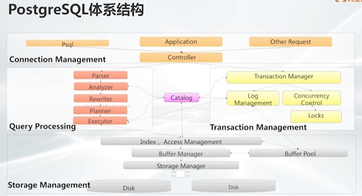

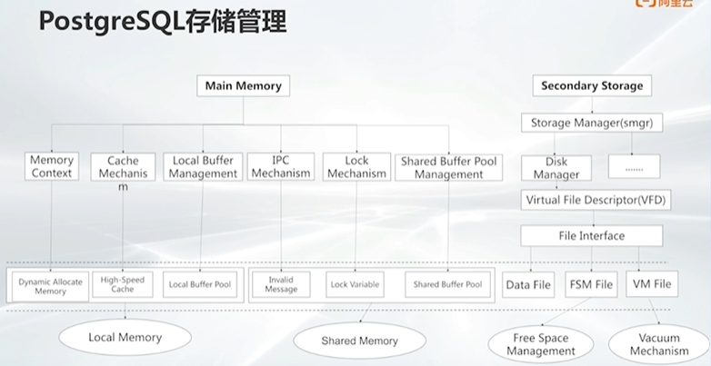

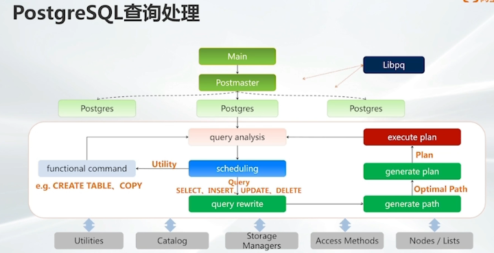

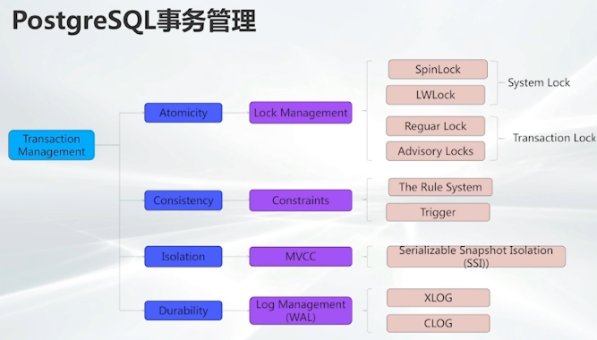

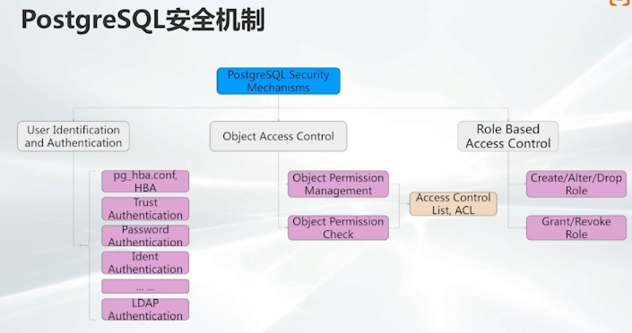

