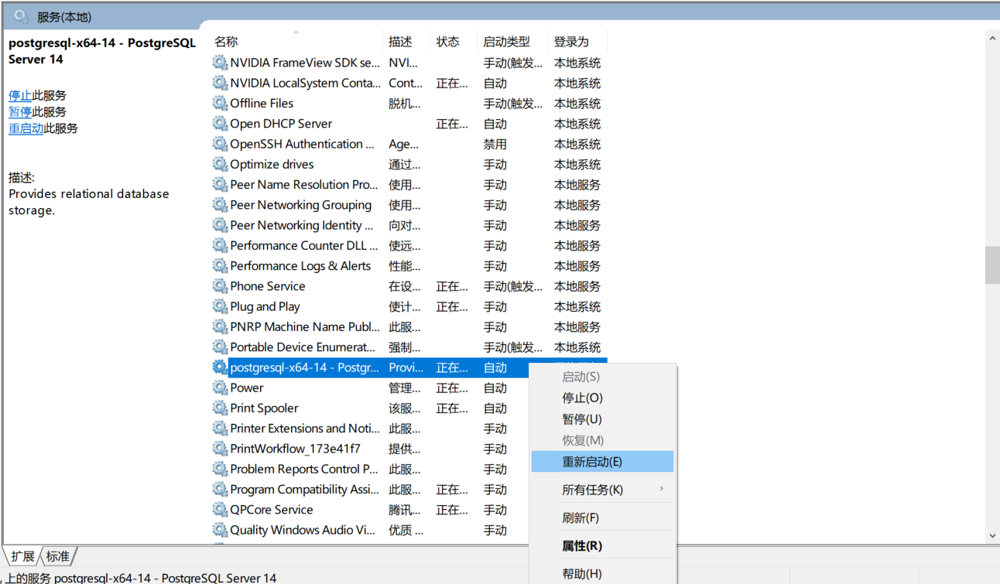

# PostgreSQL

[toc]

## Portals

[PostgreSQL官网](https://www.postgresql.org/)

[零基础入门PostgreSQL教程（短）](https://www.bilibili.com/video/BV1tL41177av)

[PostgreSQL教程](https://www.bilibili.com/video/BV1tL41177av)

[菜鸟教程 PostgreSQL教程](https://www.runoob.com/postgresql/postgresql-tutorial.html)

# PostgreSQL教程

## PostgreSQL历史

免费的对象关系数据库服务器（ORDBMS）。BSD许可证。去O。

1986年，加州大学伯克利分校。当时被叫做：Berkley Postgres Project。

纯社区，没有被商业公司控制


## MySQL和PostgreSQL的优势

PG采用堆表存放，MySQL采用索引组织表。支持比MySQL**更大的数据量**

**对SQL标准的实现更加完善**，功能实现比较严谨

对表连接支持较为完整，优化器功能完整，支持的索引类型多，复杂查询能力强

PG支持JSON和NoSQL功能

## 安装

就正常下一步下一步。可能有输入账号和密码。（安装完成自带一个图形化界面：pgAdmin 4 以及一个命令行工具）


默认用户是postgres。（一般默认是这个）

如果想要其他设备进行连接需要修改一个配置文件，然后重启服务。


PostgreSQL 默认端口  5432

可以将软件安装目录中的bin目录添加进环境变量，方便后续使用。


**远程访问配置**


在pg_hba.conf文件中添加一行即可。注意不是数据库软件安装的位置，而是相应数据文件夹所在位置。

修改完配置文件，需要重启服务。




在DBeaver中连接需要对postgre进行一些配置


## PostgreSQL基本使用

### 数据库操作
```
CREATE DATABASE testPG; //其实是创建了一个schema

drop DATABASE testPG; //删除数据库
```

### 命令行操作
```
\q：退出命令行

\l：列出所有数据库

\c + [db_name]：切换数据库

\d：查看数据库下所有的表

\d + [table_name]：查看建表信息

\du：查看用户信息
```


### 数据库表操作
数据类型
1. 数值数据类型
2. 字符串数据类型
3. 日期/时间数据类型


金额一般使用decimal


```
CREATE TABLE student(id serial PRIMARY KEY ,name varchar(35));//serial表示自增，同时建表时不需要指定int

insert into student(name) values('lzy');
insert into student(id,name) values(5,'yyr');

select * from student;

DROP TABLE student;
```

### Schema


相当于命名空间

同一个数据库中可以有多个schema，方便表进行分别管理

```
create schema lzyschema;

CREATE TABLE lzyschema.student(id serial PRIMARY KEY ,name varchar(35));
```

首先创建一个模式，然后使用"."的方式将表创建在schema中。


### 备份PostgreSQL数据库

**单数据库**


windows中需要加入"-U postgres"，随后输入口令（密码）

```
pg_dump -U postgres [db_name] > [new_db_name]
```


恢复数据库需要先创建一个空数据库，然后将之前备份的内容进行导入


 

**所有数据库**

gp_dump同时只能备份一个数据库。为了解决这个问题，就要使用pg_dumpall工具，它备份每个数据库和角色、表空间定义。


恢复时，只需写 psql -U postgres -f [all.bak] 即可，不需要指定数据库postgres


正常恢复结果


### 用户操作


# 菜鸟教程

PostgreSQL 是一个免费的对象-关系数据库服务器(ORDBMS)，在灵活的BSD许可证下发行。

PostgreSQL 开发者把它念作 post-gress-Q-L。

## 基础

### ORDBMS

**数据库**: 数据库是一些关联表的集合。
**数据表**: 表是数据的矩阵。在一个数据库中的表看起来像一个简单的电子表格。
**列**: 一列(数据元素) 包含了相同类型的数据, 例如邮政编码的数据。
**行**：一行（=元组，或记录）是一组相关的数据，例如一条用户订阅的数据。
**冗余**：存储两倍数据，冗余降低了性能，但提高了数据的安全性。
**主键**：主键是唯一的。一个数据表中只能包含一个主键。你可以使用主键来查询数据。
**外键**：外键用于关联两个表。
**复合键**：复合键（组合键）将多个列作为一个索引键，一般用于复合索引。
**索引**：使用索引可快速访问数据库表中的特定信息。索引是对数据库表中一列或多列的值进行排序的一种结构。类似于书籍的目录。
**参照完整性**: 参照的完整性要求关系中不允许引用不存在的实体。与实体完整性是关系模型必须满足的完整性约束条件，目的是保证数据的一致性。

### 特性

**函数**：通过函数，可以在数据库服务器端执行指令程序。
**索引**：用户可以自定义索引方法，或使用内置的 B 树，哈希表与 GiST 索引。
**触发器**：触发器是由SQL语句查询所触发的事件。如：一个INSERT语句可能触发一个检查数据完整性的触发器。触发器通常由INSERT或UPDATE语句触发。 多版本并发控制：PostgreSQL使用多版本并发控制（MVCC，Multiversion concurrency control）系统进行并发控制，该系统向每个用户提供了一个数据库的"快照"，用户在事务内所作的每个修改，对于其他的用户都不可见，直到该事务成功提交。
**规则**：规则（RULE）允许一个查询能被重写，通常用来实现对视图（VIEW）的操作，如插入（INSERT）、更新（UPDATE）、删除（DELETE）。
**数据类型**：包括文本、任意精度的数值数组、JSON 数据、枚举类型、XML 数据等。
**全文检索**：通过 Tsearch2 或 OpenFTS，8.3版本中内嵌 Tsearch2。
**NoSQL**：JSON，JSONB，XML，HStore 原生支持，至 NoSQL 数据库的外部数据包装器。
**数据仓库**：能平滑迁移至同属 PostgreSQL 生态的 GreenPlum，DeepGreen，HAWK 等，使用 FDW 进行 ETL。

### 数据类型

**数值类型**


**货币类型**


**字符类型**


**日期时间类型**


**布尔类型**


**枚举类型**


还有一些其他的例如：几何类型、网络地址类型（ipv4、ipv6、MAC）、位串类型、文本搜索类型、UUID类型、XML类型、JSON类型。

**数组类型**

**复合类型**

**范围类型**

**对象标识符类型**

**伪类型**

### 创建/选择/删除数据库

创建方式
1. CREATE DATABASE（SQL语句）
2. createdb（对CREATE DATABASE的封装）
3. pgAdmin工具

查看已存在数据库：\l

选择数据库：\c + 数据库名

删除方式
1. DROP DATABASE（SQL语句）
   1. 会删除数据库的系统目录项并且删除包含数据的文件目录
   2. 只能由超级管理员或数据库拥有者执行
   3. 命令需要在 PostgreSQL 命令窗口来执行 
      ```sql
      DROP DATABASE [ IF EXISTS ] name
      //IF EXISTS：如果数据库不存在则发出提示信息，而不是错误信息。
      ```
2. dropdb
3. pgAdmin工具

### 创建/删除表格

**创建表**
```sql
CREATE TABLE table_name(
   column1 datatype,
   column2 datatype,
   column3 datatype,
   .....
   columnN datatype,
   PRIMARY KEY( 一个或多个列 )
);
```
*表名字必需在同一模式中的其它表、 序列、索引、视图或外部表名字中唯一。*

\d查看表格是否创建成功、\d + table_name 查看表格信息。

**删除表**
```sql
DROP TABLE table_name;
```

### 模式 SCHEMA

PostgreSQL 模式（SCHEMA）可以看着是一个表的集合。
一个模式可以包含视图、索引、数据类型、函数和操作符等。
**相同的对象名称可以被用于不同的模式中而不会出现冲突**，例如 schema1 和 schema2 都可以包含名为 my_table 的表。

优势：
1. 允许多个用户使用一个数据库并且不会互相干扰
2. 将数据库对象组织成逻辑组，更容易管理
3. 第三方应用的对象可以放在独立的模式中，这样它们就不会与其他对象的名称发生冲突


创建模式
```sql
CREATE SCHEMA schema_name;
```
在模式中创建表，仅需在表名前加"[schema_name]."即可

删除模式
```sql
//删除一个为空的模式（其中的所有对象已经被删除）
DROP SCHEMA schema_name;

//删除一个模式以及其中包含的所有对象：
DROP SCHEMA schema_name CASCADE;
```

### INSERT INTO 语句

用于向表中插入新记录，可以插入一行也可以同时插入多行。

```sql
INSERT INTO TABLE_NAME (column1, column2, column3,...columnN)
VALUES (value1, value2, value3,...valueN);
```

column1, column2,...columnN 为表中字段名。
value1, value2, value3,...valueN 为字段对应的值。
在使用 INSERT INTO 语句时，字段列必须和数据值数量相同，且**顺序也要对应**。

VALUES后可以接多个()()用逗号隔开即可。


## 高级


# 相关知识

## DBeaver中切换数据库


## PostgreSQL全球概况

[PostgreSQL 全球概况介绍](https://www.bilibili.com/video/BV13r4y1z78r)


层次型数据库为树结构，网络数据库为网结构（效率高）

随后诞生，关系型数据库，表的关系运算。但不适用于复杂的数据类型。

由此诞生面向对象数据库，但是因为封装后的对象不能自由的重组（不够灵活），所以并未获得成功。

对象关系数据库，将面向对象数据库和关系数据库相结合。复杂的使用面向对象数据库，简单的使用关系型数据库。


**发展历史**


**核心技术**


