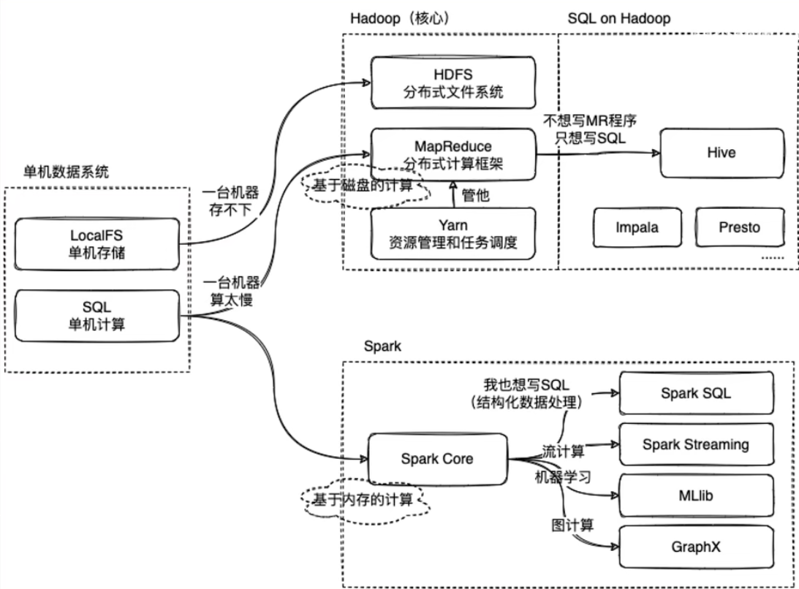
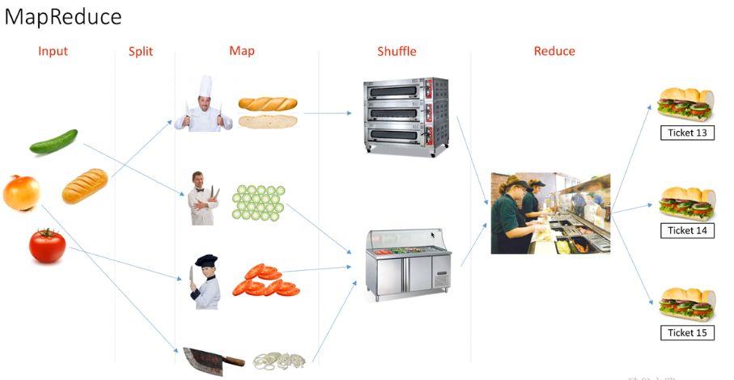
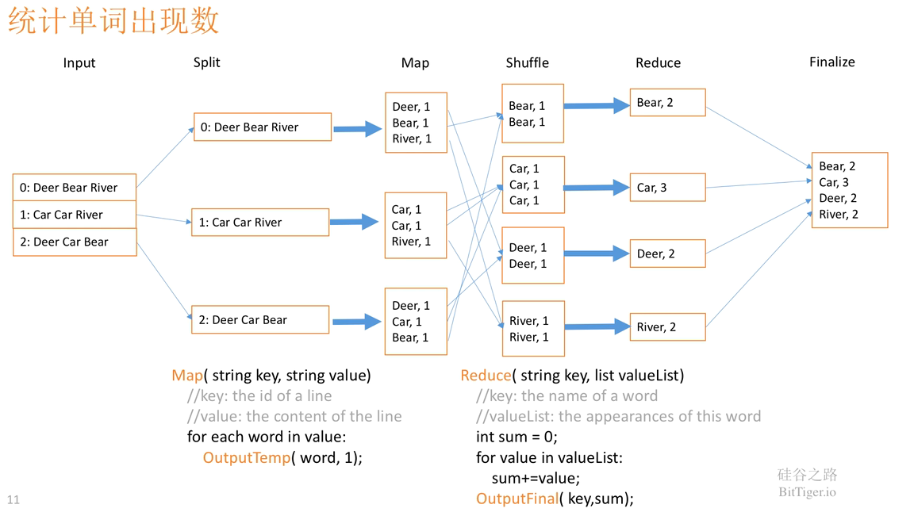
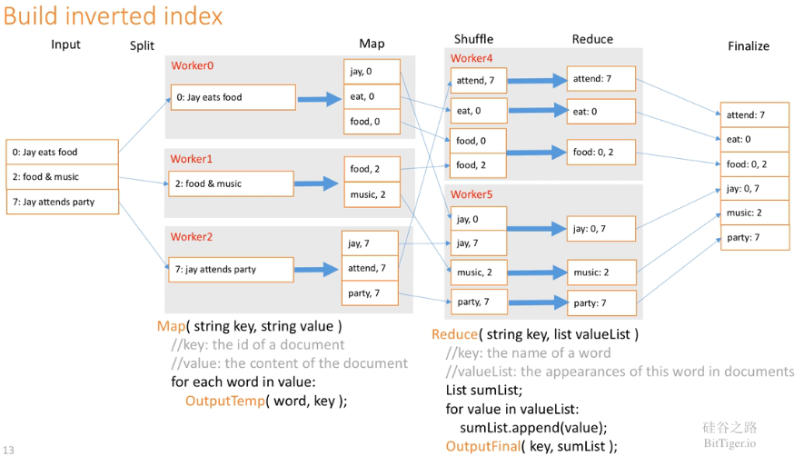
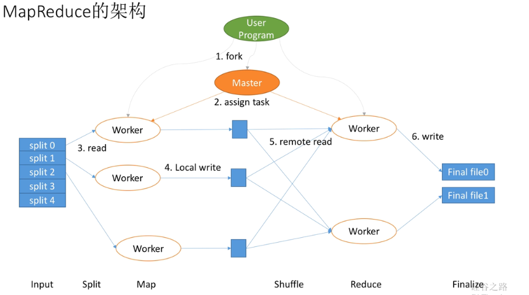
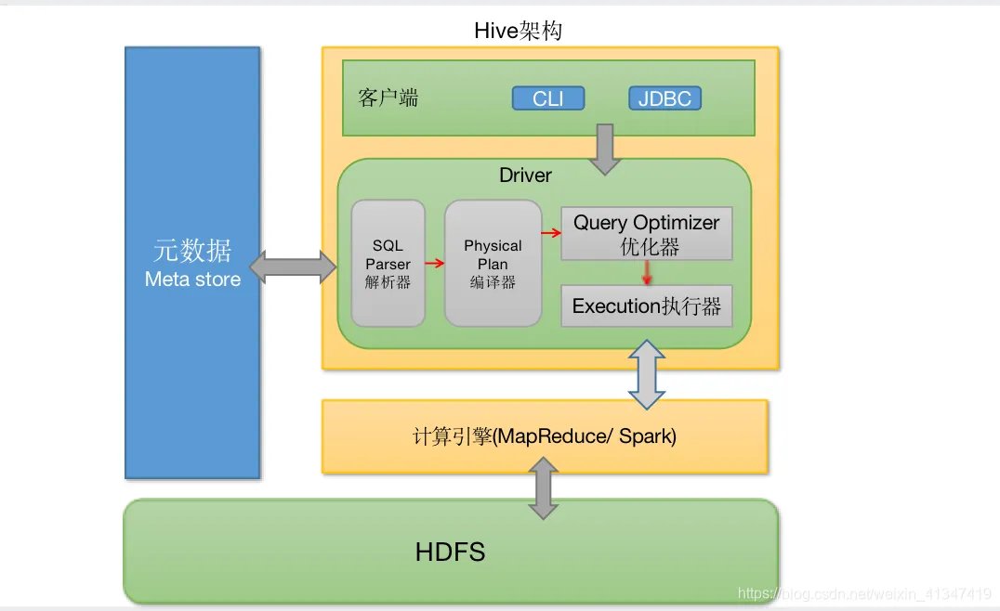

# Hadoop Noob

[toc]

# Portals

[大数据技术生态中，Hadoop、Hive、Spark是什么关系？](https://www.bilibili.com/video/BV1LU4y1e7Ve/)

# 大数据技术生态中，Hadoop、Hive、Spark是什么关系？

Hadoop分布式文件系统(HDFS)是指被设计成适合运行在通用硬件(commodity hardware)上的分布式文件系统（Distributed File System）。统一管理存储空间，提供接口，从外部感觉不到。

HDFS有着高容错性（fault-tolerant）的特点，并且设计用来部署在低廉的（low-cost）硬件上。

而且它提供高吞吐量（high throughput）来访问应用程序的数据，适合那些有着超大数据集（large data set）的应用程序。

HDFS放宽了（relax）POSIX的要求（requirements）这样可以实现流的形式访问（streaming access）文件系统中的数据。

Hadoop引入map-reduce模块，进行计算。任务并行框架。
1. map：分配任务
2. reduce：工作汇总

想在Hadoop上写SQL->产生Hive
Hive的metastore存储结构化信息
将SQL翻译成MapReduce

Hive使得开发效率高了，但是灵活性低了

Spark是一个计算框架（常常和MapReduce对比）
Spark是基于内存的计算，MapReduce是基于磁盘的计算
有SparkSQL模块，在spark上写SQL
其他模块：streaming、MLlib、GraphX

**CPU密集型、IO密集型？**
1. **CPU密集型**也叫计算密集型，指的是系统的硬盘、内存性能相对CPU要好很多，此时，系统运作大部分的状况是CPU Loading 100%，CPU要读/写I/O(硬盘/内存)，I/O在很短的时间就可以完成，而CPU还有许多运算要处理，CPU Loading很高。
2. **IO密集型**指的是系统的CPU性能相对硬盘、内存要好很多，此时，系统运作，大部分的状况是CPU在等I/O (硬盘/内存) 的读/写操作，此时CPU Loading并不高。I/O bound的程序一般在达到性能极限时，CPU占用率仍然较低。这可能是因为任务本身需要大量I/O操作，而pipeline做得不是很好，没有充分利用处理器能力。
3. **CPU密集型**可以理解为 就是处理繁杂算法的操作，对硬盘等操作不是很频繁，比如一个算法非常之复杂，可能要处理半天，而最终插入到数据库的时间很快。
4. **IO密集型**可以理解为简单的业务逻辑处理，比如计算1+1=2，但是要处理的数据很多，每一条都要去插入数据库，对数据库频繁操作。

# MapReduce

[深入浅出讲解 MapReduce  BitTiger](https://www.bilibili.com/video/BV1Vb411m7go/)
[MapReduce一个你最好了解东西](https://www.bilibili.com/video/BV1rS4y1n7PC/)

Map

Shuffle

Reduce

# Hive

[大数据高频面试题：Hive系列](https://www.bilibili.com/video/BV1XY4y1W7ma/)

**是什么**
hive是基于Hadoop的一个数据仓库工具，用来进行数据提取、转化、加载，这是一种可以存储、查询和分析存储在Hadoop中的大规模数据的机制。

hive数据仓库工具能将结构化的数据文件映射为一张数据库表，并提供SQL查询功能，能将SQL语句转变成MapReduce任务来执行。(hiveSQL，将SQL转为MapReduce)

**优缺点**
使用场景：大数据集的静态批处理

Hive的优点是学习成本低，可以通过类似SQL语句实现快速MapReduce统计，使MapReduce变得更加简单，而不必开发专门的MapReduce应用程序。

不适合实时查询，不适合联机事物处理，不适合低延迟。HiveSQL表达能力有限。无法实现数据挖掘。效率低。

调优困难，粒度粗。

**架构**

HDFS存储数据
MapReduce计算引擎
Metastore元数据（描述数据的数据，给数据下定义）：客户端连接metastore服务，metastore再去连接MySQL数据库来存取元数据。有了metastore服务，就可以有多个客户端同时连接，而且这些客户端不需要知道MySQL数据库的用户名和密码，只需要连接metastore 服务即可。

Hive有自带的元数据存储系统，但是一般不会使用它进行存储，而是存在MySQL，可以做到多用户同时访问Hive。

Driver结合元数据将SQL翻译为MapReduce给HDFS执行，最后返回

