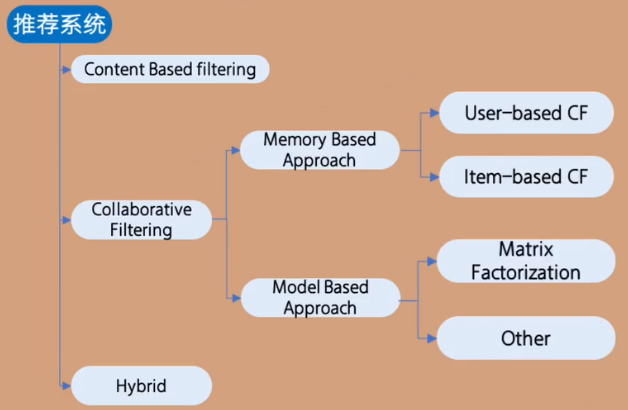
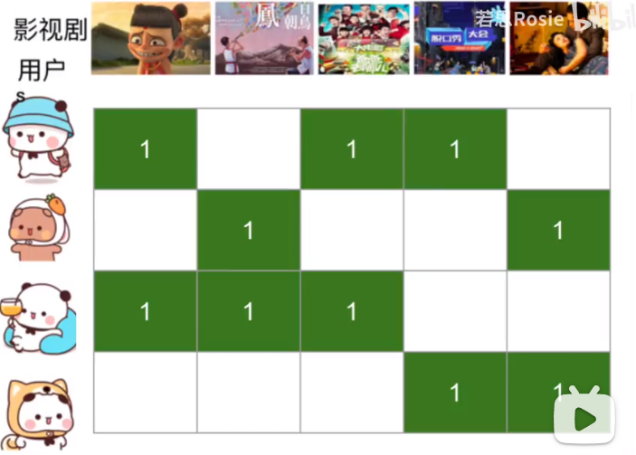
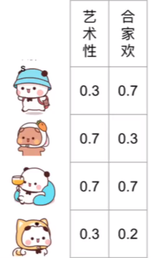
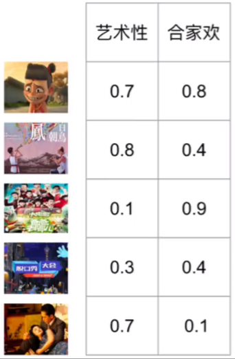
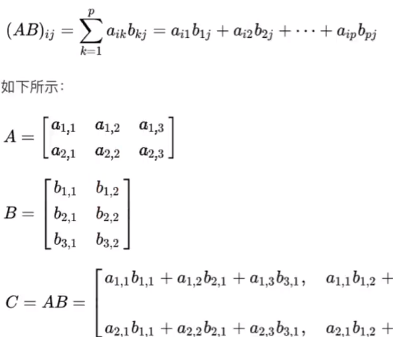
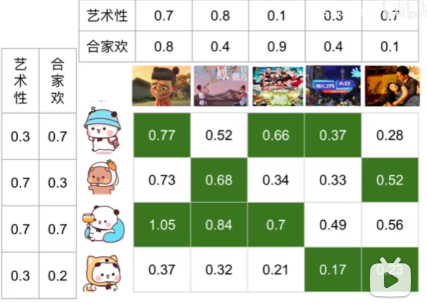
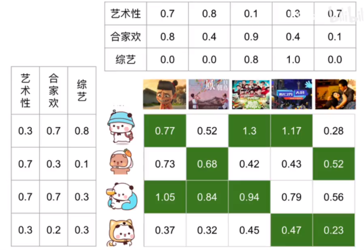
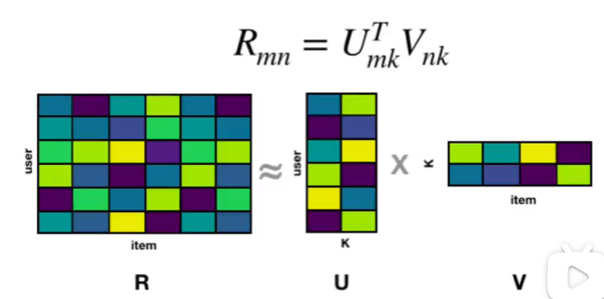
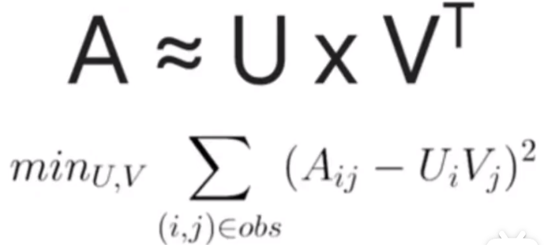
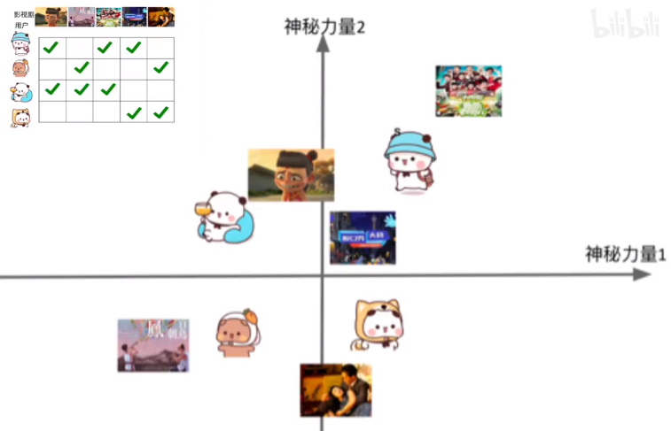

# 推荐系统

[toc]

## Portals

[推荐系统从入门到实战 蚂蚁学Python](https://www.bilibili.com/video/BV1Dz411B7wd)

[推荐系统入门篇·推荐系统算法有几种？](https://www.bilibili.com/video/BV1Zq4y1Y71R)

# 推荐系统入门

根据用户的历史信息和行为，向用户推荐内容

**类型**
1. content based filtering　　基于内容的过滤　　==基于内容元数据，与用户行为无关==
2. collaborative filtering　　协同过滤　　==基于用户行为==
   1. memory based approach  ==基于内存==　　无需模型仅通过计算即可得到结果
      1. user based　　用户相似性
      2. item based　　内容相似性
   2. model based approach  ==基于模型==
      1. matrix factorization 矩阵分解
      2. other 与深度学习相结合
3. hybrid　　混合推荐  ==两者结合== 

**用户行为**
显式：打分、点赞
隐式：点击、观看时长

**矩阵分解**

用户矩阵＋商品矩阵

 

矩阵乘法

之后选取得分最高的值，并剔除已经观看过的

添加其他评分维度

维度和数值的确定

转换为最小二乘问题，可利用SVD分解

在SVD分解前，需进行空白值的填充。不能填零，因为没看过不代表为来不回去看。有各种各样的imputation方法，但是有插值错误的可能性

或者放弃对全局进行最小二乘，转为对于已知数据进行逼近。
主流方法：
1. SGD stochastic gradient descent，速度较慢
2. ALS alternating least square，交替最小二乘
3. 对ALS改进，WALS weighted alternating least square，未知数据填零，但是给一个小权重

最后得到的维度被称为latent factor/feature，隐因子、潜在特征、潜在因素

