# 推荐系统

[toc]

## Portals

[推荐系统从入门到实战 蚂蚁学Python](https://www.bilibili.com/video/BV1Dz411B7wd)

[推荐系统入门篇·推荐系统算法有几种？](https://www.bilibili.com/video/BV1Zq4y1Y71R)

# 推荐系统入门

根据用户的历史信息和行为，向用户推荐内容

## **解决问题＆环节**
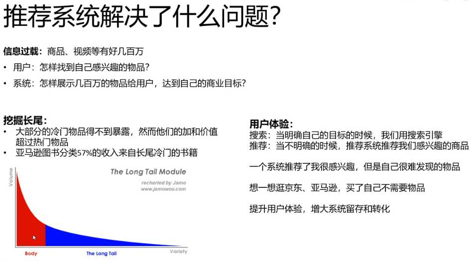

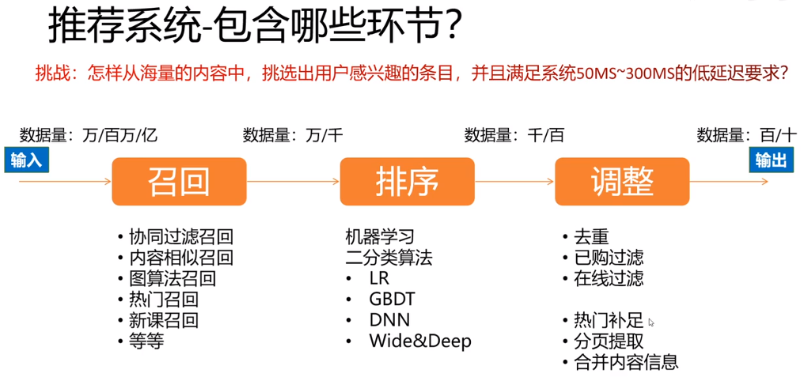

召回：海量数据量降低+粗略的个性化召回

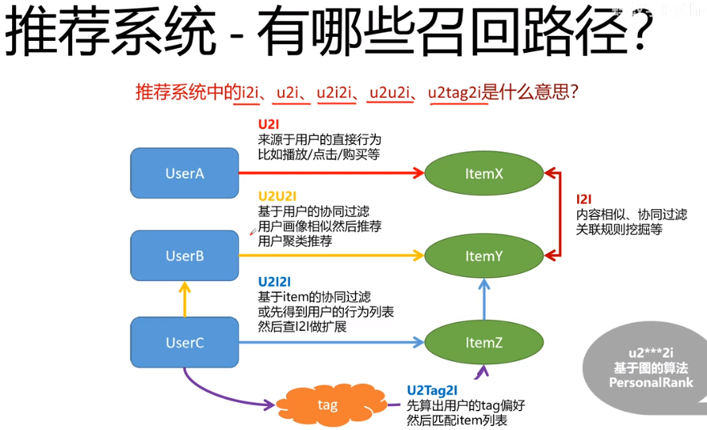

U2Tag2I的泛化性较好

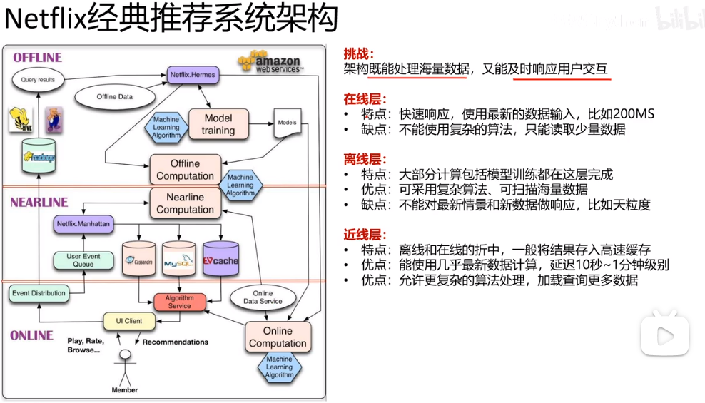

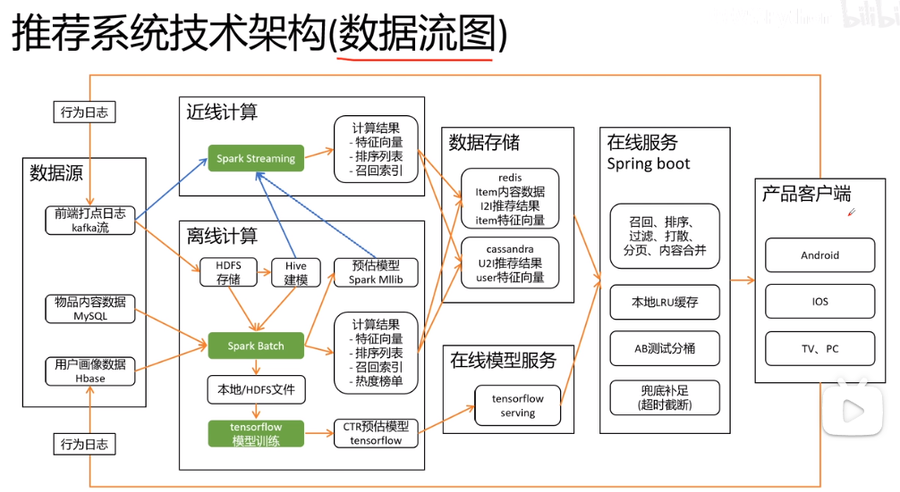

## **类型**

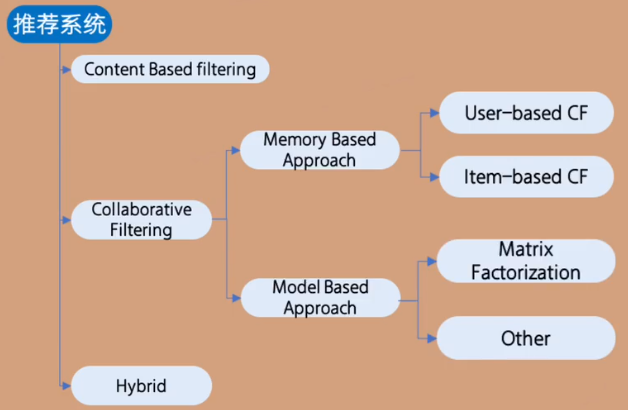

**常见类型**
1. content based filtering　　基于内容的过滤，推荐时要依赖用户画像　　(**用户和物品的信息**)　　==系统需要丰富的项目内容描述和完整的用户画像== 　不需要参照其他用户画像，如果用户画像发生变化，CBF技术仍有可能在很短的时间内调整推荐结果，不足是需要系统对项目内容的特征有足够深入的了解　可以通过相似度算法
   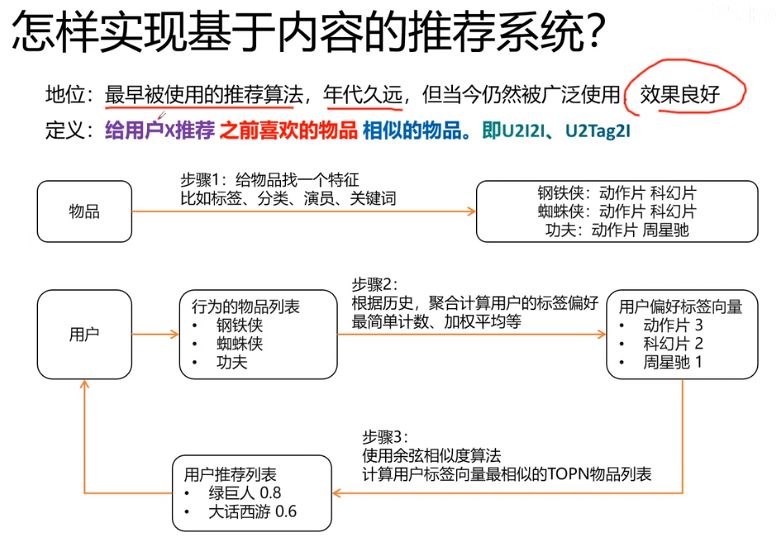
   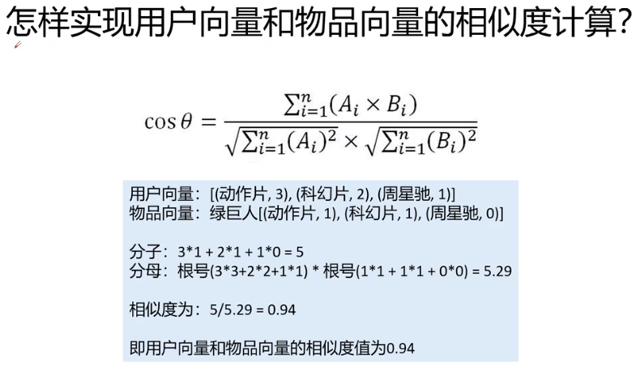
   相似度属于0~1，靠近0说明不相干，靠近1说明相干
   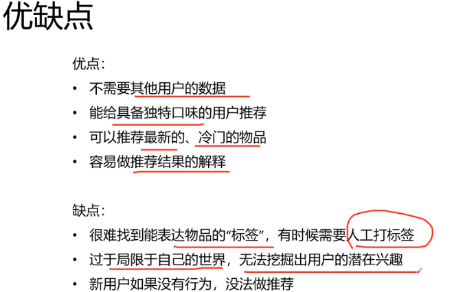
2. collaborative filtering　　协同过滤　　==基于用户行为==　　(**用户和物品的行为**)
   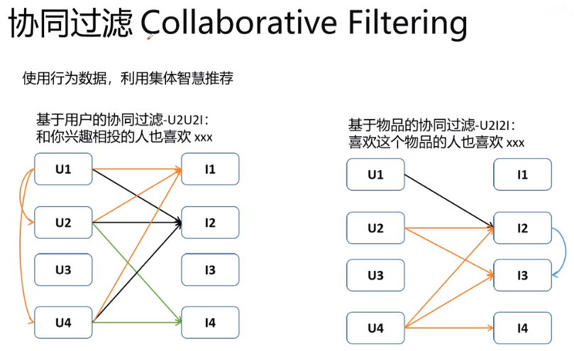
   
   皮尔逊相关系数先认定缺失值都是用户各自的平均分
   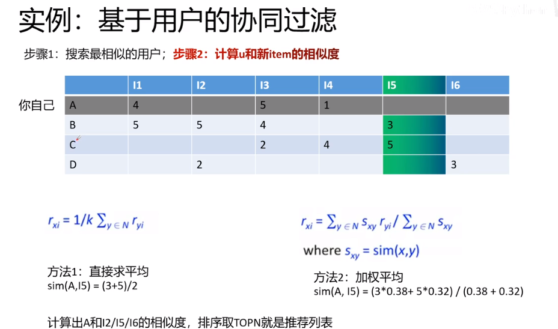
   利用上一步相似的用户，给空缺位置打分
   1. memory based approach  ==基于内存==　　无需模型仅通过计算即可得到结果　　neighborhood based
      1. user based　　用户相似性
      2. item based　　内容相似性（通过用户的反馈得到）
   2. model based approach  ==基于模型==
      1. matrix factorization 矩阵分解
      2. other 与深度学习相结合
3. hybrid　　混合推荐  ==两者结合== 

## **用户行为**
显式：打分、点赞
隐式：点击、观看时长

## **矩阵分解**
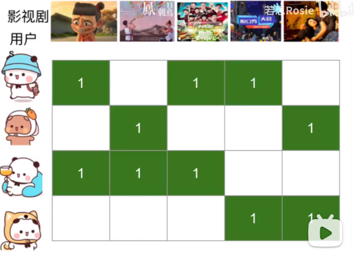

用户矩阵＋商品矩阵

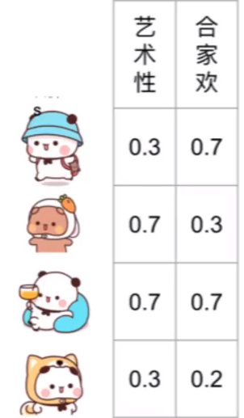 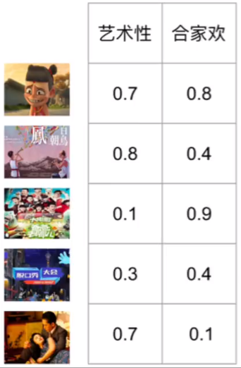

矩阵乘法

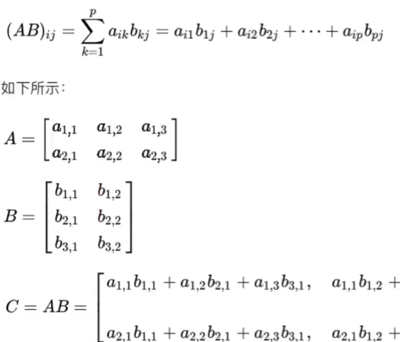

之后选取得分最高的值，并剔除已经观看过的

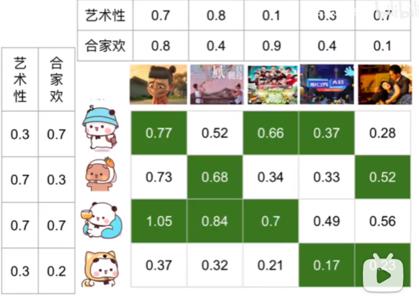

添加其他评分维度

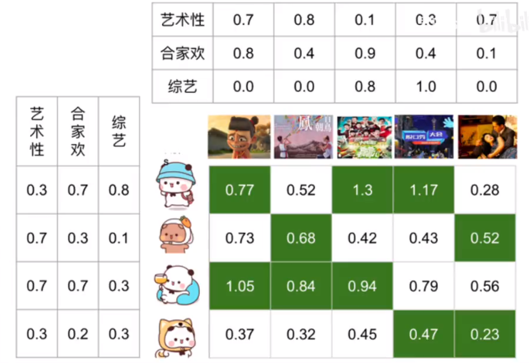

维度和数值的确定

转换为最小二乘问题，可利用SVD分解

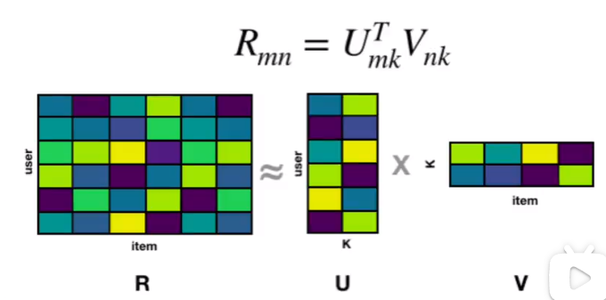

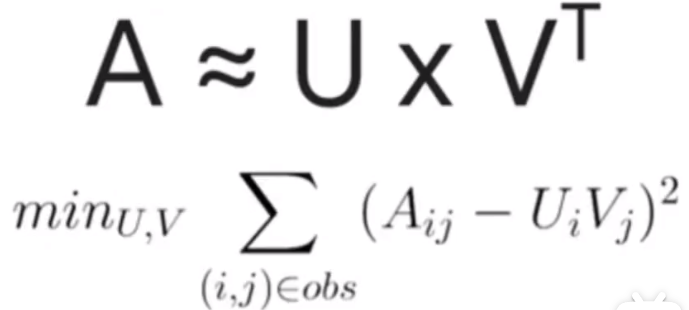

在SVD分解前，需进行空白值的填充。不能填零，因为没看过不代表为来不回去看。有各种各样的imputation方法，但是有插值错误的可能性

或者放弃对全局进行最小二乘，转为对于已知数据进行逼近。
主流方法：
1. SGD stochastic gradient descent，速度较慢
2. ALS alternating least square，交替最小二乘
3. 对ALS改进，WALS weighted alternating least square，未知数据填零，但是给一个小权重

最后得到的维度被称为latent factor/feature，隐因子、潜在特征、潜在因素

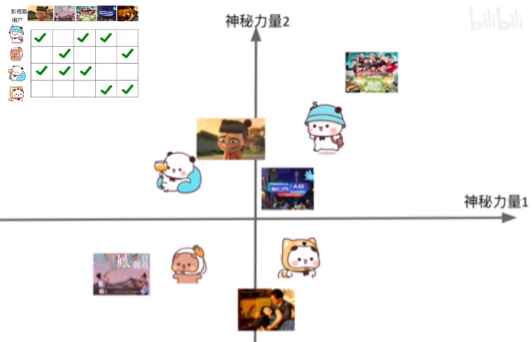

## **实战案例**

步骤:
1. 了解需求
2. 了解上下游
   1. 上游：数据来源，是否有较好的内容元数据等等
   2. 下游：模型结果要发送的系统
3. 确定目标
4. 整合资源、确定框架
5. 数据清洗+ETL(数据连接)
6. 数据探索(数据量)
7. 建模＆调参(模型需要和数据量对应)
8. 结果展示
9. 应用(模型上线，A/B Testing)
10. 结果＆反馈(持续改进回到第一步)

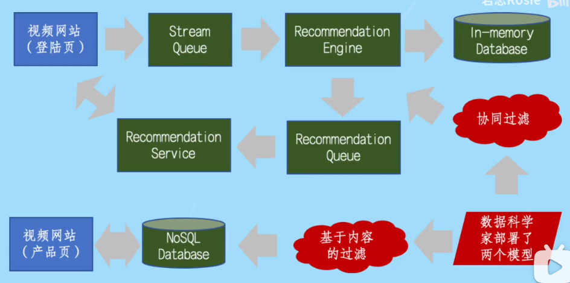

## **效果衡量**

两种方式
1. 用户打高分的内容(old)，对用户实际打分和预测用户打分进行差别分析
   1. MAE mean absolute error
   2. RMSE root mean squared error
2. 用户点击去看的内容(new)
   1. hit rate 点击率　$HR = \frac{\#hits}{\#users}$
   2. Leave-One-Out Cross-Validation (LOOCV,offline evaluation)，从用户观看数据中抽去一个，用其他数据训练模型，查看抽去的数据是否能够在当前模型中获取较高的得分
   3. 相关变体
      1. ARHR，对于用户点击的视频处于推荐序列排名较后的位置
         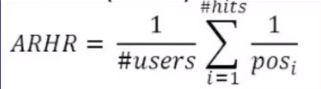
      2. CHR，去除用户可能会点击但是评分可能较低的推荐
   4. NDCG  normalized discounted cumulative gain 归一化折损累计增益
      1. gain 相当于  relevance score 0/1
      2. cumulative gain 对gain做一个累加
      3. discounted cumulative gain 对于点击的视频处理推荐序列的位置进行折损，除以$log_2(1+pos)$
      4. normalized discounted cumulative gain 对于不同长度的推荐序列进行归一化 ，统一除以完美的DCG，即iDCG
         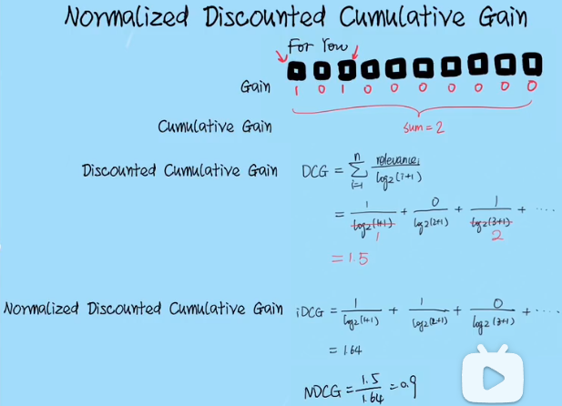
   5. MRR　mean reciprocal rank
   6. MAP 
3. 推荐系统也需考虑其他方面
   1. 多样性diversity，防止推荐页面上都是同一类型
   2. 覆盖率，尽可能将更多内容推荐给更多用户
   3. 小众性，覆盖小众用户群体

## **AB实验**

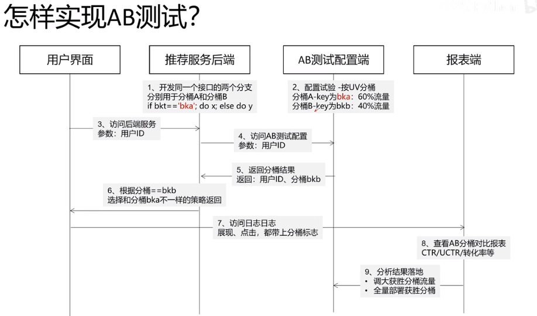

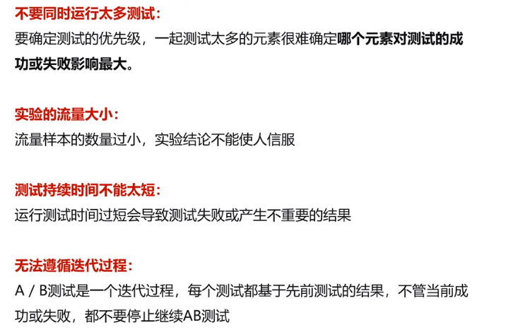

