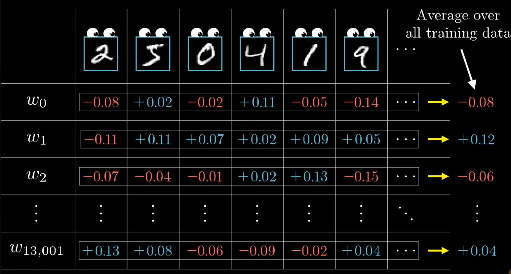
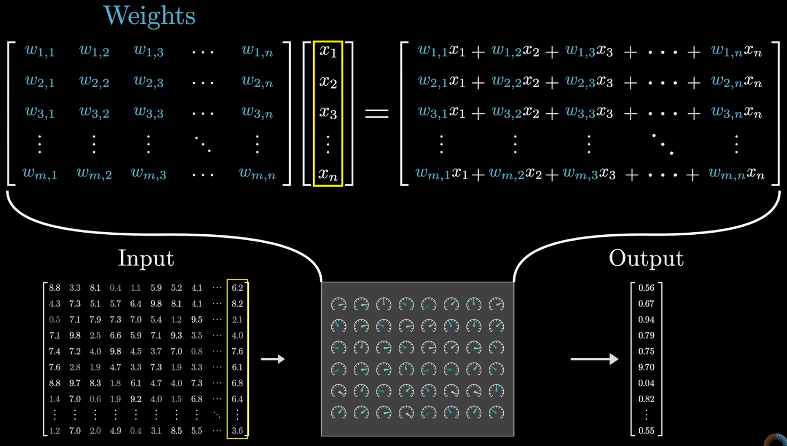

# 3B1B - Neural Networks

[3B1B - Neural Networks - YouTube](https://www.youtube.com/playlist?list=PLZHQObOWTQDNU6R1_67000Dx_ZCJB-3pi)

## Table of Contents


# 01 - Deep Learning

[Chapter 01 - Deep Learning](https://www.youtube.com/watch?v=aircAruvnKk)

Convolutional Neural Network - good for Image Recognition

Long-Short Term Memory Network - good for Speech Recognition

Plain Vanilla = Multi-Layer Perceptron


Neuron hold a number(Activation 激励值，与 input 有关)，本质是一个 function(input 是上一次全部 neuron 值，输出是 0-1 的值)

Hidden Layers 可能的 工作原理 (pixel -> edge -> pattern -> digit，只是为了方便理解)
1. Hidden Layer 第一层 存储低维信息(小特征)
2. Hidden Layer 第二层 存储高维信息(大特征)
   1. 
3. 

其他 模态的 Recognition Problem 也类似
1. 

将上一层信息 使用 weighted sum + bias 得到下一层信息，下一层 Neuron 表明 某种 Pattern 得分，权重可以使用一个掩膜(矩阵)表示
1. 
2. 每一个后续的 neuron 都和之前的 neuron 全连接，也就是每一个 后续 neuron 都对应了一个独自的 mask(同时也有 一个 bias)
3. 

需要将 weighted sum + bias 的值，即 Neuron的值(Activation) 限制在 `[-1, 1]`
1. 需要 从实数轴 `[-∞，+∞]` 映射到 `[-1, 1]`
2. Sigmoid Function $\sigma$ (Slow Learner)
   1. 
   2. $$\sigma(x) = \frac{1}{1+e^{-x}}$$
3. ReLU (Rectified Linear Unit)
   1. 
   2. $$ReLU(a) = max(0, a)$$

Bias 可以理解为 给 Neuron 设定的 Activate 的 Threshold

参数量计算
1. 

Learning 可以看做 寻找 最合适的 参数(Weights & Biases)

矩阵表示法
1. 
2. 

整个 Network 就是一个复杂的 Function

---

# 02 - Gradient Descent (Learning Find the Parameters)

[Chapter 02 - Gradient Descent](https://www.youtube.com/watch?v=IHZwWFHWa-w)

Adjust Parameters to Improve Performance on **Training** Data (获取合适的 weight & bias)

**Test** the Network that it Never Seen Before (hope it can generalize beyond the training data)

**MNIST Database** - LeCun, Cortes, Burges
1. hand-written digit recognition
2. 

相当于 Finding the Minima of a Function(Loss)

最开始 initialize weights & bias randomly


cost function - evaluate how bad the output is
1. 对于 Training Data, cost 是全部 train dataset 的共同结果
2. dataset 是 固定的
3. weight & bias 是 变量


tell the network how to change the weight & bias (minimize the cost)

对于 有显式表达式的 函数，可以直接写出 minima，但是实际情况是 并不知道 表达式

使用迭代式的算法并不能保证得到全局最小值


最好可以让迭代步长和斜率成正比，当趋向于最小值时，斜率小，步长小，避免 over-shotting

对于多变量微积分，函数梯度给出了最陡的上升方向，使得函数增加的最快方向，走反方向可以得到最陡的下降方向


负梯度 包含两个信息
1. input vector 分量是应该 增加 or 减小
2. 哪个分量的变化 更加重要(在当前input附近)，或者说 cost function 对 分量的 敏感性，也可以认为是 梯度下降的 性价比


对于 random input 可能会给出错误结果


neural network 可能不仅仅是在记忆(对于 randomly-labeled data 学习的很慢，randomly-labeled data 的 cost function 没有规律)


---

# 03 - Back Propagation

[Chapter 03 - Back Propagation](https://www.youtube.com/watch?v=Ilg3gGewQ5U)

由于 cost function 会 average over all training examples，因此 调整 梯度下降的 每一步 也会 基于 all training examples

调整参数的方法(单独一层)
1. 改变 bias
2. 改变 weight (in proportion to 上一层 neuron output/activation)
   1. weight 是 对应 output neuron 的，不需要 进行 neuron 间的 average
3. 改变 上一层的 neuron output/activation (in proportion to weight)
   1. 但是实际上并不能直接进行改变，因为是由再之前层的 weight & bias 决定的
   2. 同时需要考虑所有 output layer 对于 上一层 neuron output/activation 的改变期望(希望全部 output 同时 optimize)，因为 上一层 neuron output/activation 是 **shared 共用的**
   3. 

记得需要 average over all training
1. 


## Stochastic Gradient Descent 随机梯度下降

如果梯度下降每一步 都使用 全部训练样本average 计算会花费大量时间

训练样本打乱，分成多组 mini-batch，用于近似 all dataset

mini-batch 的每一步 计算 step


没有 使用 all data 那么准确，但是速度更快


---

# 04 - Back Propagation Calculus

[Chapter 04 - Back Propagation Calculus](https://www.youtube.com/watch?v=tIeHLnjs5U8)

考虑简单情况


Chain Rule


在 all data 上做 average


考虑复杂情况
1. 对于 weight/bias 求导 chain rule 公式不变
   1. 
2. 对于 activation 求导 chain rule 公式有些许变化，前面的 neuron activation 值会被 share
   1. 


---

# 05 - Large Language Models explained briefly

[Chapter 05 - Large Language Models explained briefly](https://www.youtube.com/watch?v=LPZh9BOjkQs)

接收文本，合理预测下一个单词

不是肯定的预测一个词，而是为所有可能的下一个词一个概率


通过 System Prompt 可以使得 相同的模型 得到不同的输出

input 去掉最后一个词，用预测的最后一个值和真实值比较，通过反向传播来调整


训练 LLM 所需的 计算量很大

Steps:
1. Pre-Training (have room for fine-tuning in specific task)
2. RLHF (Reinforcement Learning with Human Feedback)

Before 2017, 大多数 language model 是一个词一个词处理文本 (并非所有 language model 都能轻松实现 并行)

Google 2017 - Attention Is All You Need - **Transformer**

Transformer 不是从头到尾阅读文字，而是 并行的吸收信息

首先需要将文字转为数字，也就是 编码


通过 Attention，使得 编码的数字列表 可以 进行交互，根据周围语境，完善编码含义 (并行进行)

同时 FeedForward Neural Network 增加 capacity to store more patterns about language


最终，对于序列中的最后一个向量执行 一个函数，用于预测 下一个单词


---

# 06 - Transformers

[Chapter 06 - Transformers](https://www.youtube.com/watch?v=wjZofJX0v4M)

GPT = Generative Pre-trained **Transformer**

可以使用 Transformer 构建很多不同类型的模型
1. voice-to-text
2. text-to-voice
3. text-to-image
4. translation/interpretation

预测的形式 : probability distribution

## High Level Preview of Transformer

High Level Preview
1. Embedding
2. Attention
3. MLPs
4. UnEmbedding


整体流程 General Idea
1. input 被拆分为 Tokens
   1. 对于文本，是 单词、单词的一小部分、字符组合
      1. 
   2. 对于其他模态，可能是 图像的小区域、声音的小片段
2. 每个 Token 对应到一个 vector (encode the meaning of the piece)
   1. 
   2. 如果看做是 高维空间中的坐标，相同含义的 token 在空间中也相近
      1. 
3. sequence of vectors 向量序列 经过 **Attention Block**，相互**交流**，并根据彼此信息更新自身值
   1. attention block 用于确定 上下文中 哪些词 对更新其他词的意思有关，以及 如何更新词义(vector)
   2. 
4. 经过 Multi-Layer Perceptron / FeedForward Layer，此期间 向量并不交流，而是并行的进行处理
5. 重复进行多次 Attention Block & MLP
6. 直到最后，文章的核心意义融入到 sequence 中的 最后一个 vector，预测下一个 token 完全取决于 序列中的最后一个向量
   1. 


## Premise of Deep Learning

machine learning 的 本质是 构建具有 Tunable Parameters 可调节参数 的结构，然后通过大量的实例 input/output 学习，而非编写固定的程序来做特定任务



GPT-3 内部


weight define the model & model process the data


## Word Embedding

model 有一个 predefined vocabulary(针对 tokens)，并对应 Embedding Matrix (token 对应的 初始值)，learned based on data

本质上是一个不参考上下文的查找表


GPT-3
1. 50257 tokens
2. 12288 dimensions

Embedding 比 Transformer 早提出


高维空间的方向 可以编码不同的意义


向量 dot product 可用于判断 对齐程度

起初 从 embedding matrix 中获取的 vector 仅能代表 token 含义，不含 上下文信息

但 sequence of vectors 中 并不仅仅包含 token 本身，还带有 位置信息，此外 还会不断添加其他的上下文信息，最终指向一个新位置


需要 model 能够高效融合 上下文信息

网络每次只能处理一定数量的 vector，该数量称为 上下文大小 context size (GPT-3 的 context size = 2048)

上下文大小 限制 Transformer 预测下一个 token 的过程中 可以容纳的 文本量

## UnEmbedding

使用 UnEmbedding Matrix，将 最后一个 vector 映射到 vocabulary 大小的 vector (logits)
1. 行数 = vocabulary 数
2. 列数 = embedding dimension 数


再通过 softmax 函数，将这些值转换为 概率分布 probability distribution


虽然最后一步的 sequence of vectors 中 每一个 都包含丰富的 上下文信息，但是 利用 最终层的每一个向量 预测相邻后一个token(immediately after) 更加高效


## Softmax with Temperature

根据 probability distribution 定义，每个值 处于 0-1 之间，并且 sum = 1

$$\text{softmax} = \frac{e^{z_i}}{\sum_{j=1}^K e^{z_j}}$$

通过 指数函数 转为非负，求和 作为 分母


$$\text{softmax with Temperature} = \frac{e^{z_i/T}}{\sum_{j=1}^K e^{z_j/T}}$$


Temperature 越大，不同 input 对应的 output 占比差距变小，使得分布更加均匀 (较小的数值会获得更多权重)

Temperature = 0，对应模型 必定选择 预测概率最大的 token (100%)

Temperature 高，使得模型能选择概率低的词，creative but risky

P.S. : logits 是一个向量，下一步通常被投给 softmax/sigmoid

---

# 07 - Attention in Transformers

[Chapter 07 - Attention in Transformers](https://www.youtube.com/watch?v=eMlx5fFNoYc)

## Self-Attention

Transformer 的目标是 逐步调整 embedding，使之不仅仅编码单词本身，而是包含更丰富，更深层次的上下文含义

最开始 同一个 token 对应的 embedding vector 是 一样的 都是从 embedding matrix 中查找对应的词语 (随后 加入 position 信息)


直到 Transformer 的下一步，周围的 embedding 才能向该 Token 传递信息

Attention Block 计算出需要根据上下文 在 原始 embedding 中添加什么内容 (即使两个 embedding vector 相距很远)


目标是通过一系列计算(矩阵运算)，产生一组 新的，更精细的 embedding model


token 会产生 Query Vector，维度比 embedding vector 尺寸小

Query Vector 是通过 将 embedding 和 Query Matrix 相乘得到的


将 Query Matrix 与 全部 embedding 相乘，得到的是 全部 embedding 的 query 序列


希望 query matrix 能够将 embedding 映射到 Query/Key Space 中(较低维度)，用于后续找寻有关联的 token


同时 Key Matrix 同样 与 所有 embedding 相乘，得到的是 全部 embedding 的 key 序列

可以将 key 理解为 潜在的 query 回答


Key Matrix 也将 embedding 映射到 Query/Key Space 中(较低维度)，用于后续找寻有关联的 token


如果 query 和 key 能对齐，可以认为 它们 match


**==☆==** 注意，**Query Matrix 和 Key Matrix 是模型的参数**(可调整)，因此也会从 data 中学习

需要计算 全部可能的 key-query 组合之间的 dot product，match 的 key-query，dot product 大，即 key 对应的 embedding **attend to**(关注) query 对应的 embedding


得到的 点乘 matrix 值需要限定范围，希望 每一列都能构成 probability distribution(值处于 0-1，和为 1)，利用 softmax 来 normalize，个人理解 : 每一列表示 不同的 key 对 同一个 query 的 匹配程度


为了数值稳定性，可以除以 Query/Key Space 维度的 平方根 $\sqrt{d_k}$，然后 **按列** 进行 softmax


在训练过程中，对给定文本进行处理时，模型根据对文中下一个token的预测概率高低，调整权重

可以同时让模型预测每个初始 Token 子序列，来提升训练过程的效率


设计注意力模式时，基本原则是不允许 后出现的token 影响 先出现的token，因此对角线下方的元素的影响应被抹除，该步骤称为 **masking**


同时，考虑到 softmax 的影响，需要将其设置为 **-∞**，以保持 normalized


这个 Attention Pattern 的大小 是 context size 的平方，因此 context size 是 LLM 的瓶颈

使用 Value Matrix 与 embedding 相乘，得到 Value Vector，并将其加入 其他 embedding 中


注意 value vector 的 dimension 和 embedding 一样，不同于 key vector / query vector


将 value 和 之前 最终的 attention pattern(理解为权重) 相乘，按列求和，加上原始 embedding 得到 更新后的 embedding


上述过程被称为 Single-Head Self-Attention

通过 3种 参数可调的 矩阵来实现
1. Query
2. Key
3. Value

参数量计算


实践中，可以使得 `# Value Params` = `# Query Params` + `# Key Params`，先映射到低维空间，再映射回高维空间


## Multi-Headed Attention

语境对词语含义影响的方式有很多种，名词、动词、形容词 都可以相互影响，对应不同的 query, key, value 矩阵，因此需要重复多次


GPT-3 在每个块中 使用了 96 个注意力头，对应 96 套 query, key, value 矩阵，产生 96 种 attention pattern

每个头都会产生一个建议的变化，original embedding 加上全部建议的变化，得到 new embedding


一种 value matrix 的实现方式 (同时包含 升维 & 降维 矩阵)


实际的实现方式，Output Matrix(由之前的 升维矩阵组合而成)，相应的 Value Matrix 只包含 降维矩阵

达到的效果是 在降维后的空间上进行加权求和，而不是直接对高维向量操作

降低了计算复杂度，减少了模型参数量和内存占用


Transformer 中的 数据流动 不仅限于 单个 attention block，而是 通过 Multi-Layer Perceptron

GPT-3 包含 96 个不同的层(不是头)，即重复 96次


## Cross-Attention

Self-Attention & Cross-Attention


Cross-Attention 会处理不同类型的数据(翻译，语音转文字)，并且不需要 masking 步骤(不存在 后续 token 影响之前的 token)


---

# 08 - How might LLM Store Facts

[Chapter 08 - How might LLM Store Facts](https://www.youtube.com/watch?v=9-Jl0dxWQs8)

模型似乎记忆了很多 facts，可能存在于 Multi-Layer Perceptron 中


大部分模型参数存在于 MLP 区块中 大约 2/3


以 Michael Jordan Play Basketball 为例


升维 Linear 层

可以从 **行** 来理解 升维矩阵，每一行 与 embedding 相乘 得到 相似性


可以将每一行在并行的提出问题(用向量相乘的形式)，研究被处理向量的其他特征(后续通过非线性后转为 activation)

显然，矩阵将 原有信息映射到高维空间中


通过 ReLU 引入 non linear

也可以使用 GELU(Gaussian Error Linear Unit)


经过 非线性 后 可以得到 neuron(of Transformer) 是否 activate


降维 Linear 层 (Down Projection)，维数回到 embedding 空间大小

可以从 **列** 来理解 降维矩阵

列可以理解 embedding space 中的 向量，使用 全部 activation 值 对 各列进行线性组合，每一列可以包含不同的信息/元素


使用 add gate 将 原始 embedding 和 additional 相加


上述过程，并行的发生在每个 embedding vector 中

同一个 Multi-Layer Perceptron (MLP) 中，各个 embedding vector 经过的 up-projection 和 down-projection 的参数是一样的，这些投影的权重矩阵是共享的
1. 使得 Transformer 对序列长度不敏感，能够处理任意长度的输入
2. MLP中，每个位置向量被认为是独立的，彼此之间没有直接交互(互是通过注意力机制完成的，多头注意力机制 中，不同的头会有不同的权重矩阵(Query、Key、Value))


## Counting Parameters


其中有一些参数被忽略
1. MLP 中 Up-Projection & Down-Projection 的 Bias
   1. 
2. Layer Norm
   1. 


## SuperPosition

实际上，单个 neuron 很少 能代表 单一而清晰的特征

对于 N 维空间，想要通过 相互垂直/正交 的方向表示不同特征，能够容纳的向量最大数量只有 N

如果 放宽限制，不严格要求 90°，对于高维空间，可以容纳的几乎垂直的向量数量会随着维数的增加而呈指数增加 (Johnson-Lindenstrauss 引理)


或许也可以解释，模型的能力 可以随着 dimension 的增加而提高

因此，也不是单个 neuron 表达单独的特征，需要将全部 neuron 一同考虑


detail not discussed
1. tokenization
2. positional encoding
3. layer normalization
4. training
   1. cost function
   2. RLHF
   3. scaling laws
5. ...


```python
loss_fn = nn.CrossEntropyLoss()
optimizer = torch.optim.SGD(model.parameters(), lr=1e-3)
# optimizer 是与模型的参数绑定的，优化器会保存对这些参数的引用
# 通过调用 optimizer.step()，优化器会使用这些绑定的参数中的梯度信息来更新这些参数的值
# loss.backward() 时，PyTorch 会自动计算损失函数相对于每个参数的梯度，并将这些梯度存储在对应参数的 .grad 属性中
# 调用 optimizer.zero_grad() 来清除所有参数的 .grad，以避免梯度累积

def train(dataloader, model, loss_fn, optimizer):
    size = len(dataloader.dataset)
    model.train()
    for batch, (X, y) in enumerate(dataloader):
        X, y = X.to(device), y.to(device)

        # Compute prediction error
        pred = model(X)  # 构成了计算图的一部分，每个操作都有可能添加新的节点和边到图中。此时，pred 是计算图中的一个节点，它保存了从输入 X 到输出 pred 的整个计算路径。
        loss = loss_fn(pred, y)  # 损失函数接收模型的预测 pred 和真实标签 y 作为输入，计算出一个损失值 loss。
                                 # 这一步将损失值与预测值 pred（以及通过 pred 间接与模型输入 X）联系起来，构成了计算图的最终输出节点。损失值 loss 反映了模型预测和真实标签之间的差异。

        # Back Propagation
        loss.backward()  # 损失函数 loss 和计算图之间的关系是通过模型预测 pred 来建立的
        optimizer.step()  # 更新模型的参数。基于之前计算的梯度，这个步骤会调整模型的参数以最小化损失函数。
        optimizer.zero_grad()  # 清零梯度, PyTorch 默认会累加梯度，如果不手动清零，那么下次调用 .backward() 时，新计算的梯度会和旧的梯度累加起来

        if batch % 100 == 0:
            loss, current = loss.item(), (batch + 1) * len(X)
            print(f"loss: {loss:>7f}  [{current:>5d}/{size:>5d}]")
            # :>7f 是格式说明符，: 表示开始格式说明符，> 表示右对齐，7f 表示总宽度为7的浮点数，包括小数点和小数部分，确保输出具有一致的宽度，方便阅读。
```

---


#

[](https://www.youtube.com/watch?v=KJtZARuO3JY)


