# BEV

# BEV感知算法介绍 -- 系列视频

[最新！BEV感知算法介绍 --- B站视频](https://www.bilibili.com/video/BV1Gj411A7xv/)

## 最新！BEV感知算法介绍 

Bird Eye View 鸟瞰图、俯视图

优势
1. BEV空间尺度变化小(没有近大远小)
2. BEV视角目标遮挡小

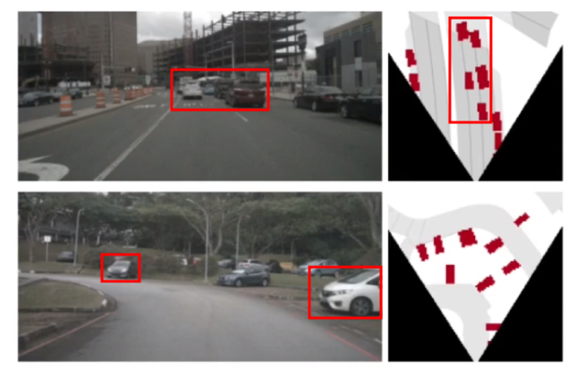

多传感输入统一到BEV空间

总体概念

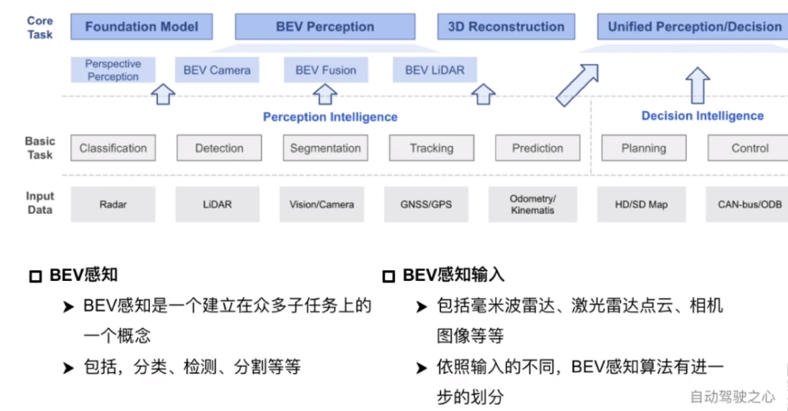

BEV输入较为宽泛

## 3D目标检测！BEV感知算法数据形式

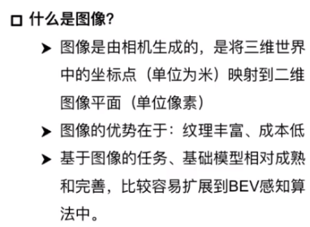

两个网络，图像处理方式都是较为经典的

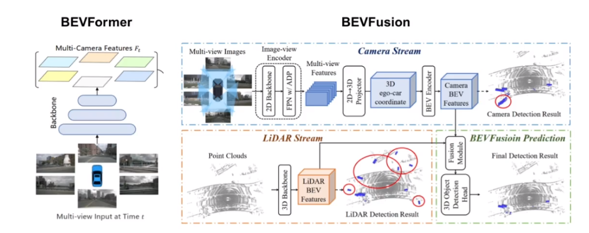

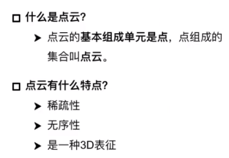

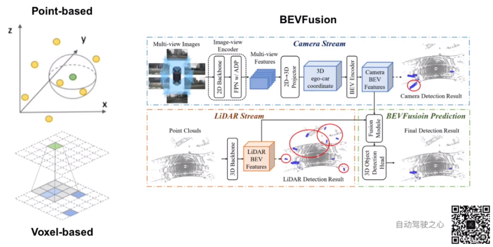

点云3D特征提取方法，都需要采用一定的聚合方法，无法确定单个点属于哪个对象，需要结合局部的空间信息
1. 基于点(关键点及其近邻点)
2. 基于体素(聚合一定立体空间内的点)

## Nuscenes、KITTI等多个BEV开源数据集介绍！

[Nuscenes、KITTI等多个BEV开源数据集介绍！](https://www.bilibili.com/video/BV1eg4y1g7Dc/)

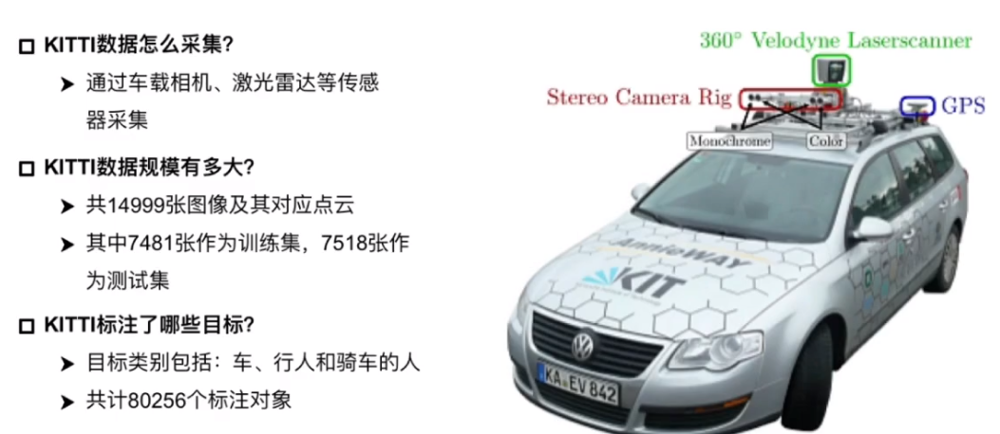

Velodyne

转换矩阵的作用，将2D和3D两种不同模态数据进行对应(3维数)

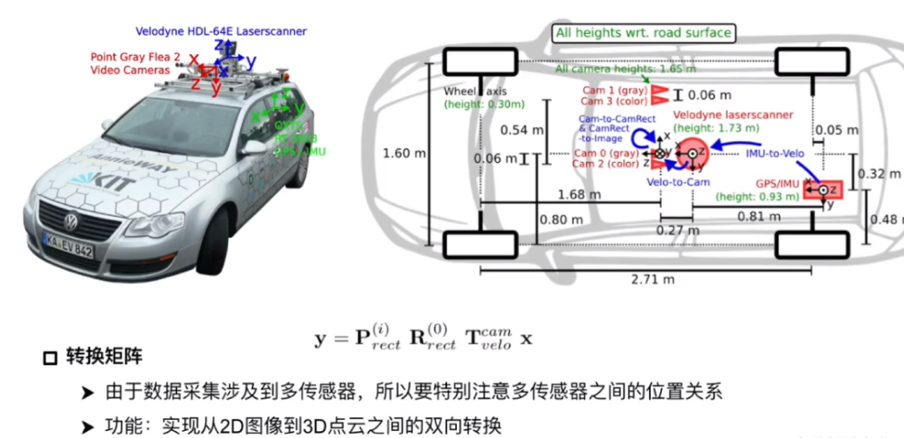

**KITTI标注文件解读**

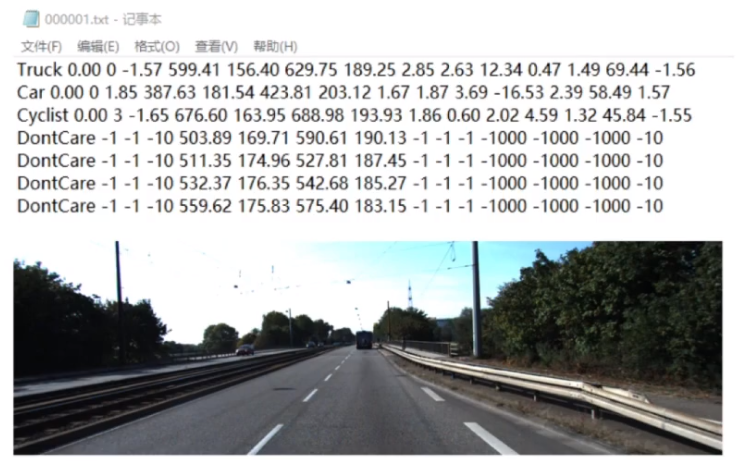

每一行代表一个物体，eg

Pedestrian 0.00 0 -0.20 712.40 143.00 810.73 307.92 1.89 0.48 1.20 1.84 1.47 8.41 0.01
1. 类别 Pedestrian 
2. 是否被截断 (0-1，表示被截断的程度，越大表示截断程度越大) 0.00
3. 当前目标被遮挡的程度 (一系列的离散值 0,1,2,3 0表示没有遮挡 3表示不清楚) 0
4. 观测角度 (弧度制 -pi到pi 当前标注物体和相机夹角) -0.20 
5. 标注2D检测框 (左上角+右下角) 712.40 143.00 810.73 307.92 
6. 当前目标的3D尺寸 (长方形 高宽长 单位:m) 1.89 0.48 1.20 
7. 当前目标3D中心点坐标 (三维位置坐标，和前面的3个数，以及角度 可以共同标注目标的3D框) 1.84 1.47 8.41 
8. 置信度得分 0.01

**nuScenes数据集** 帧数更高

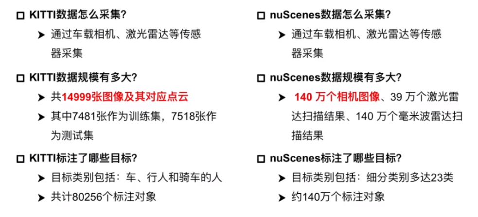

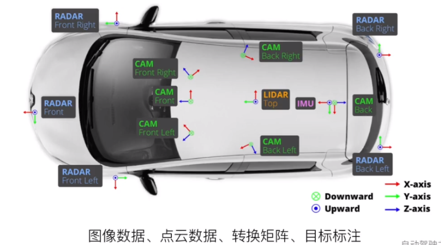

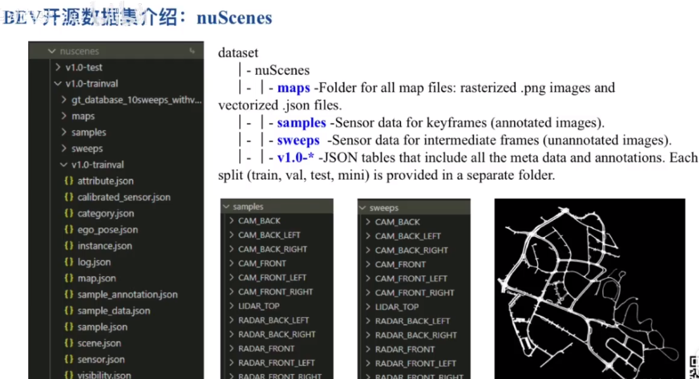

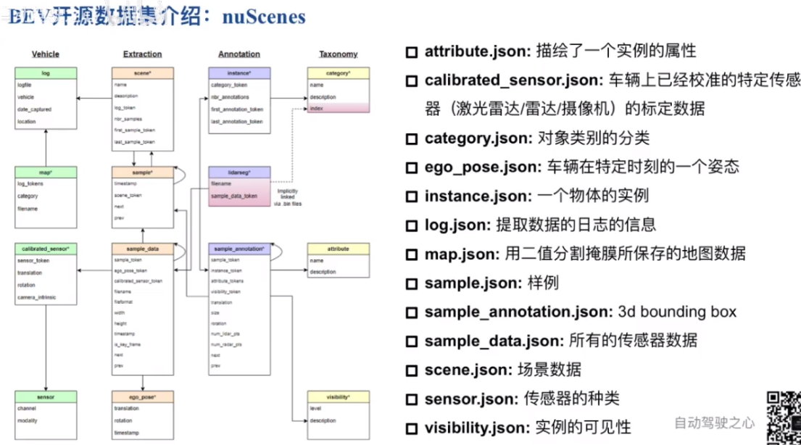

## 纯视觉/多传感器融合方案！BEV感知方法分类

bev-fusion 融合
bev-lidar 点云
bev-camera 纯视觉

**BEV-Lidar**

pre-bev : 特征提取在BEV之前进行，提取好的特征拍扁到BEV，然后进行后续检测。需要先处理点云特征，三维。

post-bev : 特征提取在BEV之后进行。可以通过二维网络进行提取。

很明显特征提取器一个是3D另一个是2D

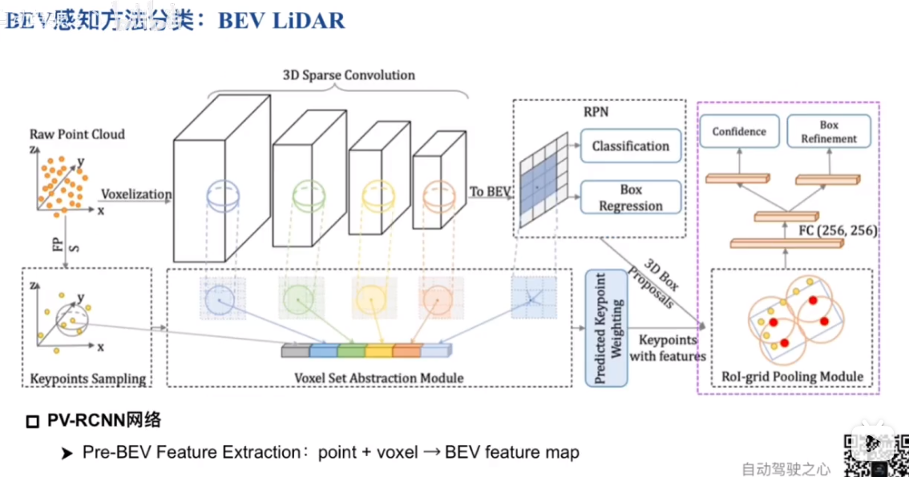

PV-RCNN 点特征和体素特征融合 点云为输入，输出3D检测结果

**BEV-Camera**

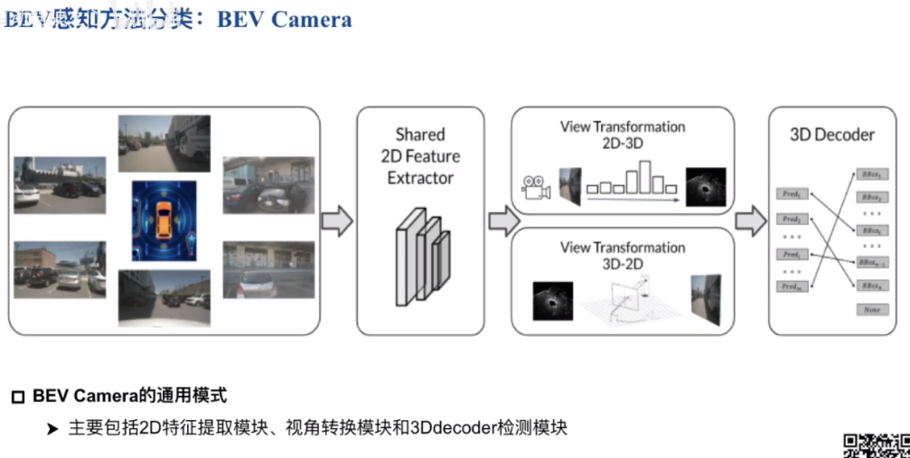

不同视角的图片使用相同的特征提取器

视角转换实现 2D -> 3D 以及 3D -> 2D

其中视角转换模块最为核心

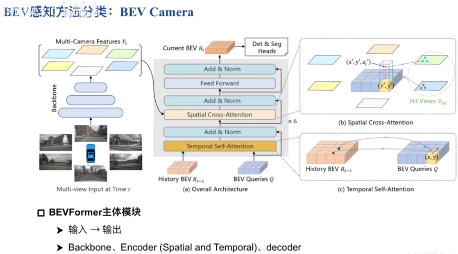

从 多视图 到 BEV 其实就是视角转换模块的工作

**BEV-Fusion**

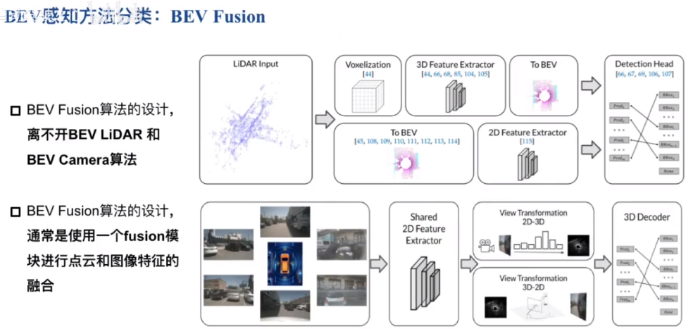

融合是特征层面的

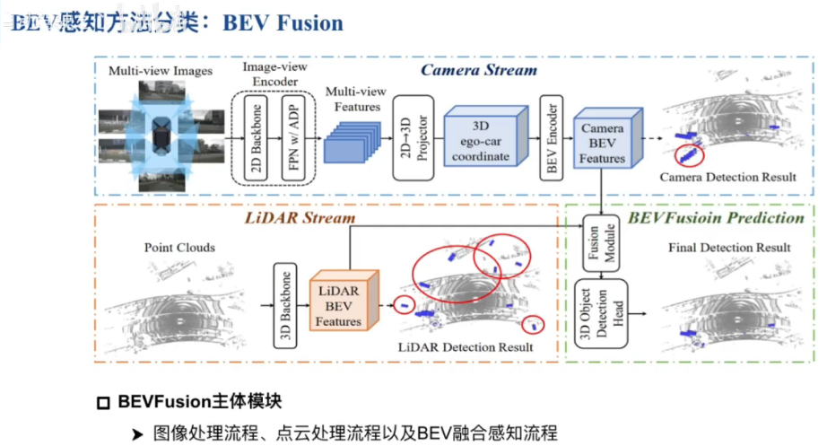

## 方法对比！BEV感知算法的优劣

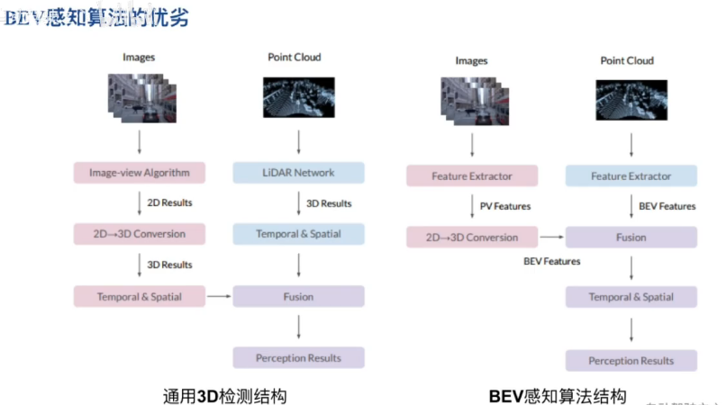

对于通用3D检测结构
1. 图像和点云支路都可以分别获取3D特征
2. 图像输入图像特征提取+点云输入点云特征提取

对于BEV感知算法结构
1. 图像特征提取后转三维，然后得到BEV特征与点云的BEV特征融合
2. "PV"通常指的是"Perspective View"，"PV Feature"可能指的是从透视视角下提取出来的图像或视频中的特征
3. 核心在于BEV特征的生成

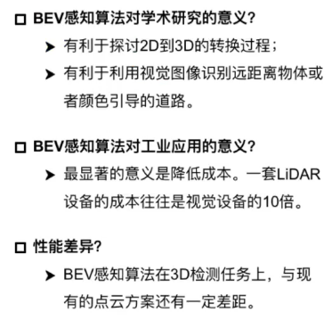

## 超详细！BEV感知算法的应用介绍

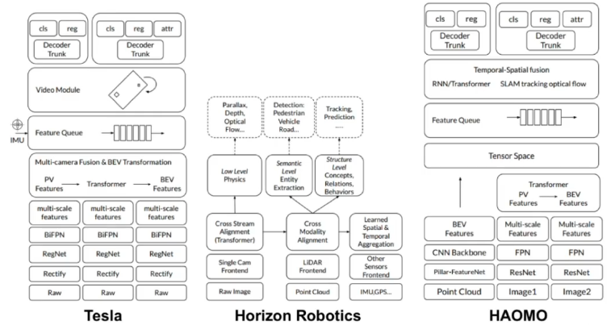

