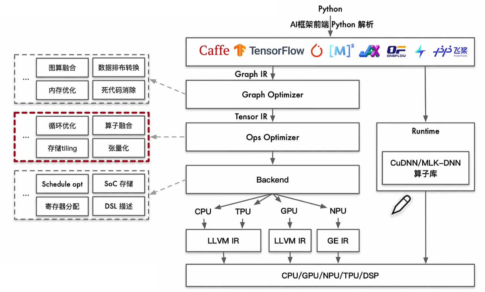

# 后端

AI 编译器 架构，传统编译器不擅长对 tensor计算 优化

LLVM(Low Level Virtual Machine)，通用编译器框架

NVCC(NVIDIA CUDA Compiler)，CUDA 12 之后，nvcc 内部的 C 前端已全面替换成 Clang，很多优化 Pass 也直接用 LLVM

IR - Intermediate Representation - 中间表示

前端 : 关注 计算图整体拓扑结构(对算子节点进行 融合、消除、化简)，不关心 算子具体实现

后端 : 关注 算子节点内部具体实现 (输入、输出、内存循环方式、计算逻辑)

# 算子 Operator

单个原子运算，对张量做数学变换，不保存可学习参数

层 = 多个算子 + 参数

算子 = 最小的数学计算单元

eg : 卷积层会拆成 `Convolution 算子` + `BiasAdd 算子` + `ReLU 算子`

一层卷积、一次注意力，都会拆出成百上千个算子节点；算子底下再映射到各种硬件 kernel

算子会在底层调用不同硬件的内核，实现，比如 CUDA kernel、ARM Neon、OneDNN、cuDNN、Ascend AI Core kernel 等

性能优化、量化压缩、跨硬件部署，几乎都要从 **算子** 这一粒度去动手脚

算子分类
1. 访存密集型 : 例如 RNN
2. 计算密集型 : FLOPs

推理/训练加速 : 绝大多数优化是对算子 kernel 下手 : 并行化、SIMD、张量核心、算子融合，减少内存往返

跨框架/跨硬件移植 : ONNX、TorchScript、MLIR 等都规定了一套“标准算子集合”，不同后端只需实现对应 kernel 就能跑同一模型

自定义运算 : 实现稀疏卷积、旋转注意力等新算法，需要写自定义算子，然后让框架认识它