# 动手学深度学习v2 - 李沐

[D2L官网](https://zh.d2l.ai/)

[d2l - 课程主页](https://courses.d2l.ai/zh-v2/)

[d2l - Github](https://github.com/d2l-ai/d2l-zh)

[动手学深度学习 PyTorch版  - B站视频(合集)](https://space.bilibili.com/1567748478/channel/seriesdetail?sid=358497)

[PyTorch 论坛](https://discuss.pytorch.org/)

[课程论坛讨论](https://discuss.d2l.ai/c/chinese-version/16)

---

# 目录

[toc]


---

## 01 课程安排

LeNet - ResNet - LSTM - BERT

损失函数、目标函数、过拟合、优化

**内容**
1. **深度学习基础** - 线性神经网络, 多层感知机
2. **卷积神经网络** - LeNet, AlexNet, VGG, Inception, ResNet
3. **循环神经网络** - RNN, GRU, LSTM, seq2seq
4. **注意力机制** - Attention, Transformer
5. **优化算法** - SGD, Momentum, Adam
6. **高性能计算** - 并行, 多GPU, 分布式
7. **计算机视觉** - 目标检测, 语义分割
8. **自然语言处理** - 词嵌入, BERT

下载 D2L Notebook

```bash
mkdir d2l-zh && cd d2l-zh
curl https://zh-v2.d2l.ai/d2l-zh-2.0.0.zip -o d2l-zh.zip
unzip d2l-zh.zip && rm d2l-zh.zip
cd pytorch
```

安装d2l包，以方便调取本书中经常使用的函数和类

```bash
pip3 install d2l
```

---

## 02 深度学习介绍

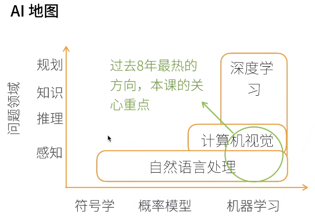

应用
1. 图片分类 - [](https://image-net.org/)
2. 物体检测&分割(精确到像素)
3. 样式迁移
4. 人脸合成
5. 文生图
6. 文字/代码生成(eg. GPT-3)
7. 无人驾驶

案例 - 广告点击(搜推广)
1. 触发(用户搜索) - 点击率预估(关键) - 排序(点击率 × 竞价)
2. 广告特征提取(广告主、产品描述、图片) -> 模型(训练数据 -> 特征和用户点击 -> 模型) -> 点击率预测

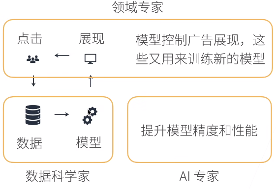

---

## 03 安装

[PyTorch 官网](https://pytorch.org/)

---

## 04 数据操作 + 数据预处理

### 04.01 数据操作

主要的数据结构 - N维数组

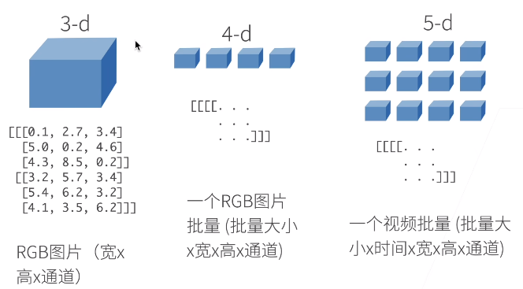


**广播机制 - broadcasting mechanism** (numpy & tensor)


```python
import numpy as np
import torch

x = torch.arange(12).reshape(3,4)
y = np.ndarray(shape=(3,4))

print(type(x))      # <class 'torch.Tensor'>
print(type(y))      # <class 'numpy.ndarray'>

x_ = x.numpy()
y_ = torch.tensor(y)  # 涉及到数据拷贝
y__ = torch.from_numpy(y)  # 不涉及数据拷贝，更快、更节省内存

print(type(x_))     # <class 'numpy.ndarray'>
print(type(y_))     # <class 'torch.Tensor'>
print(type(y__))    # <class 'torch.Tensor'>

y = x.clone()  # 深拷贝
```

深度学习通常使用 32位浮点数 - torch.float32

### 04.02 数据预处理

csv 逗号分隔值 文件

pandas

`pd.get_dummies()` 用于将分类数据转换为一种称为 **独热编码 One-Hot Encoding** 的形式 (将缺失值转为 one-hot)

float64 计算较慢，一般使用 float32

reshape & view
1. 相同点
   1. 不会改变张量存储的数据本身，而是改变张量的形状(元信息)
   2. 总元素数量必须一致
2. 不同点
   1. view(更高效) 要求原始张量的内存布局必须是连续的，如果张量是非连续的，需要先调用 `.contiguous()` 方法将张量变为连续的
   2. reshape 会尝试自动处理非连续的张量，如果原始张量是非连续的，reshape 会隐式创建一个新的连续张量，并复制数据到新的内存区域

```python
torch.Tensor._is_view()
```


## 补 : `Dataset` & `DataLoader`

[Datasets & DataLoaders](https://pytorch.org/tutorials/beginner/basics/data_tutorial.html)

torch.utils.data.`Dataset`
1. 从数据源 (文件、数据库) 加载原始数据，可以使用 自定义/
2. import 方法 : `from torch.utils.data import Dataset`
3. **Pre-Loaded** (image, text, audio)
   1. `root`
   2. `train` (Bool)
   3. `download=True`
   4. `transform` (`torchvision.transforms` 中支持的)
4. **自定义** Dataset 需要 **继承** 该类 并 实现以下三个方法
   1. `__init__` : 初始化数据集，加载数据文件等
   2. `__len__` : 返回数据集中样本的数量
   3. `__getitem__` : 根据索引返回单个样本的数据和标签
   4. example
      ```python
      class CustomImageDataset(Dataset):
         def __init__(self, annotations_file, img_dir, transform=None, target_transform=None):
            self.img_labels = pd.read_csv(annotations_file)
            self.img_dir = img_dir
            self.transform = transform
            self.target_transform = target_transform

         def __len__(self):
            return len(self.img_labels)

         def __getitem__(self, idx):
            img_path = os.path.join(self.img_dir, self.img_labels.iloc[idx, 0])
            image = read_image(img_path)
            label = self.img_labels.iloc[idx, 1]
            if self.transform:
                  image = self.transform(image)
            if self.target_transform:
                  label = self.target_transform(label)
            return image, label  # 同时返回 data & label
      ```
5. 可以通过 `torchvision.transforms` 或自定义变换来增强数据

torch.utils.data.`DataLoader`
1. 用于将 `Dataset` 封装成批量数据的迭代器，根据需要将数据分成批次，处理随机打乱等操作
2. import 方法 : `from torch.utils.data import DataLoader`
3. 参数
   1. dataset : 需要加载的数据集
   2. batch_size : 每个批次的数据量
   3. shuffle : 是否在每个 epoch 开始时打乱数据
   4. num_workers : 加载数据的线程数(默认为 0，使用主线程)
4. 本身是 可迭代对象 iterable，需要 `iter()` 变为 迭代器，才能使用 `next()`
5. `for` 循环可以直接作用于 `iterable`，并且在内部会自动将 `iterable` 转换为 `iterator`


## 补 : `dir()` & `help()`

`dir(<object_name>)`
1. 列出对象的所有属性和方法，包括内置属性和用户定义的属性

`help(<func_name>)`
1. 提供对象或模块的详细帮助文档，包括方法、属性的使用说明及参数说明
2. 注意，仅需要函数名

在函数中添加文档字符串(docstring) `""" text """`，会自动读取这些内容

函数名
1. 双下划线 `__`
   1. 单侧 **private**，这些属性或方法只能在类内部访问，外部不能直接访问
   2. 双侧 **magic method** 魔术方法，通常由 Python 解释器定义和调用，而不是由开发者直接调用
2. 单下划线 `_` ，**protected**，开发者应该避免在类外部直接访问这些成员，但它并不会真正限制访问
3. 无下划线 ，**public**


---

## 05 线性代数

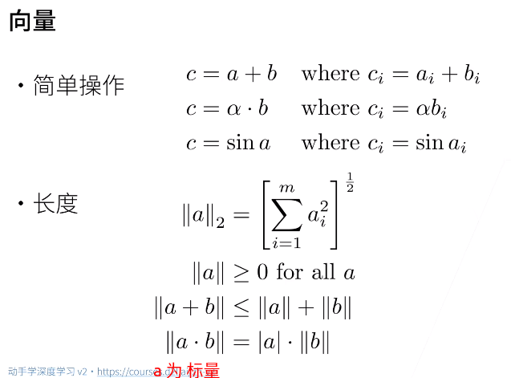

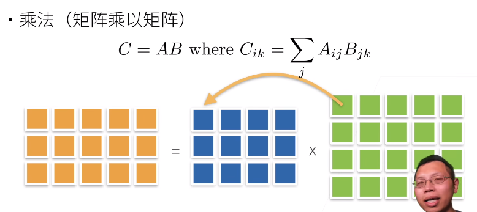

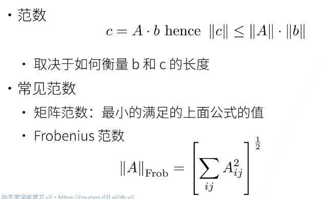

矩阵范数是一个标量，用来衡量矩阵的大小

**范数不等式**

**Frobenius范数** 是矩阵的一种范数，是矩阵中所有元素的平方和的平方根，机器学习中常用于正则化，以防止过拟合

```python
torch.norm(Array)

keepdim = True  # 保留维度
```

**正定矩阵** - Positive Definite Matrix : 对于一个实对称矩阵 $A$，它被定义为正定的，如果对于所有非零实向量 $x$，都有 $x^TAx>0$。

**正交矩阵** - Orthogonal Matrix : $UU^T=1$，行相互正交，行单位长度

**置换矩阵** - Permutation Matrix - 元素只有0和1，每行和每列只有一个元素是 1，箱单与单位矩阵行列变换，**置换矩阵 是 正交矩阵**，置换矩阵的逆是它的转置

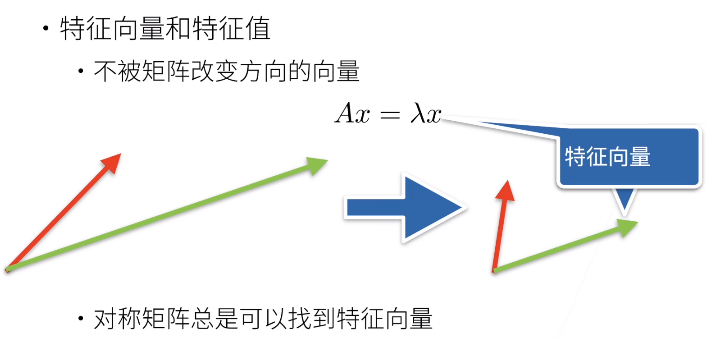

特征向量(不被矩阵改变方向的向量) & 特征值

实对称矩阵
1. 总可以找到特征向量
2. 所有特征值都是实数
3. 特征向量可以构成一组正交基
4. 可以被正交矩阵对角化


矩阵乘法
1. Hadamard Product `⊙` 哈达玛积 : 矩阵按元素乘法
2. Cross Product `@` 叉乘


计算 总和/均值 时保持 轴数不变 `keepdims=True`

沿轴累加求和 `cumsum(axis=)`


---

## 06 矩阵计算

主要是求导数

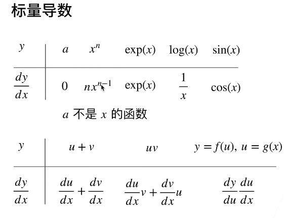

$\frac{d}{dx} ln(x) = \frac{1}{x}$ 只是对于自然对数，其他情况需要使用 换底公式

亚导数(拓展到不可微函数)

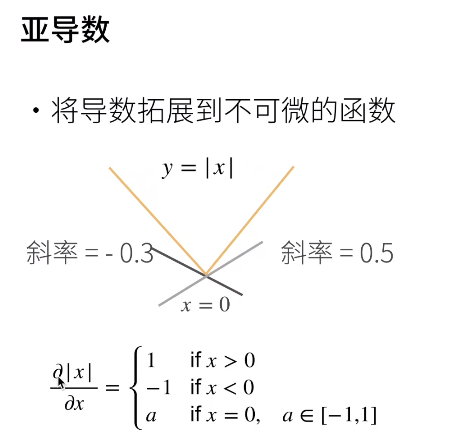


**梯度**
1. 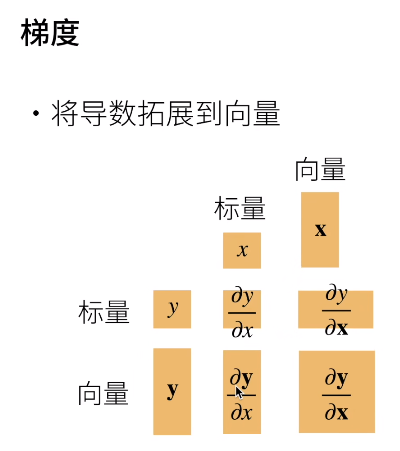
2. 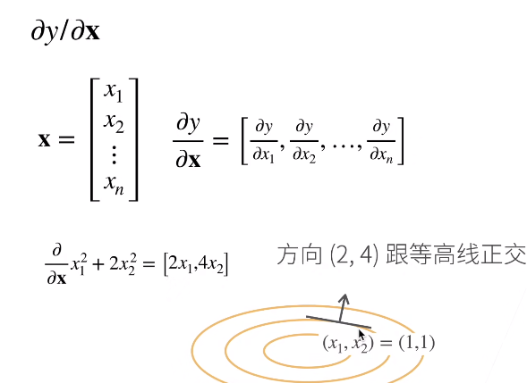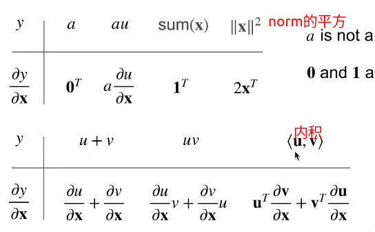
3. 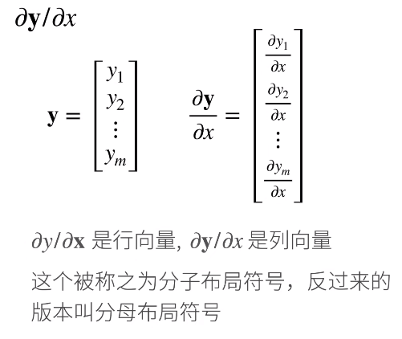
4. 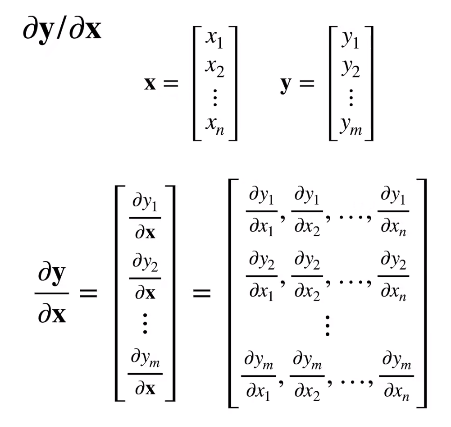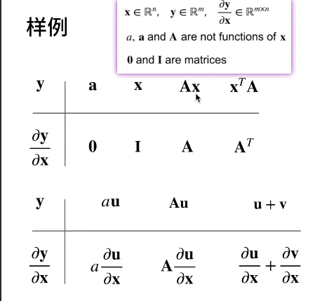
5. 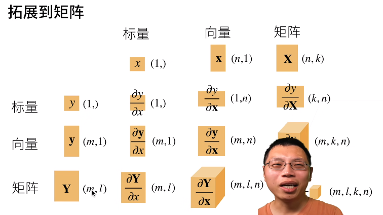


### 06.01 分子布局 & 分母布局

在 PyTorch 中，雅可比矩阵 Jacobian Matrix 使用的是 **`分子布局`**

**分子布局 - Numerator Layout**
1. **行数** 与 **分子的变量维度**（即结果变量y的维度）一致
2. **列数** 与 **分母的变量维度**（即输入变量x的维度）一致
3. 个人理解 - 求导结果的 长度(行数) 和 分子长度 一致，宽度(列数) 和 分母长度 一致

**分母布局 - Denominator Layout**
1. **行数** 与 **分母的变量维度**（即输入变量x的维度）一致
2. **列数** 与 **分子的变量维度**（即结果变量y的维度）一致
3. 个人理解 - 求导结果的 长度(行数) 和 分母长度 一致，宽度(列数) 和 分子 长度 一致


个人理解
1. 分子布局 - 求导结果的长度和分子y长度一致，宽度和分母x长度一致


---

## 07 自动求导

**链式法则**


例子(分解 & 链式法则)
1. 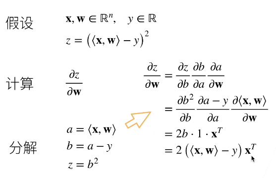
2. 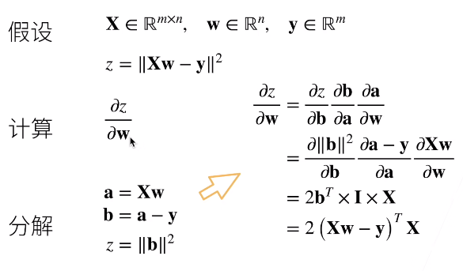

**自动求导** 计算一个函数在 **指定值** 上的导数

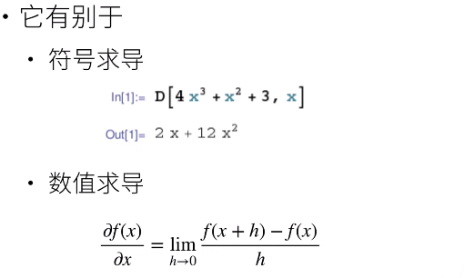

**计算图**

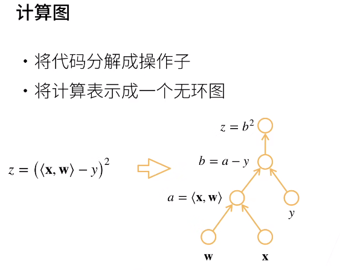

**自动求导 两种模式**
1. 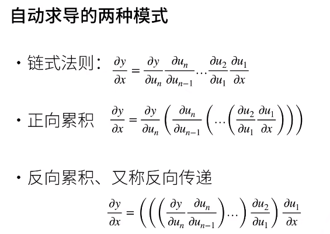
2. **正向**(Forward Mode)
   1. 先计算离输入近的
   2. 计算过程中不仅计算函数值，还同时计算导数
   3. **计算一个变量的梯度就需要扫一遍**(所以神经网络不会采用)
3. **反向**(Reverse Mode)
   1. 先计算离输出近的
   2. 需要读取 前向计算 的 中间结果(耗GPU资源)
   3. 可以一次性计算出所有输入变量的梯度
   4. 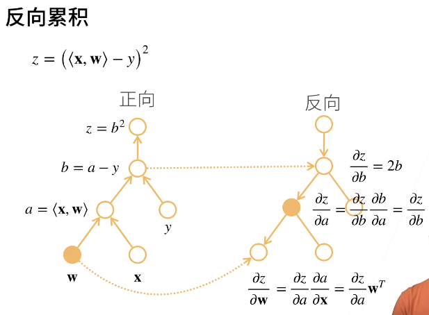 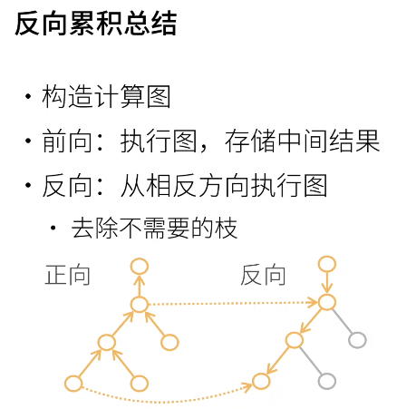
4. 复杂度
   1. 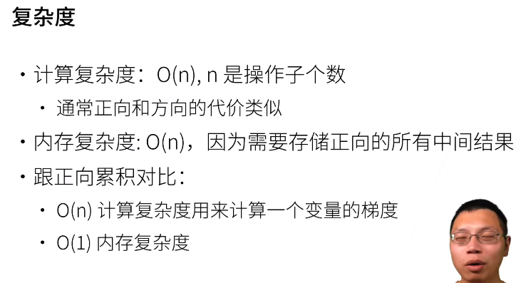

深度学习中，**求导是求模型参数对损失函数的导数**，如 权重和偏置，目的是为了优化这些参数以 **最小化损失函数**

PyTorch 的 `nn.Module` 中，模型的参数默认就是需要梯度的，`requires_grad` 属性默认为 **True**

模型中定义 `nn.Parameter` 或使用 `nn` 中的层，如 `nn.Linear`、`nn.Conv2d` 等，层内的参数 **默认会设置 requires_grad=True**

```python
# PyTorch 默认累计梯度
x.grad.zero_()  # 清空梯度，_表示重写内容
torch.Tensor.detach()  # 将部分计算移动到计算图外
```

即使构建函数的计算图需要通过 Python 的控制流(条件、循环、函数)，仍然可以得到变量的梯度


**展示梯度自动累加**
```python
import torch
x = torch.tensor([1,2,3,4], requires_grad=True, dtype=torch.float32)
y = 2.0 * torch.dot(x, x)
# 对y进行反向传播，计算梯度
y.backward(retain_graph=True)
print("After first backward: ", x.grad)  # tensor([ 4.,  8., 12., 16.])
# 再次对y进行反向传播，查看梯度如何累加
y.backward(retain_graph=True)
print("After second backward: ", x.grad)  # tensor([ 8., 16., 24., 32.])

# 如果不使用 retain_graph=True，在调用 y.backward() 后，计算图会被自动销毁。这是 PyTorch 的默认行为，目的是节省内存

# 如果不 retain_graph 也可以再次构建计算图来模拟累计
import torch
x = torch.tensor([1,2,3,4], requires_grad=True, dtype=torch.float32)
# 对y进行反向传播，计算梯度
y = 2.0 * torch.dot(x, x)
y.backward()
print("After first backward: ", x.grad)  # tensor([ 4.,  8., 12., 16.])
# 再次对y进行反向传播，查看梯度如何累加
y = 2.0 * torch.dot(x, x)
y.backward()
print("After second backward: ", x.grad)  # tensor([ 8., 16., 24., 32.])
```

显式构造并不方便

PyTorch累计梯度原因
1. 当GPU内存限制了批量大小时，通过累积来自多个小批量 mini-batches 的梯度，可以实现有效的大批量 batch 训练
2. 在多任务学习或当模型有多个输出时，需要分别计算每个损失函数对模型参数的梯度，此时需要累加梯度，之后再统一对模型参数更新
   ```python
   # 前向传播
   output1, output2 = model(input)
   loss1 = criterion1(output1, target1)
   loss2 = criterion2(output2, target2)

   # 反向传播
   optimizer.zero_grad()  # 清零梯度
   loss1.backward(retain_graph=True)  # 计算第一个损失的梯度
   loss2.backward()  # 计算第二个损失的梯度，梯度会累加到之前的基础上
   optimizer.step()  # 执行一次优化步骤
   ```
3. 循环神经网络 RNN 中，可能需要在一个训练步骤内多次计算同一参数的梯度，并将这些梯度累加起来

Loss 通常为**标量**

RNN 是环状图，但是实际上会拆开，然后梯度累加

---

## 08 线性回归 + 基础优化算法

### 08.01 线性回归

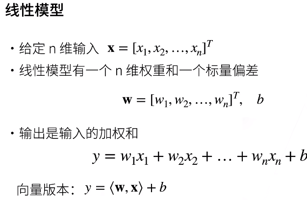

线性模型可以看做**单层神经网络**，仅有 输入层 & 输出层(不算层数)

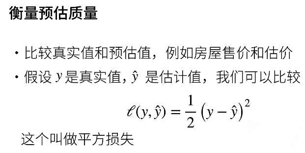

收集训练数据集

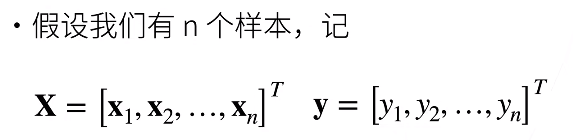

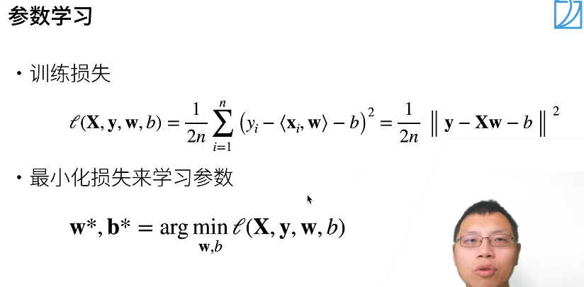

线性模型有**显式解**(损失函数是 **凸函数**)

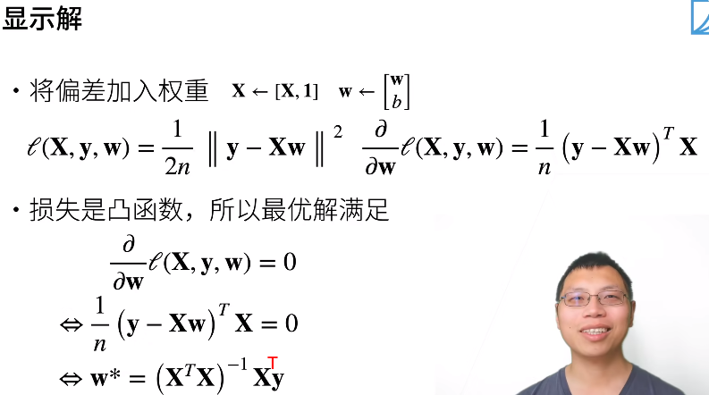

总结
1. 线性回归是对n维输入的加权，外加偏差
2. 使用平方损失来衡量预测值和真实值的差异
3. 线性回归有显式解
4. 线性回归可以看做是 **单层神经网络**


### 08.02 基础优化方法

**梯度下降**

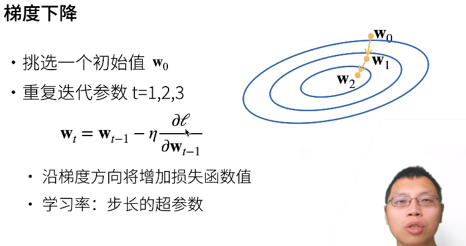

梯度，是函数值上升最快的方向；负梯度，是函数值下降最快的方向

学习率 hyper-parameter
1. 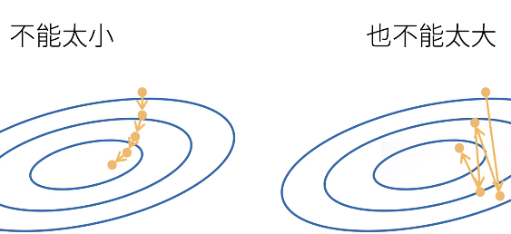
2. 不能太小 - 计算梯度耗时
3. 不能太大 - 模型难以收敛

实际中，一般不直接使用梯度下降(损失函数是所有样本的平均损失)

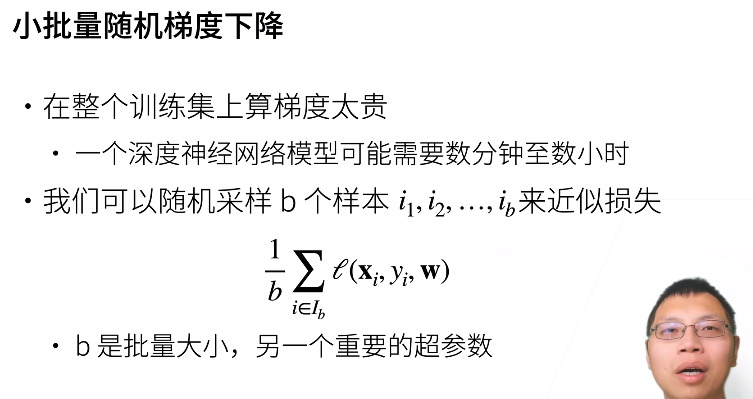

批量大小 **b** hyper-parameter
1. 不能太小 - 每次计算量太小，不适合并行来最大利用计算资源
2. 不能太大 - 内存消耗增加，浪费计算，例如 所有样本都是相同的

总结
1. 梯度下降通过不断**沿着反梯度方向更新参数**求解 - 不需要知道显式解
2. **小批量随机梯度下降**是深度学习默认的求解算法，其两个重要的超参数是
   1. 批量大小
   2. 学习率


### 08.03 线性回归 代码实现

[线性回归的从零开始实现 - ipynb](./OfficialNoteBooks/chapter_linear-networks/linear-regression-scratch.ipynb)

[线性回归的简洁实现 - ipynb](./OfficialNoteBooks/chapter_linear-networks//linear-regression-concise.ipynb)


`data.DataLoader` 将 dataset 转为 iterator，使用 next 获得下一个 batch

`trainer = torch.optim.SGD(net.parameters(), lr=0.03)`

传入 网络参数 给 optimizer，可以用 `step()` 自动 更新参数

对于 每个 iteration，optimizer 先需要 `zero_grad()`

对 loss 进行 `backward()`，各个 parameter 对于 loss 的


---

## 09 Softmax回归 + 损失函数 + 图片分类数据集

回归 预测 连续值

分类 预测 离散类别

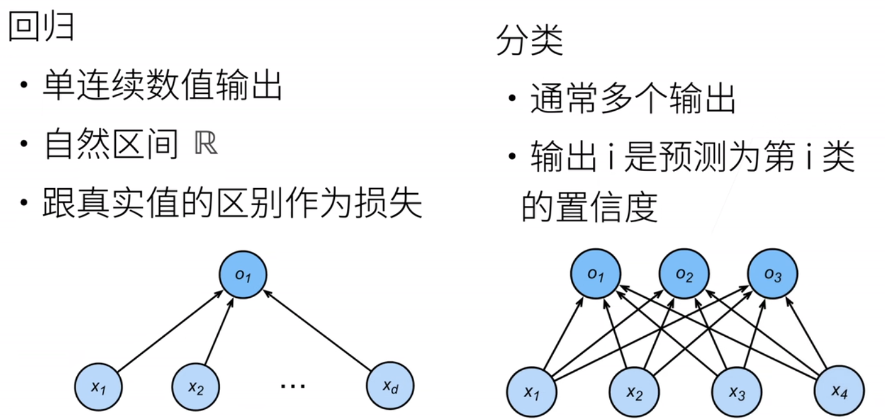

分类
1. 对 真实类别进行 独热编码 One-Hot Encoding
   1. 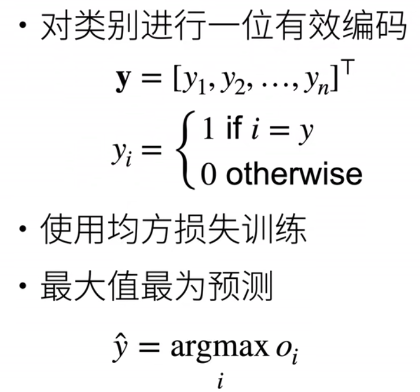
2. 更需要 正确类的 置信度 尽量大，$o_{True} - o_{False} \ge \delta$，让模型有能力更能辨识类别
3. Softmax，预测概率 (多分类)
   1. 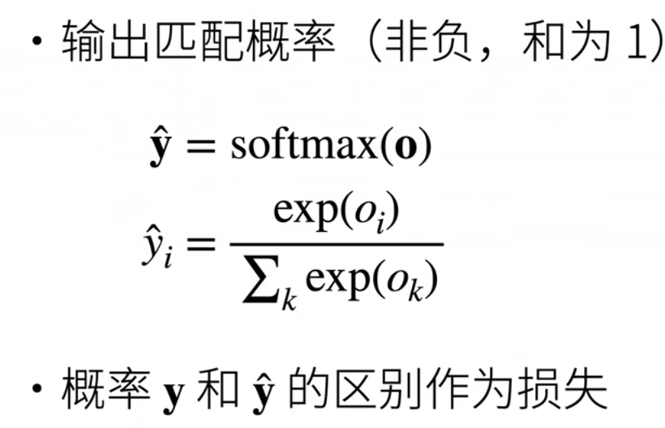
4. **Cross Entropy** 交叉熵，用于衡量 两个分布的相似程度
   1. [信息量--香农熵--交叉熵--kl散度 | 笔记](../DiffusionModel/DiffusionModel.md#补--信息量--香农熵--交叉熵--kl散度)
   2. 只关心预测正确的情况(因为独热)


Loss Function
1. L2 Loss - MSE(Mean Squared Error)
   1. 距离 minimum 越远，梯度下降 越快，参数更新幅度越大
2. L1 Loss - MAE(Mean Absolute Error)
   1. 距离 minimum 不同距离，梯度下降 速度相同，参数更新幅度相同(稳定性)
3. Huber's Robust Loss - 结合 L1 & L2
   1. 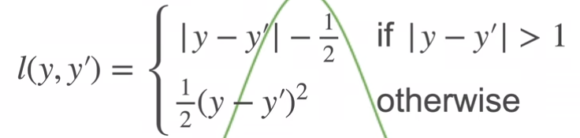
   2. 在非常靠近 minimum 时候，可以 更小的更新幅度


数据集
1. [图像分类数据集 - ipynb](./OfficialNoteBooks/chapter_linear-networks/image-classification-dataset.ipynb)


Softmax 回归 代码实现
1. [softmax回归的从零开始实现 - ipynb](./OfficialNoteBooks/chapter_linear-networks/softmax-regression-scratch.ipynb)
2. [softmax回归的简洁实现 - ipynb](./OfficialNoteBooks/chapter_linear-networks/softmax-regression-scratch.ipynb)


---

## 10 多层感知机 + 代码实现


---

## 11 模型选择 + 过拟合 & 欠拟合


---

## 12 权重衰退


---

## 13 丢弃法


---

## 14 数值稳定性 + 模型初始化


---

## 15 Kaggle 房价预测 + 课程竞赛:加州2020年房价


---

## 16 PyTorch 神经网络基础


---

## 17 使用和购买 GPU


---

## 18 预测房价竞赛总结


---

## 19 卷积层


---

## 20 卷积层里的填充和步幅


---

## 21 卷积层里的多输入多输出通道


---

## 22 池化层


---

## 23 经典卷积神经网络 LeNet


---

## 24 神队卷积神经网络 AlexNet


---

## 25 使用块的网络 VGG


---

## 26 网络中的网络 NiN


---

## 27 含并行连结的网络 GoogLeNet/Inception V3


---

## 28 批量归一化


---

## 29 残差网络 ResNet


### ResNet 为什么能训练出 1000 层的模型


---

## 30 第二部分完结竞赛:图片分类


---

## 31 深度学习硬件: CPU & GPU


---

## 32 深度学习硬件: TPU & 其他


---

## 33 单机多卡并行


---

## 34 多 GPU 训练实现


---

## 35 分布式训练


---

## 36 数据增广


---

## 37 微调


---

## 38 第二次竞赛 树叶分类结果


---

## 39 实战 Kaggle 比赛 : 图像分类 CIFAR-10


---

## 40 实战 Kaggle 比赛 : 狗的品种识别 ImageNet Dogs


---

## 41 物体检测 和 数据集


---

## 42 锚框


---

## 43 树叶分类竞赛技术总结


---

## 44 物体检测算法 : R-CNN, SSD, YOLO


---

## 45 SSD 实现


---

## 46 语义分割 和 数据集


---

## 47 转置卷积

### 47.2 转置卷积是一种卷积


---

## 48 全连接卷积神经网络 FCN


---

## 49 样式迁移


---

## 50 课程竞赛 - 牛仔行头检测


---

## 51 序列模型 Sequence Model

RNN, NLP 处理序列，考虑时间信息

CNN 考虑空间信息

**统计工具** (**不独立**的随机变量)
1. 联合概率 用 条件概率 展开
2. 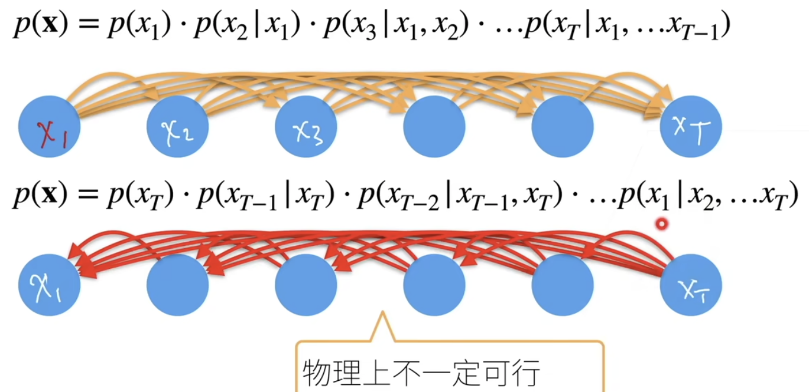
3. 核心 : 条件概率
   1. 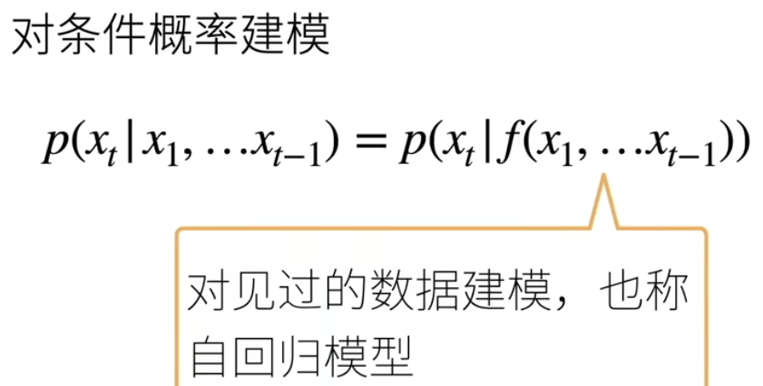
   2. 当前时刻的值依赖于之前时刻的某种函数 $f$

自回归模型 AutoRegressive Model
1. 核心思想 : 当前时刻的值由之前若干时刻的值决定，**使用自身过去数据预测未来**

方案
1. Markov 假设
   1. 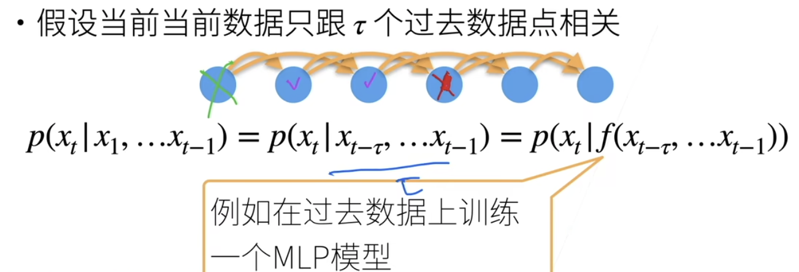
   2. 只需关注 过去 $\tau$ 个数据点
   3. 特点
      1. 当序列很长，不需要回看很久
      2. **定长**，可以使用 之前的方法 : 如 MLP
2. 潜变量模型 Latent Variable
   1. 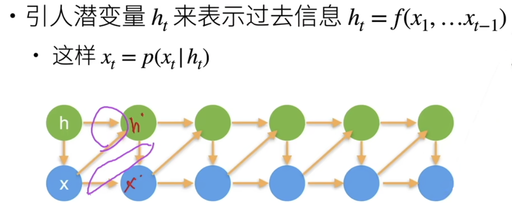
   2. 只用一个 潜变量 数据 $h_t$ 表示 过去信息
   3. 当前 潜变量 通过 **前一时刻的** input & 潜变量 来计算


[序列模型 - ipynb](./OfficialNoteBooks/chapter_recurrent-neural-networks/sequence.ipynb)
1. 数据对
   1. input  : $[x_{t-\tau}, \cdots , x_{t-1}]$
   2. output : $x_t$
2. `nn.init.xavier_uniform_` : 用于初始化 神经网络 的权重，用于 解决 梯度消失 & 梯度爆炸 - TODO

预测
1. 单步预测 : 给定 真实数据 预测下一个 数据
2. 多步预测 : 使用 自己的预测，不断推演 (每次预测都有误差，误差不断叠加)


---

## 52 文本预处理

文本当做时序序列


---

## 53 语言模型


---

## 54 循环神经网络 RNN


---

## 55 循环神经网络 RNN 的实现


---

## 56 门控循环单元 GRU


---

## 57 长短期记忆网络 LSTM


---

## 58 深层循环神经网络


---

## 59 双向循环神经网络


---

## 60 机器翻译数据集


---

## 61 编码器-解码器 架构


---

## 62 序列到序列学习 seq2seq


---

## 63 束搜索 (Beam Search)

seq2seq 中 使用 贪心搜索预测序列 (选最大概率的词)

贪心 ≠ 最优 (局部最优 ≠ 全局最优)

穷举可以保证最优，但是 computing complexity 太大，为 $n^T$ (字典大小$n$，序列长度$T$)

Beam Search
1. 每次搜索，保存最好的 k个 候选 (一共只保留k个，不是每个 branch 保留 k个)
2. 每个时刻，对上一步 k个候选(每个对应 n种 可能) 对应的 kn个可能，选出最好的 k个
   1. 如果某些分支(branch)提前结束(产生 `<eos>` 标记)，算法通常会将这些分支的结果保留，并继续扩展其他未完成的分支(确保生成的结果完整且能够处理不同长度的输出序列)
3. 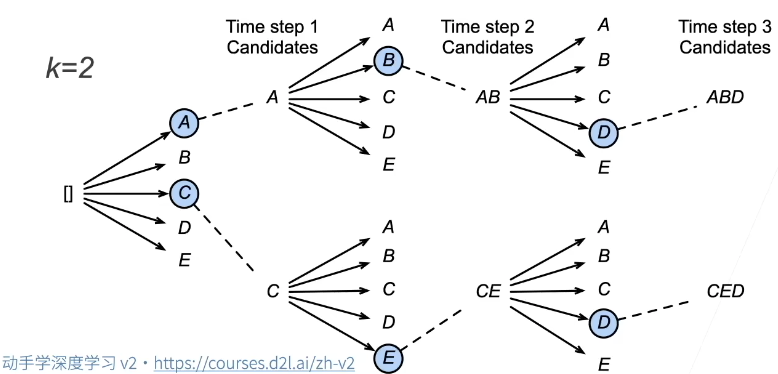
4. 时间复杂度 $O(knT)$
5. 可能不仅仅考虑最后的 k 个，子序列也考虑
6. 候选分数 $\frac{1}{L^\alpha} \log p(y_1, \ldots, y_L) = \frac{1}{L^\alpha} \sum_{t'=1}^L \log p(y_{t'} | y_1, \ldots, y_{t'-1})$
   1. $\frac{1}{L^\alpha}$ 用于归一化，log 的结果为负，使用该参数可以减少对 短句的 倾向
      1. 不归一化，会倾向于短句，因为概率越乘越小，log 之后 会是 更大负数
   2. 通常 $\alpha$ 取 0.75


bleu

### 补 :


---

## 64 注意力机制


---

## 65 注意力分数


---

## 66 使用注意力机制的 seq2seq


---

## 67 自注意力


---

## 68 Transformer


---

## 69 BERT 预训练


---

## 70 BERT 微调


---

## 71 目标检测竞赛总结


---

## 72 优化算法


---

## 73 课程总结和进阶学习


---

